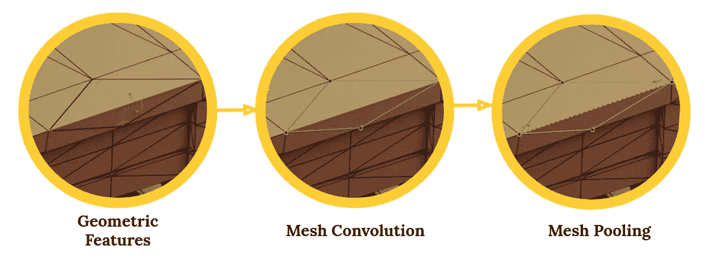
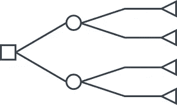
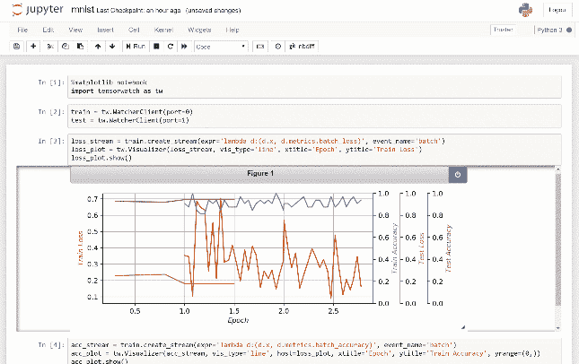

# 面向数据科学家的 7 大机器学习 Github 知识库

> 原文：<https://medium.com/analytics-vidhya/top-7-machine-learning-github-repositories-for-data-scientists-1998a64cbadf?source=collection_archive---------1----------------------->

# 介绍

如果我不得不选择一个平台，让我独自跟上[数据科学](https://courses.analyticsvidhya.com/courses/introduction-to-data-science-2?utm_source=blog&utm_medium=top-5-machine-learning-github-repositories-data-scientists)和[机器学习](https://courses.analyticsvidhya.com/courses/applied-machine-learning-beginner-to-professional?utm_source=blog&utm_medium=top-5-machine-learning-github-repositories-data-scientists)的最新发展，那将是 GitHub。GitHub 的庞大规模，加上来自全球各地的超级数据科学家的力量，使其成为对该领域感兴趣的任何人的必用平台。

你能想象一个像 BERT、 [StanfordNLP](https://www.analyticsvidhya.com/blog/2019/02/stanfordnlp-nlp-library-python/?utm_source=blog&utm_medium=top-5-machine-learning-github-repositories-data-scientists) 、 [TensorFlow](https://www.analyticsvidhya.com/blog/2016/10/an-introduction-to-implementing-neural-networks-using-tensorflow/?utm_source=blog&utm_medium=top-5-machine-learning-github-repositories-data-scientists) 、 [PyTorch](https://www.analyticsvidhya.com/blog/2018/02/pytorch-tutorial/?utm_source=blog&utm_medium=top-5-machine-learning-github-repositories-data-scientists) 等机器学习库和框架的世界吗？不是开源的吗？简直不可想象！GitHub 已经为大众实现了机器学习的民主化——这与我们在 Analytics Vidhya 的信念完全一致。

这是我们在 2018 年 1 月开始这个 GitHub 系列涵盖[最有用的机器学习库和包](https://www.analyticsvidhya.com/blog/2018/12/best-data-science-machine-learning-projects-github/?utm_source=blog&utm_medium=?utm_source=blog&utm_medium=top-5-machine-learning-github-repositories-data-scientists)的主要原因之一。


除此之外，我们还报道了我们认为与所有数据科学专业人士相关的 Reddit 讨论。这个月也不例外。我从 5 月份开始策划了前五名的讨论，集中在两件事上——机器学习技术和来自专家数据科学家的职业建议。

*你也可以浏览我们今年报道的 GitHub 库和 Reddit 讨论:*

*   [*一月*](https://www.analyticsvidhya.com/blog/2019/02/top-5-data-science-github-reddit-january-2019/?utm_source=blog&utm_medium=top-5-machine-learning-github-repositories-data-scientists)
*   [T5【二月】T6](https://www.analyticsvidhya.com/blog/2019/03/top-5-data-science-github-repositories-reddit-discussions-february-2019/?utm_source=blog&utm_medium=top-5-machine-learning-github-repositories-data-scientists)
*   [*三月*](https://www.analyticsvidhya.com/blog/2019/04/top-5-machine-learning-github-reddit/?utm_source=blog&utm_medium=top-5-machine-learning-github-repositories-data-scientists)
*   [*四月*](https://www.analyticsvidhya.com/blog/2019/05/5-data-science-github-reddit-april/?utm_source=blog&utm_medium=top-5-machine-learning-github-repositories-data-scientists)

# 顶级 GitHub 知识库(2019 年 5 月)


# [微软的 InterpretML 机器学习的可解释性](https://github.com/microsoft/interpret)


目前，可解释性是机器学习中的一件大事。能够理解一个模型如何产生它所产生的输出——这是任何机器学习项目的一个关键方面。事实上，我们甚至和 Christoph Molar 一起在可解释 ML 上做了一个[播客，你应该看看。](https://www.analyticsvidhya.com/blog/2019/03/datahack-radio-interpretable-machine-learning-christoph-molnar/)

InterpretML 是微软的一个开源包，用于训练可解释模型和解释黑盒系统。微软在解释可解释性为何至关重要时说得很好:

*   **模型调试:**为什么我的模型会犯这个错误？
*   **检测偏差:**我的模型有区别吗？
*   **人-AI 合作:**我如何理解和信任模型的决策？
*   **法规遵从性:**我的模型符合法律要求吗？
*   **高风险应用:**医疗、金融、司法等。

随着复杂性的增加，解释机器学习模型的内部工作变得更加困难。你曾经试图拆开并理解一个多模型的集合吗？做这件事需要很多时间和精力。

我们不能简单地带着一个复杂的模型去找我们的客户或领导，却不能解释它是如何产生一个好的分数/准确度的。这对我们来说是一张回到起点的单程票。

微软研究院的人开发了可解释的增强机器(EBM)算法来帮助提高可解释性。这种循证医学技术既有高准确性又有可理解性——这是圣杯。

解释 ML 不仅限于使用 EBM。它还支持像 LIME、线性模型、决策树等算法。比较模型并为我们的项目选择最佳模型从未如此简单！

您可以使用以下代码安装 InterpretML:

```
pip install numpy scipy pyscaffold 
pip install -U interpret
```

# 谷歌研究公司的 tensor 2 robot(T2R)

Google Research 在我们每月的 Github 系列中再次亮相。不出意外——他们拥有业内最强大的计算能力，并在机器学习中得到了很好的利用。


他们最新发布的开源软件 Tensor2Robot (T2R)非常棒。 **T2R 是一个用于大规模深度神经网络的训练、评估和推理的库。**但是，请等一等——它的开发有着明确的目标。它是为与机器人感知和控制相关的神经网络量身定制的

不用猜 Tensor2Robot 所基于的深度学习框架。没错——张量流。Tensor2Robot 在谷歌的母公司 Alphabet 内部使用。

以下是使用 Tensor2Robot 实现的几个项目:

*   [QT-Opt](https://arxiv.org/abs/1806.10293)
*   [Grasp2Vec](https://github.com/google-research/tensor2robot/blob/master/research/grasp2vec)

今年最受期待的 TensorFlow (TF)版本 TensorFlow 2.0 于上月正式上线。我迫不及待地想要得到它！

# [tensor flow 2 中的生成模型](https://github.com/timsainb/tensorflow2-generative-models)


该库包含多个创成式模型的 TF 实现，包括:

*   生成对抗网络
*   自动编码器
*   可变自动编码器(VAE)
*   VAE 甘以及其他人。

所有这些模型都是在你非常熟悉的两个数据集上实现的——时尚 MNIST 和 NSYNTH。

最精彩的部分？所有这些实现都可以在 Jupyter 笔记本上找到！所以你可以下载它并在你自己的机器上运行，或者导出到 Google Colab。选择权在你，TensorFlow 2.0 就在这里，供你理解和使用。

# [STUMPY —时间序列数据挖掘](https://github.com/TDAmeritrade/stumpy)


一个时间序列库！我已经很久没有遇到新的时间序列开发了。

STUMPY 是一个强大的可扩展的库，帮助我们执行时间序列数据挖掘任务。STUMPY 设计用于计算矩阵轮廓。我能看出你在想——矩阵剖面图到底是什么？这个矩阵轮廓是一个向量，它存储了时间序列中任何子序列与其最近邻之间的 z 归一化欧几里德距离。

以下是此矩阵配置文件帮助我们执行的一些时间序列数据挖掘任务:

*   异常发现
*   语义分割
*   密度估计
*   时间序列链(子序列模式的时间有序集合)
*   模式/主题(在较长时间序列内大致重复的子序列)发现

使用下面的代码通过 *pip* 直接安装:

```
pip install stumpy
```

# [py torch 中的 mesh CNN](https://github.com/ranahanocka/MeshCNN)

**MeshCNN 是一个用于 3D 三角网格的通用深度神经网络。**这些网格可用于 3D 形状分类或分割等任务。计算机视觉的卓越应用。

MeshCNN 框架包括直接应用于网格边的卷积、池化和非池化层:



[卷积神经网络(CNN)](https://www.analyticsvidhya.com/blog/2018/12/guide-convolutional-neural-network-cnn/)非常适合处理图像和视觉数据。CNN 最近风靡一时，与图像相关的任务如雨后春笋般涌现出来。目标检测、图像分割、图像分类等。——这些都是由于 CNN 的进步才成为可能的。

3D 深度学习正在吸引业界的兴趣，包括机器人和自动驾驶等领域。3D 形状的问题在于它们天生不规则。这使得像卷积这样的运算变得困难和具有挑战性。

这就是 MeshCNN 发挥作用的地方。从存储库中:

> *网格是顶点、边和面的列表，它们共同定义了 3D 对象的形状。问题是每个顶点的邻点数都不一样，没有顺序。*

如果你是一个计算机视觉的爱好者，并且热衷于学习或应用 CNN，这是一个完美的知识库。您可以通过我们的文章了解更多关于 CNN 的信息:

*   [从头开始学习卷积神经网络的综合教程](https://www.analyticsvidhya.com/blog/2018/12/guide-convolutional-neural-network-cnn/)
*   [去神秘化的卷积神经网络(CNN)架构](https://www.analyticsvidhya.com/blog/2017/06/architecture-of-convolutional-neural-networks-simplified-demystified/)

# [牛逼的决策树研究论文](https://github.com/benedekrozemberczki/awesome-decision-tree-papers)



决策树算法是我们在机器学习中学习的第一批高级技术之一。老实说，在逻辑回归之后，我真的很欣赏这种技术。我可以在更大的数据集上使用它，了解它是如何工作的，分裂是如何发生的，等等。

我个人喜欢这个知识库。对于数据科学家来说，这是一个宝库。该库包含一个基于树的算法的论文集，包括决策树、回归树和分类树。该存储库还包含每篇论文的实现。我们还能要求什么呢？

# [微软研究院的 tensor watch](https://github.com/microsoft/tensorwatch)

你有没有想过你的机器学习算法的训练过程是如何进行的？我们编写代码，一些复杂的事情在幕后发生(编程的乐趣！)，我们得到结果。

微软研究院推出了一款名为 TensorWatch 的工具，使我们能够实时可视化我们的机器学习模型的训练过程。难以置信！查看 TensorWatch 工作原理的一个片段:



TensorWatch，简单来说就是深度学习和强化学习的调试和可视化工具。它在 Jupyter 笔记本上运行，使我们能够对我们的数据和模型进行许多其他定制的可视化。

# Reddit 讨论


让我们花一些时间来看看 2019 年 5 月以来与数据科学和机器学习相关的最棒的 Reddit 讨论。这里有适合每个人的东西，无论您是数据科学爱好者还是实践者。所以让我们开始吧！

# [博士生如果想从事该行业，应该具备哪些技能？](https://www.reddit.com/r/MachineLearning/comments/bgxz0x/d_skills_to_focus_on_as_a_phd_student_if_you_know/)

这是一个棘手的问题。第一个问题是，你是否真的应该选择博士而不是行业角色。如果你选择了，那么你应该掌握哪些技能来让你的行业转型变得更容易呢？

我相信这个讨论有助于解开我们职业生涯中最大的谜团之一——我们如何从一个领域或工作线过渡到另一个领域或工作线？不要仅仅从一个博士生的角度来看待这个问题。这对于我们大多数想要在机器学习中获得第一次突破的人来说非常重要。

我强烈建议您浏览这个帖子，因为许多经验丰富的数据科学家已经分享了他们的个人经历和学习。

# [神经网络通常包含更小的“子网络”,通常可以学习得更快——麻省理工学院](https://www.reddit.com/r/MachineLearning/comments/bpriqx/neural_nets_typically_contain_smaller_subnetworks/)

最近，发布了一篇研究论文，对该主题的标题进行了扩展。该论文解释了彩票假说，其中较小的子网络，也称为中奖彩票，与较大的网络相比，可以更快地训练。

本文将重点讨论这一问题。**要阅读更多关于彩票假说及其工作原理的内容，你可以参考我的文章，我在文章中对这个概念进行了分解，以便初学者也能理解:**

[解码 2019 年 ICLR 最佳论文——神经网络在这里统治](https://www.analyticsvidhya.com/blog/2019/05/best-papers-iclr-2019/)

# 看到这么多要学的东西，还有人感到不知所措吗？

我选择这个讨论是因为我完全能理解它。我过去常常想——我已经学到了很多，但还剩下很多。我会成为专家吗？我犯了一个错误，只看我所学的数量，而不看质量。

随着技术的不断快速进步，总会有很多东西需要学习。这篇文章提供了一些可靠的建议，告诉你如何设定优先级、坚持优先级、专注于手头的任务，而不是试图成为一个万事通。

# 结束注释

我在整理这个月的机器学习 GitHub 合集时获得了很多乐趣(和学习)!我强烈推荐在这两个平台上做书签，并定期检查。这是了解机器学习最新进展的一个好方法。

或者，您也可以每月回来查看我们的最佳选择。🙂

如果你认为我错过了任何存储库或任何讨论，请在下面评论，我很乐意就此展开讨论！

你也可以在分析 Vidhya 的 Android 应用上阅读这篇文章


*原载于 2019 年 6 月 6 日*[*https://www.analyticsvidhya.com*](https://www.analyticsvidhya.com/blog/2019/06/top-7-machine-learning-github-repositories-data-scientists/)*。*