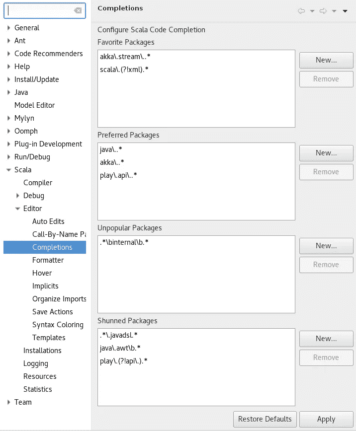

# 你应该知道的机器学习和数据科学的 8 大 ide

> 原文：<https://medium.com/analytics-vidhya/top-8-ides-for-machine-learning-and-data-scienceyou-should-know-ed4c325f3bf2?source=collection_archive---------2----------------------->

> 当市场上有各种类似的工具时，找到与您的任务所需的所有功能最匹配的 IDE 似乎是一项挑战，尤其是如果您从事数据科学或机器学习工程。
> 
> 在这里，我们将概述支持 R、Python、Scala langs 的最流行和最有效的 ide，它们通常用于数据科学。

如果你是数据科学家或者机器学习工程师，那么你应该熟悉最高效的机器学习 ide。

IDE(例如集成开发环境)是允许软件开发人员比大多数通用文本编辑器更容易地编写、测试、调试和处理代码的工具。IDE 的下一个用途是代码验证、文本编辑器、语法突出显示、完成、上下文建议、调试工具、方法和类规范、资源管理以及方便的帮助访问。

ide 通常有大量的特性集合。正因为如此，它们对[数据科学编程](https://towardsdatascience.com/programming-languages-for-data-scientists-afde2eaf5cc5)也是有益的。它们使程序员的生活变得相当容易。学习机器学习有什么推荐的 IDE？对于这个问题的答案还存在一些争议，但是我们将努力涵盖一些最优秀的候选人。

在本文中，我们将简要回顾几种可用于数据科学家最常用的四种编程语言的 ide。它们是 R、Python、Scala 和 Julia。

# RStudio

**操作系统** : macOS，Windows，Linux

**首次上映日期**:2019 年 12 月

最后发布日期:2011 年 4 月

RStudio IDE 特性

RStudio 是 R 平台上功能最丰富的 IDE。它是开源的，但也有一个商业版本用于桌面，包括 Windows、Mac 和 Linux。您也可以在运行 RStudio Server 或 RStudio Server Pro 的 Linux 服务器上使用它。

它具有语法突出显示、智能缩进和代码完成功能。r 代码可以通过源代码编辑器直接执行。开发人员可以快速阅读帮助、函数定义和文档。您还可以使用项目功能轻松管理多个工作目录。RStudio 集成了对 Apache Subversion 和 Git 的支持。

# Eclipse 的 StatET 插件

**操作系统** : macOS，Windows，Linux

**首次上映日期**:2019 年 12 月

**最后发布日期**:2010 年 9 月

Eclipse 安装的 StatET

Eclipse 是最流行的 Java IDEs 之一，它允许安装插件来支持不同的编程语言。StatET 是一个基于 Eclipse 的 IDE，旨在与 R 一起使用，它提供了一套用于 R 编码和包构建的工具。这包括完全集成的 R 控制台、包管理器、对象浏览器、调试器、数据查看器和 R 帮助系统。它支持许多 R 的本地和远程安装。

代码编辑器有语法高亮，自动更正行缩进，Roxygen 注释，函数定义等块的文本折叠，带打字粘贴的自动缩进。

像这样的可视化调试器允许简单地管理断点和条件断点。该调试器具有清晰呈现的调用堆栈和回溯功能，可直接访问所选框架的变量。还可以访问源代码和指令指针，在本例中是 R 编辑器，您也可以用它来改进您的源代码。新手可以轻松掌握它，这使它成为最好的数据科学 IDEs 之一。

# Visual Studio 的 r 工具

**操作系统** : macOS，Windows，Linux

**首次上映日期**:2016 年 3 月

**最后发布日期**:2017 年 3 月

Visual Studio 工具入门

没有提到这一个，十大机器学习 IDE 候选列表就不完整。Visual Studio 是广泛用于。NET 语言以及 C++和[其他流行的编程语言](https://www.softermii.com/blog/top-programming-languages-and-frameworks-for-software-development-for-2020)。

R Tools for Visual Studio (RTVS)是在麻省理工学院许可下开发的 Visual Studio 开源扩展。这是免费的。

使用 Visual Studio，数据科学家能够以方便的结构组织和管理相关文件。他们可以利用有用的模板，例如 R 文档、R 代码、R Markdown、SQL 查询和存储过程。

RTVS 可以绑定到本地和远程工作区。这使得开发人员可以用较小的数据集在本地开发 R 代码。然后，他们可以轻松地在更强大的基于云的计算机上运行代码，这些计算机拥有更大的数据集。

# 右脑

**操作系统** : macOS，Windows，Linux

**首次上映日期** : 2017 年

**最后发布日期** : 2019 年

右脑集成开发环境

我们要讨论的下一个数据科学 IDEs 是 R-Brin。

此外，通过 R-Brain，您可以集成各种 ide，如 Jupyter Lab、Jupyter notebooks、Zeppelin、Rstudio 或忒伊亚，并且只需点击几下鼠标即可部署应用程序，无论它使用什么框架。

它支持集成的云数据库，并充当本地数据科学平台。它支持流行的开源语言。R-Brain 由 Jupyter 提供支持，提供了一个 IDE、一个控制台、一个笔记本和一个 markdown 结构，这些都集成到一个环境中，对 R 和 Python 都有完整的语言支持。它包括智能代码完成、调试、打包和发布功能。

R-Brain 拥有众所周知的 Jupyter 笔记本的标准功能集，如交互式笔记本界面、终端、文本编辑器、文件浏览器、丰富的输出等。它们都在一个灵活的用户界面中运行。它使用 Docker 容器技术，因此该解决方案可以部署在内部或云中。

# 皮查姆

操作系统: Windows、Linux、macOS

**首次上映日期:** 2010 年

**最后上映日期:【2019 年 10 月**

PyCharm IDE

PyCharm 由 [JetBrains](https://www.jetbrains.com/) 开发，这是一家为不同编程语言开发 ide 的公司。

PyCharm 的代码编辑器为 Python 提供了广泛的支持。它有可能被命名为机器学习的最佳 Python IDE。它具有错误检测、代码完成和自动代码修复功能。它还具有智能搜索功能，可以跳转到任何类、文件、符号或任何 IDE 操作或工具窗口。只需一次点击，您就可以切换到声明、超级方法、用法、测试、实现等等。

PyCharm 包括大量的工具。其中包括一个集成的调试器和测试运行器、一个 Python 分析器和一个内置的终端。您可以将它与主要的版本控制系统集成，包括 Git、SVN 和 Mercurial。它还具有远程开发功能、SSH 终端，以及与 vagger 和 Docker 的集成。

PyCharm 支持与 Jupyter 笔记本的集成。它有一个交互式 Python 控制台，也支持 Anaconda。它还集成了科学软件包，包括 Matplotlib 和 NumPy。

# Spyder

**操作系统** : macOS，Windows，Linux

**首次发布日期** : 2009 年

**最后上映日期**:2019 年 12 月

Spyder IDE

Spyder 是为科学家、工程师和数据分析师设计的科学环境。它提供了一组功能，如编辑、分析、调试和概要分析。它是一个全面的开发工具，能够进行数据探索、交互式执行、深度检查和出色的可视化选项。它的能力可以通过插件和 API 进一步扩展。

Spyder 有一个多语言编辑器，带有类浏览器、代码分析工具、自动代码完成、定位定义以及水平和垂直拆分。使用 Spyder 的另一个好处是您可以在完整的文档中获得强大的社区支持。

# Eclipse 的 Scala IDE

**OS** : macOS，Windows，Linux

**首次上映日期**:2017 年 9 月

**最后上映日期**:2010 年 4 月

Scala IDE 代码完成特性

什么 IDE 用机器学习生产代码？Eclipse 的 Scala IDE 就是一个例子。它为构建 Scala 和基于 Scala-Java 的应用程序提供了复杂的编辑和调试支持。它允许从 Scala 到 Java 的引用，反之亦然。

与任何现代 IDE 一样，它具有代码完成、语义代码突出显示功能和定位定义。它还在您键入时捕捉编译错误。

# IntelliJ IDEA 的 Scala 插件

操作系统:macOS，Windows，Linux

**首次发布日期**:2020 年 2 月

最后发布日期:2009 年 9 月

IntelliJ IDEA Scala 插件

[IntelliJ IDEA](https://www.jetbrains.com/idea/) 是 JetBrains 的另一个 IDE。它以人机工程学和为使用 Java、JavaScript 和其他语言的开发人员提供智能编码帮助而闻名。Scala 插件扩展了 IntelliJ IDEA 的工具包，支持 SBT、Scala、Scala.js、Hocon 和 Play 框架。

它提供编码帮助、导航、搜索、各种类型的信息，还集成了 SBT 和其他构建工具。

# 吉亚尼

**操作系统** : macOS，Windows，Linux

首次发行日期:2005 年 10 月

**最后发布日期**:2019 年 9 月

Geany IDE 黑暗主题

使用 Python 进行数据科学的最佳 ide 包括您将在 Geany 中看到的许多内容。IDE 由 Enrico Troger 创建，并于 2005 年 10 月 19 日正式发布。

它是用 C & C++编写的，主要是为 Python 机器学习设计的，但现在已经支持 50 多种程序语言。

Geany 的另一个优势是它非常强大，同时又很轻便。关于 Geany 编辑器还有一点，它支持突出显示项目的语法和行号。

# 竞技

操作系统 : macOS，Windows，Linux

**首次上映日期** : 2016 年

**最后发布日期**:2017 年 1 月

在所有数据科学和机器学习的 ide 中，Rodeo 是最通用的 ide 之一。这个特定的 IDE 使用 IPython 内核，由 Yhat 编写。它以能够让用户探索、比较数据框和图表并与之交互而闻名。心想， [Rodeo 最后一次没有更新](https://github.com/yhat/rodeo/issues/655)。

其他一些值得一提的 ide 是 Jupiter Notebooks、Juno、Atom、Sublime Text 3 和 Visual Studio 代码的 Julia 扩展。每一个都有一些值得研究的属性。

如果您对数据科学感兴趣，那么您应该了解我们提到的 ide。哪个 Python 数据科学 IDE 适合你？

嗯，你可能不会发现这份清单上的所有东西都有用。然而，你对它们越熟悉，你就越有能力构建一个完全适合你的目的的编程代码。每天都有更多的数据科学 IDEs 出现，作为一名程序员，与它们保持同步是值得的。