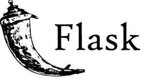
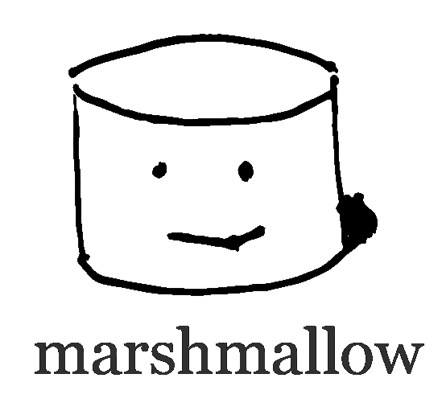

# 我成为 web 工程师路上的 8 大 python 库

> 原文：<https://medium.com/analytics-vidhya/top-8-python-libraries-on-my-way-to-become-a-web-engineer-9e4c1475d11d?source=collection_archive---------24----------------------->

阿里安·达尔维什在 [Unsplash](https://unsplash.com?utm_source=medium&utm_medium=referral) 上拍摄的照片

我在 3 年前成为一名 python 开发者。最初，我开发机器学习服务，它帮助我将 python 作为一个强制工具。今天，我是一名电子商务领域的软件工程师。我下面的分享是我在自己的工作中使用过的库。

## [**烧瓶**](https://flask.palletsprojects.com/en/1.1.x/) **-显微结构**

我喜欢它，因为简单

Flask 是 web 开发的一个有用的微观框架。“微”不是指“小，不受欢迎”。就是这样，因为它太简单了，太轻便了，你可以轻松学会。您可以灵活地定制您的服务。Flask 真的是微服务很有用的框架。

## [芹菜](http://www.celeryproject.org/) —异步任务队列

芹菜——后台工作的最佳解决方案

Celery 独立于调用者运行(也许调用者不需要用 python 实现)，你可以做 IO 相关的工作。为此，celery 使用 RabbitMQ 或 Redis 等中介环境将调用者的函数调用传输到 celery 应用程序。Celery 是由许多工作人员组成的模型，并在独立的进程中运行，因此当您的工作导致错误时，您不必担心，您的应用程序仍将健康运行。芹菜是纯 python 编写的，很容易设置和使用。我建议您使用 RabbitMQ 作为代理，并使用 Flower 来监控芹菜应用程序

## [Gunicorn](https://gunicorn.org/) - WSGI 服务器

你需要 deloy wsgi 应用程序的解决方案吗？就是这样！

如果你不熟悉 WSGI，你应该读一下它。基本上，WSGI 的工作方式类似于 CGI，它接收 HTTP 请求消息，解析它并传递给 WSGI 应用程序，看起来像 Flask app。然后，gunicorn 从 web app 接收响应对象，并将其转换为 HTTP 响应消息。此外，Gunicorn 支持 SSL、扩展请求处理程序、处理程序终止时自动重启等等。Gunicorn 还支持许多类工人，如 gevent、uvi corn(ASGI)。我真的很喜欢它[😍😍😍](https://emojipedia.org/smiling-face-with-heart-eyes/)。

## [SQLALchemy](https://www.sqlalchemy.org/) —数据库工具包

同样是流行语言，python 有一个著名的数据库工具包，就是 SQLAlchemy。SQLAlchemy 支持 MySQL、PostgresSQL、Oracle SQL 等常见的 SQL 数据库。您可以使用 SQLAlchemy 中的引擎执行原始 SQL 查询，或者使用 ORMs 将 python 对象映射到数据库中的表。基本上，您可以轻松地与数据库进行交互。SQLAlchemy 独立于应用程序，可以将 SQLAlchemy 用于 web 应用程序、桌面应用程序或命令工具，何乐而不为呢？如果您是 Flask 初学者，我推荐使用 Flask-SQLAlchemy，因为您可以将 SQLAlchemy 集成到 Flask 中，而无需担心评估管理、设置和声明模型、迁移…

## [Alembic](https://alembic.sqlalchemy.org/en/latest/) —迁移工具

Alembic 是迁移工具，它只支持 SQLAlchemy 等主要组件。Alembic 检测 ORMs 类和数据库中的表之间的变化，然后生成作为 python 源代码文件的迁移文件。您可以初始化数据库结构，而不必担心它。

## [棉花糖](https://marshmallow.readthedocs.io/en/stable/) —简化的对象序列化

您可以将高级 python 对象序列化为字典，也可以将字典加载到对象。在 Restful 服务中加载请求很有用。此外，棉花糖还可以在传递数据时验证数据。我通常由马歇尔洛执行业务验证。你声明一个结构数据(类或字典)然后传递数据给它，如此容易！

## [连接](https://connexion.readthedocs.io/en/latest/)—open API 规格包装瓶

连接由 Zalando 开发。Connexion 还支持 swagger 规范、验证请求和响应(可选)。您有一个 OpenAPI 规范文件，传递给它就完成了。Connexion 使用这些规范文件来路由请求，验证服务输入和输出。基本上，Connexion 使用 [jsonschema](https://python-jsonschema.readthedocs.io/en/stable/) 进行验证，它也支持模块化，就像 Flask 中的蓝图一样。

## [Pytest](https://docs.pytest.org/en/latest/) —用 Pytest 进行软件测试

Pytest 是一个测试框架。它基于 TestCase 类执行这些类，并且可以集成模拟框架。此外，pytest 还支持 assert 语句(contrast unittest ),它有许多有用的概念，如 fixture。您可以为每个测试单元(函数、类、会话)初始化这些基本状态。Pytest 还支持其他插件如[代码覆盖率](https://coverage.readthedocs.io/en/coverage-5.1/)等。

您可以根据[https://github.com/nkthanh98/flask-webservice](https://github.com/nkthanh98/flask-webservice)开始项目

我希望你会喜欢我的分享，它可能会在下一次帮助你。