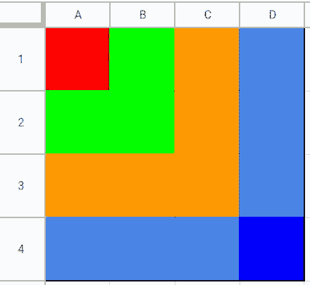

# 用 Python 实现动态编程、递归和 DFS

> 原文：<https://medium.com/analytics-vidhya/top-down-dp-python-recursion-and-dp-recursion-and-dfs-3daa5b36ee4d?source=collection_archive---------11----------------------->

## 自上而下/自下而上的方法；递归和 DP；递归和 DFS

今天我解决了一个新的 Leetcode 问题。它非常接近于经典的 DP 问题

"网格左上角到右下角之间的最短路径"

关于这个经典问题的更多信息可以在这里找到:

[](/@tiagot/dynamic-programming-an-induction-approach-b5c5e73c4a19) [## 动态规划:归纳方法

### 动态编程(DP)是一种通用编程技术，它使用记忆来解决问题，可以…

medium.com](/@tiagot/dynamic-programming-an-induction-approach-b5c5e73c4a19) 

这个问题是:

1301.得分最高的路径数

[https://leet code . com/problems/number-of-path-with-max-score/](https://leetcode.com/problems/number-of-paths-with-max-score/)

以下是我的分析。

## 自上而下差压

如果我们有四个像这样的单元格:
O A
B C
那么，
DP(O) =来自{DP(A)，DP(B)，DP(C)} + int(grid[O])的最大路径和

如果我们有一个图来显示高层次的逐层探索过程，这个图会是这样的。那么从这个 vis 就很清楚，这个算法的复杂度是 O(RC)或者 O(mn)。在实际的探索过程中，它不会完全以这种方式进行探索，相反，它将遵循 DFS 方法，如下所示。



我们可以从多个子状态中获得最大和，请将它们合并以保证正确性。

如果我们能达到(R-1，C-1)当 R 是总行数，C 是总列数时，它是可达的。

自上而下差压(332 毫秒)

```
from functools import lru_cache
class Solution:
    def pathsWithMaxScore(self, grid: List[str]) -> List[int]:
        grid[0] = "0"+grid[0][1:]
        R, C = len(grid), len(grid[0])
        self.reachable = False
        @lru_cache(None)
        def dp(i, j):
            if i==R-1 and j==C-1:
                self.reachable=True
                return [0, 1]
            substates = [(i+1,j), (i,j+1),(i+1,j+1)]
            valid_substates = [[r,c] for r, c in substates if 0<=r<R and 0<=c<C and grid[r][c]!='X']
            if not valid_substates:return [0, 0]
            results = [dp(r, c) for r,c in valid_substates]
            max_path_sum, _ = max(results)
            path_cnt = sum(this_path_cnt for this_path_sum, this_path_cnt in results if this_path_sum==max_path_sum)
            return [max_path_sum+int(grid[i][j]), path_cnt%(10**9+7)]

        res = dp(0, 0)
        return res if self.reachable else [0,0]
```

## **自下而上 DP 1(232 毫秒)**

从图中，我们可以很容易地找出自下而上的顺序来生成正确的结果。顺序是:

从(N-1，N-1)开始，求解包含整列网格[N-1，:]和整行网格[:，N-1]的每一层

我们应该在对角线(k，k)上这样做，其中 k 是从 N-1 到 0。

```
class Solution:
    def pathsWithMaxScore(self, grid: List[str]) -> List[int]:
        grid[0] = "0"+grid[0][1:]
        N = len(grid)

        def get_this_res(i, j):
            if grid[i][j] == 'X':return [-float('inf'), 0]
            if i==N-1 and j==N-1:return [0, 1]
            results = [dp[i+di][j+dj] for di, dj in [(1,0),(0,1),(1,1)]]
            max_path_sum, _ = max(results)
            max_path_sum_cnt = sum(this_path_cnt for this_path_sum, this_path_cnt in results if this_path_sum==max_path_sum)
            return [max_path_sum+int(grid[i][j]), max_path_sum_cnt%(10**9+7)]

        dp = [[[-float('inf'), 0] for j in range(N+1)] for i in range(N+1)]
        for k in range(N-1, -1, -1):
            for i in range(k, -1, -1):
                dp[i][k] = get_this_res(i, k)
            for j in range(k, -1, -1):
                dp[k][j] = get_this_res(k, j)
        return dp[0][0] if dp[0][0][0]!=-float('inf') else [0, 0]
```

我们也可以一列一列地做。顺序是从最后一列到第一列。对于每一列，我们应该从最后一行到第一行。

## **自下而上 DP 2(280 毫秒)**

```
class Solution:
    def pathsWithMaxScore(self, grid: List[str]) -> List[int]:
        grid[0] = "0"+grid[0][1:]
        N = len(grid)

        def get_this_res(i, j):
            if grid[i][j] == 'X':return [-float('inf'), 0]
            if i==N-1 and j==N-1:return [0, 1]
            results = [dp[i+di][j+dj] for di, dj in [(1,0),(0,1),(1,1)]]
            max_path_sum, _ = max(results)
			# combine the path_cnt, think about this case results = [[2,1], [2,1], [1,1]], the path_cnt shoule be 1+1 not 1.
            max_path_sum_cnt = sum(this_path_cnt for this_path_sum, this_path_cnt in results if this_path_sum==max_path_sum)
            return [max_path_sum+int(grid[i][j]), max_path_sum_cnt%(10**9+7)]

        # use N+1 by N+1 to get rid of out of boundary issue
        dp = [[[-float('inf'), 0] for j in range(N+1)] for i in range(N+1)]
        for j in range(N-1, -1, -1):
            for i in range(N-1, -1, -1):
                dp[i][j] = get_this_res(i, j)
        return dp[0][0] if dp[0][0][0]!=-float('inf') else [0, 0]
```

# 递归和 DP；递归和 DFS

如果我们想要探索自底向上的 DP 过程，我们可以使用这个测试用例，基于上面的代码打印出 I，j:
[" E111 "，" 1111 "，" 1111 "，" 111S"]
我们将得到下面的输出:

```
step  0 :  0 0
step  1 :  1 0
step  2 :  2 0
step  3 :  3 0
step  4 :  3 1
step  5 :  3 2
step  6 :  3 3
step  7 :  2 1
step  8 :  2 2
step  9 :  2 3
step 10 :  1 1
step 11 :  1 2
step 12 :  1 3
step 13 :  0 1
step 14 :  0 2
step 15 :  0 3
```

探索顺序可以这样解释:
为了求解 dp( **0，0** )，我们需要 dp( **1，0** )，dp(0，1)，dp(1，1)。
为了得到 dp( **1，0** )，我们需要 dp( **2，0** )、dp(1，1)和 dp(2，1)
为了得到 dp( **2，0** )，我们需要 dp( **3，0** )、dp(2，1)和 dp(3，1) 【T15)为了得到 dp( **3，0** )，我们需要 DP() 我们需要 dp( **3，2** )
为了得到 dp( **3，2** )，我们需要 dp( **3，3** )
既然触底了，我们回过头来求解 dp(2，1)
为了得到 dp( **2，1** )，我们需要 dp(3，1)，dp(2，2)，dp(3，2)。 由于只有 dp(2，2)没有做，我们需要根据 dp(3，2)，dp(2，3)，dp(3，3)求解
dp( **2，2** )。由于只有 dp(2，3)没有做，我们需要根据 dp(3，3)求解
dp( **2，3** )。dp(3，3)已经解决了，我们又回到了
dp( **1，1**)
……
从这个例子中，我希望我们可以对:

1.  **递归与 DP** 的关系
2.  **递归和 DFS** 之间的关系

希望有帮助。谢了。

附言

1.  代码输出 I 和 j

```
from functools import lru_cache
class Solution:
    def pathsWithMaxScore(self, grid: List[str]) -> List[int]:
        grid[0] = "0"+grid[0][1:]
        R, C = len(grid), len(grid[0])
        self.reachable = False
        self.step = 0
        @lru_cache(None)
        def dp(i, j):
            print("step {:2d}".format(self.step),": ", i, j)
            self.step += 1
            if i==R-1 and j==C-1:
                self.reachable=True
                return [0, 1]
            candidates = [(i+1,j), (i,j+1),(i+1,j+1)]
            valids = [[r,c] for r, c in candidates if 0<=r<R and 0<=c<C and grid[r][c]!='X']
            if not valids:return [0, 0]
            results = [dp(r, c) for r,c in valids]
            max_sum, _ = max(results)
            cnt = sum(this_cnt for this_sum, this_cnt in results if this_sum==max_sum)
            this_res= [max_sum+int(grid[i][j]), cnt%(10**9+7)]
            return this_res

        res = dp(0, 0)
        return res if self.reachable else [0,0]
```

1.  天真的 BFS 会明白的。

```
class Solution:
    def pathsWithMaxScore(self, grid: List[str]) -> List[int]:
        grid[0] = "0"+grid[0][1:]
        R, C = len(grid), len(grid[0])
        dp = [[collections.defaultdict(int) for j in range(C)] for i in range(R)]
        def bfs():
            from collections import deque
            Q = deque([(R-1, C-1, 0, 1)])
            while Q:
                i, j, path_sum, path_cnt = Q.popleft()
                for di, dj in [(-1,0),(0,-1),(-1,-1)]:
                    r,c  = i+di, j+dj
                    if 0<=r<R and 0<=c<C and grid[r][c]!='X':
                        this_path_sum, this_path_cnt = path_sum+int(grid[r][c]), path_cnt
                        dp[r][c][this_path_sum] += this_path_cnt
                        Q.append((r,c,this_path_sum, this_path_cnt))
            values = sum(dp[0][0][key] for key in dp[0][0])
            if values==0:return [0,0]
            max_k = max(dp[0][0].keys())
            return [max_k, dp[0][0][max_k]%(10**9+7)]
        return bfs()
```