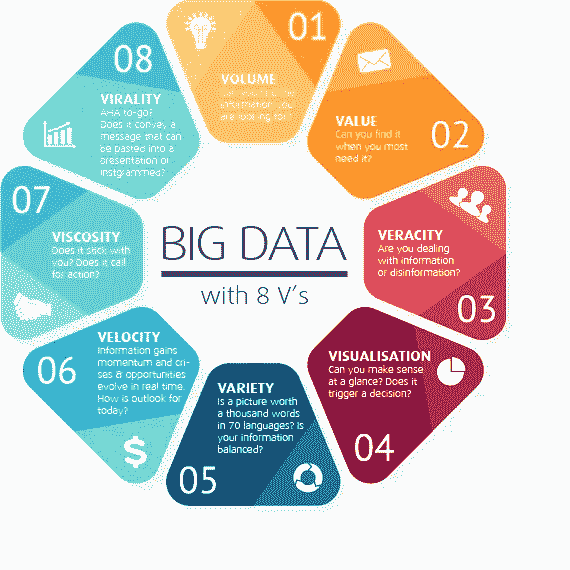
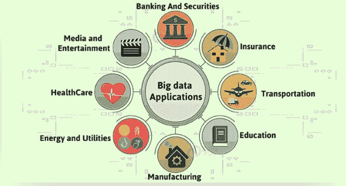
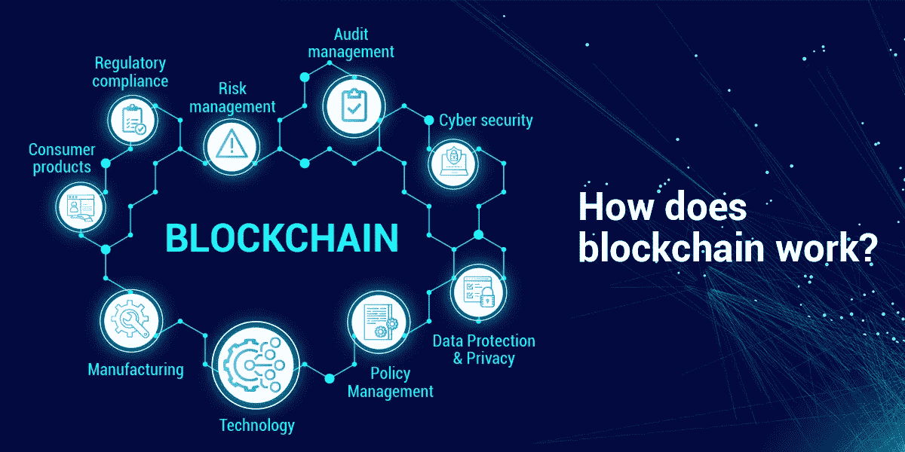
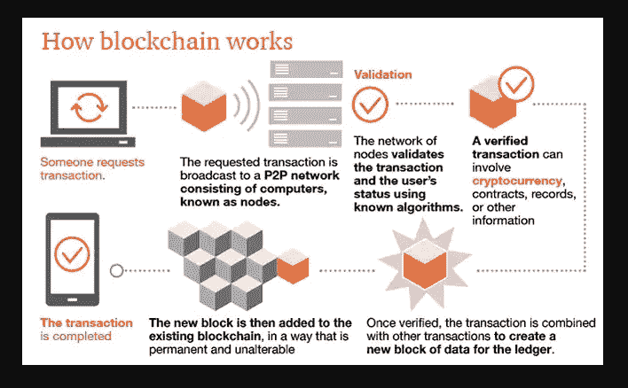
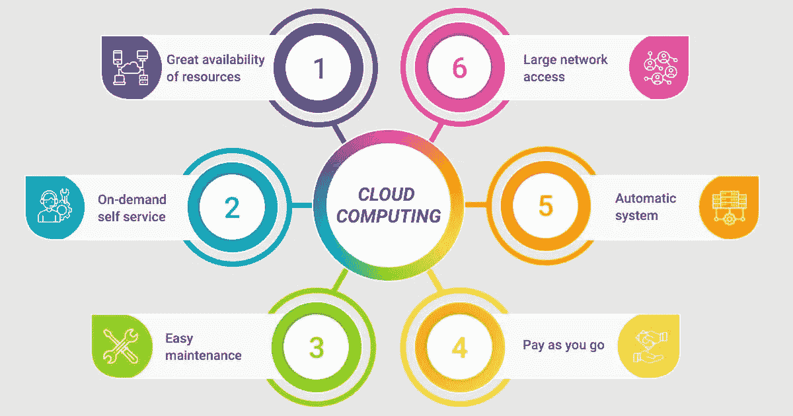
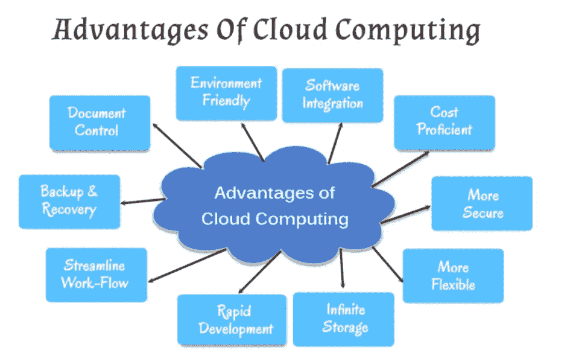
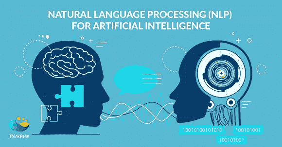
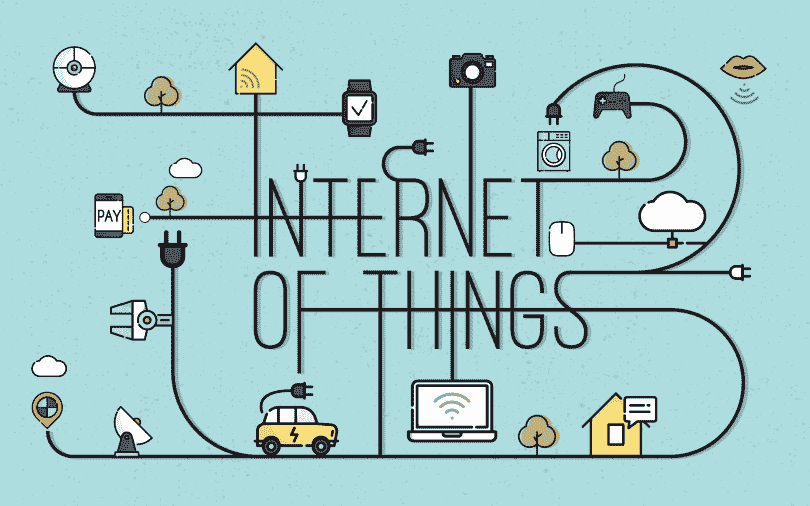
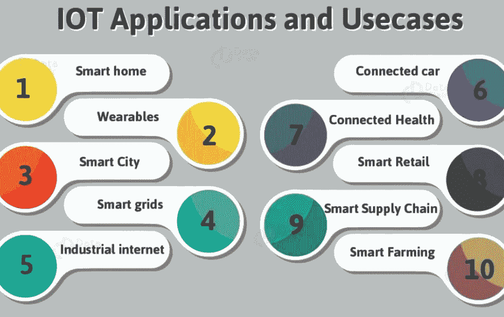

# 五大新兴热门技术

> 原文：<https://medium.com/analytics-vidhya/top-five-latest-technologies-ishhh2010-c188326e1062?source=collection_archive---------20----------------------->

以下是我对回答前 5 个问题的看法，即什么？什么时候？为什么？怎么会？在哪里？每个软件开发人员都应该了解的最新技术！

## 让我们开始:

**1。大数据分析**

## **T5 什么** ？

**:-** [大数据](https://itsmeishathakur.medium.com/getting-to-know-big-data-analytics-8c97a90da741)帮助组织创造新的增长机会和全新的公司类别，这些公司可以组合和分析海量的行业数据。这些公司拥有大量关于产品和服务、买家和供应商、消费者偏好的信息，可以对这些信息进行捕捉和分析。

大数据的 8 V

## **什么时候？**

**:-**“[**大数据**](https://itsmeishathakur.medium.com/getting-to-know-big-data-analytics-8c97a90da741) ”这个术语从上世纪 90 年代初就开始使用了。虽然并不确切知道是谁首先使用了这个术语，但大多数人认为是约翰·r·马什(他当时在 Silicon Graphics 工作)使这个术语流行起来。

## 为什么？

**:-** 要激发你学习大数据，展示 it 行业对大数据专业人才的需求很重要。大数据的一个有趣之处在于其发展速度之快。你可能没有意识到，即使在睡觉的时候，你也在通过智能手机和电脑生成数据。

大数据与高效且强大的**分析**相结合，可以极大地推动任何业务，并有助于找到挫折和失败的根本原因，发现客户的购买习惯并确定进一步促进销售的下一步措施，甚至发现组织内部的欺诈行为。

## 怎么会？

**:-** 媒体公司和娱乐行业需要推动数字化转型，以便在当前市场上尽快分发其产品和内容。使用任何设备在任何地方搜索和访问任何内容已经成为一种普遍的做法。它甚至可以帮助找出艺术家的观点或喜好，以衡量数字媒体领域的受欢迎程度。

其他非常重要的用途如下图所示:

[https://www.digitalvidya.com/blog/big-data-applications/](https://www.digitalvidya.com/blog/big-data-applications/)

## 在哪里？

**: *-*** *如需进一步阅读，可访问以下网站:*

1.  [https://itsmeishathakur . medium . com/get-to-know-big-data-analytics-8c 97 a 90 da 741](https://itsmeishathakur.medium.com/getting-to-know-big-data-analytics-8c97a90da741)
2.  [https://data-flair.training/blogs/big-data-applications/](https://data-flair.training/blogs/big-data-applications/)
3.  [https://www . rd-alliance . org/group/big-data-ig-data-development-ig/wiki/big-data-definition-importance-examples-tools](https://www.rd-alliance.org/group/big-data-ig-data-development-ig/wiki/big-data-definition-importance-examples-tools)

**2。区块链**

## 什么？

**:-区块链**是一个以某种方式记录信息的系统，这种方式使得改变、黑客攻击或欺骗系统变得困难或不可能。

区块链本质上是交易的数字分类账，它被复制并分布在区块链的整个计算机系统网络中。

区块链技术

## 什么时候？

**:-区块链始于**一个名叫中本聪的人，他发明了比特币，并在 2009 年将**区块链技术**带给了世界。比特币旨在成为法定货币的可行替代品。一种安全、分散的全球货币，可用作交换媒介。

## 为什么？

**:-** 任何人都可以查看区块链的内容，但是用户也可以选择将他们的计算机作为[节点](https://www.investopedia.com/terms/m/master-node-cryptocurrency.asp)连接到区块链网络。这样一来，他们的电脑就会收到一份区块链，每当有新的区块加入时，它就会自动更新，有点像脸书的新闻提要，每当有新的状态发布时，它就会提供实时更新。

区块链网络中的每台计算机都有自己的区块链副本，这意味着有数千个，或者就比特币而言，数百万个相同的区块链副本。尽管区块链的每一份拷贝都是完全相同的，但是通过计算机网络传播这些信息会使信息更难被操纵。在区块链事件中，没有一个单一的、确定的事件可以被操纵。相反，黑客需要操纵网络上区块链的每一份拷贝。这就是区块链所说的“分布式”总账。

## 怎么会？

**:-**

区块链概念化的运作

如何使用这项技术包括以下应用:

一方面，有形或无形的财产，如汽车、房屋或炊具，另一方面，专利、产权或公司股份，都可以嵌入智能技术。这种登记可以与被允许拥有该房产的其他人的合同细节一起存储在分类账中。智能钥匙可用于方便对被许可方的访问。一旦合同被验证，分类帐存储并允许交换这些[智能密钥。](https://blockgeeks.com/guides/different-smart-contract-platforms/)

这是众多应用程序中的一个。

## 在哪里？

**: *-*** *如需进一步阅读，可访问以下网站:*

1.  [https://www.investopedia.com/terms/b/blockchain.asp](https://www.investopedia.com/terms/b/blockchain.asp)
2.  [https://www . PwC . com/us/en/industries/financial-services/fin tech/比特币-区块链-加密货币. html](https://www.pwc.com/us/en/industries/financial-services/fintech/bitcoin-blockchain-cryptocurrency.html)
3.  [https://www . upgrad . com/blog/区块链-project-ideas-for-初学者-学生/#:~:text = 10% 20 best % 20 block chain % 20 project % 20 ideas，A % 20 fake % 20 product % 20 identificati on % 20 system](https://www.upgrad.com/blog/blockchain-project-ideas-for-beginners-students/#:~:text=10%20Best%20Blockchain%20Project%20Ideas,A%20Fake%20Product%20Identification%20System)

**3。云计算**

## 什么？

**云计算**意味着你正在使用的所有计算机[硬件和软件不是放在你的桌面上，或者在你公司](https://www.explainthatstuff.com/howcomputerswork.html)[网络](https://www.explainthatstuff.com/howcomputernetworkswork.html)的某个地方，而是由另一家公司作为服务提供给你，并通过[互联网](https://www.explainthatstuff.com/internet.html)访问，通常是以一种完全无缝的方式。硬件和软件的确切位置以及它们如何工作对你这个用户来说并不重要——它只是互联网所代表的模糊的“云”中的某个地方。

云计算

## 什么时候？

基于网络的计算的概念可以追溯到 20 世纪 60 年代，但是很多人认为“云计算”在现代环境中的第一次使用发生在 2006 年 8 月 9 日，当时的谷歌首席执行官埃里克·施密特在一次行业会议上介绍了这个术语。

## 为什么？

**:-**

使用云计算的理由

云计算基于这样一个前提，即主要的计算发生在一台机器上，通常是远程的，不是当前正在使用的那台。在此过程中收集的数据由远程服务器(也称为云服务器)存储和处理。这意味着访问云的设备不需要努力工作。

通过远程托管软件、平台和数据库，云服务器释放了个人电脑的内存和计算能力。用户可以使用从云计算提供商接收的凭证安全地访问云服务。

## 怎么会？

**:-** 在云计算系统中，有一个显著的工作负载转移。当运行应用程序时，本地计算机不再需要做所有繁重的工作。组成云的计算机网络处理它们。用户端的硬件和软件需求减少。用户的电脑唯一需要能够运行的是云计算系统的**界面软件**，它可以像网页浏览器一样简单，云的网络会负责剩下的事情。

## 在哪里？

**: *-*** *如需进一步阅读，可访问以下网站:*

1.  [https://phoenixnap.com/blog/what-is-cloud-computing](https://phoenixnap.com/blog/what-is-cloud-computing)
2.  [https://www.guru99.com/cloud-computing-for-beginners.html](https://www.guru99.com/cloud-computing-for-beginners.html)
3.  [https://www . ubuntupit . com/best-cloud-computing-projects-ideas/](https://www.ubuntupit.com/best-cloud-computing-projects-ideas/)

**4。自然语言处理**

## 什么？

**:-** 自然语言处理(NLP)是[人工智能](/analytics-vidhya/artificial-intelligence-the-multidimensional-technology-ecfe5f2040ea)的一个分支，帮助计算机理解、解释和操纵人类语言。NLP 借鉴了许多学科，包括计算机科学和计算语言学，以填补人类交流和计算机理解之间的空白。

## 什么时候？

20 世纪 60 年代开发的一些非常成功的自然语言处理系统是 SHRDLU，这是一个在词汇受限的受限“块世界”中工作的自然语言系统，以及 ELIZA，一个由 Joseph Weizenbaum 在 1964 年至 1966 年间编写的对 Rogerian 精神治疗师的模拟。

## 为什么？

**:-** 随着网上可访问数据量的逐步扩大，访问和处理这些数据的需求变得越来越重要。为了将数据从一种语言转换到另一种语言，可以使用机器翻译。自然语言处理方法帮助机器理解句子的意义，提高了机器翻译的效率。

NLP 方法对于情感分析非常有价值。它有助于识别几个在线帖子和评论中的情绪。商业公司利用 NLP 方法从在线评论中了解客户对其产品和服务的意见。

利用 NLP 可以更有效地执行自动摘要。

自然语言处理的应用

## 怎么会？

**:-** 让我们来看看自然语言处理在商业中最有趣的 11 个应用:

1.  [情绪分析](https://monkeylearn.com/#sentiment-analysis)
2.  [文字摘要](https://itsmeishathakur.medium.com/textsummarizer-using-textrank-and-glove-embeddings-59a229a98966)
3.  [聊天机器人&虚拟助手](https://monkeylearn.com/#chatbots)
4.  [文本分类](https://monkeylearn.com/#text-classification)
5.  [机器翻译](https://monkeylearn.com/#translation)
6.  [文本提取](https://monkeylearn.com/#text-extraction)
7.  [市场情报](https://monkeylearn.com/#market-intelligence)
8.  [自动校正](https://monkeylearn.com/#auto-correct)
9.  [意向分类](https://monkeylearn.com/#intent)
10.  [紧急检测](https://monkeylearn.com/#urgency)
11.  [语音识别](https://monkeylearn.com/#speech)

## 在哪里？

**: *-*** *如需进一步阅读，可访问以下网站:*

1.  [https://www.guru99.com/nlp-tutorial.html](https://www.guru99.com/nlp-tutorial.html)
2.  [https://www . SAS . com/en _ in/insights/analytics/what-is-natural-language-processing-NLP . html](https://www.sas.com/en_in/insights/analytics/what-is-natural-language-processing-nlp.html)
3.  [https://towards data science . com/a-list-of-beginner-friendly-NLP-projects-using-pre-trained-models-DC 4768 B4 bec 0](https://towardsdatascience.com/a-list-of-beginner-friendly-nlp-projects-using-pre-trained-models-dc4768b4bec0)

**5。物联网**

## 什么？

**:-** 物联网( **IoT** )指的是一个由相互关联、联网的物体组成的系统，这些物体能够在没有人工干预的情况下，通过无线网络收集和传输数据。个人或商业的可能性是无限的。

物联网

## 什么时候？

**:-****物联网的概念在 2010 年夏天开始**变得流行起来。

## 为什么？

**:-物联网**平台可以通过提高流程效率、资产利用率和生产力来帮助组织降低成本。随着使用传感器和连接改善对设备/对象的跟踪，他们可以从实时洞察和分析中受益，这将有助于他们做出更明智的决策。

**1)更多的数据意味着更好的决策**

**2)跟踪和监控事物的能力**

**3)自动化减轻工作量**

通过节省资金和资源来提高效率

更好的生活质量

## 怎么会？

**:-** 物联网系统由通过某种连接与云“对话”的传感器/设备组成。一旦数据到达云端，软件会对其进行处理，然后可能会决定执行某项操作，例如发送警报或自动调整传感器/设备，而无需用户参与。

但是如果用户输入*是需要的*或者如果用户只是想在系统上签到，用户界面允许他们这样做。然后，用户做出的任何调整或动作都会通过系统以相反的方向发送:从用户界面到云，然后返回到传感器/设备以进行某种改变。

一些应用是:

物联网的应用

## 在哪里？

**: *-*** *如需进一步阅读，可访问以下网站:*

1.  [https://www . leverege . com/blogpost/IOT-explained-how-do-a-IOT-system-actually-work #:~:text = An % 20 IOT % 20 system % 20 completes % 20 of，the % 20 need % 20 for % 20 the % 20 the % 20 user](https://www.leverege.com/blogpost/iot-explained-how-does-an-iot-system-actually-work#:~:text=An%20IoT%20system%20consists%20of,the%20need%20for%20the%20user)。
2.  [https://www.guru99.com/iot-tutorial.html](https://www.guru99.com/iot-tutorial.html)
3.  [https://www.electronicsforu.com/iot-projects-ideas](https://www.electronicsforu.com/iot-projects-ideas)

这篇博客到此结束，希望你对这些新兴技术有所了解。

***快乐学习！***