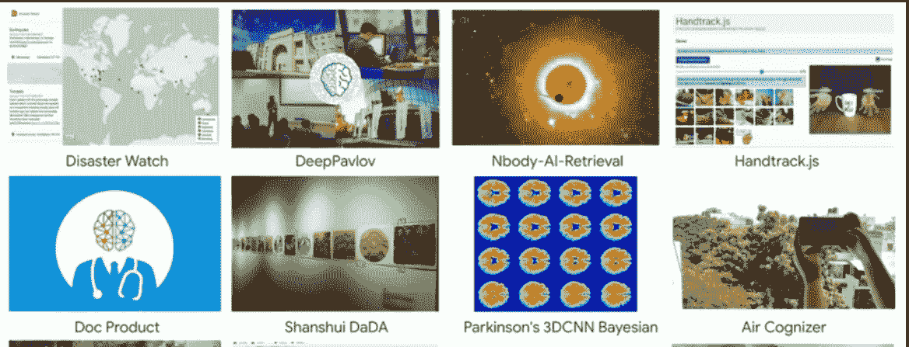
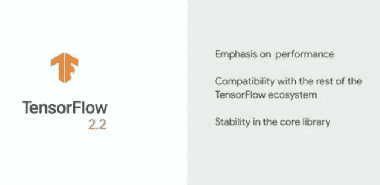
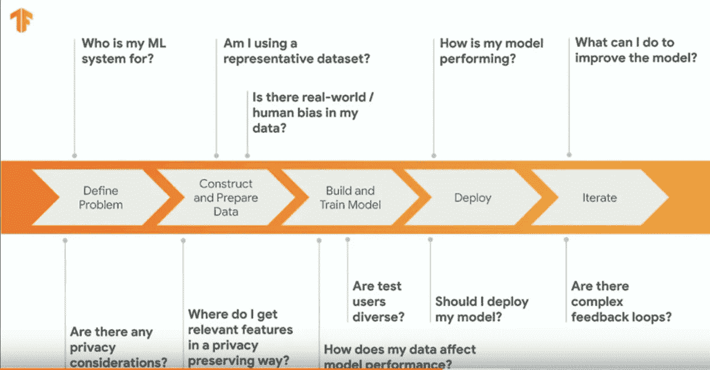
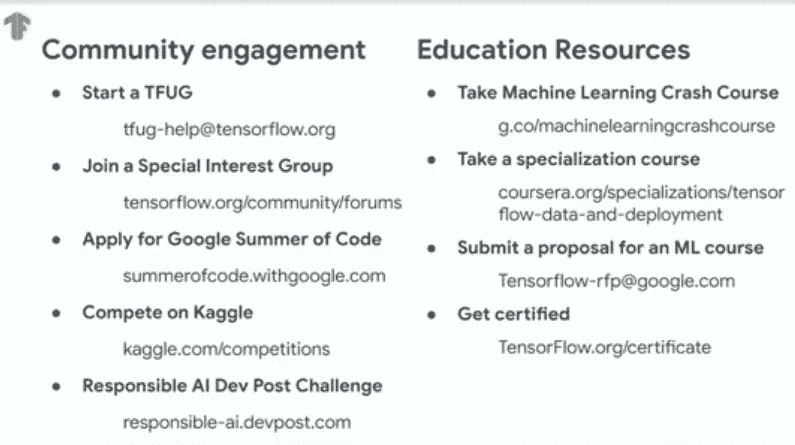
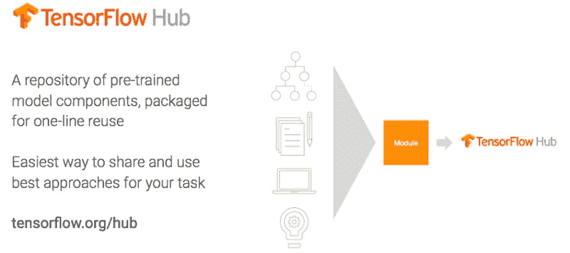
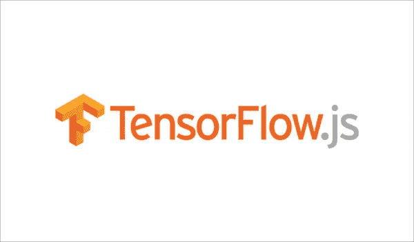

# TensorFlow Dev Summit 2020 的主要亮点！

> 原文：<https://medium.com/analytics-vidhya/top-highlights-from-tensorflow-dev-summit-2020-fa83634c070f?source=collection_archive---------23----------------------->

# 介绍

TensorFlow 是一个流行和领先的开源框架，用于开发机器学习和深度学习应用程序。TensorFlow 由谷歌开发和首创，是一个灵活且不断变化的框架，受到深度学习行业专业人士和专家的青睐。

每年，TensorFlow 背后的团队都会举办一次开发峰会活动，为期两天，内容包括 TensorFlow 团队的技术更新和用户演示，展示他们使用 TensorFlow 构建的惊人应用。也有黑客室，分组会议和研讨会。

今年，TensorFlow Dev Summit 2020 有了不同的味道。随着冠状病毒在许多国家的爆发，TensorFlow 团队决定优先考虑与会者的健康和安全(这是正确的！).他们将发展峰会变成了 YouTube 上有史以来第一个直播流，并为错过它的人提供了录音。

我很高兴在这篇文章中展示 2020 年 TensorFlow 开发峰会的主要亮点。我还附上了每次演讲的视频，这样你就可以完整地观看了！

您还可以在此查看 Analytics Vidhya 的 TensorFlow 教程:

 [## 深度学习指南:使用 Python 中的 TensorFlow 实现神经网络简介

### 概述了解如何使用 TensorFlow 实现神经网络了解神经网络的应用与…

www.analyticsvidhya.com](https://www.analyticsvidhya.com/blog/2016/10/an-introduction-to-implementing-neural-networks-using-tensorflow/?utm_source=blog&amp;utm_medium=highlights-tensorflow-dev-summit-2020) 

好吧，让我们开始最精彩的部分吧！

# 1.TensorFlow 主题演讲

**演讲嘉宾:** [**梅根卡乔利亚**](https://www.linkedin.com/in/megan-kacholia-663abb2/)**[**凯末尔穆贾希德**](https://www.linkedin.com/in/kemalelmoujahid/)**[**玛纳斯乔希**](https://www.linkedin.com/in/manasi-joshi-b51a856/)****

****TensorFlow 的技术项目经理 Megan Kacholia 以欧文博士的故事拉开了峰会的序幕，欧文博士自称是人工智能爱好者，也是菲律宾的一名放射科医生。他使用 Tensorflow.js 构建了一个深度学习应用程序，可以对骨折图像进行分类。****

****从那以后，欧文博士一直在谈论 TensorFlow 如何有可能改变医疗行业，并定期邀请爱好者来建立这样的系统。
以下是一些使用 TensorFlow 构建的其他项目:****

*   ******灾害观察:**一个危机测绘平台，汇集数据并预测自然灾害造成的物理限制****
*   ******深层巴甫洛夫:** NLP 对话系统库****

********

****Megan 随后推出了新的更新— Tensorflow 2.2。以下是它的几个特点:****

*   ****此更新是以结构化方式衡量性能的新基准，即提高速度和性能****
*   ****TensorFlow 生态系统(2020 年 TensorFlow 开发峰会的主要话题):对于那些在迁移到 TensorFlow 2.0 时遇到困难的人，该生态系统为他们提供了他们最喜欢的库和模型，以便与 2.x 一起工作****
*   ****提高稳定性****

********

****TensorFlow 在本次主题演讲中的主要收获和主要特点:****

*   *******tensorflow 数据集****:*2019 谷歌代码学生之夏整理的 tensorflow 数据集出炉****
*   ******tensorflow.dev:** 通过可共享链接分享您的 TensorBoard 结果的新工具包****
*   ****TensorFlow 生态系统的插件和扩展****
*   ******Google Cloud AI Pipeline** :发布用于构建端到端的生产管道，扩展了 Kubeflow 和 Tensorflow****
*   ****TensorFlow 2.x 中的性能分析工具****
*   ****TensorFlow 2.1 支持云 TPU****
*   ******tensor flow Runtime(TFRT):**我们不会以开发人员或研究人员的身份接触 FRT，但它将在幕后为您的深度学习模型提供最佳性能****

****接下来，在 TensorFlow Dev Summit 2020 主题演讲中，TensorFlow 团队的工程总监 Mansi Joshi 介绍了 tensor flow responsive AI 系统。她阐述了什么是负责任的人工智能，以及 TensorFlow 生态系统如何帮助构建这样的系统:****

********

****最后，TensorFlow 团队的产品总监 Kemal El Moujahid 上台发言。他介绍并解释了使用 TF 用户组、TF SIGs(重要兴趣小组)和其他选项与 TensorFlow 团队建立更多联系的各种资源和机会:****

********

****您可以在此观看 TensorFlow Dev Summit 2020 的完整主题演讲:****

# ****2.TensorFlow Hub:简化模型发现****

******演讲者:** [**桑迪普·古普塔**](https://www.linkedin.com/in/sandeep-gupta-a71a343/)****

********

****TensorFlow Hub 是一个可以轻松找到最新的即用型深度学习 TensorFlow 模型的地方，其中包含文档、代码片段等等。TensorFlow Hub 丰富的模型库涵盖了广泛的深度学习任务，如:****

*   ****对于**图像**:用于[图像分类](https://www.analyticsvidhya.com/blog/2019/01/build-image-classification-model-10-minutes/?utm_source=blog&utm_medium=highlights-tensorflow-dev-summit-2020)、[物体检测](https://www.analyticsvidhya.com/blog/2018/10/a-step-by-step-introduction-to-the-basic-object-detection-algorithms-part-1/?utm_source=blog&utm_medium=highlights-tensorflow-dev-summit-2020)、图像放大等的模型。****
*   ****对于**文本**:文本分类的模型，像[伯特](https://www.analyticsvidhya.com/blog/2019/09/demystifying-bert-groundbreaking-nlp-framework/?utm_source=blog&utm_medium=highlights-tensorflow-dev-summit-2020)这样最先进的模型****
*   ******视频**:动作识别、手势模型****
*   ****对于**音频**:音高检测模式****

****1000 多个模型都有文档和代码片段。你可以在[这个链接](https://tfhub.dev/s?subtype=module,placeholder)上找到交互式的 Google colab 笔记本。****

******tensor flow Hub 的新特性:******

*   ****改进的搜索和发现****
*   ****扩展了对 TF 格式的支持，包括 tensorflow.js 和 tensflow.lite****
*   ****适用于各种流的改进的最新模型****

****点击此处观看 TensorFlow Hub 上的完整演讲:****

# ****3.与 TensorBoard.dev 合作的 ML****

******演讲者:** [**加尔·奥什里**](https://www.linkedin.com/in/galoshri/)****

****TensorBoard 是一个 TensorFlow 可视化工具包，深度学习研究人员和工程师通常使用它来了解他们的实验结果。TensorBoard 让我们可以跟踪指标，可视化我们的深度学习模型，并探索参数等。****

****但是有一个限制——这些结果只能以图片的形式分享给其他人查看或修改。更容易发现错误的实际实现不能共享。****

****TensorBoard.dev 简化了这项任务。通过 tensorflow.dev，我们可以上传我们的 TensorBoard 结果，并获得一个链接，我们可以免费与大家分享！其他人可以轻松地查看我们的 TensorBoard 并与之互动，以比较他们的表现或纠正我们的错误。下面是[链接](https://tensorboard.dev/)入门。****

****以下是 TensorBoard.dev 在 TensorFlow Dev Summit 2020 上的演讲:****

# ****4.TensorFlow 2.x 中的性能分析****

******演讲人:** [**【徐】**](https://www.linkedin.com/in/qiumin-xu-3a3b9940/)****

****性能评测工具终于在 Tensorflow 2.x 中发布了！这个工具有助于像专业玩家一样提高我们深度学习模型的性能。性能分析的作用是产生自动化的性能指导和建议，以提高模型性能，从而提高性能工程师的工作效率。****

****发布了 8 个新工具，其中 4 个是 CPU、GPU 和 TPU 通用的。其中一些包括:****

*   ******概述页面:**该工具概述了在我们的设备上运行的工作负载的性能****
*   ******I/O 输入管道分析器:**最重要的工具，用于确定模型中是否存在任何瓶颈，并提供消除该瓶颈的建议和资源****
*   ******TensorFlow Stats** :以图表或表格的形式呈现统计数据****

****我相信您会和我一样对尝试 TensorFlow 2.0 中的性能分析感到兴奋！你可以通过这个[链接做到这一点。](https://www.tensorflow.org/tensorboard/tensorboard_profiling_keras)****

****别忘了观看关于 TensorFlow 2.x 中性能分析的完整报告:****

# ****5.MLIR:用编译器加速张量流****

******演讲者:** [**雅克·皮纳尔**](https://www.linkedin.com/in/jacquespienaar/)****

****机器学习模型的复杂性和规模每天都在增加。因此，这需要增加训练这些模型的计算要求。系统和硬件必须快速适应更复杂的深度学习算法，同时支持各种各样的部署场景。****

****这就是 MLIR(多层次中间代表制)。它是 TensorFlow 的编译器框架和中间表示。以下是它的主要特点:****

*   ****最先进的编译器技术****
*   ****模块化和可扩展(可以根据您自己的型号和硬件轻松修改)****
*   ****不固执己见(为自己的问题空间创建解决方案)****
*   ****完全可定制****

****请点击此[链接](https://www.tensorflow.org/mlir)开始为 MLIR 做贡献。****

****你可以在这里观看演讲:****

# ****6.TFRT:新的 TensorFlow 运行时****

******演讲人:******

******运行时是一个低级组件，它通过调用实现机器学习原语(如矩阵乘法)的相关内核来协调所有模型的执行。引入 TFRT 是为了取代现有的 TensorFlow 运行时，以获得更快、更大的模型，并增强研究创新。******

******以下是它的主要特点:******

*   ******重点是性能、可扩展性和统一性******
*   ******改进的错误报告******
*   ******提高了性能，降低了 CPU 使用率******
*   ******跨多种硬件的统一培训。******

******它仍在生产中，TensorFlow 团队计划在一年内将 TFRT 与 TensorFlow 堆栈集成在一起。这将极大地提高性能，同时减少硬件使用。******

******以下是演讲全文的链接:******

# ******7.TensorFlow Lite:面向移动和物联网设备的 ML******

********演讲人:** [**蒂姆·戴维斯**](https://www.linkedin.com/in/timdavisau/)**[**t . j .阿隆博**](https://www.linkedin.com/in/t-j-alumbaugh-6828932/)********

****Tensorflow Lite 是一个生产就绪的跨平台框架，用于在移动设备和嵌入式系统上部署机器学习和深度学习模型。自 2017 年推出以来，TensorFlow lite 现已在全球超过 40 亿台移动设备上使用。****

****以下是介绍不断涌现的 TensorFlow lite 库的许多功能的演讲要点:****

*   ****TF lite **支持库已经将**扩展到处理和转换数据之外，以实现轻松的设备部署****
*   ****引入了更多图像和语言 API****
*   ******Android Studio 集成**(目前为止这个 TF lite 中最重要的集成)。这将确保单次拖放到 Android studio 中，然后自动为 TF lite 模型生成 Java 类****
*   ******扩展的模型元数据**:这个工具将允许我们轻松地生成模型元数据，它提供了关于模型做什么、模型的预期输入格式以及输出意味着什么的附加信息****
*   ******TFLite Model Maker:** 一个新的 Python 库，让我们可以为数据集定制模型，而不需要机器学习****
*   ****苹果设备的核心 ML 委托，通过[苹果神经引擎](https://www.tensorflow.org/lite/guide/ios)加速 iOS 设备上的浮点运算****

****如果你还没有尝试过这个惊人的 TensorFlow 功能，你可以从这里开始[。](https://www.tensorflow.org/lite/)****

****以下是完整的会话:****

# ****8.TensorFlow.js:网络及其他领域的机器学习****

******演讲者:李娜******

********

****[TensorFlow.js](https://www.analyticsvidhya.com/blog/2019/06/build-machine-learning-model-in-your-browser-tensorflow-js-deeplearn-js/) 是一个开源的人工智能平台，用于在你的浏览器或任何可以运行 JavaScript 的地方开发、训练和使用人工智能模型。今年，Tensorflow.js 1.0 发布了以下改进功能:****

*   ****更多模型包括身体分割、毒性检测和声音识别****
*   ****与 Glitch 和 Codepen(两个大型在线 javascript 平台)合作，进一步支持 JS 开发人员在他们的应用程序中学习和使用机器学习****
*   ****Converter Wizard 是一款交互式命令行工具，可以毫不费力地将深度学习模型转换为 Tensorflow.js 格式****

****自 2018 年发布以来，TensorFlow.js 已经实现了关键功能集成和许多模型，以简单地在 JavaScript 中构建深度学习模型，并轻松帮助全球开发者。****

****观看以下完整视频:****

# ****分析 Vidhya 对 2020 年 TensorFlow 开发峰会的看法****

****以下是我从 TensorFlow Dev Summit 2020 学到的内容:****

*   ****TensorFlow 中介绍了很多精彩的库，包括 tensorboard.dev 和 TFRT****
*   ****TensorFlow Lite 和 TensorFlow.js 等现有库中引入了许多新功能****
*   ****主要重点是提高我们模型的速度和性能。性能分析将大大提高全球性能工程师的工作效率****
*   ****在改善深度学习模型的可扩展性和在 Android 设备和 Arduino 中实现机器学习模型方面做了大量工作，减少了延迟和网络问题****

****请在下面的评论区告诉我你对 TensorFlow Dev Summit 2020 的选择！你也可以在分析 Vidhya 的 Android 应用上阅读这篇文章****

*****原载于 2020 年 3 月 12 日 https://www.analyticsvidhya.com***。******