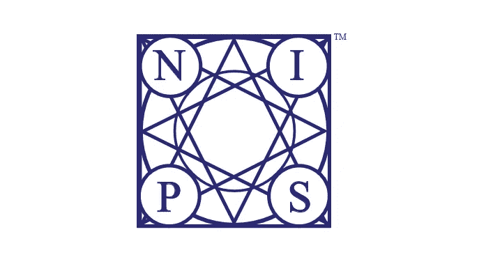

# neur IPS(NIPS)2018ML 教程的最精彩部分

> 原文：<https://medium.com/analytics-vidhya/top-highlights-from-the-ml-tutorials-neurips-nips-2018-359a097f35f5?source=collection_archive---------1----------------------->

NeurIPS(以前称为 NIPS——神经信息处理系统)是世界上最重要的机器学习会议之一。来自全球各地的研究人员展示了他们在这一领域的最新项目，但通过审查筛选？没那么容易。每年都有成千上万的论文被提交，其中只有一小部分能通过最后的会议。

NeurIPS 2018 的观众门票在门户开放 12 分钟内售罄！这可能会让你对这个年度会议有多受欢迎有所了解。对于那些无法到场的人，我们很高兴为您呈现 NeurIPS 2018 最佳教程的快速摘要！

今年的会议于 12 月 2 日至 8 日在加拿大蒙特利尔举行。展示了各种各样的主题——从人工智能的公平和透明到可视化深度学习模型。你可以点击查看完整的日程表[。](https://neurips.cc/Conferences/2018/Schedule)

有几个小时的视频，所以我们的团队浏览了所有的视频，以这篇文章的形式带给你最好的东西。

*注意:我们已经嵌入了大多数会议的视频。由于 FB 视频平台的一些技术问题，一些视频没有被嵌入，我们已经提供了它们的直接链接。虽然总结是一个很好的起点，但我们鼓励每个人也观看视频——这是向该领域顶尖人物学习的绝佳机会。*

# 目录

1.  自动机器学习
2.  研究机器学习中人类方面的常见陷阱
3.  统计学习理论:搭便车指南
4.  无监督深度学习
5.  对抗性鲁棒性，理论与实践
6.  机器学习的可视化
7.  反事实推理
8.  可扩展贝叶斯推理
9.  负相关性，稳定多项式等等

# 自动机器学习

**演讲者**:弗兰克·哈特和华金·范肖伦

# 教程摘要

建立一个端到端的机器学习模型涉及许多步骤，如预处理数据、创建特征、选择模型和调整超参数。自动机器学习(AutoML)旨在自动化这些过程——本教程涵盖了 AutoML 中最先进的方法。在当今环境下，这是一个非常相关的话题。

Frank Hutter 通过讨论深度学习的各种应用以及专家在建立成功模型中的作用，开始了该教程。这可能会被 AutoML 服务所取代，该服务会根据我们提供的原始数据来学习要使用的功能、架构和参数。接下来是对 AutoML 的基本介绍，Frank 谈到了超参数的类型和现代的**超参数优化方法**。这大致分为三个子主题:

*   AutoML as 超参数优化
*   黑盒优化:讨论黑盒优化的方法，如网格搜索，随机搜索和贝叶斯优化。
*   超越黑盒优化:涵盖三种主要方法-超参数梯度下降，学习曲线外推和多保真优化。元学习也是这方面的一部分

Frank 涉及的下一个主题是关于神经架构的，它又分为三个部分——搜索空间设计、黑盒优化和超越黑盒优化。

*   搜索空间设计:包括基本的神经结构搜索空间，如链式结构搜索空间和单元结构搜索空间。
*   神经架构搜索(NAS)方法的黑盒优化:Frank 将强化学习和贝叶斯优化作为本主题的一部分，涵盖了 NAS
*   超越黑盒优化:讨论四种主要方法:权重继承和网络变形、权重共享和一次性模型、多保真优化和元学习。

在与 Frank 进行了简短的问答后，Joaquin Vanschoren 接手了本教程的后半部分。他主要关注元学习。他谈到了各种方法，配置空间设计，代理模型转移和热启动多任务学习。Joaquin 进一步讨论了学习管道，接着是迁移学习和迁移特征。他还花了一些时间讨论梯度下降和 LSTM 元学习者等话题。

# 研究机器学习中人类方面的常见陷阱

演讲者:迪尔德丽·穆里根、尼廷·科利、约书亚·克罗尔

# **教程总结**

机器学习几乎被用于该行业的每个领域，世界各地的研究人员都在研究它如何影响人类和社会。本质上，伦理应该是每个 ML 项目的核心。本教程背后的主要思想是提出机器学习研究人员和实践者在思考某些主题时持有的一些常见误解。

***这是我们恳求大家观看的视频！***

一些术语，如公平性、问责制、透明度和可解释性，经常被重复使用来表示不同的含义，这可能会造成不必要的误解。本教程研究了如何用相同的词来指代不同的想法。演讲者还展示了一些案例研究，这些学习应用于 ML 问题。

会议首先集中讨论了我们使用的术语有一定定义的必要性，以及这些术语如何对不同的人有不同的含义。我们被引入了术语“*社会技术*”。为了更好地解释这个概念，Nitin Kohli 采用了“公平”这个术语，并展示了它对统计学家、计算机科学家或律师的不同理解。

很自然，下一个例子是“透明度”一词。演讲者们拿起一些非常常见的例子来区分这个词对于在政府部门工作的人和机器学习工程师的意义。在这篇文章之后，尼廷用合适的例子描述了“解释”这个词及其各种类型。

在会议期间，他们还谈到了“问责制”和“可解释性”这两个术语，随后的问答也提供了大量信息。

# 统计学习理论——搭便车指南

 [## 神经信息处理系统

### 欢迎回到 NeurIPS 2018 教程会议。本教程统计学习理论:一个搭便车的指南…

www.facebook.com](https://www.facebook.com/nipsfoundation/videos/tutorial-session-statistical-learning-theory-a-hitchhikers-guie/590172534772927/) 

演讲者:约翰·肖-泰勒，奥马尔·里瓦斯帕拉塔

# **教程总结**

John Shawe-Taylor 首先介绍了统计学习理论(SLT ),然后介绍了一些常用术语的基本定义和符号，如推广差距、上限等。

两位发言人概述了本次会议，并列出了一些重要主题:

*   第一代 SLT
*   最坏情况一致界限
*   Vapnik Chervonenkis 的特征
*   第二代 SLT
*   假设相关复杂性
*   SRM 利润 PAC-Bayes 框架
*   下一代 SLT？

在让观众熟悉重要术语后，Omar Rivasplata 接过了讨论第一代 SLT 的接力棒。他从谈论单个函数的构造块开始，然后解释了有限函数类和无限函数类。在接下来的几张幻灯片中，Omar 讨论了虚拟机的界限以及虚拟机框架的限制。

在演讲的前半部分，当听众熟悉了第一代 SLT 之后，约翰概述了接下来的内容——第二代 SLT。他详细阐述了使约束函数依赖的不同方法，以及可用于检测良性分布的技术。

我们还看到了*三种证明技术*——涵盖数字、Rademacher 复杂度和 PAC Bayes 分析。他比较了 PAC-Bayes 界限和 Bayes 学习。演讲的这一部分非常有趣——请观看视频，以便更深入地了解它。

本教程的最后一部分是关于下一代 SLT 的讨论，演讲者将讨论神经网络的性能和稳定性。在整个教程中，演讲者使用图表和数学方程解释所有的概念，这使得主题非常清楚。

# 无监督深度学习

演讲者:亚历克斯·格雷夫斯和马克·奥雷里奥·兰扎托

# 教程摘要

一个你们大多数人都会好奇去探索的话题！本教程分为两部分:

*   第一部分由 ***亚历克斯·格雷夫斯*** 教授
*   第二部分由***Marc ' aurelio ranz ATO***编写。

在第 1 部分中，Alex 解释了为什么我们首先需要无监督学习。为什么不能只提供训练模型的真实标签？主要有三个原因:

1.  目标可能很难获得
2.  无监督学习感觉更人性化
3.  我们需要对新任务和新情况的快速概括

与输入数据相比，监督学习中的目标包含非常少的信息。使用监督学习，我们限制模型只学习少量信息。另一方面，无监督学习给我们提供了无限的学习信息。因此，模型不是学习数据点，而是学习数据集。

无监督学习给了我们更多的学习信号，但学习目标并不完全清楚。**自回归神经网络**可用于密度建模，帮助从数据中学习信息。像**自动编码**和**预测编码**这样的方法可以产生有用的潜在表示。

在第 2 部分中，Marc 讨论了基于其他框架和原则的无监督学习的各种应用。他解释了如何学习表示和样本，以及如何在两个域之间进行映射。学习表示法的一些技巧是:

*   在设计模型之前，请务必查看数据
*   PCA 和 k-means 通常是一个强有力的基线

他还提到了如何使用无监督学习在 NLP 中提取特征。学习如何在两个域之间映射的一些应用是:

*   在视觉中进行类比
*   在机器翻译中利用大量未标记的数据
*   一个人工智能代理必须能够执行类比以快速适应新的环境，因此学习这种映射是有帮助的

无监督学习有大量的子领域，如特征学习、学习对齐域、学习生成样本等。无监督学习的最大挑战是:

*   选择哪种度量标准，定义的任务应该是什么？
*   当前算法的通用性和效率
*   将无监督学习与其他学习组件集成

# 对抗性鲁棒性，理论与实践

演讲者:济科·科尔特和亚历山大·mądry

# 教程摘要

在该教程中，两位研究人员都谈到了机器学习预测如何最准确，但同时也很脆弱。好奇吗？向数据中添加一点点噪声就能彻底改变预测，导致性能下降。尝试数据扩充也无助于提高性能。机器学习的脆弱性可能导致的一些问题是:

*   安全性
*   安全
*   ML 对齐

为了让我们的机器学习模型更加安全，济科和亚历山大提出了三条戒律:

*   不要对你不信任的数据进行训练，因为这可能会导致数据中毒
*   永远不要让任何人使用你的模型或者观察它的输出，除非你完全信任他们
*   不要因为对立的例子而完全相信你的模型的预测

他们谈到了对抗性的例子和验证，以及如何训练对抗性的健壮模型。济科进一步提出了强健的深度网络是否过度适应的问题。即使是训练对抗性的鲁棒模型，也需要更多的数据——这是众所周知的事实。数据扩充可用于增强模型的稳健性。对抗性训练也是数据增强的终极版本，因为我们在给定训练集的最混乱版本上进行训练。

使模型稳健的一些关键点是:

*   在标准训练中，所有的相关性都是好的相关性
*   但是，如果我们想要稳健，必须避免弱相关特征

最后，总结一下对抗性的健壮性:

*   训练期间的优化更加困难，并且模型需要更大
*   需要更多的训练数据
*   当使用对抗性强的模型时，标准精度也可能降低

除此之外，使用对抗性稳健模型的优势是巨大的。该模型在语义上变得更有意义。我们将能够更加依赖它。并且它导致机器学习不仅安全可靠，而且更好。听起来对我们来说是个不错的赌注！

# 机器学习的可视化

演讲者:费尔南达·维加斯和马丁·瓦滕伯格

# [点击此处观看完整视频](https://www.facebook.com/nipsfoundation/videos/203530960558001/)

# 教程摘要

在某种程度上，视觉化是我们所有人都会涉及的话题。我们当中有谁以前没有做过彻底的 EDA？

Fernanda Viégas 和 Martin Wattenburg 讨论了机器学习最有趣和最基本的主题之一——可视化。他们首先谈到了什么是数据可视化，它是如何工作的，以及它的一些最佳实践。然后，演讲重点讨论了可视化如何应用于机器学习。本教程还介绍了高维数据的一种特殊情况。

数据可视化几乎适用于每个领域，它的一些应用包括:

*   数据探索
*   科学见解
*   沟通
*   教育

使用颜色进行可视化使它更容易理解，甚至更快。可视化使计算变得更容易，不那么乏味(谁不欣赏这一点呢？！).它有助于计算的一些示例如下:

*   平均值计算和比较
*   加权平均值

本教程还深入探讨了 ML 项目的可解释性和模型检查方面。可视化卷积神经网络(CNN)的不同层有助于我们理解它如何对图像进行分类(这在模型表现不佳的情况下也有帮助)。

我们可以一层一层地解释这个模型，最终得出问题出在哪里。他们推荐使用 Jupyter 笔记本进行可视化，这些笔记本有像 *matplotlib* 和 *plotly* 这样的库，这些库有用于大多数可视化的预建代码。

# 反事实推理

演讲者:苏珊·艾希

# 教程摘要

在这个引人入胜的教程中，Susan 主要讲述了如何估计因果效应的大小，以及如何量化研究人员对这些大小的不确定性。她用反事实推理的方法提出了机器学习的发展。接下来，Susan 展示了一个冷酷的事实——研究人员所做的和企业所应用的之间存在差距。

她提到了三种反事实推理方法:

*   **项目评估或治疗效果评估**:在这种方法中，根据平均效果评估干预政策的影响，在复杂项目的情况下，根据异质性效果评估影响(对谁有效？)
*   **结构估计或“生成模型和反事实”**:目标是影响替代反事实体制中参与者的福利
*   **因果发现**:这种方法的目标是发现潜在的因果结构

此外，Susan 简要地提到了因果推理所面临的主要挑战，例如，数据缺乏变化、数据不足以及从业者缺乏关于模型的知识。主动进行大量实验并与专家进行大规模互动的科技公司应该更多地关注因果关系的学习。

# 可扩展贝叶斯推理

演讲者:大卫·邓森

# 教程摘要

贝叶斯学习作为一个话题吸引了我们很长一段时间。

**本次会议的目标是激励人们更多地研究贝叶斯方法，因为这些方法为复杂数据建模提供了一种有吸引力的通用方法。** David Dunson 概述了使用贝叶斯统计方法分析大型数据集的最新方法。

David 解释了 Markov Chain Monte Carlo (MCMC)算法如何变得越来越可扩展和更快，这要归功于该主题上新兴的丰富和实用的文献。除此之外，他还非常强调调整贝叶斯范式，使其在大数据和将贝叶斯扩展到高维数据(特征数量>样本数量)方面更加稳健，这本身就是一个非常热门的话题。

如果你对贝叶斯统计感兴趣，那么这是一个必看的视频，有以下几个要点:

*   贝叶斯是可扩展的
*   在大数据和高维问题中，我们必须调整和修改贝叶斯算法
*   我们必须仔细探索如何利用 Bayes 方法的并行处理&精确的近似来减少瓶颈
*   这些贝叶斯方法可以提高计算性能和鲁棒性

# 负相关性，稳定多项式等等

演讲者:苏维特·斯拉和斯蒂芬妮·杰加尔卡

# 教程摘要

本教程介绍的题目是:**负依赖理论**。这可能会影响机器学习的所有方面，包括监督和非监督学习。它是一个丰富的数学工具箱，有助于异常检测、信息最大化、实验设计、黑盒系统验证、架构学习、快速 MCMC 采样等任务。

演讲者强调了负相关理论背后丰富多样的数学思想。此外，还涵盖了以下主题:

*   **强瑞利(SR)测度:**确定点过程，体积抽样，双体积抽样
*   受益于负面依赖的 ML 应用:主动学习、互动学习、推荐系统、对抗模型等。

# 结束注释

这是一个相当激烈的收集！今年的会议比以往任何时候都大，有更多的论文，更大的会场和来自世界各地更广泛的观众。在回顾这些视频时，我们最终学到了很多东西，所以我们建议你也这样做。🙂

NeurIPS 2018 中你最喜欢的环节是哪一个？请在下面的评论区与我们联系，并随时询问您对所涉及主题的任何问题。

*原载于 2018 年 12 月 19 日*[*www.analyticsvidhya.com*](https://www.analyticsvidhya.com/blog/2018/12/top-highlights-tutorials-neurips-2018/)*。*