# 顶级 IPL 击球手-用网络分析寻找答案

> 原文：<https://medium.com/analytics-vidhya/top-ipl-batsmen-to-bat-with-finding-the-answer-with-network-analysis-df5ab128025d?source=collection_archive---------12----------------------->


# 介绍

您知道印度板球队非常依赖数据分析来决定他们即将到来的比赛的策略吗？击球手被告知投球手在死亡回合中通常投球的位置，投球手被展示各种视觉效果以帮助他们理解对方击球手的弱点，等等。

老实说，随着数据生成和收集的空前增长，世界各地的运动队和特许经营商正在利用我们指尖上看似无限的数据宝藏。体育分析是一个蓬勃发展的领域。

你可以想象，cricket 已经有了大量的数据。这是一场不同形式和不同水平的球棒和球之间的战斗。对比赛的逐球分析可以产生一些令人惊讶的隐藏见解，例如击球伙伴关系和谁是最佳击球伙伴(网络分析和本文背后的想法)。

板球的最短版本，T20，产生了难以置信的分析和解释点数。我喜欢浏览这些数据集，寻找其他人可能忽略的特征。

这就是我们在本文中要做的。我们将学习网络分析的概念，并将其应用于 IPL 2019 数据，以分析谁是最佳击球手。准备好潜水并大吃一惊了吗？

# 目录

1.  统计在板球运动中的作用
2.  击球伙伴关系的重要性
3.  击球合作关系的网络分析
    -击球合作关系网络概述
    -网络解释和推论
4.  为 IPL 2019 在 Python 中实现网络分析

# 统计在板球运动中的作用

统计学在体育运动中一直扮演着重要的角色。正如我上面提到的，体育分析正在崛起，并将继续在球队如何运作、选择球员、如何比赛等方面发挥重要作用。

板球也不例外。击球手得分、投球手得分或板球队获胜——这些都是板球比赛中最重要数字的例子。

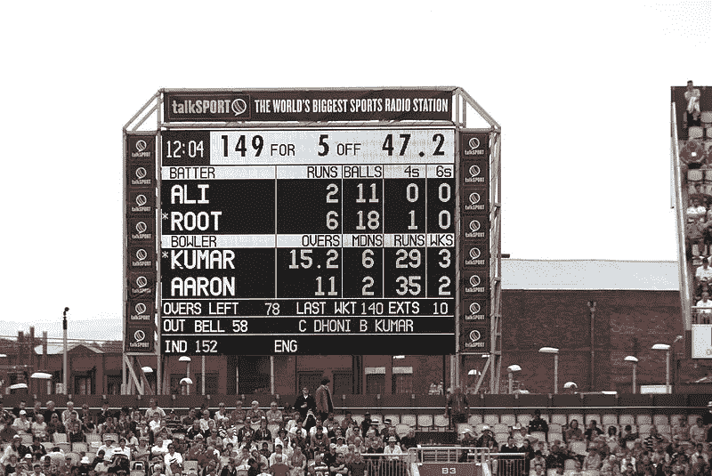

*板球记分卡*

保留所有此类统计数据的记录有多种好处。团队和个人玩家可以深入挖掘这些数据，找到需要改进的地方。它也可以用来评估对手的优势和劣势。

下面你可以看到板球运动中最好的击球手之一 Virat Kohli 的一些关键数据的快照:

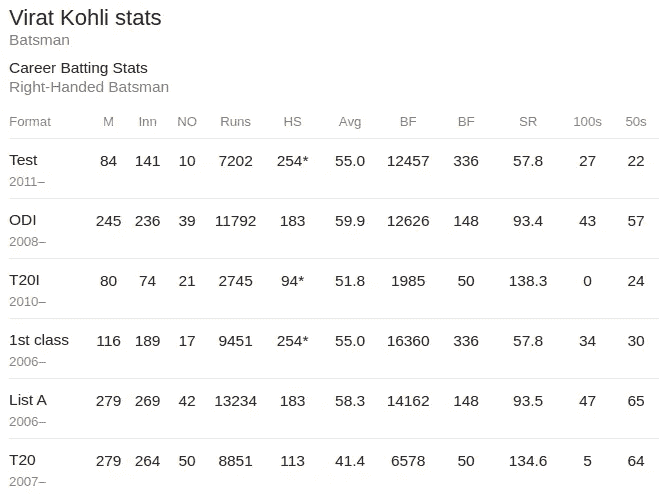

这个记录给了我们相当多有用的信息，比如:

*   不同形式的击球率
*   击球手得分> = 100 分的次数
*   击球手的最高分
*   比赛次数等。

对这种结构良好的数据进行广泛的探索性分析有助于比较多个玩家。

> 想想看——我们可以试着回答一些古老的问题，比如谁是有史以来最好的击球手？考特尼·沃尔什比柯特利·安布罗斯强吗？诸如此类。

这种分析将基于他们的个人记录。想象一下我们使用这些数据会有多有趣！

然而，仅使用传统的数据分析技术很难获得许多重要的见解。由于板球是一项团队运动，它包括队内队员之间以及与对方队员之间的互动。

如果个人只关注各自的表现，赢得比赛是相当困难的。他们也必须支持他们的同伴，对吗？

游戏的这方面是相当明显的，尤其是在击球的时候。总会有两个击球手站在折痕处。在下一节，我们将讨论板球比赛中击球伙伴关系的重要性。

# 击球伙伴关系的重要性

你最喜欢的开场击球搭档是谁？我以前很喜欢看 Sachin Tendulkar 和 Sourav Ganguly 打开局面——那种左右手组合是致命的。

> 健康的击球伙伴关系对球队获得高分有很大的作用。在一局的早期阶段，良好的合作关系为后续的击球手提供了一个坚实的基础，使他们能够自由地打球，并根据情况得分(不管比赛的形式如何)。

让我们来看看 2020 年 1 月 7 日印度和斯里兰卡之间的 T20 比赛的伙伴关系图:

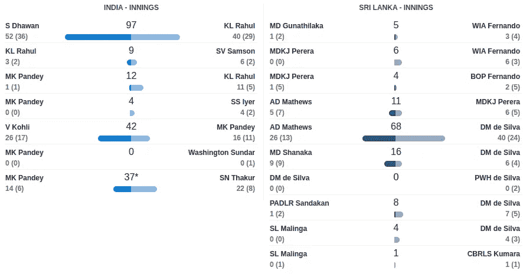

斯里兰卡先击球，得了 142 分。印度轻松克服了这个目标，赢得了比赛。

上面的图表显示了两个队击球搭档的比较。正如你所看到的，斯里兰卡只有一个像样的合作伙伴(马修斯和德席尔瓦)。另一方面，印度有三个好的合作伙伴，分别是 97、42 和 37 分。

我敢肯定，你们所有的板球死硬派都会挑选出这些年来你所见过的最喜欢的搭档。板球界有很多这样的例子——只要选出你最喜欢的 5 个，这种模式就会出现！

在下一节，我将介绍我的方法来量化整个比赛的击球伙伴关系。

# 击球伙伴关系的网络分析

我的方法受到了萨蒂扬·慕克吉(Satyam Mukherjee)的这篇精彩论文——《板球中的复杂网络分析 》的启发。

> 我选择了网络分析，因为它可以轻松地向我们展示全局，也就是说，当我们在参与者之间进行交互时，它会比许多其他传统分析提供更多的见解。

**在这篇文章中，我将向你展示我如何在 IPL 2019** 中对击球伙伴关系进行网络分析。你可以在这里跟着我——然后将你的知识应用到 IPL 2020 数据上，这些数据将在锦标赛开始后出现！

对于外行人来说，IPL(印度超级联赛)是一年一度在印度举行的 T20 板球锦标赛。IPL 有八支队伍，每支队伍都由本地和国际球员组成:

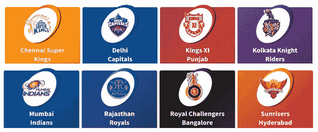

[资料来源:sports.ndtv.com](https://s3-ap-south-1.amazonaws.com/av-blog-media/wp-content/uploads/2020/01/teams.png)

# 击球合作网络概述

这个想法是为一支球队建立一个网络，其中的节点是整个锦标赛(IPL 2019)期间为球队击球的击球手。**如果任何两个击球手一起击球一次，他们之间就会有优势。**

这些边将有方向，即每条边将从一个节点指向另一个节点。这个方向将告诉我们谁对合作关系的贡献更大。

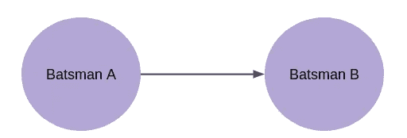

例如，在上图中，考虑到他们在一起的所有合作关系，击球手 B 的总体贡献大于击球手 A。

但是，等一下！这个“整体贡献”到底是什么？

这本质上是一个性能指标。让我告诉你它是如何计算的。

假设击球手 A 和击球手 B 在一场板球比赛中有 6 次搭档(任选 2 名击球手)。以下是每个合作关系中个人得分的柱状图:

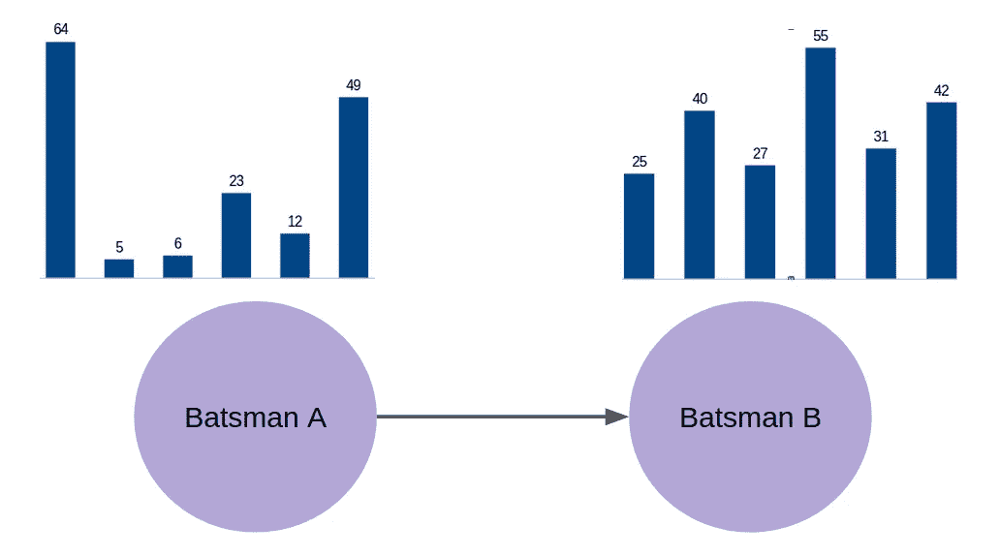

我们可以清楚地看到，与击球手 a 相比，击球手 B 的得分更加稳定。然而，我们不能依靠目测来找出两个击球手中更好的击球手。我们应该想出一些衡量标准来决定谁是更好的击球手。

我们将按照以下步骤来计算该性能指标:

1.  计算两个相连击球手得分的单个中值
2.  单独把分数加起来。击球手 A 与击球手 B 共得了 159 分，而击球手 B 又为这一合作关系总共增加了 220 分
3.  找出两个分数中较大的分数与总分数之比。因此，在这种情况下，比率将是 220/(159 + 220)

这个比率是我们用来确定边缘方向的性能指标。以下是 IPL 时代最成功的球队之一钦奈超级国王队(CSK)的击球合作关系图:

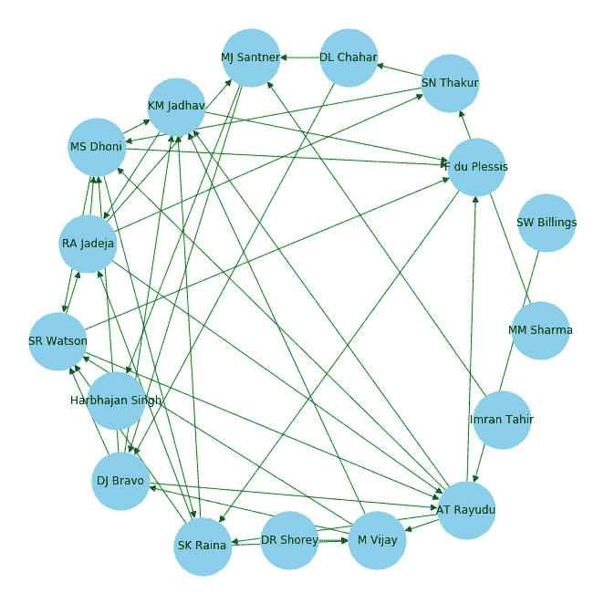

*金奈超级国王击球伙伴网络*

让我们看看如何解读这个图表，以及从中我们能得到什么样的启示。

# 网络解释和推理

在上图中，有 17 个节点和 40 条带方向的边。这意味着在 IPL 2019 期间， **17 名球员为 CSK 击球，有 40 对独特的球员一起击球。**

让我们来看看我们能从这个网络中获得的洞察力:

*   在 Rayudu 与最多的玩家(9 人)建立了伙伴关系，其次是 Dhoni 女士(8 人)
*   KM Jadhav 拥有最大数量的入球优势(5)，这意味着他在与 5 名不同球员的合作中是更有效的击球手
*   11 点 40 分，拉尤杜和老沃森为 CSK 队首开纪录.在建立伙伴关系方面，Rayudu 比 Watson 做得稍好
*   我们还可以推断，一个高边数的击球手可以适应不同的情况，与不同风格的球员一起击球

如果我们把这个网络用于球员的团队间比较，它会更有用。例如，比较所有球队的中级击球手。

我们来对比一下 IPL 2019 半决赛的所有开场击球手。孟买印度人队、金奈超级国王队、太阳升起的海得拉巴队(SRH)和德里首都队(DC)进入了半决赛。我在下面列出了这四支队伍的开场:

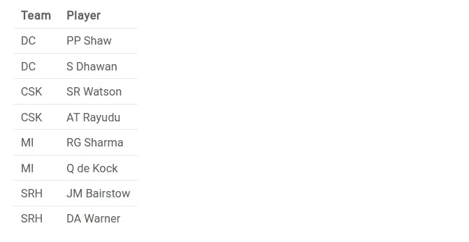

> 通过为这些团队构建类似的伙伴关系网络，我们可以提取上述每个参与者的边数和传入边数。

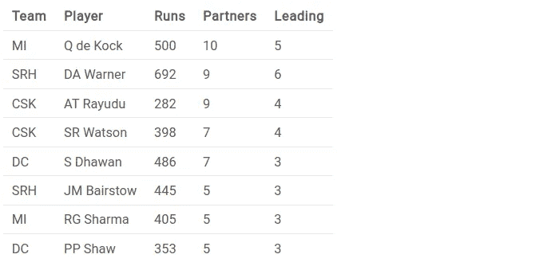

列**‘Partners’**包含边数(独特的合作关系的数量)，列**‘Leading’**包含即将到来的边数(击球手比他的合作伙伴表现更好的独特的合作关系的数量)。

我已经根据边数和传入边数对这些玩家进行了排名，更偏向于边数。然而，在平局的情况下，我使用击球手的总得分。

现在，我将把玩家的价格添加到我们现有的表格中:

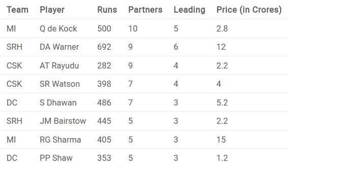

我们可以从这张表中列出几个推论:

*   按照这个排名，Q . de Kock 是最高的，因为他与 10 个不同的击球手搭档
*   达·华纳也做得很好。然而，他比科克贵多了
*   令人惊讶的是，在 Rayudu 没有得分满袋运行。然而，他设法支持其他击球手并建立伙伴关系
*   RG Sharma 只是不能公平对待他的价格标签

这对任何参加明年拍卖的队伍来说都是有用的信息！你还能推断出别的什么吗？请在评论区告诉我。

# 实施 IPL 2019 网络分析

到目前为止，我们已经讨论了大量的理论和思想。是时候将所有这些整合在一起，用 Python 设计我们的网络分析了。

我已经用 Google Colab 实现了代码。你可以随意使用任何你喜欢的 IDE。我们开始吧！

# 导入库和数据

让我们首先导入所需的库:

我从 ESPN·克里奇信息公司手动收集了半决赛选手的击球搭档数据:孟买印第安人队(mi)、钦奈超级国王队(Chennai Super Kings)、太阳队(Sunrisers)海得拉巴队(Hyderabad)和德里首都队(Delhi Capitals)(DC)。

您可以在此 从[T5 下载数据集并加载:](https://s3-ap-south-1.amazonaws.com/av-blog-media/wp-content/uploads/2020/01/ipl_batting_partnerships.csv)

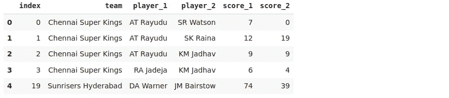

数据集中的每一行都代表一个击球伙伴关系。列 **player_1** 和 **player_2** 包含击球手对，列 **score_1** 和 **score_2** 分别是他们在各自的合作关系中得分的得分。

# 数据准备

让我们首先为四个 IPL 团队之一准备数据集。我们将用它来创建击球合作网络。

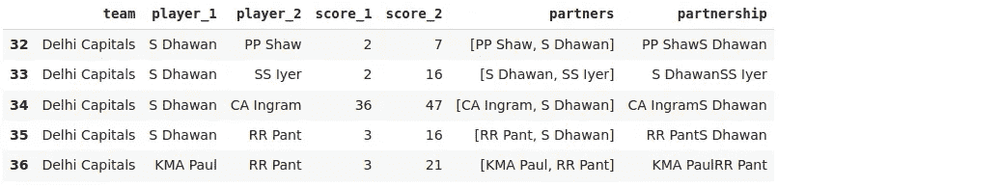

现在，我们有 2019 年 IPL 期间德里首都所有合作伙伴的记录。为了构建网络，我们需要聚集这些数据。

例如，如果两名球员组成了 5 个搭档，那么我们将通过分别取两名击球手得分的中间值来合计:

让我们将汇总的数据放在一个数据帧中:

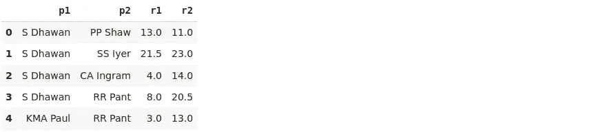

现在我们有了每个击球手得分的中位数，我们可以计算性能指标(总贡献):

# 构建网络

最后，是时候建立我们的伙伴关系网络了！这将是一个有向网络，因为网络中的边将具有基于性能指标的方向:

下面是绘制网络的代码:

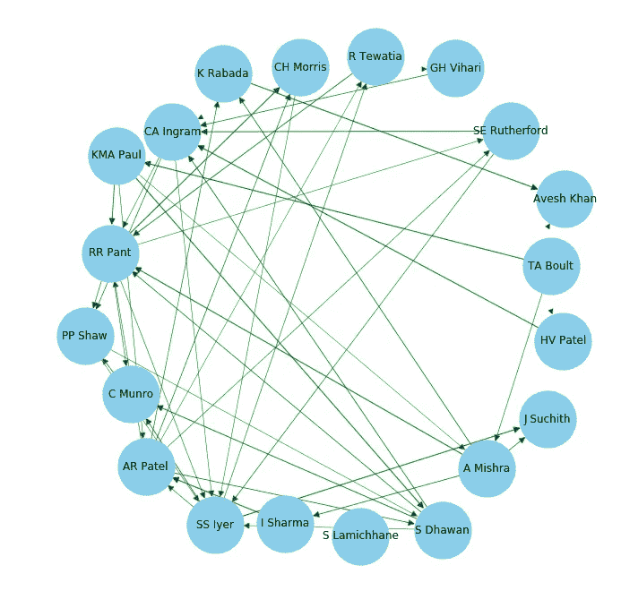

*德里首都击球合作网络*

同样，您也可以为其他团队绘制网络图。使用*网络 x* 库，我们可以很容易地提取边和进来的边的数量。

让我们按节点计算所有边的数量:

```
list(G.degree)
```

**输出:**

[('PP Shaw '，5)，
('S Dhawan '，7)，
('SS Iyer '，10)，
('CA Ingram '，8)，
('RR Pant '，11)，
('KMA 保罗'，5)，
('AR Patel '，9)，
('R Tewatia '，3)，
('GH Vihari '，3)，
('HV Patel '，2)，
('CH Morris '，4)，

按节点获取传入边的计数:

```
list(G.in_degree)
```

**输出:**

输出:
(' PP Shaw '，3)、
('S Dhawan '，3)、
('SS Iyer '，6)、
('CA Ingram '，5)、
('RR Pant '，6)、
('KMA 保罗'，1)、
('AR Patel '，3)、
('R Tewatia '，2)、
('GH Vihari '，1)、
('HV Patel '，1)、
(。

# 结束注释

我为这个项目和这篇文章忙得不可开交。我非常热爱运动，尤其是板球，并且喜欢将这种激情带到这个项目中。

在这里，我们学习了如何在板球中使用图形和网络来发现隐藏的但至关重要的见解。使用本文中获得的技术和知识，我们也可以对其他运动进行网络分析。

如果你对图形和网络的应用有任何其他想法，请在下面的评论区告诉我。

*最初发表于 2020 年 2 月 4 日*[*https://www.analyticsvidhya.com*](https://www.analyticsvidhya.com/blog/2020/02/network-analysis-ipl-data/?utm_source=av&utm_medium=feed-articles&utm_campaign=feed)*。*