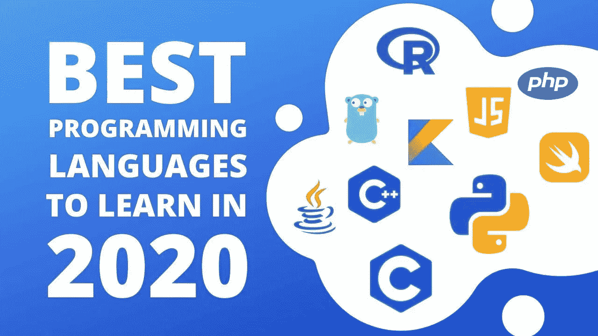
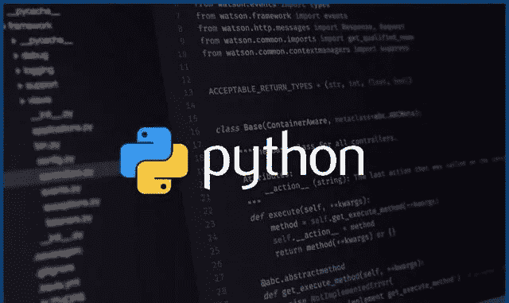
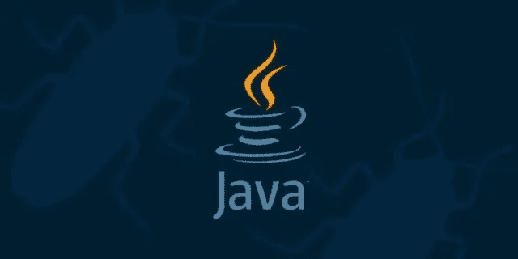
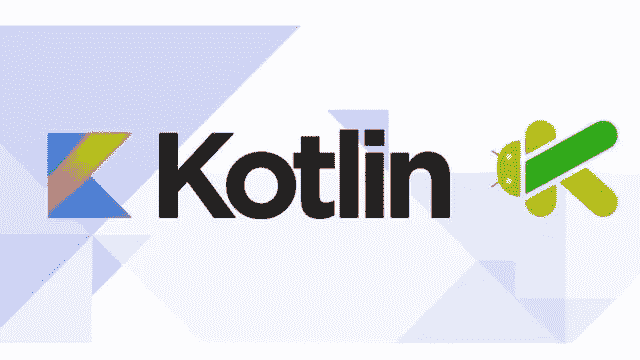
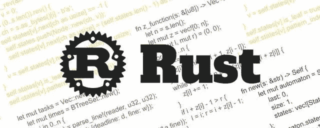
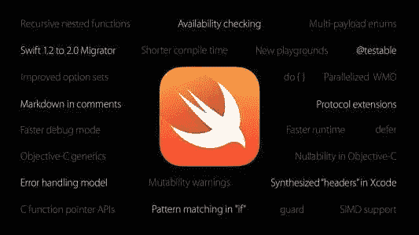

# 2020 年顶级编程语言趋势:你应该学习哪一种

> 原文：<https://medium.com/analytics-vidhya/top-programming-languages-trends-in-2020-which-one-you-should-learn-dd1bc6a529bd?source=collection_archive---------8----------------------->

在这个新的十年里，所有行业都在总结过去，展望未来。SegmentFault 作为面向开发者社区和科技行业的垂直媒体，一直关注行业发展及相关动态。最近，它为技术领域整理了主要平台和社区的预测和库存。

这个清单和分析是由数字编程专家编写的，包含了很多他们对一些经典编程语言和新兴编程语言的思考，以及基于行业的分析。

# 计算机编程语言

Python 今年最大的新闻是“Python 之父”吉多·范·罗苏姆正式退休，将 Python 交给了 Python 指导委员会。到目前为止，在这种权力转移中没有“劳动力”，正如《Python 速成班》的作者埃里克·马特斯(Eric Matthes)认为的那样，这是正常的，因为“圭多将保持自己在社区中的角色。”此外，对 Python 2.7 的支持将在 2020 年结束，这很可能会让那些坚持使用 Python 2.7 的人感到不舒服。

不管怎样，Python 仍然是数据科学的首选语言。

对于 Matthes 来说，Python 令人兴奋的一个方面是“来自一个社区的各种有趣而关键的项目已经诞生，而且这个社区已经如此有意识地建立了这么久。”Python 指导委员会成员和 CPython 开发人员 Carol Willing 的核心也庆祝这些项目，例如 Binder 服务，它通过在 Jupyter Notebook 中创建可执行环境来促进可重复的研究，尤其是当它们超出了最初的目标时。

她指出，“去年，在许多 Python 会议上，活页夹被广泛用于教学研讨会和教程中。”Willing 还对 CircuitPython 和 Mu 项目大喊大叫，问道:“谁会不喜欢硬件，闪烁的 led，传感器，以及使用 Mu 的用户友好型编辑器，这对大人和孩子来说不是一个很好的选择吗？”

# Java 语言(一种计算机语言，尤用于创建网站)

今年对 Java 来说大多是好消息。“Java 消亡的传言再一次成为了平台批评家的一厢情愿，”Ben Evans 解释道。

但这并非一帆风顺。正如我们去年指出的，Java 11 于 2018 年 9 月发布，并带来了许多新功能，包括许多在使用容器方面具有明显优势的重要功能。然而，根据 JetBrains 的调查，这一新版本的推出并没有带来广泛的采用，超过 80%的开发者仍在使用 Java 8。

Evans 想知道:“这是否意味着人们不是在我们所知道的容器中运行 Java？或者人们只是想知道在容器中使用 Java 11 的好处？”

尽管采用缓慢，但 Java 的 6 个月发布节奏仍在继续进化——2019 年 3 月 Java 12 降了，9 月 Java 13 出来了。根据 Trisha Gee 的说法，它确实开始显示其价值:

每个版本都很小，但是可以预测。虽然不是所有的都有令人兴奋的新语言变化，但你可以看到语言正在稳步前进。

此外，它支持预览功能的想法，我认为我们的切换表达式工作得非常好——开发者必须尝试使用该功能，并基于使用的感觉提供真实的反馈，而不是抽象的，概念性的反馈想法。在 Java 13 中，switch 表达式的语法略有变化，这是可能的，因为它是一个预览功能，没有固定的设置。

当 Oracle 将 Java SE 迁移到基于订阅的模式时，2019 年又有了一个惊喜。但是，正如《学习 Java》的合著者 Marc Loy 所指出的，“随着对 OpenJDK 热情的增加，整个 Java 社区正面临着一场‘不幸的’变革。”

至于刚刚到来的 2020 年，埃文斯建议 2020 年可以继续关注 2019 年的发展趋势:

我们将如何处理瓦尔哈拉项目的生产版本？提供模式匹配和代数数据类型的增量策略(Amber 项目)有用吗？Quarkus 会兑现自己的承诺和早期粉丝的信仰吗？2020 年是否会是 Kotlin 在 Android 上跃进的重要一步？

这是一个激动人心的时刻，我们正在向新事物过渡，许多事情正在发生。

# 科特林

谷歌在 2019 年 5 月宣布，Kotlin 现在是 Android 应用程序开发者的首选语言，这表明该语言已经被广泛采用。

虽然许多 Android 开发人员还没有完全迁移到 Kotlin，但那些已经迁移的人知道它提供的好处。Head First Kotlin 的作者 Dawn 和 David Griffiths 分享了 Kotlin 崛起背后的一些原因:

毫不奇怪，Kotlin 对 IDE 公司开发的语言有很好的工具支持。一个用于代码契约的实验性 DSL 使开发人员能够提供关于代码行为的保证。你的功能有副作用吗？是否保证返回非空值？代码契约允许您做出这些承诺，编译器可以使用它们来放松编译时检查。

现在，不同 Kotlin 平台之间的壁垒也被打破。“expect”/“actual”限定符使开发人员更容易编写跨 Java / Native / JS 环境兼容的代码。序列化支持意味着更容易将 JSON 数据转换成 Kotlin 对象，反之亦然。

希望看到 Kotlin 继续惊人地增长——不仅仅是在 Android 上。JetBrains 开发者倡导团队的负责人哈迪·哈里里(Hadi Hariri)指出，Kotlin / Everywhere 的成功使人们有可能学习 Kotlin 在 Android、谷歌云平台和多平台开发中的基础知识和最佳实践，并使用数据来说明:

“从 5 月到 11 月，我们已经成功接触了 86 个国家的 30，000 人。KotlinConf 在 2019 年连续三年售罄，出席人数超过 1700 人。这尤其是一个迹象，表明开发人员的兴趣和采用正在增长。"

# 去

当 Gophers 回顾 2019 年时，他们可能会记得尝试提案的传奇故事。围棋开发者兼作家 Jon Bodner 解释道:

对 Go 最常见的抱怨之一是错误处理过于冗长。因此，在 6 月初，核心 Go 开发者建议增加一个新的内置功能，名为 try。GitHub 现已公开讨论这一新功能。一个月内，有近 800 条评论，其中大部分是负面的。反对这个新特性的人觉得这个变化让代码太“不可思议”，模糊了逻辑流程。在审查反馈后，Go 团队将该提案标记为已完成，并于 7 月 16 日关闭。

这个过程值得注意的不是函数的失败，而是，正如博德纳所描述的，“过程发生的方式:一个函数被提出，讨论被尊重，但很多人认为改变不符合 Go 的风格。最后，人们的管理语言决定了要尊重大多数人。这就是开发者所说的社区。”

2020 年应该会让 Go 的合约规范更加清晰。这就是众所周知的泛型提议。

根据 Bodner 的说法，“与其他语言相比，Go 似乎使用了一种略微不同的泛型方法，但它符合 Go 的习惯用法。”希望它将保持其惯用风格，同时增加开发人员发现其他语言中有用的功能。

# 锈

我们与《编程 Rust》的合著者吉姆·布兰迪(Jim Blandy)进行了交谈，以了解他对 Rust 在 2019 年的进展的看法是如何变化的。

去年，他指出，“Rusty 长期以来一直以这样或那样的形式支持异步编程，但异步函数为这种代码提供了一种语法，这是对以前 Rust 产品的重大改进。”

他改善 Rust 语法的希望实现了吗？是的，最后:Brandy 解释异步/等待语法直到 2019 年 11 月 7 日发布的 1.39 版本才变得稳定。

“最初，我们希望异步/等待语法可以成为 Rust 2018 的一部分，但它需要更长的时间才能完成事情。”然而，他对 Rust 在 2020 年对 Rust 意味着什么抱有很高的期望:“将异步集成到语言中使借用检查器意识到你的行为，因此异步代码看起来像惯用的 Rust。

Rust 社区也对 WebAssembly 感到兴奋，今年 WebAssembly 已经成为 C / FFI 的理论替代品，用于需要可移植的高性能模块的生态系统。正如 Rust 专家 Nathan Stocks 指出的那样:“你也可以使用轻型沙箱！”给股票印象最深的是“有多少理论被成功原型化和证明了。”

之前我纯粹把 WebAssembly 作为编译目标，在浏览器中运行非 JS 语言代码。从浏览器之外的任何语言中使用 Web 程序集的能力令人不寒而栗。

# 迅速发生的

去年发生在 Swift 的最大的故事是 SwiftUI 的发布，这是苹果公司为所有苹果设备设计用户界面的最新框架，以及 Swift 版本的 TensorFlow。

正如 Timirah James 解释的那样，SwiftUI 的声明性已经获得了开发人员的广泛关注，并被认为是 UIKit 的未来继任者。

至于 TensorFlow 的 Swift，Buttfield-Addison 称之为“Swift 的基本新用途”他解释说，“Swift 一直是一种优秀的应用开发和系统编程语言，也是一种新兴的 web 和后端开发语言，但现在，随着 Swift for TensorFlow 的推出，它也是一种强大的 ML 框架。”原因如下:

用于 TensorFlow 的 Swift 由一个团队开发，该团队包括 Swift 的原始创建者克里斯·拉特纳，并提供(或在完成后将提供)机器学习和数值计算所需的一切。最令人惊讶的是，Swift 的底层编译器框架和设计使得完全支持对具有自动区分功能的区分编程的一流支持成为可能。

完全的语言歧视性编程将使以前不可能的事情成为可能:最好的例子是使用标准编程调试器建立神经网络的能力，以逐步反向传播和调试派生类。

Swift for TensorFlow 还为 Swift 提供了完整的 Python 支持，使数据科学家能够将他们需要的有用且熟悉的 Python 框架与清晰的 Swift 代码混合搭配。

展望未来，James 和 Buttfield-Addison 都很高兴看到 Swift 的新方向。詹姆斯指出，“Swift 正在移动社区之外的不同社区和堆栈中迅速采用，特别是在无服务器领域，”Buttfield-Addison 称“令人惊叹的 web 开发框架(如 Kitura)和各种针对特定领域的令人惊叹的框架……如 SwiftPlot，这是 Matplotlib 的原生 Swift 版本，在 Python 中无处不在。”

未来是什么样子的？

变化是不可避免的，随着编程语言继续倾向于针对云、微服务、大数据和机器学习的新趋势进行优化，每种语言及其生态系统都将继续以自己独特的方式进行适应。

一些语言可能会在 2020 年发布主要版本。比如 C ++ 20 将在今年夏天发布，Scala 3.0 预计在 2020 年底发布。但是很明显，即使是最小的变化也会在程序员的日常生活中引起巨大的波澜。