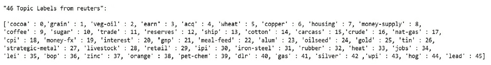
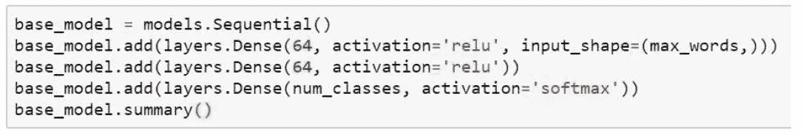
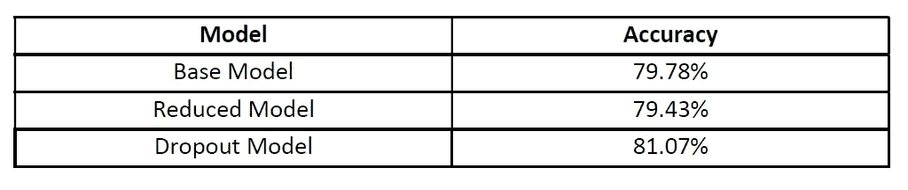
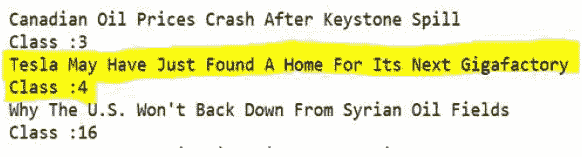

# 新闻文章的话题分析

> 原文：<https://medium.com/analytics-vidhya/topic-analysis-of-news-articles-86996796a26b?source=collection_archive---------16----------------------->

在本文中，我的主要目标是对新闻文章进行主题分析。

1.  使用 Keras 中的 Reuters newswire 数据集作为训练集，构建一个抓取 RSS 提要的实时引擎
2.  自动标记 RSS 源中的主题。

Keras 新闻专线主题分类数据集由路透社的 11，228 篇新闻文章组成，其中有 46 个带标签的主题。每篇新闻文章都被编码为一系列单词索引。

数据集:[https://keras . io/datasets/#路透社-新闻专线-主题-分类](https://keras.io/datasets/#reuters-newswire-topics-classification)

我将使用路透社的数据集作为训练集来建立一个模型，将新闻文章分为 46 个不同的主题。由于我们有许多类别，而且每个数据点只应归入一个类别，这就是*单标签、多类别分类*的一个例子。

# **数据准备**

## 用主题映射类

路透社数据集由简短的新闻专线及其主题组成。有 46 个不同的主题-一些主题比其他主题更具代表性，但每个主题在训练集中至少有 10 条新闻专线。

在最初的分析中，我发现这些类别的范围从 0 到 45，然后将主题映射到相应的类别:

主题标签

从题目名称中，我们可以看到所有的课程都是与商品相关的题目。

## **对数据进行矢量化**

有两种方法可以对数据/标签进行矢量化

1.  将标签列表转换为整数张量，
2.  使用“一键”编码。

在这种情况下，标签的一键编码意味着将每个标签作为一个全零向量嵌入，在标签索引的位置上加 1，我们可以很容易地实现这一点，因为 Keras 中有一个内置函数可以实现这一点。

# **模型构建**

在这个主题分类问题中，我们试图对文本的简短片段进行分类，即新闻标题，输出类别的数量是 46，即输出空间的维度要大得多。

在密集 FNN 模型的情况下，每一层只能访问存在于前一层的输出中的信息。如果一层丢失了一些与分类问题相关的信息，这些信息将永远无法被后面的层恢复。

因此，我们将以 64 层开始我们的模型，并以大小为 46 (num_classes)的密集层结束网络，以便对于每个输入样本，模型将给出 46 维向量作为输出。

最后一层使用一个 *softmax* 激活。使用的损失函数是*分类交叉熵*。

为了处理过度拟合，我还建立了

1.  简化模型→删除一个隐藏层，并将神经元数量从 64 个减少到 32 个
2.  Dropout 模型→一个额外的隐藏层用于随机丢弃一些数据进行训练。

模型精度

所有模型的精确度或多或少是相同的，但是它们可以被改进。

# **模型验证**

下一步是使用 *feedparser* 函数读入数据，即来自不同 RSS 源(路透社、谷歌新闻、BBC、CNN、商品 RSS)的新闻文章，并预测每个新闻标题的类别。

我将使用 dropout 模型来预测和自动标记类，因为 dropout 模型的准确性比其他模型略高。这里您可以看到模型的输出。新闻标题读入，自动预测班级。

例如，突出显示的标题谈到特斯拉“收购”一个新的属性，该属性已被 NN 模型正确预测并标记为 Class: 4，这意味着“收购”。