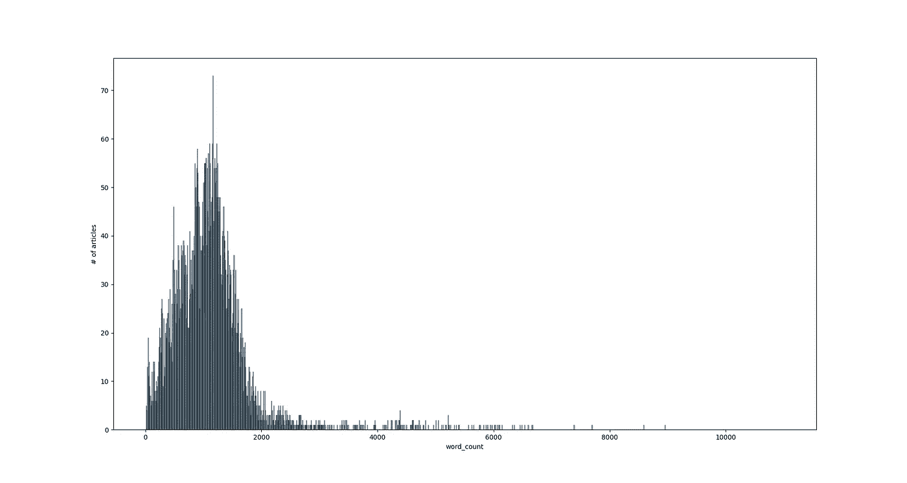
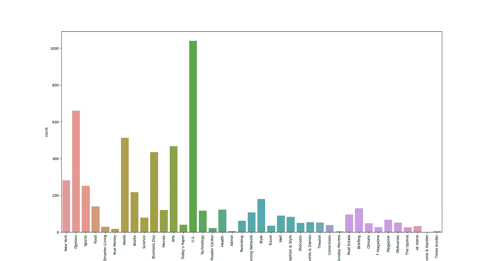
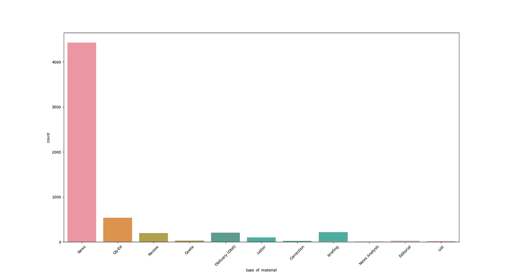
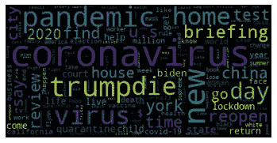
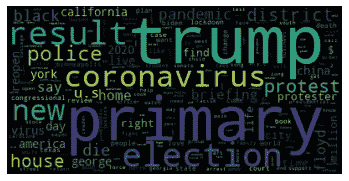

# 主题建模:新闻如何从冠状病毒转移到黑人的命也是命

> 原文：<https://medium.com/analytics-vidhya/topic-modeling-how-the-news-has-shifted-from-the-coronavirus-to-black-lives-matter-f24b8340f18b?source=collection_archive---------20----------------------->

正在进行的 BLM 抗议活动已经导致新闻报道从冠状病毒转向种族主义，这让我很好奇，想看看标题从乔治·弗洛伊德去世前后是如何变化的。

在本文中，我们将使用《纽约时报》通过其 API 从其档案中收集的内容，并根据单词的频率形成单词云，以及使用主题建模来识别和可视化这一巨大变化。为此，我们将混合使用 spaCy 和 Scikit 学习。

所有代码和*。csv 文件可以在我的 [GitHub 仓库中找到，](https://github.com/ApurvaMisra/nyt_headlines_analysis)这里只提供了代码片段。

# 提取数据

数据是在 https://developer.nytimes.com/apis[的](https://developer.nytimes.com/apis)使用纽约时报 API 提取的。作为一名开发者，你需要创建一个帐户，并选择你要使用的 API，在我们的例子中，它是归档 API，返回给定月份的 NYT 文章。我在 2020 年 6 月 19 日提出了 5 月和 6 月的请求，这给了我整个 5 月和 6 月 19 天的数据，这一期间包括杀人前 24 天和杀人后 25 天。

JSON 文件被转储到一个*。txt 文件，然后解析该文件以将数据提取到 CSV 文件中。提取的特征是‘摘要’，‘发布日期’，‘材料类型’，‘字数’，‘打印页面’，‘标题’，‘章节名称’，‘小节名称’。

# 预处理和 WordCloud

获得 CSV 格式的数据后，是时候探索了！下面给出了一些可视化效果(代码可以在[这里](https://github.com/ApurvaMisra/nyt_headlines_analysis)找到)。大部分文章字数在 700-1400 之间。从一份美国出版物来看,“US”是最受欢迎的部分名称，这并不奇怪。“新闻”是出版的材料中数量最多的。就出版日期而言，出版的材料类型没有特定的模式，因此不在此公布。基于打印页面的字数分布也可以在存储库中找到。



字数和文章数量的分布



章节名称的分布



材料类型的分布。



2020 年 5 月 25 日前的词云



2020 年 5 月 25 日之后的词云

除了对“川普”的大量强调，使用词频制作词云突出了热门话题的变化，从“疫情”和“重开”可以看出，让位于“警察”、“抗议”、“黑色”。当然，冠状病毒仍然是一个主要问题和话题，但已经不那么重要了。

# 主题建模

主题建模比使用文档中的词频更进一步。这是一个我们试图捕捉文档中的意义的过程。主题建模用于降维以及捕捉文档中的含义。这与 [PCA](https://math.stackexchange.com/questions/3869/what-is-the-intuitive-relationship-between-svd-and-pca) 的过程本质上是相同的，其中我们将数据投影到新的维度中，并可以在新的向量空间中消除对文档与文档之间的向量差异没有太大贡献的维度。

每个维度都变成了词频的线性组合而不是单一的词频，这些被称为“话题向量”。我们将使用截断的 SVD，它需要一个文档术语矩阵作为输入。我们将经历以下步骤，这些步骤可能会因所分析数据集的种类而异:

1.  删除与我们不太感兴趣的部分相对应的新闻文章，只保留以下部分:“纽约”、“观点”、“体育”、“你的钱”、“世界”、“科学”、“商业日报”、“今日报纸”、“美国”、“技术”、“T2”、“读者中心”、“健康”、“周日评论”、“房地产”、“简报”、“T3”、“气候”、“时代内幕”。
2.  使用 spaCy 进行小写、标记化(通常通过基于空格进行拆分来将文本拆分为标记)、词汇化(删除单词的屈折形式并保留基本形式，例如，“changing”、“changes”和“changed”都有基本单词“change”)以及删除停用单词(“the”、“a”等)。).
3.  去掉只包含数字和星期几的标记作为单词，如“星期一”和“星期二”，这些单词在新闻标题中很常见，但不添加任何相关信息。
4.  形成包含作为列的标记的 BOW(单词袋)数据帧，并且每个索引对应于标题，其值对应于标题中每个标记的频率。
5.  从 TF-IDF(词频-逆文档词频)文档-词频矩阵来看，TF-IDF 建立在这样一个概念上，即如果一个词在其他文档中出现的频率较低，则该词在该文档中应该被赋予更大的权重。
6.  使用 scikit learn 执行截断奇异值分解，找到新的维数。

下面给出了上述步骤的代码，并且仅对 2020 年 5 月 25 日之前的数据帧执行这些步骤，尽管对 5 月 25 日之后的数据帧重复了相同的步骤，这可以在存储库中找到。

5 月 25 日之前的话题:

```
Topic 0: 
 briefing coronavirus happen today test late update
Topic 1: 
 face test mask bad suicide threat stress
Topic 2: 
 test people antibody pandemic f.d.a coronavirus positive
Topic 3: 
 coronavirus late update n.y.c new york pandemic
Topic 4: 
 new pandemic york home market city end
```

5 月 25 日之后的话题:

```
Topic 0: 
 briefing happen today coronavirus evening protest george
Topic 1: 
 result primary election district house california texas
Topic 2: 
 police protest trump new america coronavirus floyd
Topic 3: 
 briefing police protest floyd george trump definitely
Topic 4: 
 trump twitter president rally tweet campaign biden
```

不出所料，5 月 25 日之前的话题主要是冠状病毒疫情，而 25 日之后的话题一直包括乔治·弗洛伊德(George Floyd)、抗议活动，甚至川普和推特之间的斗争。

这一分析的下一个有意义的步骤是研究两个时期之间情绪的变化。我们现在知道我们写的和谈论的已经改变了，如果知道我们写的和谈论的方式也在改变会很有趣。