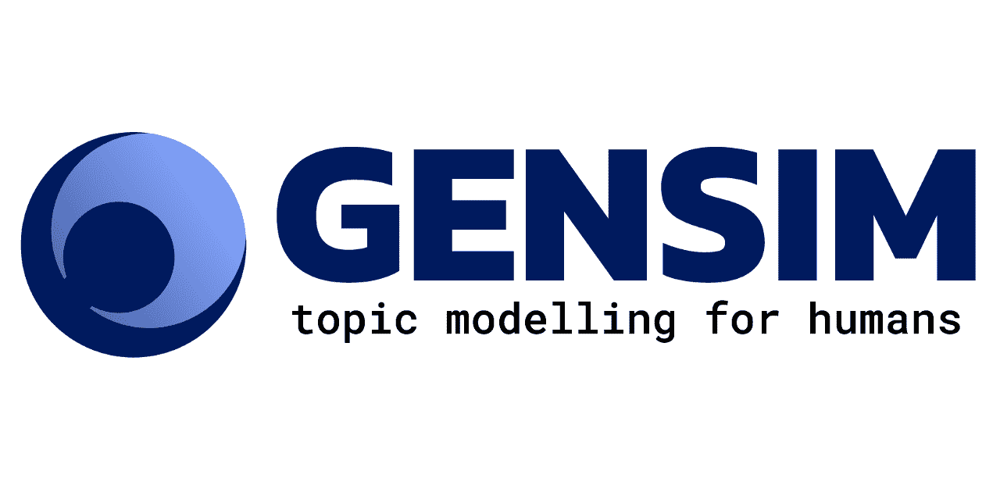
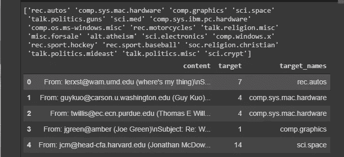
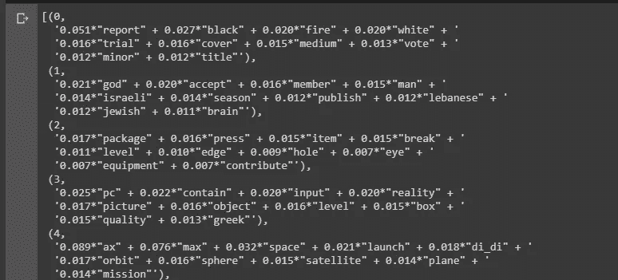
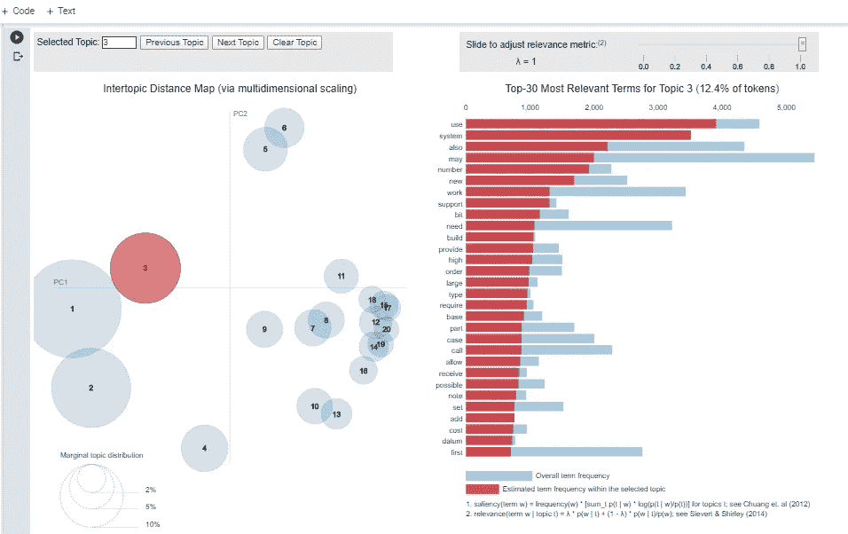

# Python 中使用 Gensim-LDA 的主题建模

> 原文：<https://medium.com/analytics-vidhya/topic-modeling-using-gensim-lda-in-python-48eaa2344920?source=collection_archive---------0----------------------->



这篇博文是使用 spaCy 的自然语言处理的第 2 部分，主要关注主题建模。

一定要看看博客的第一部分，其中包括使用 spaCy 的各种预处理和特征提取技术。

# 什么是主题建模？

**主题建模**是从大量文本中提取隐藏主题的技术。主题模型是包含文本信息的概率模型。

例如:如果它是一个报纸语料库，它可能有像经济、体育、政治、天气这样的主题。

主题模型对于文档聚类、组织大块文本数据、从非结构化文本中检索信息以及特征选择是有用的。 ***找到好的主题取决于文本处理的质量、主题建模算法的选择、算法中指定的主题数量。***

有几种现有的算法可以用来执行主题建模。最常见的是潜在语义分析或索引(LSA/LSI)，分层狄利克雷过程(HDP)， ***【潜在狄利克雷分配(LDA)*** 我们将在本文中讨论。

LDA 的主题建模方法是，将每个文档视为主题的集合，将每个主题视为关键字的集合。一旦为算法提供了主题数量，它所做的就是重新安排文档中的主题分布和主题中的关键字分布，以获得主题-关键字分布的良好组合。

主题不过是主题中出现概率最高的关键词或单词的集合，这有助于识别主题是关于什么的。

# 安装依赖项

> *pip3 安装空间*
> 
> *python3 -m spacy 下载 en #语言模型*
> 
> *pip3 安装 gensim #进行主题建模*
> 
> *pip3 安装 pyLDAvis #用于可视化主题模型*

*   对于这个实现，我们将使用 NLTK 中的停用词。

```
import nltk
nltk.download('stopwords')
```

# 实施

*   **导入库**

```
import re
import numpy as np
import pandas as  pd
from pprint import pprint# Gensim
import gensim
import gensim.corpora as corpora
from gensim.utils import simple_preprocess
from gensim.models import CoherenceModel# spaCy for preprocessing
import spacy# Plotting tools
import pyLDAvis
import pyLDAvis.gensim
import matplotlib.pyplot as plt
%matplotlib inline
```

# 准备停用词

*   您可以根据所使用的数据集或预处理后是否看到停用词来扩展停用词列表。您还可以使用 [wordcloud](https://amueller.github.io/word_cloud/) 可视化清理后的语料库，并检查清理后的语料库中是否有任何添加噪音的单词或任何未使用的单词。

```
# NLTK Stop words
from nltk.corpus import stopwords
stop_words = stopwords.words('english')
stop_words.extend(['from', 'subject', 're', 'edu', 'use'])
```

# 加载数据集

我们将 20-新闻组数据集。它包含大约 11K 个新闻组帖子，来自 20 个不同的主题。数据集可从 [newsgroup.json](https://raw.githubusercontent.com/selva86/datasets/master/newsgroups.json) 获得。

```
# LoadDataset
df=pd.read_json('https://raw.githubusercontent.com/selva86/datasets/ master/newsgroups.json')
print(df.target_names.unique())
df.head()
```



# 删除电子邮件和换行符

*   正如你所看到的，数据集中有很多电子邮件和换行符。使用正则表达式删除它们。使用 **re** 模块的 **sub()** 。在**re sub()***中，在第一个参数中指定正则表达式模式，在第二个参数中指定新字符串，在第三个参数中指定要处理的字符串。*

```
**# Convert to list* 
data = df.content.values.tolist()  
*# Remove Emails* 
data = [re.sub('\S*@\S*\s?', '', sent) **for** sent **in** data]  
*# Remove new line characters* 
data = [re.sub('\s+', ' ', sent) **for** sent **in** data]  
*# Remove distracting single quotes* 
data = [re.sub("**\'**", "", sent) **for** sent **in** data]  
pprint(data[:1])*
```

*   *文本看起来仍然凌乱，进行进一步的预处理。*

# *标记单词并清理文本*

*使用 gensims simple_preprocess()，设置 deacc=True 以删除标点符号。*

```
*def sent_to_words(sentences):
  for sentence in sentences:
    yield(gensim.utils.simple_preprocess(str(sentence), deacc=True))            #deacc=True removes punctuations
data_words = list(sent_to_words(data))
print(data_words[:1])*
```

# *创建二元和三元模型*

*二元词是两个在文档中频繁出现的词。三元组是三个经常出现的词。博客的 [**第一部分**](/analytics-vidhya/natural-language-processing-using-spacy-in-python-part-1-ac1bc4ad2b9c) 中解释了许多其他技术，这些技术在 NLP pipline 中非常重要，值得您浏览该博客。**短语**的两个自变量是 **最小计数**和**阈值**。这些参数的值越高，单词就越难组合成二元模型。*

```
*# Build the bigram and trigram models
bigram = gensim.models.Phrases(data_words, min_count=5, threshold=100) **# higher threshold fewer phrases.**
trigram = gensim.models.Phrases(bigram[data_words], threshold=100)
# Faster way to get a sentence clubbed as a trigram/bigram
bigram_mod = gensim.models.phrases.Phraser(bigram)
trigram_mod = gensim.models.phrases.Phraser(trigram)
# See trigram example
print(trigram_mod[bigram_mod[data_words[0]]])*
```

# *删除停用词，建立二元模型和词条*

*   *使用词汇化而不是词干化是一种实践，在主题建模中特别有用，因为词汇化的单词比词干化的更易于阅读。*

```
**# Define function for stopwords, bigrams, trigrams and lemmatization*
**def** remove_stopwords(texts):
    **return** [[word **for** word **in** simple_preprocess(str(doc)) **if** word **not** **in** stop_words] **for** doc **in** texts]

**def** make_bigrams(texts):
    **return** [bigram_mod[doc] **for** doc **in** texts]

**def** make_trigrams(texts):
    **return** [trigram_mod[bigram_mod[doc]] **for** doc **in** texts]

**def** lemmatization(texts, allowed_postags=['NOUN', 'ADJ', 'VERB', 'ADV']):
    *"""https://spacy.io/api/annotation"""*
    texts_out = []
    **for** sent **in** texts:
        doc = nlp(" ".join(sent)) 
        texts_out.append([token.lemma_ **for** token **in** doc **if** token.pos_ **in** allowed_postags])
    **return** texts_out*
```

# *按顺序调用函数*

```
**# Remove Stop Words*
data_words_nostops = remove_stopwords(data_words)

*# Form Bigrams*
data_words_bigrams = make_bigrams(data_words_nostops)

*# Initialize spacy 'en' model, keeping only tagger component (for efficiency)*
*# python3 -m spacy download en*
nlp = spacy.load('en', disable=['parser', 'ner'])

*# Do lemmatization keeping only noun, adj, vb, adv*
data_lemmatized = lemmatization(data_words_bigrams, allowed_postags=['NOUN', 'ADJ', 'VERB', 'ADV'])

print(data_lemmatized[:1])*
```

# *创建主题建模所需的词典和语料库*

*   *确保检查字典[id2word]或语料库是否干净，否则你可能得不到高质量的主题。*

```
**# Create Dictionary* 
id2word = corpora.Dictionary(data_lemmatized)  
*# Create Corpus* 
texts = data_lemmatized  
*# Term Document Frequency* 
corpus = [id2word.doc2bow(text) **for** text **in** texts]  
*# View* 
print(corpus[:1])*
```

> **[(0，1)，(1，1)，(2，1)，(3，1)，(4，1)，(5，5)，(6，1)，(7，1)，(8，2)，(9，1)，(10，1)，(11，1)，(12，1)，(13，1)，(14，1)，(15，1)，(16，1)，(17，1)，(18，1)，(19，1)，(20，2)，(21，1)，(22，1)，(23，1)，(24，1)，(25，1)**

*   *Gensim 为文档中的每个单词创建唯一的 id。它的映射**字 _id** 和**字 _ 频**。例:(8，2)以上表示，word_id 8 在文档中出现两次，以此类推。*
*   *这用作 LDA 模型的输入。*

*如果您想查看哪个单词对应于给定的 **id，**，那么将 id 作为一个键传递给 dictionary。例如:id2word[4]。*

*   *通过执行下面的代码块，可以获得可读格式的语料库。*

```
*[[(id2word[id], freq) for id, freq in cp] for cp in corpus[:1]]*
```

# *构建主题模型*

***>LDA 的参数***

*   ****Alpha*** 和 ***Beta*** 是超参数——Alpha 表示文档-主题密度，Beta 表示主题-单词密度，`chunksize`是每个训练块中要使用的文档数量，`update_every`确定模型参数应该更新的频率，`passes`是训练遍数的总数。*
*   *衡量最佳主题数量的标准实际上取决于你所使用的语料库的种类、语料库的大小以及你希望看到的主题数量。*

```
*lda_model = gensim.models.ldamodel.LdaModel(corpus=corpus,
                                           id2word=id2word,
                                           num_topics=20, 
                                           random_state=100,
                                           update_every=1,
                                           chunksize=100,
                                           passes=10,
                                           alpha='auto',
                                           per_word_topics=**True**)*
```

*查看 LDA 模型中的主题*

*   *每个主题是关键词的组合，每个关键词对主题有一定的权重。*
*   *使用**LDA _ model . print _ topics()**可以看到每个主题的关键词以及每个关键词的权重。*

```
*# Print the keyword of topics
pprint(lda_model.print_topics())
doc_lda = lda_model[corpus]*
```

*输出:前 5 个主题-*

**

*图前 5 个主题*

*   *您可以看到对主题有贡献的关键词相关的排名靠前的关键词和权重。*
*   *主题是在主题中出现概率最高的词，数字是词在主题分布中出现的概率。*
*   *但是看关键词能猜出题目是什么吗？*
*   *你可以把 topic-4 概括为空格(在上图中)。每一个可能在特定的数字上有不同的主题，主题 4 可能不在现在的位置，它可能在主题 10 或任何数字上。*

# *评估主题模型*

## *计算模型复杂度和[一致性分数](https://rare-technologies.com/what-is-topic-coherence/)*

*   *连贯分数和困惑度提供了一种方便的方法来衡量一个给定的主题模型有多好。*

```
**# Compute Perplexity*
print('**\n**Perplexity: ', lda_model.log_perplexity(corpus))  
*# a measure of how good the model is. lower the better.*

*# Compute Coherence Score*
coherence_model_lda = CoherenceModel(model=lda_model, texts=data_lemmatized, dictionary=id2word, coherence='c_v')
coherence_lda = coherence_model_lda.get_coherence()
print('**\n**Coherence Score: ', coherence_lda)*
```

*输出:*

*   *复杂度越低，模型越好。*
*   *话题连贯性越高，话题就越有人情味可解读。*

```
*Perplexity:  -8.348722848762439  
Coherence Score:  0.4392813747423439*
```

# *可视化主题模型*

```
***# Visualize the topics**
pyLDAvis.enable_notebook()
vis = pyLDAvis.gensim.prepare(lda_model, corpus, id2word)
vis*
```

**

*图 4 可视化主题模型*

*左侧的每个气泡代表一个主题。气泡越大，主题就越普遍或占主导地位。好的主题模型将是分散在不同象限的相当大的主题，而不是聚集在一个象限。*

*   *有太多主题的模型会有很多重叠，小气泡聚集在图表的一个区域。*
*   *如果你移动光标到不同的气泡上，你可以看到与主题相关的不同关键词。*

***如何找到最佳话题数？***

*   *找到最佳主题数量的一种方法是建立许多具有不同主题数量值的 LDA 模型，并挑选一个给出最高一致性值的模型。*
*   *如果你看到相同的关键词在多个主题中重复出现，这可能是“k”太大的信号。*
*   *有时主题关键词可能不足以理解主题的内容。因此，为了更好地理解主题，您可以找到给定主题贡献最大的文档，并通过阅读文档来推断主题。*
*   *最后，我们需要了解主题的数量和分布，以便判断讨论的范围有多广。*

# *希望这个博客是有益的*

****继续学习……..****

# *谢谢你。*