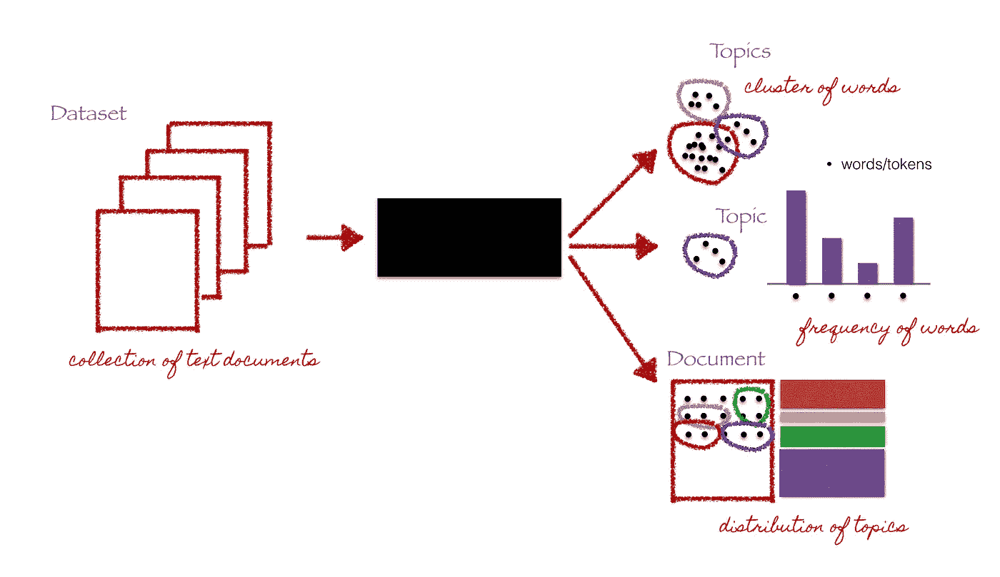
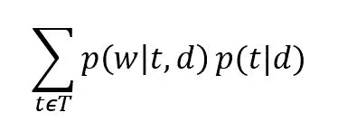
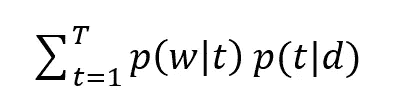
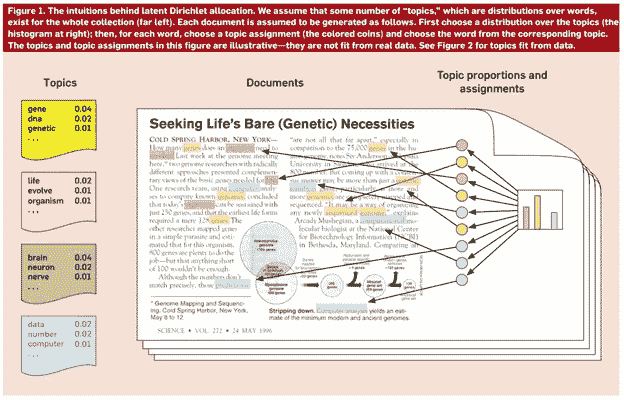
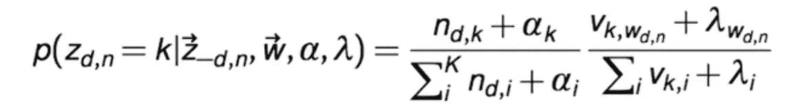
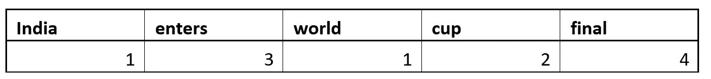
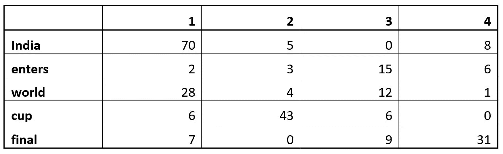
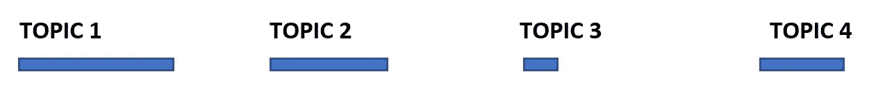
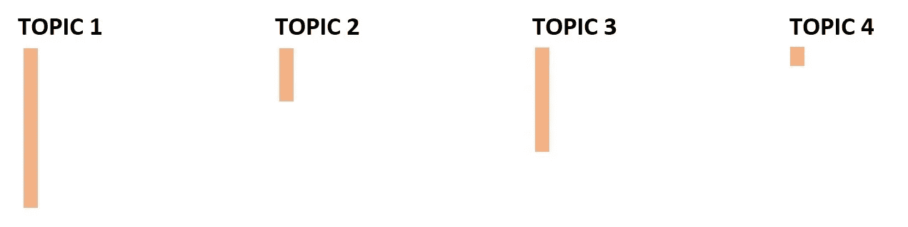
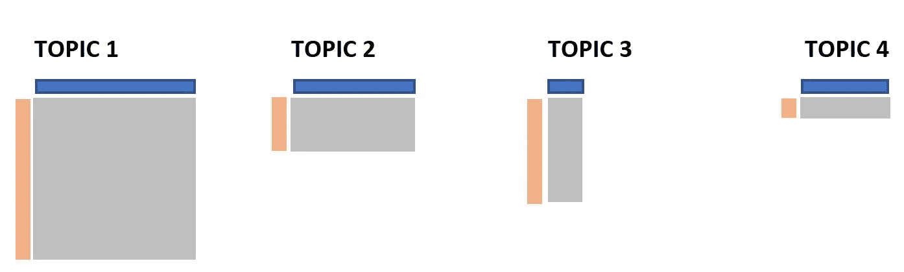

# 主题建模使用潜在的狄利克雷分配(LDA)和吉布斯抽样解释！

> 原文：<https://medium.com/analytics-vidhya/topic-modeling-using-lda-and-gibbs-sampling-explained-49d49b3d1045?source=collection_archive---------0----------------------->

演职员表:[克里斯汀·多伊格](http://chdoig.github.io/pygotham-topic-modeling/#/)

大家好。自从我写了上一篇关于不同类型的推荐系统的博客以来，已经有很长时间了。这一次，我将写关于主题建模。

有很多来源可以让你了解什么是主题建模，但是我认为，大多数都是技术性的，需要很好的数学知识和其他技术，比如马尔可夫链。在这篇文章中，我将尝试用一种非常直观的方式，用最少的数学和技术细节来解释主题建模背后的思想。我将分两部分写这篇文章。在第一部分中，我将尝试解释什么是主题建模，在第二部分中，我将提供一个如何在真实数据集上进行主题建模的 python 教程。

在我开始之前，我想承认这篇文章在很大程度上受到了我的探索性数据分析教授 Edward McFowland、 [Coursera 的高等经济学院关于自然语言处理的课程](https://www.coursera.org/learn/language-processing/home/welcome)以及 [Jordan Boyd-Graber](https://www.youtube.com/channel/UCIXpjlxPL5Ow8rPO_gOHISQ) 对 Gibbs 抽样的解释的启发。

# **简介**

**什么是话题建模？**

主题建模是无监督自然语言处理的一个分支，用于在几个主题的帮助下表示文本文档，可以最好地解释特定文档中的底层信息。这可以从集群的角度来考虑，但有所不同。现在，我们有了一个单词集合，而不是数字特征，我们希望以这样一种方式将这些单词组合在一起，即每个组代表文档中的一个主题。

**为什么我们需要主题建模？**

好了，现在问题来了，为什么我们需要主题建模？如果我们环顾四周，我们可以看到大量的文本数据以非结构化的形式存在于我们周围，如新闻文章、研究论文、社交媒体帖子等。我们需要一种方法来理解、组织和标记这些数据，以便做出明智的决策。主题建模被用在各种应用中，如寻找关于栈溢出的彼此相似的问题、新闻流聚集和分析、推荐系统等。所有这些都侧重于发现文本中隐藏的主题结构，因为人们认为我们写的每一篇文本，无论是推文、帖子还是研究论文，都是由体育、物理、航天等主题组成的。

**如何做话题建模？**

目前，有许多方法来进行主题建模，但在这篇文章中，我们将讨论一种称为潜在狄利克雷分配(LDA)的概率建模方法，该方法由 David M. Blei 教授在 2003 年开发。这是由 Thomas Hoffman 在 1999 年开发的概率潜在语义分析(PLSA)的扩展，在他们如何对待每文档分布方面有非常微小的差异。所以让我们直接进入 LDA 是如何工作的。

# **潜在狄利克雷分配**

让我们从理解标题中每个单词的意思开始，因为我认为它包含了我们理解 LDA 如何工作所需要知道的一切。

**潜在**:这是指一切我们事先不知道的，隐藏在数据中的东西。在这里，文档包含的主题或主题是未知的，但是它们被认为是存在的，因为文本是基于这些主题生成的。

**狄利克雷:**这是一个‘分布的分布’。是的，你没看错。但这意味着什么呢？让我们借助一个例子来思考这个问题。让我们假设有一台生产骰子的机器，我们可以控制这台机器是否总是生产出对所有边重量相等的骰子，或者对某些边有任何偏差。因此，生产骰子的机器是一种分配，因为它生产不同类型的骰子。此外，我们知道骰子本身是一个分布，因为当我们掷骰子时会得到多个值。这就是分布的意义，这就是狄利克雷分布。这里，在主题建模的上下文中，Dirichlet 是文档中主题的分布和主题中单词的分布。目前可能还不太清楚，但没关系，我们稍后会更详细地了解它。

**分配**:这意味着一旦我们有了狄利克雷，我们将把主题分配给文档，把文档的单词分配给主题。

就是这样。简而言之，这就是 LDA。现在让我们理解这在主题建模中是如何工作的。

简单回顾一下，LDA 说的是每个文档中的每个单词都来自一个主题，而主题是从主题的每个文档分布中选择的。所以我们有两个矩阵:

1.θTD = P(t | d ),这是文档中主题的概率分布

2.фwt = P(w | t)这是主题中单词的概率分布

并且，我们可以说给定文档的单词的概率，即 P(w|d)等于:

其中 T 是主题的总数。同样，让我们假设所有文档的词汇表中有 W 个单词。

如果我们假设条件独立，我们可以说

P(w|t，d) = P(w|t)

因此 P(w|d)等于:

那就是每个题目 t 的θTD 和фwt 的点积。

这可以用如下矩阵形式表示:

**学分:** [**高等经济学院**](https://www.coursera.org/learn/language-processing/lecture/fzTUI/topic-modeling-a-way-to-navigate-through-text-collections)

因此，考虑到这一点，我们可以认为 LDA 类似于矩阵分解或 SVD，其中我们将文档中单词的概率分布矩阵分解为两个矩阵，包括文档中主题的分布和主题中单词的分布。

因此，举例来说，我们将得到这样的结果:

**鸣谢:** [**大卫·布雷**](http://www.cs.columbia.edu/~blei/papers/Blei2012.pdf)

回到我们的骰子示例，我们可以说，主题中单词分布的每个单词都类似于骰子的一个边，我们有 Dirichlet 参数来控制所有单词在主题中是否具有相同的概率，或者该主题是否会对某些单词有极端的偏向。同样的直觉也适用于文档中主题的分布。

很好。现在重要的部分来了。我们如何学习这两个矩阵的权重？

首先，让我们为两个矩阵随机分配权重，并假设我们的数据是按照以下步骤生成的:

1.根据分配的权重，从文档中的主题分布中随机选择一个主题。在前面的例子中，假设我们选择了粉色主题

2.接下来，根据所选主题的单词分布，随机选择一个单词并将其放入文档中

3.对整个文档重复此步骤

在这个过程中，如果我们对权重的猜测是错误的，那么在我们假设的权重和数据生成过程下，我们观察到的实际数据将是非常不可能的。例如，假设我们有包含以下文本的文档 D1:

"*高通 Adreno 630 视觉处理子系统，具有带 SLAM、adre no 视野的房间级 6 自由度*"

假设我们给主题 T1 分配高权重，主题 T1 对像勺子、盘子、洋葱等词有高权重。然后我们会看到，根据我们对数据生成方式的假设，T1 不太可能属于 D1，或者这些单词不太可能属于 T1。因此，我们正在做的是，在给定这两个矩阵的情况下，尽量使数据的可能性最大化。

为了确定正确的权重，我们将使用一种叫做吉布斯采样的算法。现在让我们了解什么是吉布斯采样，以及它在 LDA 中是如何工作的。

# **吉布斯采样**

吉布斯采样是一种对变量的条件分布进行连续采样的算法，其在状态上的分布最终会收敛到真实分布。这在某种程度上是一个抽象的概念，需要很好地理解蒙特卡罗马尔可夫链和贝叶斯定理。这些概念及其背后的数学相当复杂，超出了本博客的范围。在这里，我将尝试给出 Gibbs 抽样如何识别文档中主题的直觉。

正如我之前提到的，首先，我们假设我们知道θ和ф矩阵。现在我们要做的是，我们将慢慢地改变这些矩阵，得到一个最大化我们拥有的数据的可能性的答案。我们将通过改变一个单词的主题分配来一个单词一个单词地做这件事。我们将假设我们不知道给定单词的主题分配，但我们知道文本中所有其他单词的分配，我们将尝试推断这个单词将被分配什么主题。

如果我们以数学的方式来看待这个问题，我们所做的是试图找到一个单词的主题分配的条件概率分布，这取决于其余的主题分配。忽略所有的数学计算，我们将得到一个条件概率方程，对于文档 *d* 中属于主题 *k* 的单个单词 *w* :

**鸣谢:** [**乔丹-博伊德-格雷伯**](https://www.youtube.com/channel/UCIXpjlxPL5Ow8rPO_gOHISQ)

其中:

n(d，k):文档 d 使用主题 k 的次数

v(k，w):主题 k 使用给定单词的次数

αk:文档到主题分布的狄利克雷参数

λw:用于主题到单词分布的狄利克雷参数

这个等式有两个部分。第一部分告诉我们每个主题在文档中出现的次数，第二部分告诉我们每个主题有多喜欢一个单词。请注意，对于每个单词，我们将获得一个概率向量，该向量将解释该单词属于每个主题的可能性。在上面的等式中，可以看出，当 *n(d，k)* 或 *v(k，w)* 为零时，狄利克雷参数也充当平滑参数，这意味着该单词仍将有一些机会继续选择主题。

现在让我们看一个例子:

首先，假设我们有一个带有一些随机 word 主题分配的文档，例如，如下所示:

我们还有如下所示的计数矩阵 v(k，w ):

现在让我们改变文档中单词 **world** 的赋值。

*   首先，我们将把主题 1 中世界的数量从 28 减少到 27，因为我们不知道世界属于哪个主题。
*   其次让我们用下面的方式表示矩阵 *n(d，k)* 来显示一个文档使用了多少个主题

第三，我们用下面的方式来表示 *v(k，w)* 来表示每个题目分配给这个单词的次数

*   第四，我们将这两个矩阵相乘，得到我们的条件概率

*   最后，我们将随机选择任何一个主题，并将该主题分配给**世界**，我们将对所有其他单词重复这些步骤。直觉上，具有最高条件概率的主题应该被选择，但是正如我们可以看到的，其他主题也有一些机会被选择

就是这样。这就是吉布斯采样算法正在做的事情。虽然我们跳过了一些细节，比如超参数调整，但是从直觉的角度来看，这就是 Gibbs 抽样在主题建模中的工作方式。

这就是潜在狄利克雷分配理论。我希望这有助于理解什么是主题建模，以及我们如何使用 LDA 和 Gibbs 进行主题建模。在下一篇文章中，我将使用 Python 实现 LDA。

谢谢！