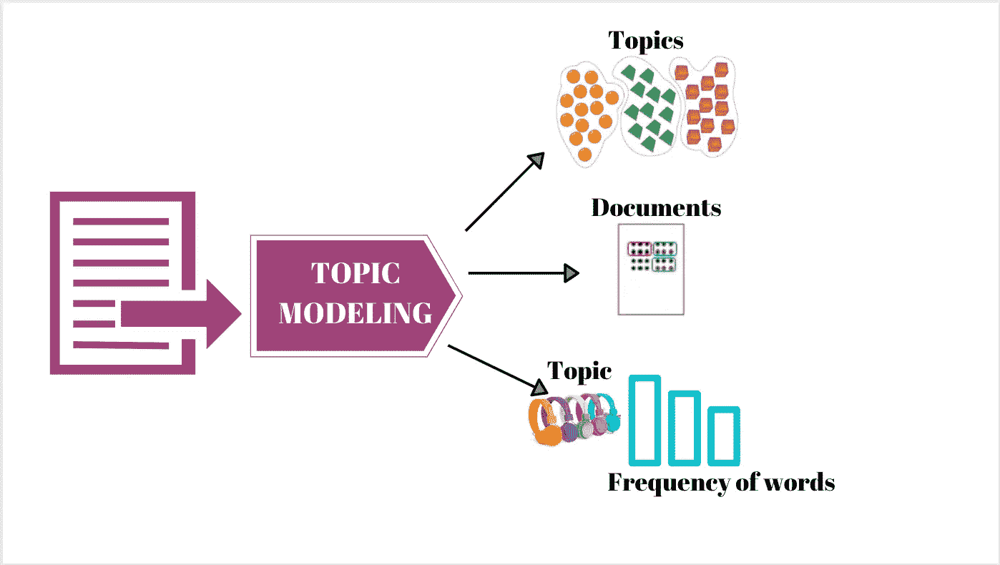

# 亚马逊评论的主题建模

> 原文：<https://medium.com/analytics-vidhya/topic-modeling-with-amazon-reviews-8dcb40ffc97d?source=collection_archive---------5----------------------->



什么是主题建模？

主题建模可以描述为一种从文档集合中找到最能代表这些文档中信息的主题的方法。使用这种方法，您可以发现隐藏的模式，注释您的文档并总结一堆文档。

## **数据**

我们将使用的数据集是亚马逊关于电子产品的评论。该数据集包含从 1996 年 5 月到 2014 年 6 月的产品评论。该数据集包括评论文本、评级、有用性投票。对于下面的方法，我们将只使用评论。

**数据预处理**是处理文本数据时的一项重要任务。以下是处理数据的步骤，然后创建一个单词包来适应一个**潜在的狄利克雷分配** ( **LDA** )

**第一步:提取数据**——这是最简单的一步，我用的是网页上[**Julian McAuley**](https://cseweb.ucsd.edu/~jmcauley/)、UCSD 提供的代码:[亚马逊产品数据](http://jmcauley.ucsd.edu/data/amazon/)

```
def parse(path):
    g = gzip.open(path, 'rb')
    for l in g:
        yield eval(l)def getDF(path):
    i = 0
    df = {}
    for d in parse(path):
        df[i] = d
        i += 1
    return pd.DataFrame.from_dict(df, orient='index')df = getDF(r'NLP\reviews_Electronics_5.json.gz')
df.head(10)
df.columns
```

**步骤 2: Tokenizer，删除停用词&小写 doc**——我们将使用 Regexptokenizer 将所有句子拆分成单词，然后在删除标点符号的同时将其小写。**我们选择一个文档来预览结果**

```
#Regular expression tokenizer
tokenizer = RegexpTokenizer(r'\w+')
doc_1 = df.reviewText[0]# Using one review
tokens = tokenizer.tokenize(doc_1.lower())print('{} characters in string vs {} words in a list'.format(len(doc_1),                                                             len(tokens)))
print(tokens[:10])nltk_stpwd = stopwords.words('english')print(len(set(nltk_stpwd)))
print(nltk_stpwd[:10])stopped_tokens = [token for token in tokens if not token in nltk_stpwd]
print(stopped_tokens[:10])
```

第三步:用雪球词干分析器做词干——注意雪球词干分析器应用后的单词，要了解雪球词干分析器的更多信息，请访问[网站](https://snowballstem.org/)。

```
sb_stemmer = SnowballStemmer('english')
stemmed_tokens = [sb_stemmer.stem(token) for token in stopped_tokens]
print(stemmed_tokens)
"""
This is how results looked:'normal', 'receiv', 'review', '**sampl**', 'thorough', 'evalu', 'write', 'review', 'within', 'two', 'day', 'one', 'took', 'longer', 'reason', 'took', 'hear', 'differ', 'model', 'versus', 'thebrainwavz', 'ear', '**headphon**', 'also', 'impress', 'also', 'go', 'pile', 'album', 'tri', 'understand', 'product', '**descript**', 'meant', 'smoother', 'bass', 'final', 'found', 'album', 'allow', 'hear', 'portrait', 'jazz', 'scott', 'lafaro', 'bass', 'came', 'autumn', '**leav**', 'start', 'switch', 'back', 'forth','also', 'haul', 'studio'"""
```

步骤 3A:对所有数据执行上述所有步骤——为了创建 LDA 模型，我们需要将上述预处理步骤放在一起，以创建一个文档列表(列表列表),然后生成一个文档术语矩阵(唯一术语作为行，评论作为列)。这个矩阵告诉我们每个术语在每个文档中出现的频率。

```
num_reviews = df.shape[0]doc_set = [df.reviewText[i] for i in range(num_reviews)]texts = []for doc in doc_set:
    tokens = tokenizer.tokenize(doc.lower())
    stopped_tokens = [token for token in tokens if not token in nltk_stpwd]
    stemmed_tokens = [sb_stemmer.stem(token) for token in stopped_tokens]
    texts.append(stemmed_tokens)# Adds tokens to new list "texts"

print(texts[1])
```

步骤 4:使用语料库创建词典

Gensim 的 Dictionary 方法封装了规范化单词和它们的整数 id 之间的映射。[更多链接](https://radimrehurek.com/gensim/corpora/dictionary.html)！另外，请注意下面代码中的步骤，我们可以评估单词和它们的 id 之间的映射，为此我们使用 token2id 方法。

```
texts_dict = corpora.Dictionary(texts)
texts_dict.save('elec_review.dict') 
print(texts_dict)**#Assess the mapping between words and their ids we use the token2id #method:**
print("IDs 1 through 10: {}".format(sorted(texts_dict.token2id.items(), key=operator.itemgetter(1), reverse = False)[:10]))#Here we assess how many reviews have word complaint in it
complaints = df.reviewText.str.contains("complaint").value_counts()
ax = complaints.plot.bar(rot=0)"""
Attempting to see what happens if we ignore tokens that appear in less 
than 30 documents or more than 20% documents.
"""texts_dict.filter_extremes(no_below=20, no_above=0.10) 
print(sorted(texts_dict.token2id.items(), key=operator.itemgetter(1), reverse = False)[:10])
```

第五步:将字典转换成称为语料库的单词包

单词包格式是(token_id，token_count)元组列表)。语料库的长度为 1689188

```
# Step 5: Converting the dictionary to bag of words calling it corpus here
corpus = [texts_dict.doc2bow(text) for text in texts]
len(corpus)#Save a corpus to disk in the sparse coordinate Matrix Market format in a serialized format instead of random
gensim.corpora.MmCorpus.serialize('amzn_elec_review.mm', corpus)
```

主题的数量是随机的，可以根据亚马逊通常放置其产品的类别来确定:
1。电脑—配件
2。电视&视频
3。手机&配件
4。摄影&摄像
5。家用音响
6。亚马逊设备
7。耳机
8。办公电子
9。办公用品
10。智能家居
11。乐器
12。视频游戏

步骤 6:拟合 LDA 模型以评估主题

我们知道 LDA 是一种无监督的机器学习方法，但它是什么呢？

> [潜在狄利克雷分配(LDA)，一种用于文本语料库等离散数据集合的生成概率模型。LDA 是一个三级分层贝叶斯模型，其中集合中的每个项目都被建模为一组底层主题的有限混合。反过来，每个主题都被建模为一组潜在主题概率的无限混合物。在文本建模的背景下，主题概率提供了文档的显式表示](http://www.jmlr.org/papers/volume3/blei03a/blei03a.pdf)

```
#Step 6: Fit LDA model
lda_model = gensim.models.LdaModel(corpus,alpha='auto', num_topics=5,id2word=texts_dict, passes=20)#Choosing the number of topics based on various categories of electronics on Amazon
lda_model.show_topics(num_topics=5,num_words=5)raw_query = 'portable speaker'query_words = raw_query.split()
query = []
for word in query_words:
    # ad-hoc reuse steps from above
    q_tokens = tokenizer.tokenize(word.lower())
    q_stopped_tokens = [word for word in q_tokens if not word in nltk_stpwd]
    q_stemmed_tokens = [sb_stemmer.stem(word) for word in q_stopped_tokens]
    query.append(q_stemmed_tokens[0])

print(query)# Words in query will be converted to ids and frequencies  
id2word = gensim.corpora.Dictionary()
_ = id2word.merge_with(texts_dict) # garbage# Convert this document into (word, frequency) pairs
query = id2word.doc2bow(query)
print(query)#Create a sorted list
sorted_list = list(sorted(lda_model[query], key=lambda x: x[1]))
sorted_list#Assessing least related topics
lda_model.print_topic(a[0][0]) #least related#Assessing most related topics
lda_model.print_topic(a[-1][0]) #most related"""'0.025*"speaker" + 0.015*"headphon" + 0.013*"music" + 0.013*"bluetooth" + 0.009*"phone" + 0.009*"ear" + 0.009*"8217" + 0.009*"volum" + 0.009*"audio" + 0.008*"pair"'"""
```

最后一步:以上是与一个主题相关的前 5 个单词。每个单词旁边的浮动是权重，显示给定单词对特定主题的影响程度。我们可以解释为，这里的主题可能接近亚马逊的耳机类别，该类别有各种子类别:“入耳式耳机、耳挂式耳机、入耳式耳机、蓝牙耳机、运动和健身耳机、降噪耳机”

源代码可以在 [**Github**](https://github.com/Anjalisk/Topic-Modeling-/blob/master/TopicModeling.py) 上找到。