# 基于潜在狄利克雷分配的主题建模

> 原文：<https://medium.com/analytics-vidhya/topic-modeling-with-latent-dirichlet-allocation-lda-196c287e221?source=collection_archive---------5----------------------->

[https://www.google.com/url?sa=i&URL = https % 3A % 2F % 2ftheteachingtexan . com % 2f 2018% 2f 07% 2f 06% 2Fa-fresh-and-bright-teacher-toolbox-DIY % 2F&psig = aovvaw 18 cty-qcumfzl 8-dcNpqpl&ust = 1592241054285000&source = images&CD = vfe&ved = 00](https://www.google.com/url?sa=i&url=https%3A%2F%2Ftheteachingtexan.com%2F2018%2F07%2F06%2Fa-fresh-and-bright-teacher-toolbox-diy%2F&psig=AOvVaw18cTY-qcuMfzL8-dcNpqpl&ust=1592241054285000&source=images&cd=vfe&ved=0CAIQjRxqFwoTCJCvrqbmgeoCFQAAAAAdAAAAABAS)

***我热烈欢迎所有的读者！***

# **内容:**

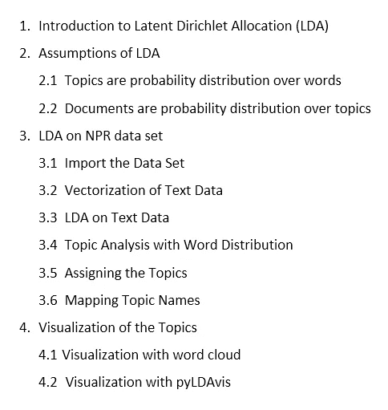

内容

# 1.潜在狄利克雷分配(LDA)简介:

LDA 代表潜在的狄利克雷分配。随着时间的推移，数据呈指数级增长。大部分数据是非结构化的，其中有一些是未标记的。手动标记每个数据是一项繁琐的任务。如果不是手动，我们如何标记如此大量的数据？LDA 来救我们了。LDA 是一种主题建模技术，用于分析大量数据，将它们聚类到相似的组中，并标记每个组。应该注意的是，LDA 技术是用于无监督学习的，其用于通过将数据分组到相似的主题中来标记数据。与 K-Means 聚类和其他使用聚类中心之间的距离概念的聚类技术不同，LDA 处理属于文档的主题的概率分布。

# 2.LDA 的假设:

## 2.1 主题是单词的概率分布:

它表示属于主题的单词的概率分布。假设，我们有两个话题— **医疗**和**政治**。像药物、注射、氧气等这样的词将具有属于**保健**主题的较高概率分布，而像选举、投票等这样的词将具有较低概率分布。另一方面，像选举、投票、政党这样的词具有属于话题政治的较高概率分布，而像药物、注射等这样的词将具有较低概率分布。在这种情况下，每个主题以更高的概率共享相似的一组单词。请参考下图以获得清晰的理解。

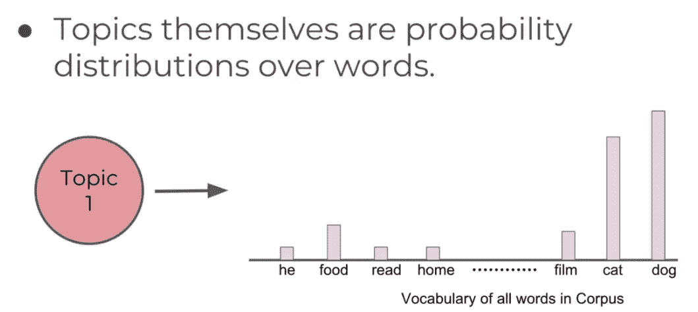

资料来源:https://www.udemy.com/share/101YmOBEYTcVxUQX4=/

## 2.2 文档是主题的概率分布:

它表示属于每个文档的主题的概率分布。如上例所示，我们有两个主题——**医疗保健**和**政治**。由于文档是各种单词的混合，每个单词将具有属于主题的概率分布。这导致了属于每个文档的主题的概率分布。迷惑，对！开始的时候我也很困惑，但是经过一段时间的思考，我终于明白了。让我试着用其他术语来解释。请看一份文件，上面写着— **“我们观察到许多病人上个月康复了。政府的基金增加了药品的供应。”**如果我们阅读这份声明，它听起来更像是关于**医疗保健**的话题，而不是**政府**。虽然我们在涉及政治的文件中有类似**【政府基金】**的词语，但由于其出现的概率较低，当与患者、康复、药物等词语相比时，该文件可被标记为**【医疗】**。请参考下图以获得清晰的理解。

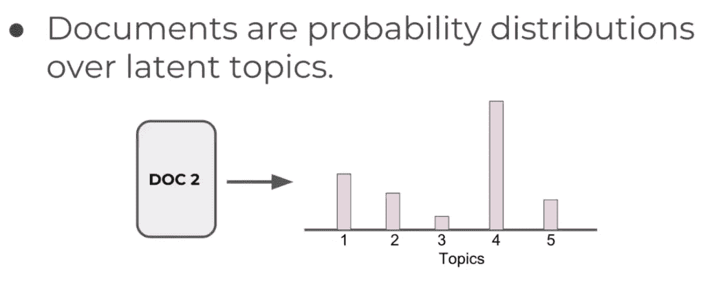

来源:[https://www.udemy.com/share/101YmOBEYTcVxUQX4=/](https://www.udemy.com/course/nlp-natural-language-processing-with-python/)

# 3.NPR 数据集上的 LDA:

我用 NPR 的数据集来理解 LDA，它是如何被分组到相似的主题中，并被相应地标记的。参考下图，查看数据集的大小和头部。

## 3.1 导入数据集:

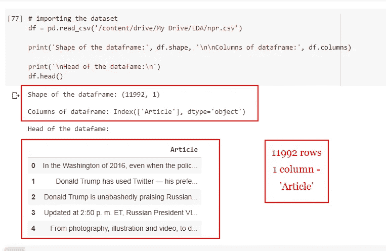

数据集图像

## 3.2 文本数据的矢量化:

我正在使用**单词包(计数矢量化工具)**对文本数据进行矢量化。我们甚至可以使用其他矢量技术，如 TFIDF、Word2Vec 等。我已经将参数“max_df”设置为 0.90，以便丢弃出现频率超过 90%的单词，并将“mid_df”设置为 2，以便只包括至少在 2 个文档中出现的那些单词。此外，我将通过将 stop_words 设置为“english”来删除非索引词。

> 仅供参考:我们的目标只是理解 LDA 在主题建模中的基本应用。我不做任何探索性的数据分析部分。另外，我不是在做词干化或词干化、去除标点符号等数据预处理。可以进行探索性的数据分析、数据预处理等，以便更好地理解数据，获得更好的结果。

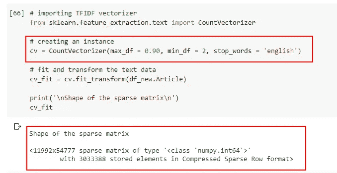

计数矢量器

从上图中，我们可以看到稀疏矩阵有 54777 个词的语料库。

## 3.3 文本数据的 LDA:

是时候开始应用 LDA 将文档分配到相似的主题中了。这里，应该注意的是，主题数量(n_components)的选择仅仅取决于个人的领域知识和对数据集的理解。在这里，我选择 5 个主题进行分配。代码请参考下图。

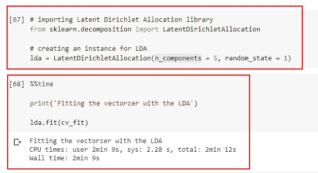

LDA 代码

请参考下图，了解它生成的主题数量和专栏(单词语料库)。

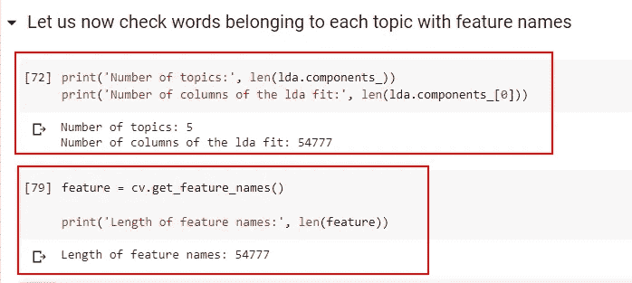

主题和功能名称

从上面的图片中，我们可以看到 LDA 已经创建了 5 个主题和 54777 个特性名，它们是列名。

## 3.4 带单词分布的主题分析:

参考下图分析每个主题中的单词。我会在下面的图片中解释我所做的事情。

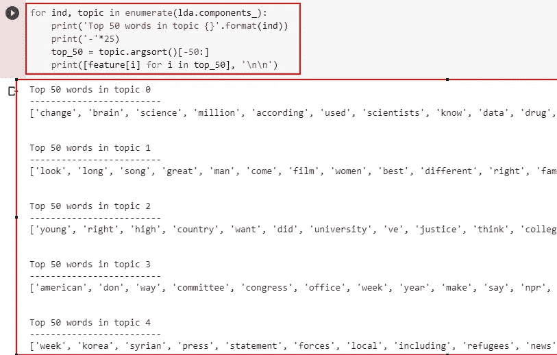

主题分析

我把属于题目概率最高的前 50 个词打印出来了。每个主题有 54777 个单词，有一个概率分布。我首先对它们进行了排序，并用' df.argsort()'得到了索引。使用获得的索引，我已经获得了特征名称，但是从最后一个开始，它代表了该主题的最高概率分布。

如果少读几个字，我们可以看到，**话题- 0** 谈**医疗**，**话题-1** 谈**娱乐**，**话题- 2** 谈**教育**，**话题- 3** 谈**政治，**和**话题- 4** 谈**军事**。

让我们打印第一行，检查它是如何分配给概率分布的主题的。参考下图。

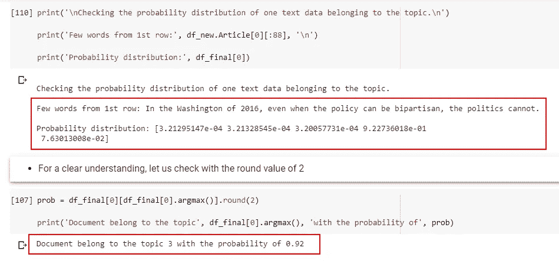

测试一行

如果我们阅读 2016 年华盛顿的文本**‘即使政策可以是两党的，政治也不能……’**这显然代表了政治声明。在上图的第二个单元格中，我们可以看到各个主题的概率分布，文字属于 **topic- 3** 的概率为 **92%** 。根据我们对图片**【话题分析】**的分析，**话题- 3** 其实属于**政治**。完美！

## 3.5 分配主题:

参考下面的代码为每一行分配主题。

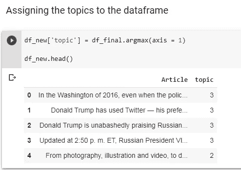

分配主题

## 3.6 映射主题名称:

请参考下面的主题名称映射。

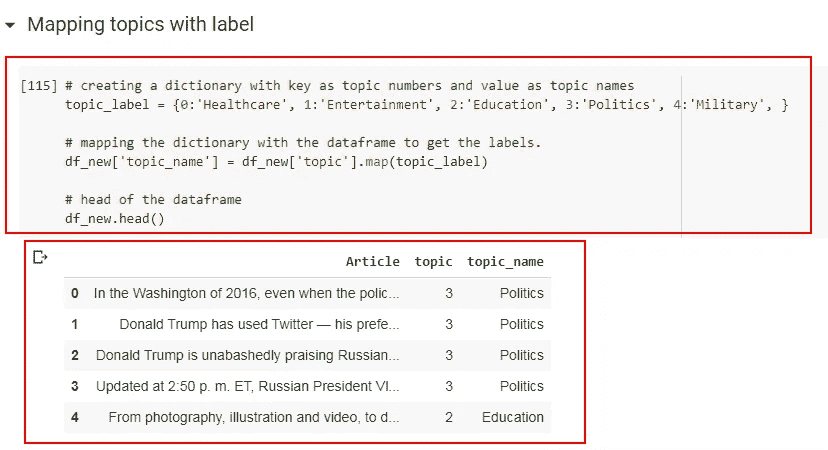

映射主题名称

# 4.主题的可视化:

## 4.1 文字云可视化:

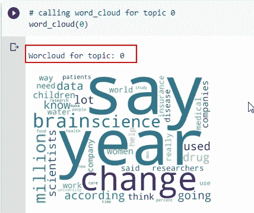

主题- 0

字云为**题- 0** 。我们可以看到脑科学、研究人员、患者、疾病、保险等词汇。这涉及到**医疗保健**话题。

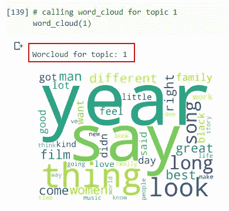

主题- 1

题词云- 1。我们可以看到宋立科，故事，家庭，电影，音乐，爱情等词。这就涉及到**娱乐**话题了。

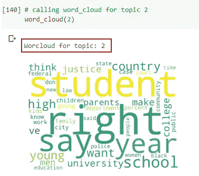

话题 2

字云为题**-2**。我们可以看到学生、大学、学校、学院、工作等词语。这涉及到**教育**话题。

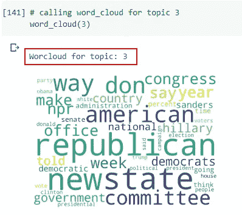

主题- 3

字云为**题- 3** 。我们可以看到像国会、共和党、新州、民主党、政府、委员会等词。这涉及到**政治**话题。

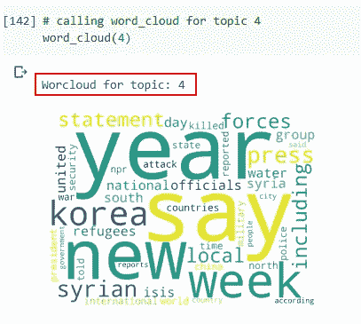

主题- 4

字云为**题- 4** 。我们可以看到像部队，ISIS，警察，安全，朝鲜，难民等词。这涉及到**军事**话题。

## 4.2 pyl Davis 可视化:

要安装 pyLDAvis，请在笔记本单元格或 CMD 提示符或 anaconda 提示符下输入以下代码。

> ！pip 安装 pyLDAvis

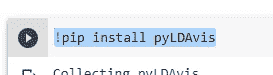

安装 pyLDAvis

代码请参考下图。

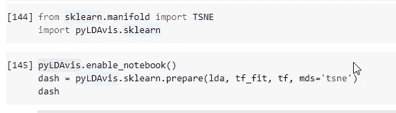

pyLDAvis 代码

**输出视频:** [**用 pyLDAvis**](https://www.linkedin.com/feed/update/urn:li:activity:6678155419195719680/) 可视化的视频

> 完整代码请参考 GitHub 资源库-[**Topic-Modeling-with-LDA**](https://github.com/Sandeep-Panchal/Topic-Modeling-with-LDA)。

# 参考:

1.  [https://www.udemy.com/share/101YmOBEYTcVxUQX4=/](https://www.udemy.com/course/nlp-natural-language-processing-with-python/)

# 帮我连接:

1.  **领英:**[https://www.linkedin.com/in/sandeep-panchal-682734111/](https://www.linkedin.com/in/sandeep-panchal-682734111/)
2.  **GitHub:**[https://github.com/Sandeep-Panchal](https://github.com/Sandeep-Panchal)

谢谢大家阅读这篇博客。非常感谢您的建议！