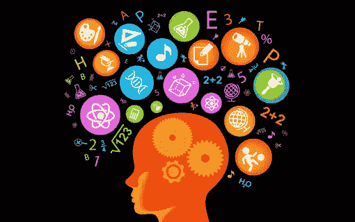

# 基于非负矩阵分解的主题建模(NMF)

> 原文：<https://medium.com/analytics-vidhya/topic-modeling-with-non-negative-matrix-factorization-nmf-3caf3a6bb6da?source=collection_archive---------5----------------------->

**自然语言处理(NLP)** 是数据科学的一个前沿领域。它的终端应用有很多——聊天机器人、推荐系统、搜索、虚拟助手等等。

因此，对于初露头角的数据科学家来说，至少了解 NLP 的基础知识是有益的，即使他们的职业生涯将他们带到了一个完全不同的方向。而且谁知道，有些话题…