# 使用单词嵌入和潜在狄利克雷分配的主题建模

> 原文：<https://medium.com/analytics-vidhya/topic-modelling-using-word-embeddings-and-latent-dirichlet-allocation-3494778307bc?source=collection_archive---------0----------------------->

*使用聚类(关于嵌入)和* ***LDA*** *技术从一百万个标题中提取* ***主题***

*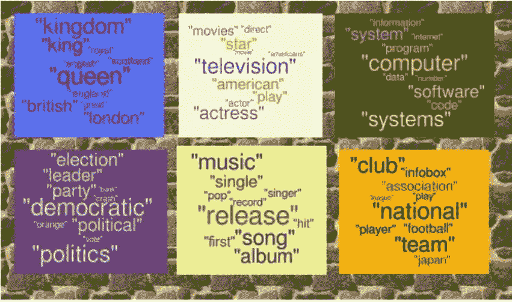*

*世界各地的媒体、期刊和报纸每天都必须将他们拥有的所有数据聚集到特定的主题中，以结构化的方式展示特定主题下的文章或新闻。所有的社交网络公司，如**脸书**、**推特**等，在使用推荐引擎向用户推荐东西之前，都会对帖子和广告进行某种主题建模。甚至谷歌也在他们的搜索中运行主题建模来识别与用户搜索相关的文档。想象一下，有一个数字图书馆，里面的书被随机放置，与主题无关。搜索它们或搜索属于我们感兴趣的特定主题的书籍会有多困难。幸运的是，我们有深度学习和分析工具来拯救我们脱离这些情况。*

*在这个项目中，我将从著名的澳大利亚新闻来源 ABC(澳大利亚广播公司)的一百万条新闻标题中提取主题。该数据集在 Kaggle 中可用。*

*[https://www.kaggle.com/therohk/million-headlines](https://www.kaggle.com/therohk/million-headlines)*

***数据集内容***

*publish_date:以 yyyyMMdd 格式发布文章的日期*

*headline_text:标题文本，Ascii，英文，小写*

*开始日期:2003 年 2 月 19 日；结束日期:2019 年 12 月 31 日*

*我们将从两个方面探讨这一点:*

*1)在第一种情况下，我们将使用'**Google News ' wortovec ' embeddings**'为每个标题创建嵌入，它负责语义和含义，并将标题聚类成 8 个聚类，并查看不同聚类中最频繁出现的单词*

*2)在第二种情况下，我们将使用 **LDA** (潜在狄利克雷分配)方法对这些标题中的主题进行建模。LDA 假设每个标题来自几个主题，每个主题由几个单词组成。*

*现在，让我们从导入一些库开始。*

```
**#importing libraries***import** **numpy** **as** **np**
**import** **pandas** **as** **pd**
**import** **numpy** **as** **np**
**import** **pandas** **as** **pd**
**import** **seaborn** **as** **sns**
**import** **matplotlib.pyplot** **as** **plt**
**from** **sklearn.feature_extraction.text** **import** CountVectorizer
**from** **sklearn.feature_extraction.text** **import** TfidfVectorizerheadlines = pd.read_csv('abcnews-date-text.csv',parse_dates=[0], infer_datetime_format=**True**)headlines.head()*
```

*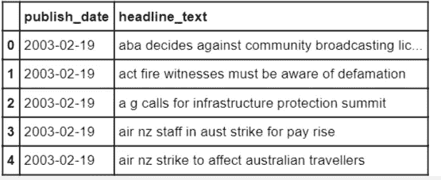*

*既然我们已经导入了数据，我们将开始探索性的数据分析，以便我们对数据包含的内容有一个直观的了解。让我们首先创建一个包含每个标题长度的列，以直观地了解标题中使用的平均字数。*

```
*headlines['NumWords'] = headlines['headline_text'].apply(**lambda** x: len(x.split()))
headlines[['NumWords']].hist(figsize=(12, 6), bins=10, xlabelsize=8, ylabelsize=8);
plt.title("Distributon of number of words in the headlines")*
```

*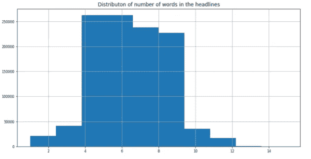*

*我们可以看到，大多数标题大约有 4-6 个单词，现在我们也制作一个年、月和日字段，以查看标题在这些属性中的分布。*

```
*headlines['year'] = pd.DatetimeIndex(headlines['publish_date']).year
headlines['month'] = pd.DatetimeIndex(headlines['publish_date']).month
headlines['day'] = pd.DatetimeIndex(headlines['publish_date']).day*
```

*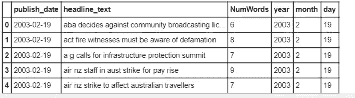**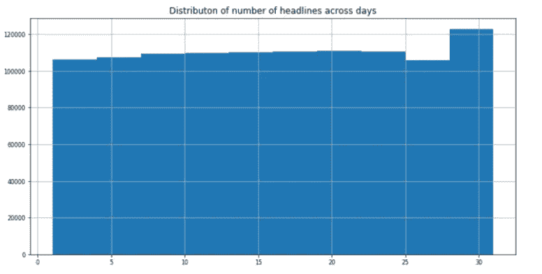*

*似乎这些天的分布是均匀的。*

*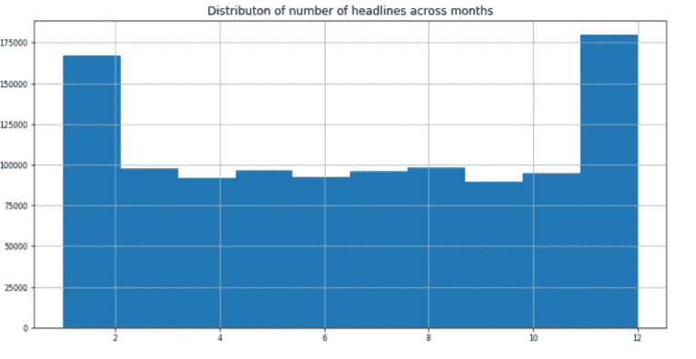*

*数据集中的大部分标题都是由年初和年末决定的。*

*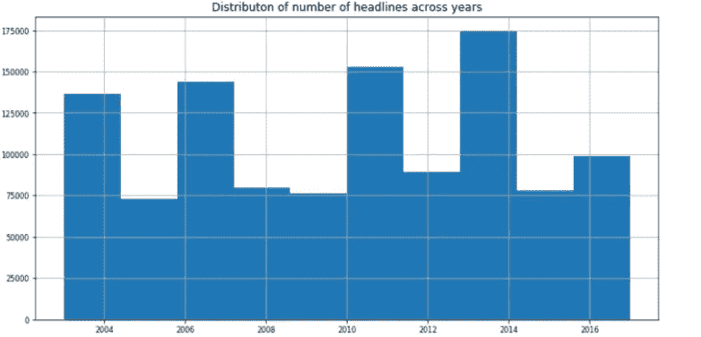*

*同样，我们可以看到头条新闻的数量是如何跨年度分布的。*

*现在，让我们以时间序列模式来观察标题数量的日常变化。这将会给我们一个更好的直觉，并且有趣的是去思考所有可能在某些年份导致峰值的原因。*

```
*monthly_counts = headlines.resample('M').count()
yearly_counts = headlines.resample('A').count()
daily_counts = headlines.resample('D').count()fig, ax = plt.subplots(3, figsize=(18,16))
ax[0].plot(daily_counts);
ax[0].set_title('Daily Counts');
ax[1].plot(monthly_counts);
ax[1].set_title('Monthly Counts');
ax[2].plot(yearly_counts);
ax[2].set_title('Yearly Counts');
plt.show()*
```

*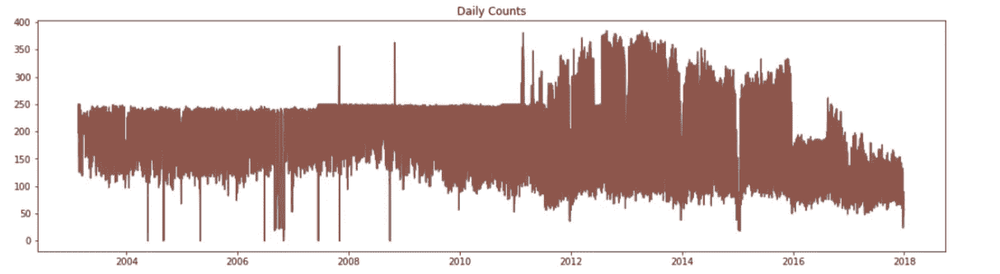**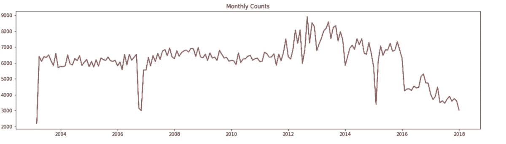**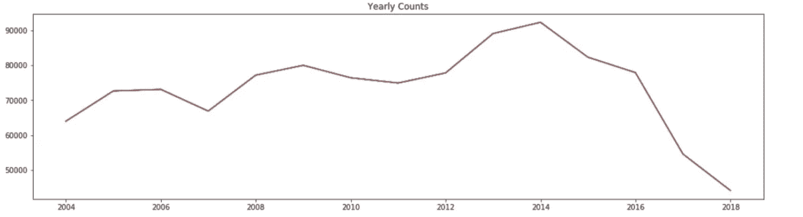*

*现在，让我们构建一个词云，来看看这些年来在标题中使用频率最高的词。*

```
***from** **wordcloud** **import** WordCloud
all_words = ''.join([word **for** word **in** headlines['headline_text'][0:100000]])
all_words
wordcloud = WordCloud(width=800, height=500, random_state=21, max_font_size=110).generate(all_words)
plt.figure(figsize=(15, 8))
plt.imshow(wordcloud, interpolation="bilinear")
plt.axis('off')
plt.title("Some frequent words used in the headlines", weight='bold', fontsize=14)
plt.show()*
```

*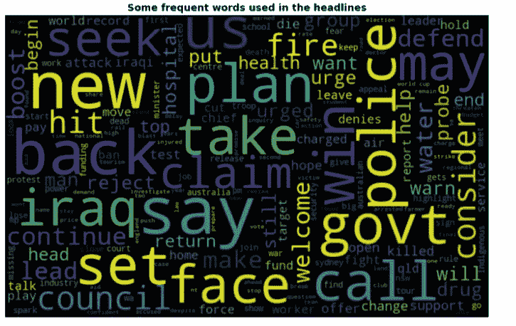*

*云这个词似乎很有趣。尽管新闻频道属于澳大利亚，但我们可以看到一些常见的词，如“伊拉克”和其他一些词，如“警察”，“计划”，“健康”，“委员会”等。*

*现在，让我们继续执行一些清理操作，比如将每个单词转换为小写字体，从这些标题中删除与建模主题无关的标点符号和非 ASCII 字符。*

```
***import** **re**
NON_ALPHANUM = re.compile(r'[\W]')
NON_ASCII = re.compile(r'[^a-z0-1\s]')
**def** normalize_texts(texts):
  normalized_texts = ''
  lower = texts.lower()
  no_punctuation = NON_ALPHANUM.sub(r' ', lower)
  no_non_ascii = NON_ASCII.sub(r'', no_punctuation)
  **return** no_non_ascii

headlines['headline_text'] = headlines['headline_text'].apply(normalize_texts)
headlines.head()
headlines['headline_text'] = headlines['headline_text'].apply(**lambda** x: ' '.join([w **for** w **in** x.split() **if** len(w)>2]))*
```

*让我们为使用频率最高的 15 个单词画最后一张图。*

```
***def** get_top_n_words(corpus, n=10):
  vec = CountVectorizer(stop_words='english').fit(corpus)
  bag_of_words = vec.transform(corpus)
  sum_words = bag_of_words.sum(axis=0) 
  words_freq = [(word, sum_words[0, idx]) **for** word, idx **in**   vec.vocabulary_.items()]
  words_freq =sorted(words_freq, key = **lambda** x: x[1], reverse=**True**)
  **return** words_freq[:n]words = []
word_values = []
**for** i,j **in** get_top_n_words(headlines['headline_text'],15):
  words.append(i)
  word_values.append(j)
fig, ax = plt.subplots(figsize=(16,8))
ax.bar(range(len(words)), word_values);
ax.set_xticks(range(len(words)));
ax.set_xticklabels(words, rotation='vertical');
ax.set_title('Top 15 words in the headlines dataset');
ax.set_xlabel('Word');
ax.set_ylabel('Number of occurences');
plt.show()*
```

*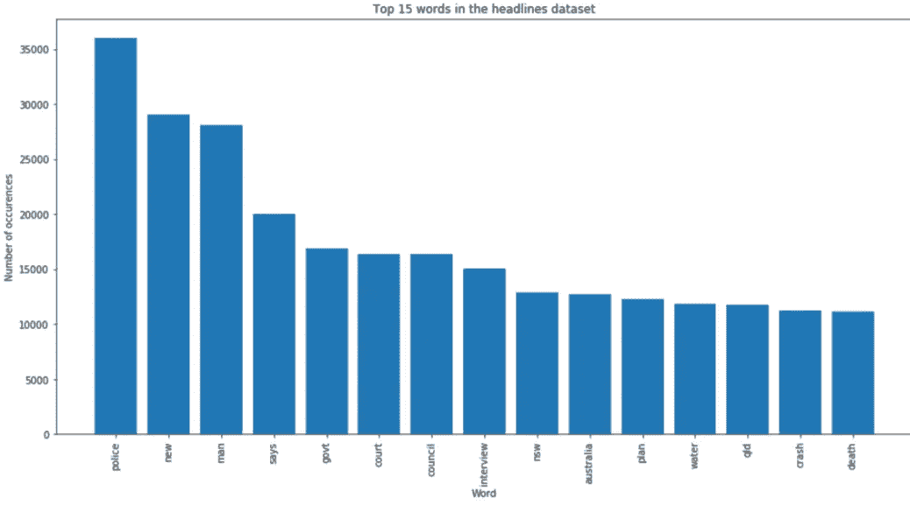*

# *方法 1:使用“wordtovec”嵌入进行聚类*

*现在，让我们从第一个方法开始。我们将从谷歌新闻上预先训练的深度神经网络中导入单词嵌入，然后用该标题中每个单词的单词嵌入的平均值来表示每个标题。如果看起来很复杂，坚持住。*

```
*pip install --upgrade gensim
*#importing wordtovec embeddings* 
**from** **gensim.models** **import** KeyedVectors
pretrained_embeddings_path = "https://s3.amazonaws.com/dl4j-distribution/GoogleNews-vectors-negative300.bin.gz"word2vec = KeyedVectors.load_word2vec_format(pretrained_embeddings_path, binary=**True**)*
```

*让我们看看一个单词是如何以其嵌入格式表示的。*

```
*word = 'iraq'
print('Word: **{}**'.format(word))
print('First 20 values of embedding:**\n{}**'.format(word2vec[word][:20]))*
```

*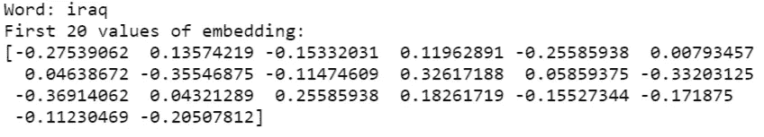*

*让我先向你展示嵌入这个词的美妙之处。它捕捉了同义词、反义词和所有人类能够理解的逻辑类比。如果有人问你“什么是女人+国王-男人”,我们首先想到的会是女王。现在让我们看看“wordtovec”嵌入给出了这个问题最相似的答案。*

```
*print(word2vec.most_similar(positive=['woman', 'king'], negative=['man'], topn=3))print(word2vec.most_similar(positive=['Tennis', 'Ronaldo'], negative=['Soccer'], topn=3))*
```

*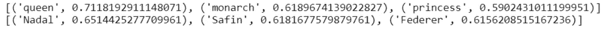*

*嗯，这是相当聪明的给皇后。*

*现在，由于内存限制，我们将随机抽取 20%的数据，然后使用我们刚刚导入的单词嵌入来构建聚类模型。*

```
*X_train = pd.DataFrame(X)
headlines_smaller = X_train.sample(frac = 0.2, random_state= 423)
headlines_smaller.columns = ['head_line']**class** **WordVecVectorizer**(object):
    **def** __init__(self, word2vec):
        self.word2vec = word2vec
        self.dim = 300 **def** fit(self, X, y):
        **return** self **def** transform(self, X):
        **return** np.array([
            np.mean([self.word2vec[w] **for** w **in** texts.split() **if** w **in** self.word2vec]
                    **or** [np.zeros(self.dim)], axis=0)
            **for** texts **in** X
        ])*#representing each headline by the mean of word embeddings for the words used in the headlines.*wtv_vect = WordVecVectorizer(word2vec)
X_train_wtv = wtv_vect.transform(headlines_smaller.head_line)
print(X_train_wtv.shape)*
```

*现在我们有 220733 个标题，每个标题有 300 个特征。让我们使用 KMeans 集群将它们分成 8 个集群。*

```
***from** **sklearn.cluster** **import** KMeanskm = KMeans(
    n_clusters=8, init='random',
    n_init=10, max_iter=300, 
    tol=1e-04, random_state=0
)
y_km = km.fit_predict(X_train_wtv)df = pd.DataFrame({'headlines' :headlines_smaller.head_line, 'topic_cluster' :y_km })*
```

*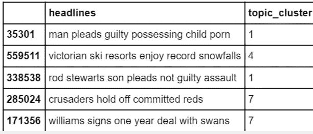*

*让我们想象每组中的前 15 个单词，并思考它们可能代表的主题。*

*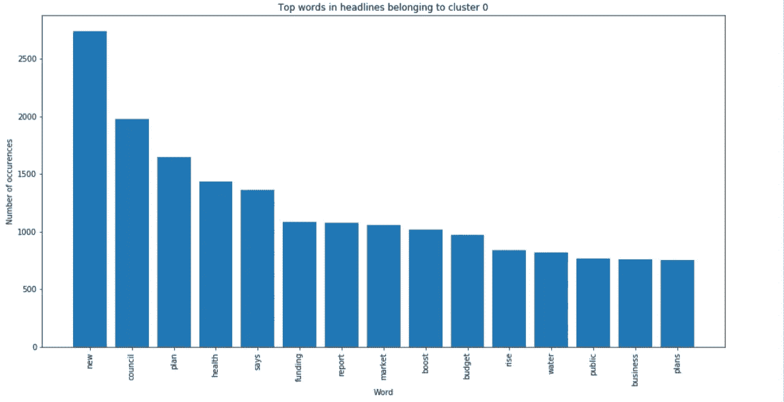*

*聚类 0 代表像“计划”、“健康”、“预算”等这样的词，看起来这属于新闻的经济或商业部分。*

*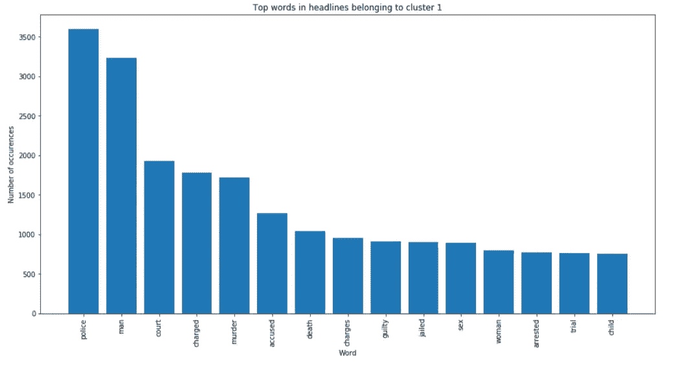*

*聚类 1 代表像“警察”、“谋杀”、“死亡”等这样的词，似乎这属于新闻的犯罪部分。*

*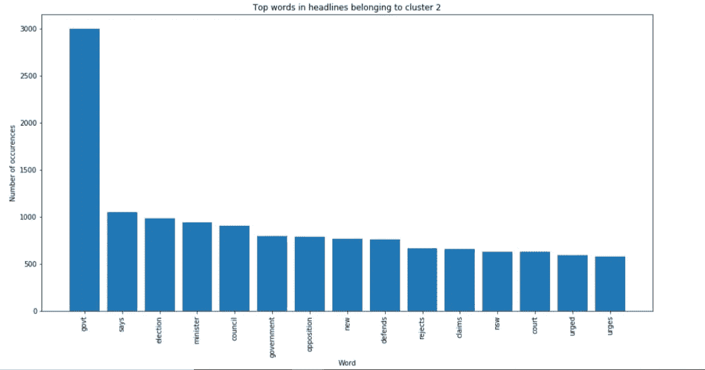*

*集群 2 代表像“选举”、“部长”、“法院”等词，似乎这属于新闻的政治部分。*

*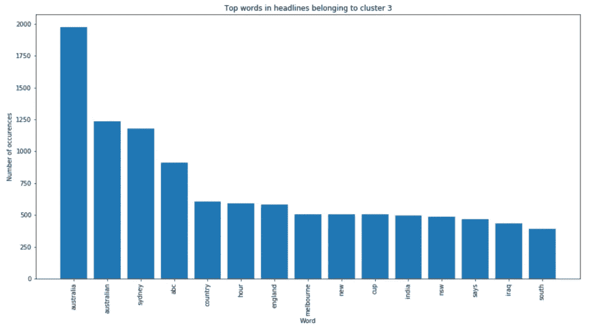*

*聚类 3 代表像“澳大利亚”、“英格兰”、“印度”等这样的词，并且似乎这属于新闻的全球部分。*

*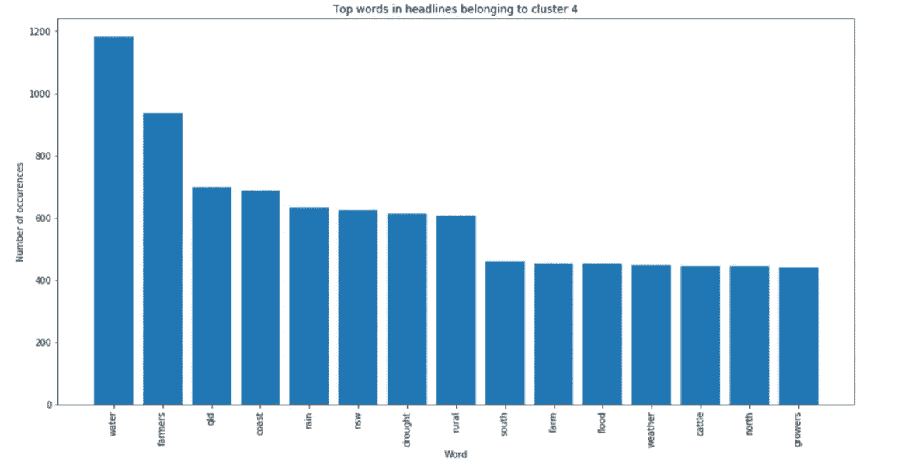*

*聚类 4 代表像“农村”、“水”、“洪水”等词，看起来这属于经济学部分，但更倾向于微观问题。*

*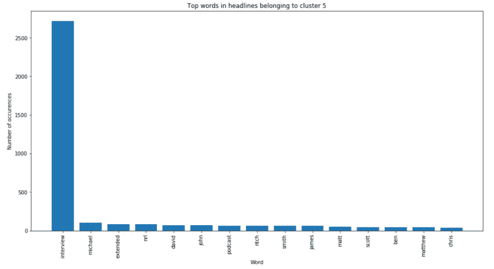*

*聚类 5 代表像“迈克尔”、“酷跑”、“史密斯”等这样的词，并且看起来这属于新闻的采访或人物部分。*

*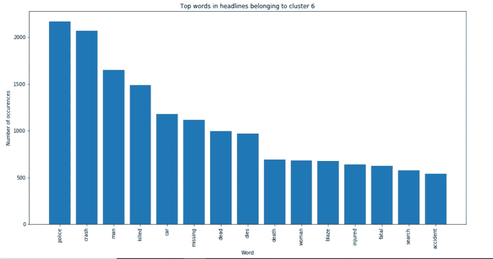*

*聚类 6 代表像“撞车”、“死亡”、“失踪”等这样的词，并且似乎这属于新闻的事故或当前事件部分。*

*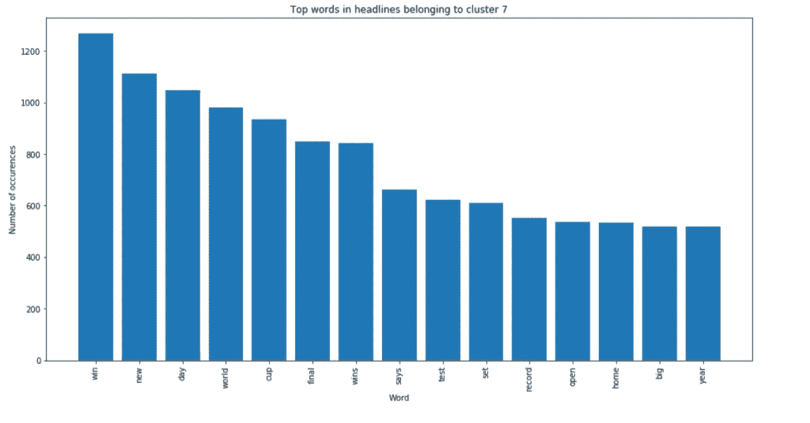*

*聚类 7 代表像“公开赛”、“冠军”、“决赛”等这样的词，并且看起来这属于新闻的体育部分。*

*我们可以看到，word2vec 嵌入以一种非常智能的方式将我们带到了一些随机新闻到属于特定主题的新闻。现在，让我们转到方法 2。*

# *方法 2:使用 LDA(潜在狄利克雷分析)的聚类*

*LDA 是一种从文档中提取主题的概率方法。它假设每个文档由几个具有不同概率分布的主题组成，每个主题由几个具有不同分布的单词组成。因此，它的工作方式是为每个文档中的每个单词初始化随机主题，并以相反的方式发现会在文档中生成这些单词的主题。要获得高层次的直觉，请阅读本博客—[https://medium . com/@ pratikbarhate/latent-Dirichlet-allocation-for-初学者-a-high-level-intuition-23 F8 a5 cbad 71](/@pratikbarhate/latent-dirichlet-allocation-for-beginners-a-high-level-intuition-23f8a5cbad71)*

*由于 LDA 有大量的计算，我们将对 2%的数据进行采样并执行分析，这可能不会导致非常智能的主题，但它会让我们对 LDA 的工作有一个高层次的理解。*

```
*news = headlines.sample(frac = 0.02, random_state= 423)*
```

*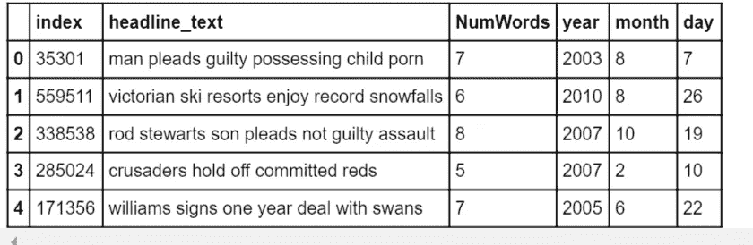*

*我们将使用 TfIdf 矢量器构建我们的特征，该矢量器类似于单词袋模型，唯一的区别是“tfidf”对出现在几个文档中的单词进行惩罚。现在，让我们拟合 LDA 模型，看看 LDA 使用每个主题的前 15 个词提取了哪些主题。*

```
*tf_vectorizer = TfidfVectorizer(stop_words='english', max_features=50000)
news_matrix = tf_vectorizer.fit_transform(news['headline_text'])
*#importing LDA***from** **gensim** **import** corpora, models
**from** **sklearn.decomposition** **import** LatentDirichletAllocation*#Fitting LDA*lda = LatentDirichletAllocation(n_components=8, learning_method='online', 
                                          random_state=0, verbose=0, n_jobs = -1)
lda_model = lda.fit(news_matrix)lda_matrix = lda_model.transform(news_matrix)lda_matrix*
```

*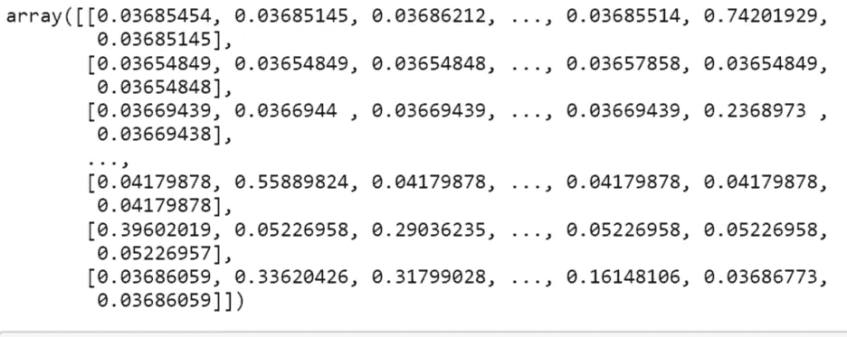*

```
***def** print_topics(model, count_vectorizer, n_top_words):
    words = tf_vectorizer.get_feature_names()
    **for** topic_idx, topic **in** enumerate(model.components_):

        print("**\n**Topic #**%d**:" % topic_idx )
        print(" ".join([words[i]
                        **for** i **in** topic.argsort()[:-n_top_words - 1:-1]]))*# Print the topics found by the LDA model*
print("Topics found via LDA:")
print_topics(lda_model, news_matrix, 15)*
```

*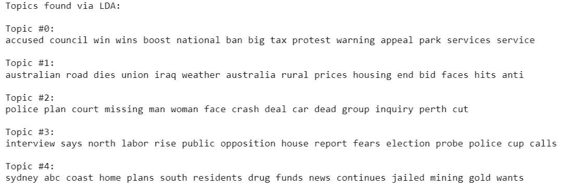**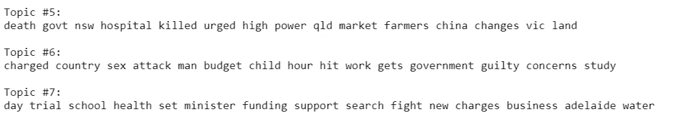*

*你可以试着去理解以上每一个代表了什么主题。一旦开始增加训练样本，主题将变得更加具体，模型将更加智能地提取。现在，让我们使用 TSNE 来绘制所有的文档，并根据它们所代表的主题给它们上色。尽管我们知道每个文档都来自几个主题(LDA 的一个假设)，但我们会认为对于每个文档，概率最高的主题就是该文档所代表的主题。*

```
***from** **sklearn.manifold** **import** TSNE
model = TSNE(n_components=2, perplexity=50, learning_rate=100, 
                        n_iter=1000, verbose=1, random_state=0, angle=0.75)tsne_features = model.fit_transform(lda_matrix)df = pd.DataFrame(tsne_features)
df['topic'] = lda_matrix.argmax(axis=1)
df.columns = ['TSNE1', 'TSNE2', 'topic']**import** **seaborn** **as** **sns**
plt.figure(figsize=(15, 10))
plt.title('T-SNE plot of different headlines ( headlines are clustered among their topics)')
ax = sns.scatterplot(x = 'TSNE1', y = 'TSNE2', hue = 'topic', data = df, legend = 'full')
plt.show()*
```

*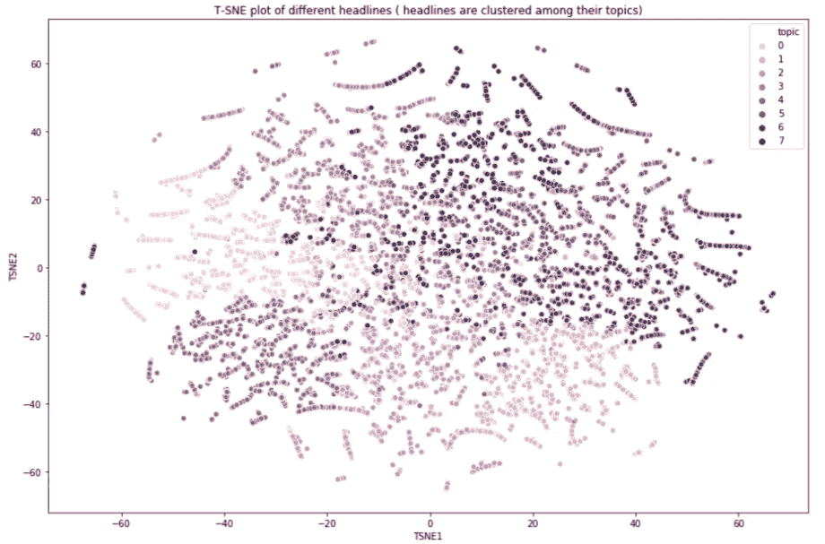*

*从 TSNE 图中，我们可以看到不同的文档属于它们的集群。*

*我希望您至少对主题建模的工作原理有所了解。现在试着从 twitter 上删除数据，并从这些数据中获取话题。*

*谢谢你。*

**图片参考:*[https://appliedmachinehlearning . blog/2017/09/28/topic-modeling-part-2-discovering-topics-from-articles-with-latent-Dirichlet-allocation/](https://appliedmachinelearning.blog/2017/09/28/topic-modelling-part-2-discovering-topics-from-articles-with-latent-dirichlet-allocation/)*