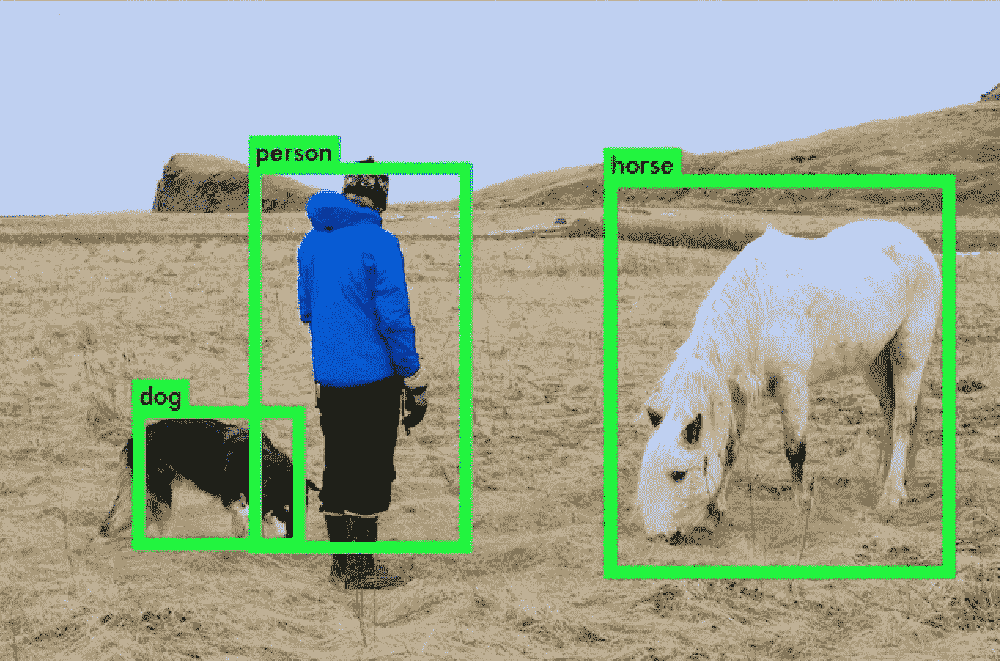
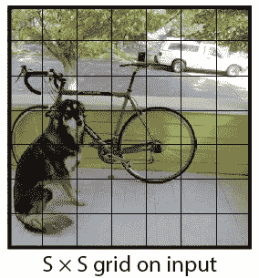
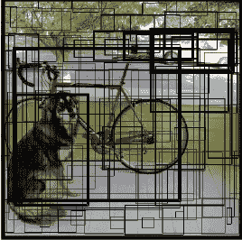
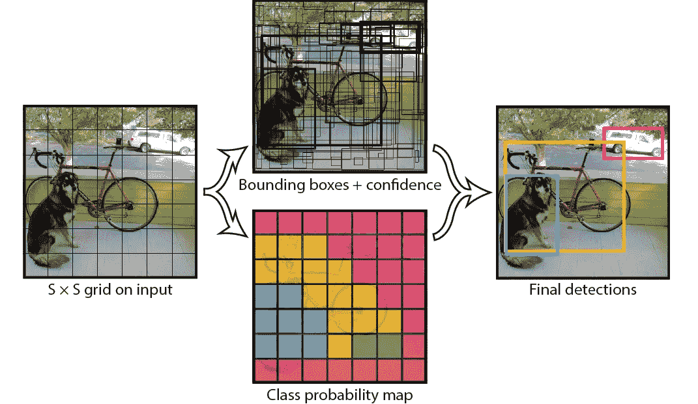

# 计算机视觉专题——YOLO 算法

> 原文：<https://medium.com/analytics-vidhya/topics-in-computer-vision-the-yolo-algorithm-4f04e3bc1e14?source=collection_archive---------28----------------------->

**你只看一次**或“ **YOLO** ”是一种物体检测算法的名字，在 *Redmon* *等人*2016 年的一篇研究论文中受到洗礼。YOLO 实现了用于自动驾驶汽车等尖端技术的实时物体检测。让我们看看是什么让这个算法如此受欢迎，并浏览一下它的工作概况。

对象检测示例

# 背景

## 实时的重要性

人类可以看到图像，并立即识别其中的对象、它们的位置和相对位置。这使我们能够用很少的意识思考来完成复杂的任务，比如开车。因此，训练汽车自动驾驶需要相似的反应能力和准确性。在其最基本的形式中，这种系统必须能够剖析道路的实时视频，检测各种类型的物体，并在继续决定路径之前学习它们的真实世界位置，所有这些都是实时的。

## 在 YOLO 之前

先前的检测系统使用在测试图像的不同切片上评估的分类器。例如，可变形零件模型( **DPM** )涉及在图像中均匀间隔的位置上滑动窗口，并在这些零件上运行分类器。 **R-CNN** (基于区域的卷积神经网络)，另一个模型，运行分割算法将图像分成斑点，然后对这些斑点运行分类器。但是**低速**和**难以优化**困扰着这样的前 YOLO 系统。

# YOLO 算法

## 工作

YOLO 将物体检测重新定义为一个回归问题。它将单个卷积神经网络(CNN)应用于整个图像，将图像划分为网格，并预测每个网格的类别概率和边界框。例如，取一个 100×100 的图像。我们把它分成网格，比如说 7x7。

对于每个网格，网络预测一个边界框和对应于每个类别(汽车、行人、交通灯等)的概率。).

每个边界框可以用四个描述符来描述:

1.  边界框的中心
2.  高度
3.  宽度
4.  映射到对象所属类的值

此外，该算法还预测了包围盒中存在物体的概率。如果对象的中心落入网格单元，则该网格单元负责检测该对象。每个网格中会有多个边界框。在训练时，我们只希望每个对象有一个边界框。因此，我们指定一个框负责基于哪个框与地面真实框具有最高重叠来预测对象。

最后，我们在每个类的对象上应用一个名为“**非最大抑制**的方法来过滤掉“置信度”小于阈值的边界框。这给了我们对图像的预测。

# 重要

YOLO 是**速度极快的**。由于检测问题被构造为回归问题，因此不需要复杂的流水线。比' **R-CNN** 快 **1000x** 以上，比' **Fast R-CNN** 快 **100x** 以上。它能够处理小于 25 毫秒延迟的实时视频流。它还实现了比现有实时系统两倍多的精度。同样重要的是，YOLO 正在沿着'**端到端深度学习的路线**实践。