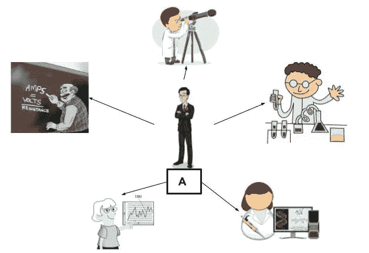
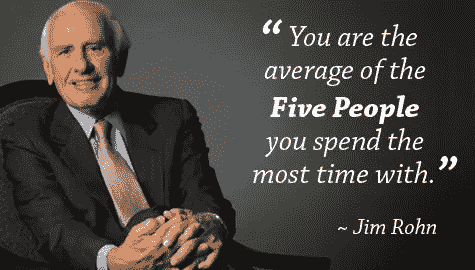
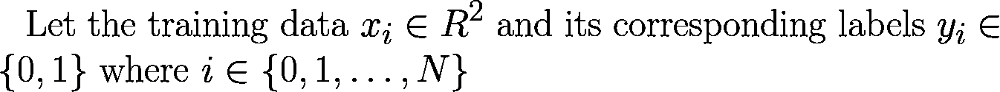
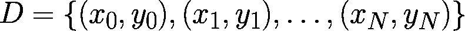
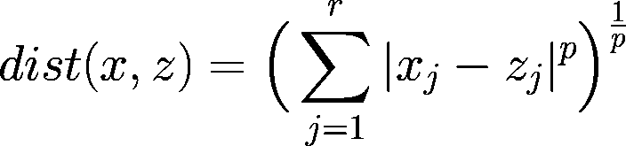
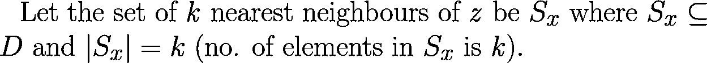
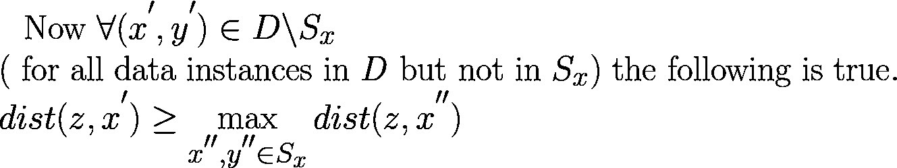
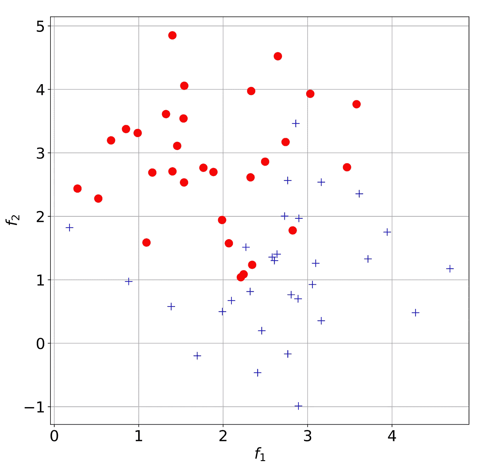
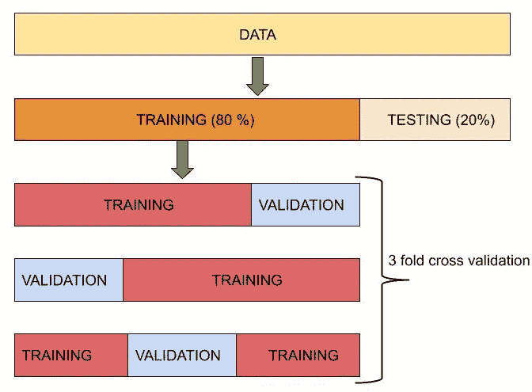
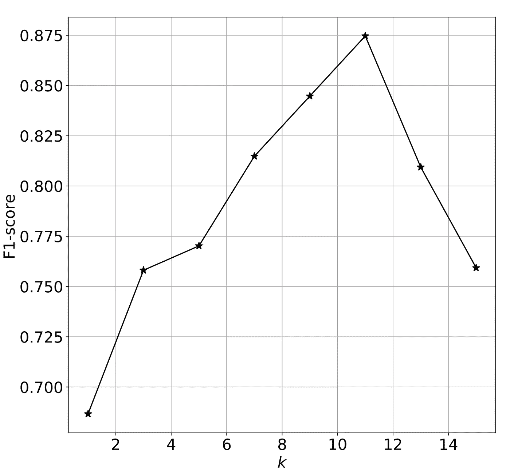

# K-最近邻分类器的基础:用 Python 举例说明

> 原文：<https://medium.com/analytics-vidhya/topics-in-machine-learning-4edffd79237f?source=collection_archive---------17----------------------->

## 机器学习专题

## **简介**

在机器学习(ML)中，关键的一点是，不存在适用于所有数据集的*完美算法。每个算法都有一些 ***假设*** 。了解这些假设很重要，这样我们才能知道何时应用不同的 ML 算法。今天，我们将尝试理解一种称为 K -最近邻(KNN)的 ML 算法的假设和原理。*

## ***直觉***

*在探索技术细节之前，我们将试图理解 KNN 背后的直觉。我们将通过玩一个叫做 ***的游戏来识别职业*** 来做到这一点。这个游戏的目标和规则如下:*

> *目标:确定 A 和 b 两个人的职业。*
> 
> *规则:你只知道 A 和 B 花费最多时间的五个人的职业。*

*让我们想出一个算法来识别他们的职业。*

****

*图 1:辨别 A 和 b 的职业。*

*我们将采用吉米·罗恩的模式来解决这个问题。*

**

*图 2:来源:[https://candicelatham.com/friends-inspire-me/](https://candicelatham.com/friends-inspire-me/)*

*在这个模型中，我们试图根据 A 和 B 相处时间最长的五个朋友的职业对 A 和 B 的职业进行分类。A 的前五个朋友大部分都是科学家。因此，我们把 A 的职业归类为科学家。同样，B 的前五大好友中，绝大多数都是警察工作人员。所以我们把 B 的职业归类为警察。我们可以把这个量词命名为*。**

## **假设**

**记住每个模型都有一些假设，没有一个模型是完美的。最近朋友分类器中使用的假设是什么？如果我们假设每个人的职业为一个数据实例，那么我们就是假设 ***相似的数据实例有相似的标签*** 。基于这个假设，我们将 A 的职业分类为科学家，B 的职业分类为警察。**

## **我们为什么选择这种模式？**

**我们选择这个模型的一个原因是通过观察数据集(即 A 和 B 的五个朋友的信息)。我们可以在这个数据集中看到一个模式，即 A 和 B 的朋友的职业相似。所以选择这个模型纯粹是基于数据，而不是任意的。在这两种情况下，我们对 A 和 b 的职业分类有很高的信心。现在考虑一个第三人 C*，他是一名**法医科学家** ( *一名法医科学家同时与科学家和警方人员*混在一起)。如果再玩一次游戏会怎么样？***

**能不能把 C 这个人分类正确？这个问题的答案取决于与 C 相处时间最长的五个人的职业。如果五个人中有三个是科学家，两个是警察，那么我们把 C 归类为科学家。另一方面，如果 C 的三个朋友是警察，两个是科学家，那么我们把 C 的职业归类为警察。注意，在 A 和 B 的情况下，职业分类的置信度很高，而在 C 的情况下，置信度降低。**

## **KNN 分类器**

**KNN 还假设 ***相似的点(数据实例)有相似的标号。*** 现在我们将进入算法的细节。**

**让我们考虑一个二元分类任务，对圆和十字进行分类。**

****

**训练数据和标签来自概率分布 ***P*** 。我们只有这个分布的一些数据实例。我们不知道实际的分布情况。让数据集 ***D*** 如下:**

****

## **算法**

*****目标:给定一个测试数据实例，找出其 k 个最近的训练数据实例的最常见标签。将最常用的标签指定为测试数据的标签。*****

***第一步:*选择 ***k*** 的值。 ***k*** 代表最近邻的个数。 ***k*** 是一个超参数，必须通过交叉验证来确定。 ***k*** 的值是奇数。**

***步骤 2:* 定义 KNN 使用的距离度量**

**KNN 的分类输出依赖于距离度量。常用的距离度量是 ***闵可夫斯基距离。*** 闵可夫斯基距离定义如下:**

****

*****x*** 和 ***z*** 是长度 ***r*** 的向量。**

1.  **当 ***p = 1 时，dist(x，z)*** 为曼哈顿距离(L1 范数)，**
2.  **当 ***p = 2*** ， ***dist(x，z)*** 就是欧氏距离(L2-范数)。**
3.  *****p*** 也是一个超参数，必须通过交叉验证来选择。**

***第三步:*考虑单个测试数据实例 ***z*** 。计算 ***z*** 到其最近的 ***k*** 训练实例的距离。**

********

*****Sx*** 是训练集 ***D. Sx*** 由 ***k* 训练数据实例**和测试数据实例 ***z*** 组成。测试数据实例 ***z*** 距*D***Sx***中数据实例的距离大于或等于测试数据实例*z***Sx***中数据实例的距离。这是因为*Sx 由测试数据实例 z 的 ***k 个最近邻居组成，第 k+1 个邻居比第 k 个邻居***【1】***更远。********

***第四步:*测试数据实例的分类——从集合 ***Sx*** 中选择最频繁出现的标签作为测试数据实例的标签 ***z.*****

## **玩具示例**

*****数据集生成*****

**我们将创建一个圆圈和十字的数据集。我们将使用 python 来生成和绘制数据集。**

****

**图 3:具有两个特征 f1 和 f2 的数据集。**

*****三重交叉验证和超参数调整*****

**数据集随机分为训练集和测试集。训练数据被进一步分成训练集和验证集。现在，我们进行三重交叉验证，以找到最佳的 ***k*** 值。**

*****需要注意的是，测试数据应该只访问一次*** 。我们不应该通过反复测试测试数据来修正超参数。超参数的选择必须基于验证集的性能。一旦确定了超参数，就使用完整的训练集重新训练该模型，并将该模型应用于测试集。测试集只需要被访问一次。这部分在所有机器学习算法中都是一样的。**

****

**图 4:交叉验证**

*****将数据集拆分成训练和测试*****

*****KNN 主要功能*****

*****固定 k 的三重交叉验证*****

**在这个例子中，我们只做交叉验证来确定最佳值*我们已经确定了值 ***p*** 为 2。理想情况下， ***p*** 的值也必须通过交叉验证来固定。***

****

**图 5:使用三重交叉验证为 KNN 选择 k 值。**

**在超参数调整过程中， ***k = 11*** 给出了最好的 [F1 值](https://en.wikipedia.org/wiki/F1_score)。**

## **用全部训练数据进行再训练，并应用该模型对测试数据进行分类**

## **评估指标**

**在本教程中，我们试图从头开始编写 KNN 代码。为了更快地实现，我们可以使用 [scikit-learn](https://scikit-learn.org/stable/) [2】。**

## **参考**

1.  **康奈尔 CS4780《智能系统的机器学习》”*YouTube【www.youtube.com/playlist?】、YouTube、[list = pl l8 olhzgyoq 7 bkvburthesalr 7 bonzbxs。](http://www.youtube.com/playlist?list=PLl8OlHZGYOQ7bkVbuRthEsaLr7bONzbXS.)***
2.  **彼得雷戈萨，法比安，等着，〈sci kit-learn:Python 中的机器学习〉。*机器学习研究杂志* 12。2011 年 10 月:2825–2830。**