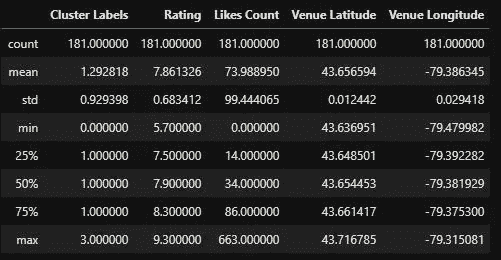
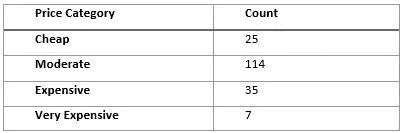
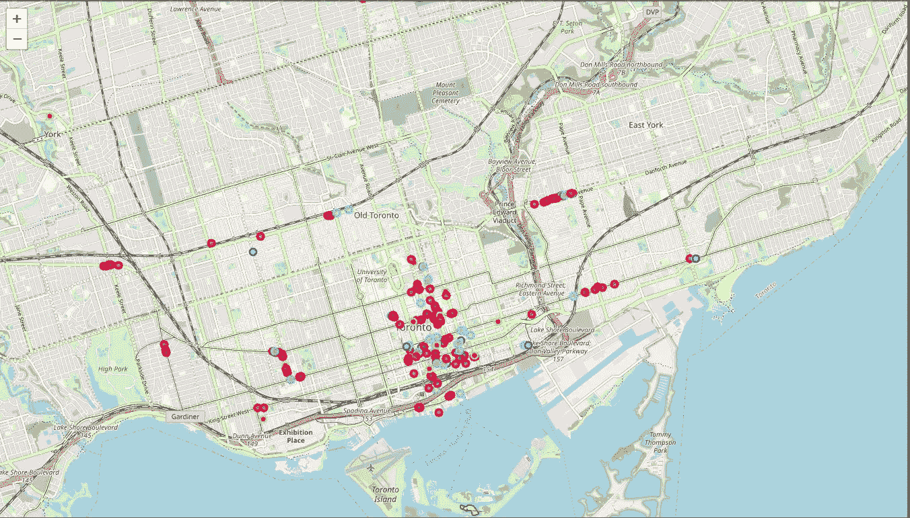
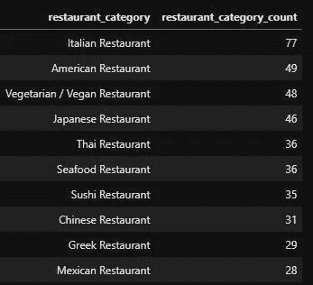
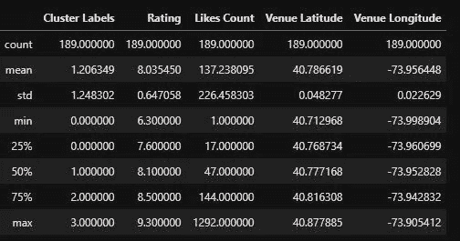
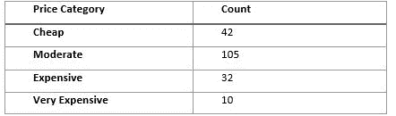
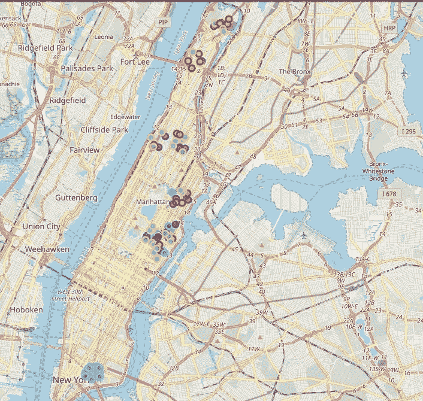
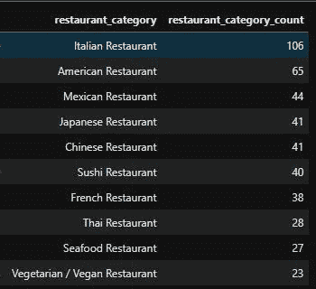

# 多伦多和纽约餐馆的比较

> 原文：<https://medium.com/analytics-vidhya/toronto-and-nyc-restaurants-comparison-69b978cb5531?source=collection_archive---------9----------------------->

多伦多和纽约。

# 介绍

这个项目旨在比较多伦多和纽约市(具体来说是曼哈顿)的餐馆。

作为一个美食爱好者，我有好奇心去深入挖掘和了解纽约和多伦多的餐馆，因为我在纽约生活了将近 2 年，尝试了各种各样的餐馆。另一方面，我对多伦多和它那刻板的、众所周知的各种不同文化背景的餐馆感兴趣。

要考虑的一件事是两个城市的餐馆类别的差异和独特性。因此，美食爱好者可以从多元文化的角度了解哪个城市的餐厅选择范围更广。

根据价格类别、评级、点赞数、经度和纬度将餐馆分成不同的类别是这项研究的一个方面。

另一件有趣的事情是查看两个城市中顶级餐厅类别的数量，这样如果一个承包商想开一家餐厅，就可以知道哪个城市没有那么多特定类别的餐厅，这样它可能会有更大的客户群和利润。

# 方法:

使用 Python 中的“Requests”和“JSON”库从参考资料部分提供的资源中检索并格式化两个城市的数据集，然后数据集被转换成 Pandas 数据帧。

使用 Foursquare API 检索城市中每个街区的附近地点，以便获得所有街区的餐馆。之后，从场地中过滤餐馆，并检索餐馆的详细信息，包括价格、点赞数和评级。

下一步是根据价格、数量、评级、纬度和经度对两个城市的 200 家餐馆进行聚类(由于 API 的限制)。

为了开始对餐馆进行聚类，需要对价格类别进行“一次性编码”,然后使用“Sklearn”中的“Standardscaler”库对餐馆的全部数据进行规范化，接着使用 k=4 的 K-Means 聚类，分析聚类属性，然后在地图上可视化聚类。

多伦多和纽约的餐厅类别示例:

多伦多:

*   意大利餐馆
*   素食餐馆
*   美国餐馆
*   日本餐馆
*   泰国餐馆

纽约市:

*   寿司店
*   中国餐馆
*   法国餐馆
*   海鲜餐馆
*   印度餐馆

知道多伦多大约有 50 个餐馆类别，而纽约有 76 个。

关于多伦多的聚类标签、餐馆评级和喜欢数的一些统计数据:

多伦多集群统计。

多伦多价格类别的计数。

多伦多餐馆集群视觉。

多伦多顶级餐馆分类。

纽约餐馆集群统计。

纽约市价格类别的计数。

纽约餐馆集群的视觉。

纽约顶级餐馆分类。

# 讨论:

基于这些结果，我们可以说:

*   如果一个游客想要一个更便宜的城市，纽约市将会在 200 家廉价餐馆中赢得 42 家，多伦多有 25 家。
*   如果一个游客想看看餐馆的喜欢和评级，纽约市以餐馆评级的平均 8 分和平均 137 个喜欢数获胜。
*   如果游客想尝试希腊美食，多伦多以 29 家希腊餐厅胜出，而纽约只有不到 23 家。
*   如果游客想尝试一家法国餐厅，纽约市有 38 家餐厅，而多伦多有不到 28 家法国餐厅。
*   对于更广泛的餐馆选择，纽约市以 70 个独特的餐馆类别胜出，而多伦多有 50 个独特的餐馆类别。
*   对于想要建立一个新餐厅并想要决定在哪个城市的承包商来说，他们可以查看前 10 大餐厅类别及其数量，例如，如果餐厅是纯素食餐厅，纽约市对承包商来说可能有更好的未来潜力，因为那里没有多伦多那么多的纯素食餐厅。
*   我们可以注意到，一般来说，纽约的餐馆更密集，多伦多的餐馆更分散。

# 结论

最终，纽约看起来像是游客餐厅和多元文化选择的赢家，但独特类别餐厅的巨大差异给了承包商在多伦多开设新餐厅的机会，这些餐厅在同一类别中可能甚至没有竞争对手。

# 参考

1.[https://en . Wikipedia . org/wiki/List _ of _ postal _ codes _ of _ Canada:_ M](https://en.wikipedia.org/wiki/List_of_postal_codes_of_Canada:_M)

2.http://cocl.us/Geospatial_data

[3。https://cocl.us/new_york_dataset](https://cocl.us/new_york_dataset)

# **Github 回购**

[https://github . com/zeyadalmotafar/IBM-Capstone _ Restaurants-study](https://github.com/zeyadalmothafar/IBM-Capstone_Restaurants-study)