# 多伦多枫叶在一些图表中。

> 原文：<https://medium.com/analytics-vidhya/toronto-maple-leafs-in-a-few-plots-1eaece3c608b?source=collection_archive---------11----------------------->

首先快速介绍一下。正如我几周前开始使用 R。我现在做了一个小脚本来生成我们最喜欢的曲棍球队(是的，我认识一个赞博尼车手)的这个(可能是全部)赛季的统计图表。反正你可以在这里找到剧本[。](https://github.com/concipaulo/NHLonR/tree/master/NHLschedulescraper)

现在每周都会生成图表，直到赛季结束。所以 4 月 4 日。由于这是一个非常实验性的概念，我不会一开始就描述，也不会解释自己，也许在最后一篇文章中，我会对这个赛季以及它是如何结束的进行一些分析。现在，你必须解释你自己，或者只是沉思那些点。

## 到目前为止，这支队伍是如何增加 72 分的。

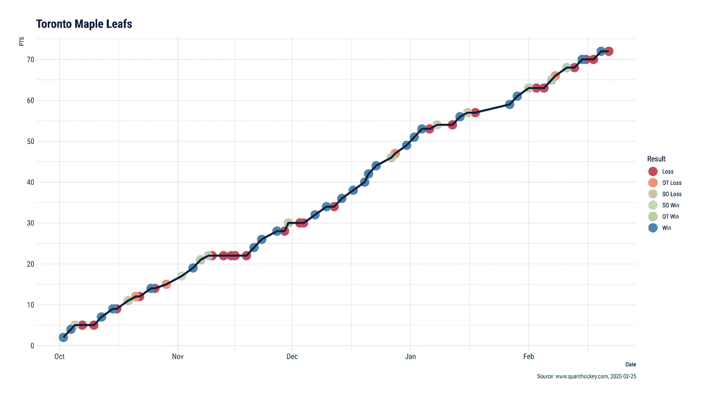

## 这是我们本赛季的净胜球。

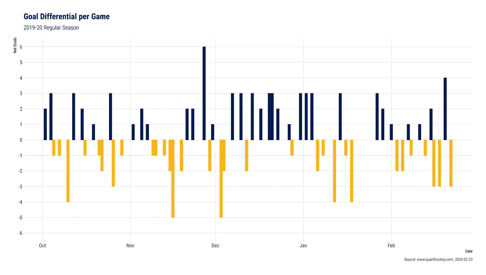

## 这些目标在 2000 年转变成了。

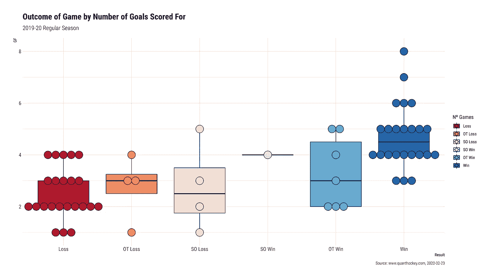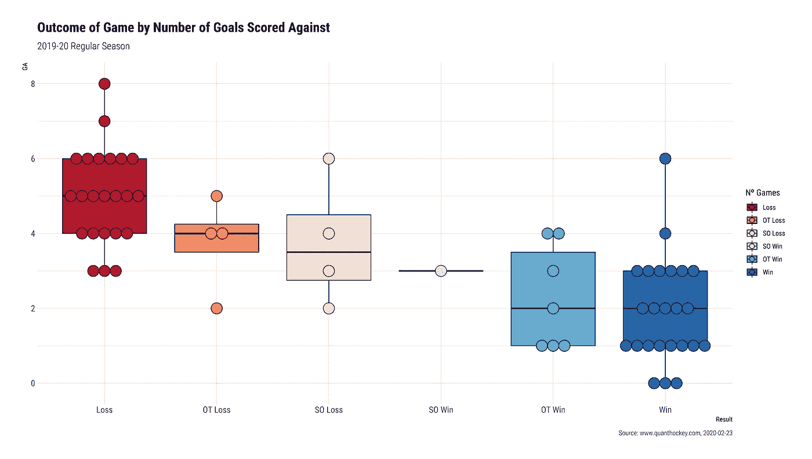

## 这是我们的储蓄百分比。

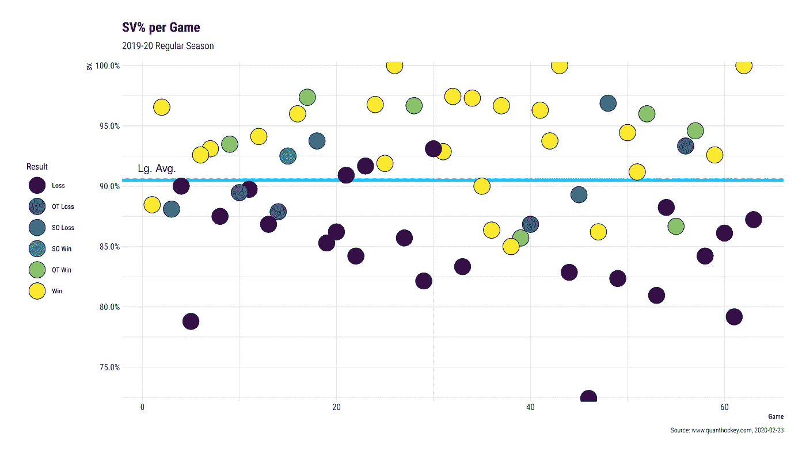

## 按对手和部门分解。

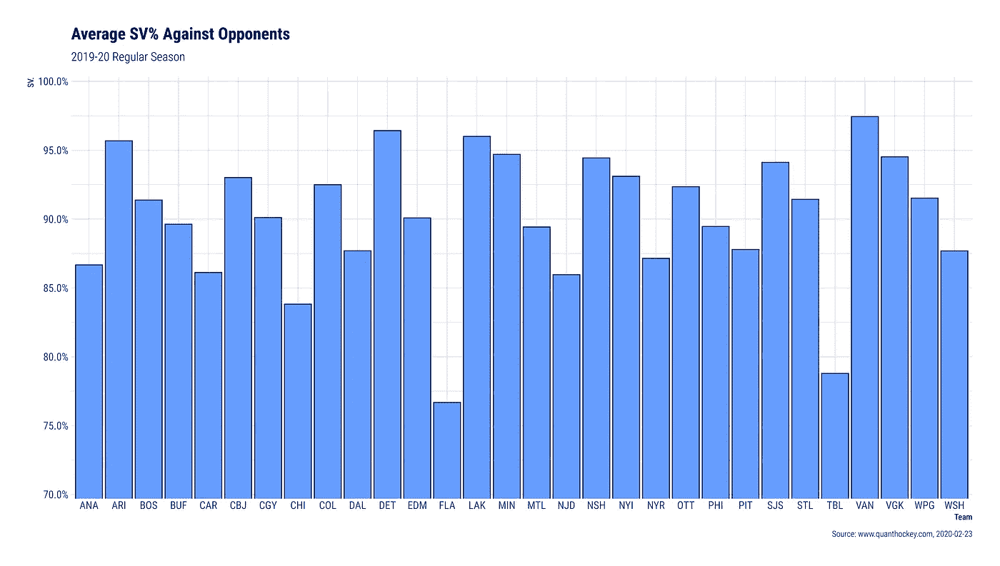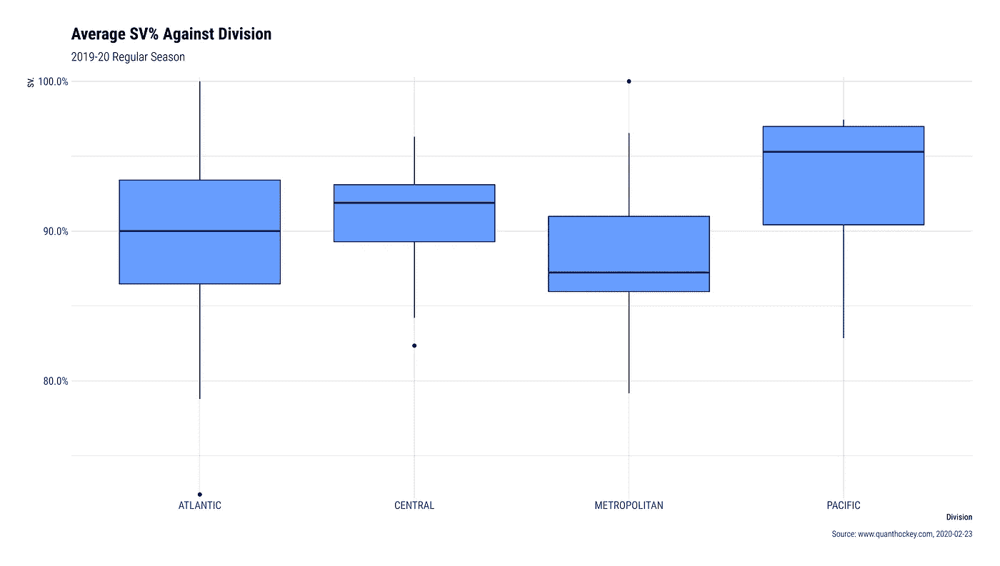

## 以及我们的投篮命中率。

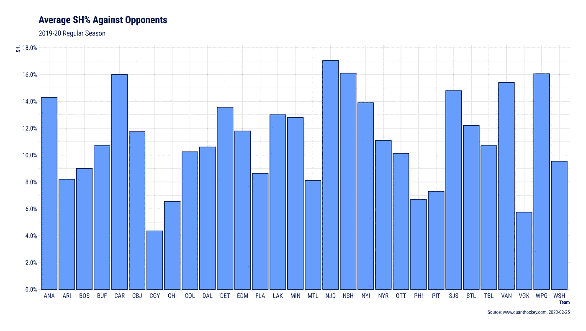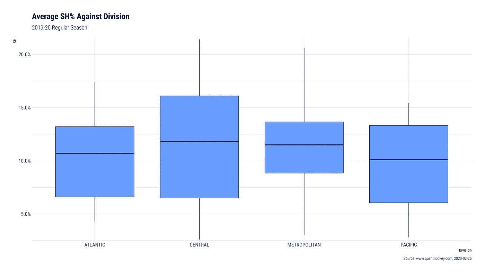

## 最后是我们的 PDO。

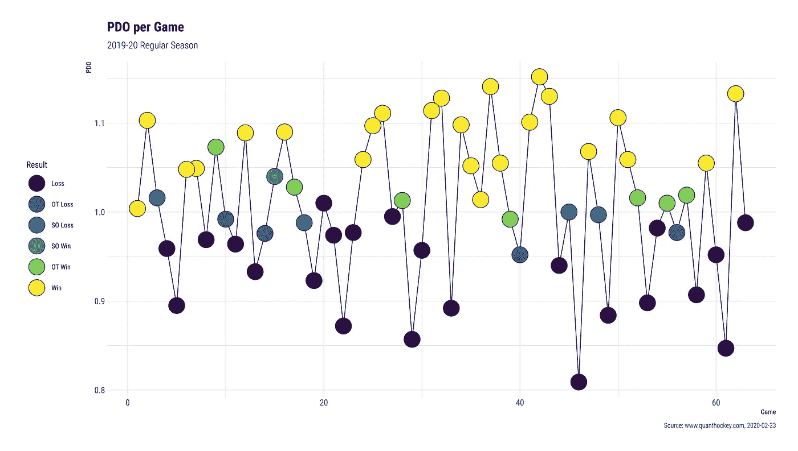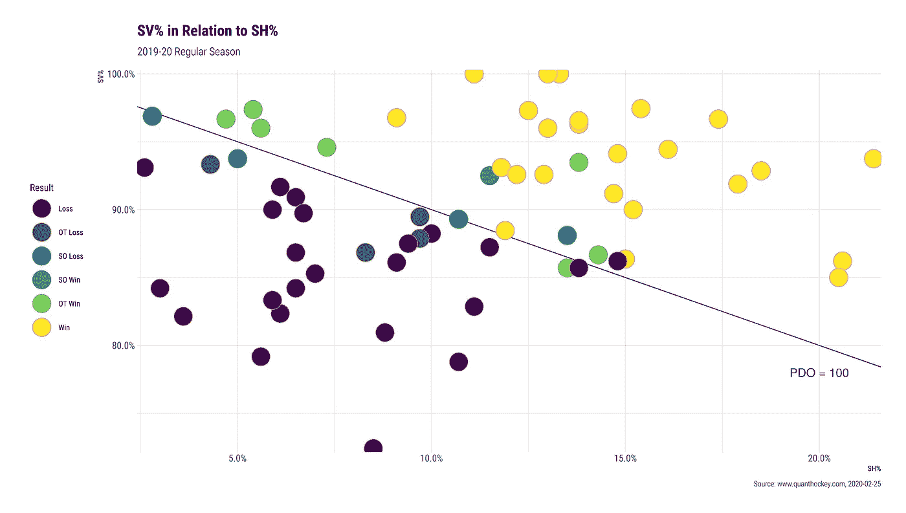

# 结束语

暂时就这样了。如果你想要另外的图表，你可以留下评论或者在我的社交网站上联系我。我很乐意包括。GLG。