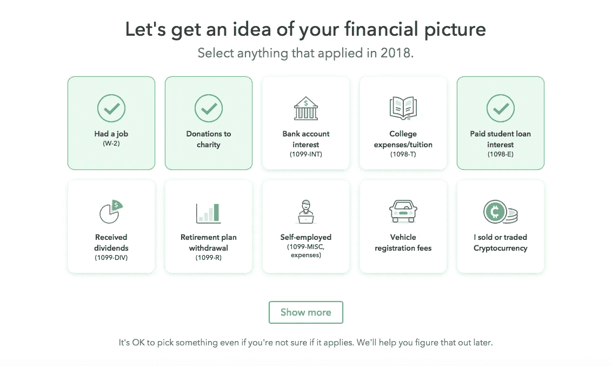
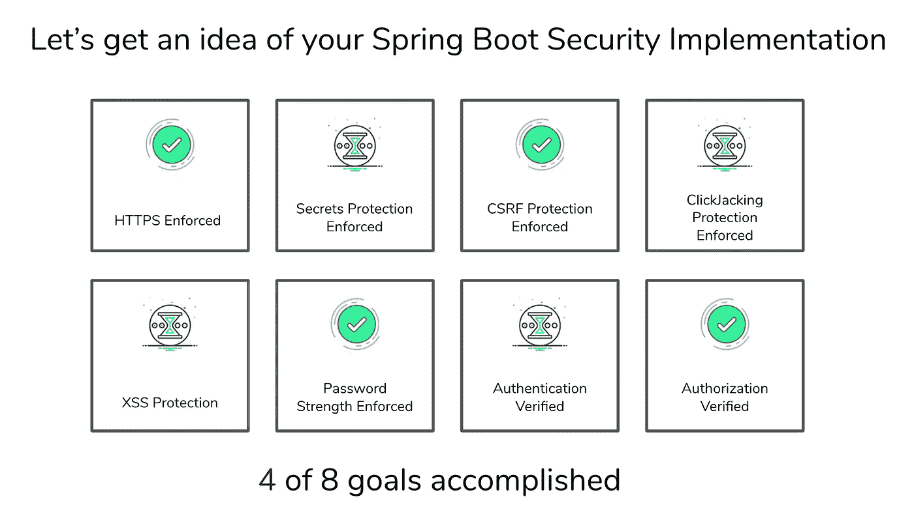

# web 应用程序的安全规范

> 原文：<https://medium.com/analytics-vidhya/towards-a-concept-of-security-specification-for-software-supply-chain-a267a58e099d?source=collection_archive---------14----------------------->

许多开发人员害怕代码评审，其中一个原因可能是大多数评审人员只提供批评而不是鼓励。请记住，作为一名同行评审员，你也可以强化你看到的做得好的东西，这与挑剔每个设计缺陷、错误、bug 或风格问题一样重要和有效。

鼓励**期望行为的**正强化**有其内在价值。**

# 你不应该唠叨一个开发商

有一组静态分析工具可以扫描源代码中常见的漏洞。使用这些工具的**开发者**的预期**期望行为**是确定并修复任何发现的漏洞。唠叨或让工程师感到内疚来修理东西对双方都是痛苦的。

不幸的是，这些工具的结果几乎总是集中在负面的**上，即围绕可能导致漏洞的实现风险进行文案撰写(*您的应用容易受到命令注入、XSS、弱认证、弱加密、特权提升等的攻击*)。任何积极的实施评估(良好的验证标准和检查)都被排除在外，因为这些工具经过优化/调整，可以消除误报。**

> **因此，这样的工具变成了没有任何正面强化的自动安全挑剔工具**

**这是危险的，原因有几个。它削弱了努力，让花费数小时编写代码，然后重写(通过拉请求修复问题)，再重写的开发人员感到沮丧。有时，你会目睹悲伤的各个阶段因一个安全漏洞而展开:**

**愤怒→否认→讨价还价→脱离/接受。**

**导致这种体验的是，开发人员经常选择忽略或脱离这些工具。**

> **而不是**静音**出来观察**好的做法**，这样的工具**能得到**的称赞吗？**

## **正向强化的重组**

**正面强化与安全风险的最佳组合会导致开发人员不断地使用这些安全工具。**

**作为 Intuit 的毕业生，我一直对 TurboTax 的愉快经历感到敬畏，这种经历主要集中在目标导向而不是任务导向上。**

****

**Intuit TurboTax 申报体验**

**没有人会为了纳税而纳税。TurboTax 知道这一点，而是围绕用户的真正动机来定位其体验:*获得最大退款，保证*并通过里程碑来实现它——这是我们可以支持的价值主张。**

> **设计应用程序安全工具时能考虑到目标吗？
> 当然，找到并修复所有的漏洞并不是一个可衡量的目标。正如 Dijkstra 明智地指出的那样——“**测试显示了缺陷的存在，而不是缺陷的不存在**”。
> 我们的应用程序在不断发展，因此如果我们知道我们正在寻找的所有漏洞，就不必一开始就去寻找。**

**一个产品的旅程从源代码开始，然后蜕变成针对消费者愉悦/价值的*功能*或变成漏洞的*bug*。bug 是“观察到的不安全的例子”的副作用代理，这通常是极快的生产力的负面影响。**

**错误的后果可以分为以下几种**

*   ****被利用** —该漏洞未被发现或忽略，导致攻击者利用它造成伤害**
*   ****未被发现的** —这个 bug 仍然潜伏在代码中等待被利用**
*   ****发现** —通过代码审查、安全工具、安全测试或道德赏金猎人发现的错误意识**
*   ****预防性**—**发现什么**是固定的，并且执行检查以使其不会再次重复**

**就像你不能神奇地将质量加入到软件中一样，你也不能在设计中加入或强制加入安全特性，然后期望它变得完全安全。**

**你能想象在你的代码中发现一个严重的安全漏洞的压力吗？通过要求迅速采取行动的模糊和指责性的漏洞报告，压力倍增。**

## **从安全漏洞到安全目标**

**随着从业者意识到软件安全性的重要性，他们越来越多地采用并发展一套最佳实践来解决这个问题。**

**这样的最佳实践是由组织内的**经验丰富的架构师**或者开发人员社区中的**主题专家**定义的。**

> **这种编码的最佳实践是有形的度量，自然地与目标导向的概念相一致。鉴于软件堆栈由代码模块、开源库和框架组成，它应该有助于回答一系列基本问题
> ——“如果我使用库 X，我应该加入哪些 Y 选项来保持安全”
> ——“如果我使用 web framework P，我应该启用哪些 Q 配置来保持安全”**

**现代 web 应用程序开发过程中使用的主要工具之一是后端框架。框架在应用程序的安全性中扮演着关键的角色。如果每个开发人员都必须为每个应用程序重新实现基本的安全特性，如身份验证和授权，这将总是包括引入新的安全漏洞的可能性。**

1.  **在采用某个框架后，开发人员如何利用框架作者提供的漏洞利用安全默认值来保持安全？**
2.  **开发人员应该依靠文档、社区、专家或其他开发人员来理解这些默认值吗？**

**最终，目标是构建一个能够更好地应对攻击的应用程序，并更好地保护数据的机密性和完整性以及应用程序的可用性。**

**让我们通过利用流行的 [**spring boot 的安全框架**](https://spring.io/guides/gs/securing-web/) **来举例说明这种思想练习。****

**下面列出了一些由 [Pivotal](https://pivotal.io/) 、 [HashiCorp](https://www.hashicorp.com/products/vault/) 、 [Atomist](https://atomist.com/) 、 [Spring Framework](https://spring.io/) 以及 beachhead 社区成员推荐的 [**spring boot 的安全框架**、Atomist](https://spring.io/guides/gs/securing-web/) 的 [Rod Johnson、](https://blog.atomist.com/author/rod/) [Mkyong](https://www.mkyong.com/) 、AWS[Arun Gupta](https://github.com/arun-gupta)**

1.  **在您的应用程序中始终启用和扩展*web securityconfigureradapter***
2.  **在每个公共 web 路由上应用授权和身份验证检查**
3.  **在生产中实施 HTTPS 运输安全条例**
4.  **实施 CSRF 攻击防御**
5.  **强制会话固定保护**
6.  **对安全请求实施安全报头集成
    i. [HTTP 严格传输安全](https://en.wikipedia.org/wiki/HTTP_Strict_Transport_Security)ii .[X-内容-类型-选项](https://msdn.microsoft.com/en-us/library/ie/gg622941(v=vs.85).aspx)整合
    三。静态资源上的缓存控制。[X-XSS-保护](https://msdn.microsoft.com/en-us/library/dd565647(v=vs.85).aspx)集成
    v. [点击千斤顶](https://en.wikipedia.org/wiki/Clickjacking)使用 X-框架-选项缓解**
7.  **密码哈希实施**
8.  **使用 [Spring Vault](https://spring.io/projects/spring-vault) 对 Hashicorp Vault 进行抽象以访问、存储和撤销**机密****
9.  **使用 OAuth2/JWT 规范进行授权**

> **这样的最佳实践可以被编纂成一个符合消费者如何使用开源框架或库的规范吗？**

**让我们**重新想象一下从使用 spring boot 安全框架的应用程序的角度来看，TuroboTax 的面向目标的体验会是什么样子****

****

**面向目标的安全体验的概念 UX**

**请注意，文案围绕一个目标进行优化，而不是挑剔漏洞/风险列表。**

**通过清晰、简洁、非情绪化的无 FUD 的错误报告来表现出同理心是至关重要的。作为一个以目标为导向的开发人员，一个人将从这样的经历中确定反馈，并开始迭代地实现所有这些推荐的最佳实践，直到他/她的目标实现。**

**虽然编写无 bug 代码很难，但要证明无 bug 就更难了。因此，我们为由专家领导的团体创作和驱动的 OSS 软件(库/框架)定义并不断发展这样一个安全规范，然后使用这样一个规范从应用程序的角度来衡量它的遵守或缺乏。**

**安全利用默认原则强调了默认情况下使系统安全的重要性。安全性不是事后才想到的。它必须是任何开发项目不可或缺的一部分，对于 API 也是如此。它从需求收集开始，经过设计、开发、测试、部署和监控阶段。安全性给系统设计带来了大量挑战。很难建立一个 100%安全的系统。你唯一能做的就是让攻击者的工作更加困难。这实际上是设计加密算法时遵循的哲学。**

# **Spring Boot 安全的安全规范的示例实现**

**说够了，让我们用 [ShiftLeft 的代码属性图](https://blog.shiftleft.io/open-sourcing-the-code-property-graph-specification-30238d66a541)来测试这个假设。**

## **使用 Spring Boot 安全的示例微服务**

**让我们利用这个我在 github 中主持的项目，它是在启用了 Spring security 的 Spring Boot 机箱上创建的。**

** [## conikeec/spring boot-安全

### 该应用程序展示了启用了 Spring Security 的关键特性/选项的 Spring Boot 的使用，例如:登录表单…

github.com](https://github.com/conikeec/springboot-security) 

## 一种衡量 Spring Boot 安全性有效利用的安全性规范

使用 [ShiftLeft 的代码属性图](https://blog.shiftleft.io/open-sourcing-the-code-property-graph-specification-30238d66a541)的**面向目标的安全规范**在此发布

 [## conikeec/spring boot-安全

### 此时您不能执行该操作。您已使用另一个标签页或窗口登录。您已在另一个选项卡中注销，或者…

github.com](https://github.com/conikeec/springboot-security/blob/master/specification/SpringBoot_SecuritySpec.sc) 

这种"**安全性即代码**"规范可以集成到您的 CI 渠道中，用于持续验证，以确保迭代地满足设定的所有**目标**。

## (视频)针对示例应用运行规范

一个**spring-boot-security specification**在本地机器或 CI 管道(Jenkins、TravisCI、CircleCI、GitHub Actions、GitLab CI)中的运行顺序如下图所示

 [## 无标题的

### 由 chetansl 录制

asciinema.org](https://asciinema.org/a/PofzjLFfAq5A6ihbGJhc0QTw4) 

## 结果推动以目标为导向的仪表板

产生的输出(通过 API)可以为整个组织的排行榜目标导向的 UI 提供动力。

最后，安全是一个固有的**跨职能学科**。我们必须和许多不同素质和热情的团队一起工作。通过利用 OSS 委员和主题专家的集体智慧，我们可以创建更多这样的安全规范(Apache Struts，Hadoop，Kafka，JWT，Play！DropWizard 等)，它可以与每个 OSS 计划捆绑在一起。

这将有望防止此类[争论](https://blog.codecentric.de/en/2015/11/comment-on-the-so-called-security-vulnerability-in-apache-commons-collections/)，并使使用更接近面向目标的安全性。

## 另一个视角——供应链规范

信用:Amatechinc

我的共同创始人[马尼什·古普塔](/@manish_17771)热情地用汽车行业的供应链和分销管理来类比。

工业供应链从原材料生产商一直延伸到最复杂的电子和计算技术的组装。

供应链的主要组成部分包括供应商(1-3 级)、原始设备制造商、配送中心、经销商等。大多数汽车原始设备制造商在内部创造**25%到 30%** 的价值，并将剩余的 **70%** 委托给他们的供应链。

制造商(OEM)从供应商那里购买整个组件，如门、动力传动系和电子设备。与合作伙伴合作外包组件的愿望正在导致全新的基础设施，以支持制造商的设计、采购和物流流程，从而提高他们的创新能力，使汽车更快上市并减少错误。

> 原始设备制造商和供应链**的运营成功取决于**发布的规范，即由原始设备制造商定义的特定尺寸、单位和指标，供应商应遵守这些规范以防止错误，从而减少死亡

在软件领域，供应链由 OSS/SaaS SDK 开发人员组成，他们在彼此的基础元素上构建软件，一个或多个这样的基础依赖于一个企业应用程序套件。

> 不幸的是，没有任何规范可以精确定义“一个特定的框架/库/ SDK 应该如何使用”。文档不是规范的好替代品，因为规范定义了一个部分如何适应整体的度量标准。

想象一下这样一个世界，规范(就像上面用 spring boot security 说明的那样，或者如何安全地使用 Twilio、Stripe API)与每一个可能的开源库或 SDK 捆绑在一起。

当一个软件制造商依赖这样一个库时，它的规范会在 CI 管道中不断地被评估是否符合。

> 未能通过规范将导致被敌对实体利用的风险。

这从根本上说是一种思考软件及其供应链的新方法。**