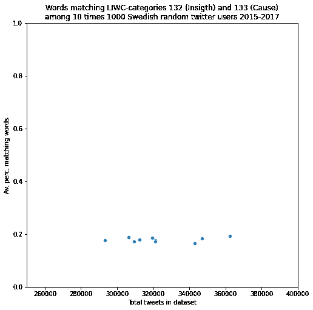
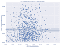
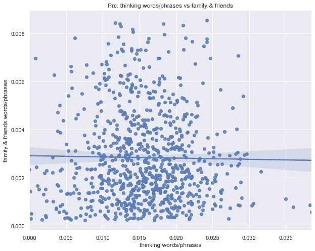
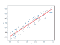
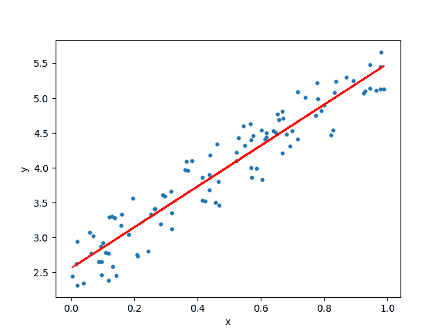
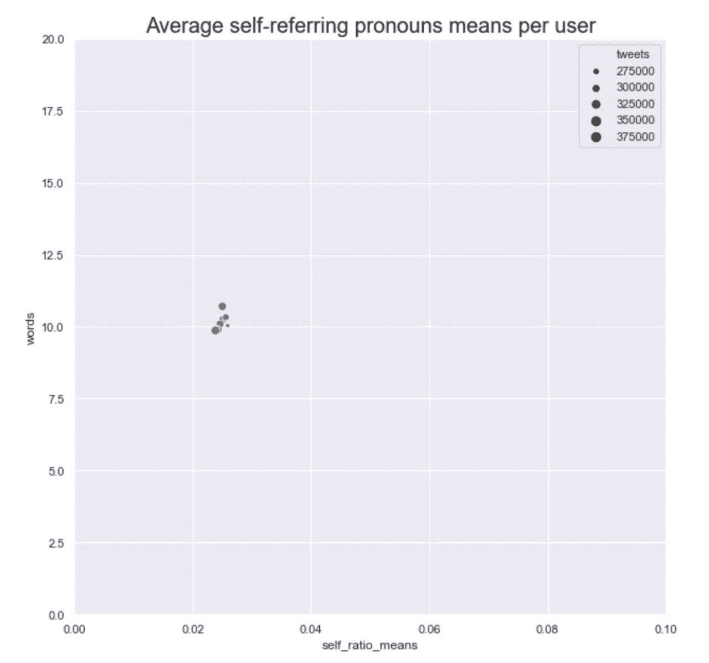

# 用数据科学走向荣格类型学

> 原文：<https://medium.com/analytics-vidhya/towards-jungian-typology-with-data-science-95dcc6f1d57a?source=collection_archive---------16----------------------->

> 卡尔·荣格并没有发展出一种评估人格类型的量化方法，这很可能会使他的理论在科学界更受欢迎。然而，他认为被分析者(即客户)所说的话以及绘画等是主要的经验数据。在互联网出现之前，或多或少唯一在科学上可以接受的(在经济上可以辩护的)测量个性的方法是使用严格构建的问卷进行自我报告。今天，数字媒体和数据科学的进步承诺了一种评估方法，更忠实于荣格的原始观点，即心理是动态的，嘈杂的，并随着时间的推移而变化。
> 
> 心理学家卡尔·荣格在他 1921 年的著作[心理类型](https://en.wikipedia.org/wiki/Psychological_Types)中提出了四种认知功能的理论。他自己最初的想法不是四种认知功能，而是它们是如何指向人和事物的外部世界或者思想、情感和主观经验的内部世界的。
> 
> 他称之为外向的外在倾向和他称之为内向的内在倾向。严格来说，他最初的人格类型理论是基于[八种认知功能](https://personalityjunkie.com/02/function-roles-8-jungian-functions/)，这是四种核心功能与其方向相结合的产物。
> 
> 今天，更多的人通过后来的发展，如迈尔斯-布里格斯类型指标或大量或多或少有效和可靠的在线性格类型问卷，知道了他的想法。
> 
> 使用这种问卷的合格专业人员和这种测试的批评者都很清楚，依靠这种心理偏好的自我报告来获得个人的准确描述存在许多问题。对于最佳实践和陷阱的概述，我建议阅读 Naomi Quenck 博士的 Myers-Briggs 类型指标评估的更学术[要点或 A.J. Drenth](https://www.amazon.com/Essentials-Myers-Briggs-Type-Indicator-Assessment/dp/0470343907/ref=pd_lpo_14_t_1/141-5001282-1598850?_encoding=UTF8&pd_rd_i=0470343907&pd_rd_r=c7bb60e0-0461-4eff-b169-022c4477aebf&pd_rd_w=qg1TW&pd_rd_wg=Br9Sz&pf_rd_p=7b36d496-f366-4631-94d3-61b87b52511b&pf_rd_r=0G01PKTYTYSM27J7EDXA&psc=1&refRID=0G01PKTYTYSM27J7EDXA) 博士的更容易理解的[我的真实类型。](https://personalityjunkie.com/my-true-type-book/)

# 自我报告问卷的问题是

综上所述，我建议关注一个基本事实，即作为一名心理学家，卡尔·荣格的主要关注点是描述心理是如何动态变化的，以及我们在一生中越来越多地发展这些认知功能。

那么，问题的关键不是把人归入一个静态的类别，而是分析并可能促进认知功能的进一步发展，这些认知功能在个体的发展中“停滞不前”,从而导致神经症和生活中的痛苦。

分析师的角色不是真的“轻推”人们超越他们当前的心理状态和潜在的障碍，而是帮助被分析的人(*荣格所说的被分析者*)变得更加意识到无意识的、被压抑的心理部分，并且能够承认它们，也将它们整合到他们的意识中。

# 认知功能是个人成长的地图

四个主要认知功能在这个过程中的作用是充当心理成长和整体性的地图。一个人从童年起就具有最受培养的特定功能，而其相反的功能是最不发达的，也是无意识运作的功能。人一生中的许多麻烦都可以归因于四种功能中最不发达的一种，尤其是在人的前半生。

只有意识到并理解一个人最不发达的认知功能的运作——以及在此之前逐渐发展成熟为意识和意识可操作性的三个功能——一个人才能在心理上变得完整，并体验到一种深刻的存在“完整性”感和不受阻碍地自由充分使用自己的心灵来应对生活抛给我们的无数不同外部事件的快乐。

# 缺少标记训练数据的问题

自从心理学家[詹姆斯·w·彭尼贝克和他的同事在 2003 年发表的开创性工作](https://www.annualreviews.org/doi/abs/10.1146/annurev.psych.54.101601.145041)以来，我们可以有把握地说，单词的使用反映了我们的社会和心理世界的模式。当然，无论我们用什么方法去了解人们的思想和心灵，我们都可以从这些领域中得出关于人格类型和特征的结论。

然而，为了利用数据科学，如机器学习，我们需要来自许多人的大量语言样本，我们知道这些人的性格类型。已经进行了研究，特别是将 Pennebakers 彻底研究了 LIWC 词类与人格类型的关联，但从机器学习的角度来看，每个研究中的个体数量非常低。

一个例子是 2007 年对 80 名韩国学生的意识流文章中的 LIWC 类型和自我报告的大五和 MBTI 类型之间的相关性的研究。但是，在机器学习实验中，人们至少需要大约 1000 个个体的 n 数，并且能够使用近年来在例如深度学习方面的进展，而不是 100，000 到数百万个个体之间的 n 数。

# 所需的数据可能由公司创建，但是…

在当今互联网规模的 webb 应用程序世界中，个性类型数据可能是相关的，如在线约会应用程序，这些数据实际上是可能访问的。至少对拥有这些应用的公司来说是这样。

但是一些对这一领域感兴趣的个人已经主动从个性类型论坛中搜集内容。例如，在流行的数据科学社区平台 Kaggle.com 上，有一个收集了 8600 个用户论坛帖子的[数据集，以及他们自我报告的 Myers-Briggs 性格类型](https://www.kaggle.com/datasnaek/mbti-type)。

原始数据的质量可能会受到质疑，因为无法控制论坛用户使用了哪些问卷来了解他们的类型，这些问卷的结构有多好，以及这些人在一生中发展了多少自我理解和自我观察能力。

此外，他们在那个特定论坛(【personalitycafe.com】)上发布的内容不太可能是可能产生最佳结果的意识流内容。尽管如此，我认为当人们搜集在线数据以使训练数据可用时，这是一个非常好的贡献。

也许像 Myers & Briggs Foundation 这样的组织集中了看起来像是关于 Jungian 类型的大部分学术知识(即使在 Myers-Briggs 人格类型的稍微，但可能是重要的不同形式中),将具有财务实力和远见，以带头探索人格类型的数据挖掘的新可能性。或者他们不会也不会。

或者，致力于让更多人了解卡尔·荣格思想的[应用荣格研究中心](https://appliedjung.com/about-the-centre-of-applied-jungian-studies/)可能有助于促进甚至呼吁资助和发展对荣格数据科学的更多探索。

但相反，似乎全球研究界以詹姆斯·彭尼贝克在心理文本分析方面的长期研究为中心处于领先地位，而对卡尔·荣格的深度心理学*本身没有任何特别的兴趣。科学界取得的任何进步当然都会影响到每个参与人格类型评估和讨论的人，无论是用于商业还是治疗。*

# 瑞典社交媒体分析的例子

去年，我做了一个数据科学实验，试图[从 Reddit 帖子](/@mattiasostmar/pre-trained-fastai-lstm-vs-uclassify-com-predicting-mbti-from-reddit-texts-3b0039ca6a61)中预测八种荣格认知功能，这是建立在另一个个人之前的实验基础上的。

目前，我正在探索如何绘制和使用 Pennebaker 的 LIWC 分类来预测认知功能和社交媒体中可能的社会行为之间的常识性关系。

例如，我曾尝试将特定类别(如 LIWC 类别 132(洞察力)和 133(原因))翻译成瑞典语，以便在瑞典 Twitter 用户上测试它们。

每条推文总字数的 18%左右有一个重复出现的自然模式

大规模研究的人类语言有着有趣的模式。最近几年从一种语言到另一种语言的机器翻译的彻底改进就是一个活生生的例子。当我注意到上面看到的模式时，我实际上很困惑，但在那个例子中没有人称代词。与认知推理(LIWC 分类 132)和因果关系(133)相关的单词和短语也是如此。当对足够大的个体样本和足够多的语言样本进行分析时，一个自然的模式就出现了。

请注意，上图中的每个点代表 1000 个 twitter 账户，平均每个人有 323 条推文。一条推文平均约 10 个单词长，因此结果表明，推文中几乎 10 个单词中有 2 个与 LIWC 定义的思维过程有关(当然，还有我翻译成瑞典语的质量)。

当从这种统计学的高层次角度来看人们的语言时，你可以非常精确地测量语言模式和他们交流内容之间的相关性。我想快速检查一下，看看单词量较高的人是否与 LIWC 相关——类别 132 和 133(我认为应该映射到荣格思维的粗略估计——功能，无论内向还是外向)，以及他们谈论家庭和朋友的程度。

我的个人直觉是，思维风格词汇的程度越高，对家人(如妈妈、兄弟、配偶)和朋友(如哥们、朋友、客人)的提及就越少。似乎很明显，不是吗？但实际上，对这两个变量进行简单的视觉探索，以每条推特上所有单词的百分比来衡量，没有显示出任何相关的迹象。

这只是噪音。这也许本身就是一个发现。

如果与思考相关的 LIWC 词汇和人们谈论家庭和朋友的程度之间存在统计关系，图表中的点和回归线就会有非常不同的外观。就像树的年龄和高度之间的关系。然后像上面这样的图看起来会像下面这样。

就我个人而言，我对 James W. Pennebaker 和他的同事观察到的事实很感兴趣，即在对自然人类语言进行任何机器学习实验之前通常被丢弃的单词表现出与社会地位和性格类型等相关的几个一致模式。他写了一本关于这些发现的通俗易懂的科普书，名为[代词的秘密生活](https://www.secretlifeofpronouns.com/)，我强烈推荐给任何对用数据科学的方法探索人格类型感兴趣的人。

当我最近在瑞典语中重现他关于人称代词的发现时，我的兴趣真的被激起了。他发现，人称代词的使用在很大程度上反映了一个人的心理和生理健康水平(他们当然是相关的，身体疼痛时很难保持冷静和快乐)。由于在统计水平上的使用显示出众所周知的[统计正态分布](https://en.wikipedia.org/wiki/Normal_distribution)的明显迹象，因此可以高精度地分析特定人称代词的使用始终高于或低于总体平均水平的人。

当从 9 个不同的瑞典 twitter 用户随机样本中筛选出成千上万条推文时，看看瑞典推文中自我指代代词(例如，我的，我的)的使用是多么整齐地集中在一个平均值周围！

在每个用户的所有推文中发现的所有单词中，大约有 2%是指自己的代词。该实验重复 9 次，每个子样本中有 1000 个用户(圆点)。

# 瑞典利用 LIWC 和类似方法进行的研究

在瑞典，除了瑞典国防研究机构——FOI 之外，我在这一领域很少发现学术研究或公开发表的实验，他们多次使用笔杆子 LIWC 进行研究

极端采纳者中激进心态的语言标记

[仇外叙事的自动检测:瑞典替代媒体案例研究](https://www.foi.se/download/18.7fd35d7f166c56ebe0bffd8/1542623691578/Automatic-detection-xenophopic_FOI-S--5655--SE.pdf)

[一种用于检测数字社区中极端采纳者的机器学习方法](https://www.researchgate.net/publication/320091937_A_Machine_Learning_Approach_towards_Detecting_Extreme_Adopters_in_Digital_Communities)

以上所有内容实际上是瑞典乌普萨拉大学阿曼德拉·施雷斯塔最近(2019 年)博士论文的部分研究，该论文非常好地概述了应用于分析人们在线话语的数据科学方法，有时使用 LIWC。论文由 FOI 的丽莎·卡提指导，她也是乌普萨拉大学的博士。

他的论文全文可以在这里找到:

[从安全角度分析数字环境的技术](http://www.diva-portal.org/smash/record.jsf?pid=diva2%3A1298150&dswid=3572)