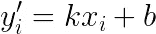
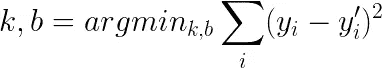
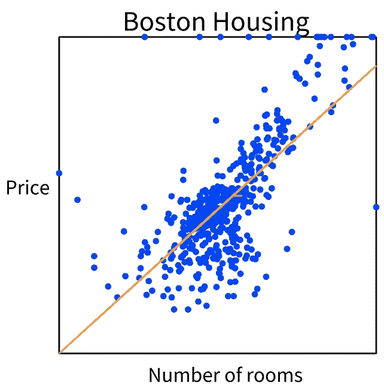

# 走向 Pharo 中的机器学习:可视化线性回归

> 原文：<https://medium.com/analytics-vidhya/towards-machine-learning-in-pharo-visualizing-linear-regression-4b55aa335462?source=collection_archive---------15----------------------->

## 一个小教程，将教你如何拟合波士顿住房数据的回归线，并用 Roassal3 可视化它

这是一个关于如何使用来自[学者](https://github.com/PolyMathOrg/PolyMath)的线性回归模型估计 [Pharo](https://pharo.org/) 房屋价格的小教程。然后，我们将使用 [Roassal3](https://github.com/ObjectProfile/Roassal3) 的新图表功能来可视化数据点和回归线。

这篇博文的主要目的是展示昨天推出的 Roassal3 的新图表功能。我们将构建的可视化并不十分漂亮，但它将让您体验到我们在不久的将来能够做的惊人的事情。

# 装置

Pharo 是一种纯面向对象的编程语言*和一个强大的环境*，专注于简单性和即时反馈(想想 IDE 和 OS 合二为一)。如果你不熟悉 Pharo，你可以按照[https://pharo.org/download](https://pharo.org/download)上的说明来安装。

安装并运行 Pharo 映像后，打开 Playground (Ctrl+OW)并执行(选择它并按 Ctrl+D)下面的 Metacello 脚本来安装[数据集](https://github.com/PharoAI/Datasets)库。该库将允许您下载不同的数据集(包括我们将在本教程中使用的波士顿住房数据集)并将它们作为 [DataFrame](https://github.com/PolyMathOrg/DataFrame/) 对象加载到您的图像中:

```
Metacello new
   baseline: 'Datasets';
   repository: 'github://PharoAI/Datasets';
   load.
```

现在运行这个脚本来安装 [PolyMath](https://github.com/PolyMathOrg/PolyMath) 。这是一个 Pharo 的科学计算库，包含一个`PMLinearRegression`类:

```
Metacello new
   repository: 'github://PolyMathOrg/PolyMath:v1.0.1/src';
   baseline: 'PolyMath';
   load.
```

最后，执行这个脚本来安装 [Roassal3](https://github.com/ObjectProfile/Roassal3) 。我将向您展示的功能是几个小时前添加的。在接下来的几天里，API 很有可能会被修改，所以为了确保在你阅读这篇文章的时候一切正常，你必须在一个特定的提交上加载 roassal 3`b9fa9e1`:

```
Metacello new
   baseline: 'Roassal3';
   repository: 'github://ObjectProfile/Roassal3:b9fa9e1';
   load.
```

我在这篇博文中展示的改动还没有集成到 Roassal3 的 masters 分支中，所以你必须单独加载它们。为此，打开 Iceberg (Ctrl+OI)，点击 Roassal3，找到`Roassal3-Matplotlib`包并按下 Load。

# 正在加载波士顿住房数据集

要加载波士顿住房数据集，只需运行

```
boston := Datasets loadBoston.
```

这将为您提供一个包含 14 列的数据框架:

```
1\. CRIM: per capita crime rate by town
2\. ZN: proportion of residential land zoned for lots over 25,000 sq.ft.
3\. INDUS: proportion of non-retail business acres per town
4\. CHAS: Charles River dummy variable (= 1 if tract bounds river; 0 otherwise)
5\. NOX: nitric oxides concentration (parts per 10 million)
6\. RM: average number of rooms per dwelling
7\. AGE: proportion of owner-occupied units built prior to 1940
8\. DIS: weighted distances to five Boston employment centres
9\. RAD: index of accessibility to radial highways
10\. TAX: full-value property-tax rate per $10,000
11\. PTRATIO: pupil-teacher ratio by town
12\. B: 1000(Bk - 0.63)^2 where Bk is the proportion of blacks by town
13\. LSTAT: % lower status of the population
14\. MEDV: Median value of owner-occupied homes in $1000's"
```

我们将使用列`RM`和`MEDV`来研究平均房间数和房价之间的关系。

```
rooms := boston column: 'RM'.
price := boston column: 'MEDV'.
```

# 使用 PolyMath 对数据进行直线拟合

简单的一元线性回归背后的思想如下:

1.  我们得到了一个积分集合`(x, y)`——在我们的例子中，`x`是房间数量，`y`是价格——并且
2.  我们需要找到两个值`k`和`b`，使得线`y = kx + b`是所有给定点的最佳近似。这些值被称为*【斜率】*和*【截距】*。

更具体地说，如果我们想使用斜率`k`和截距`b`来预测每`xᵢ`(房间数量)的`yᵢ`(价格)为



我们需要选择`k`和`b`，使得实际`yᵢ`和预测`yᵢ´`的平方差之和最小；



我不会详细介绍这是如何实现的(但我鼓励你阅读计算线性回归的不同方法——这非常有趣)。我们可以使用 PolyMath 的`PMLinearRegression`类找到给定点的斜率和截距。为此，我们只需向其添加点，并提取斜率和截距的值:

```
regression := PMLinearRegression new.1 to: rooms size do: [ :i |
    point := (rooms at: i) @ (price at: i).
    regression add: point ].k := regression slope.
b := regression intercept.
```

现在，我们可以根据房间数量来预测建筑物的价格:

```
predictedPrices := k * rooms + b.
```

这些预测都在同一条线上，称为*“回归线”*。

# 用 Roassal3 绘制回归线

最后，我们可以使用 Roassal3 可视化库构建一个图表，向我们显示我们所有的点和一条穿过它们的线。

我们首先创建一个空图表:

```
chart := RSChart new.
```

现在我们创建一个散点图:

```
points := RSScatterPlot new
   x: rooms
   y: price.
```

我们还创造了一个系列:

```
regressionLine := RSLinePlot new
   x: rooms
   y: predictedPrices.
```

然后，我们将散点图和线条添加到图表中:

```
chart
   addPlot: points;
   addPlot: regressionLine.
```

我们为图表的两个坐标轴指定了自定义标题和自定义标签:

```
chart
   title: 'Boston Housing';
   xlabel: 'Number of rooms';
   ylabel: 'Price'.
```

现在我们可以通过选择单词`chart`并检查它(Ctrl+I)或(Ctrl+G)来查看图表:

