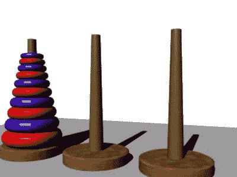
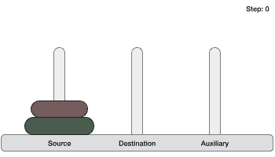
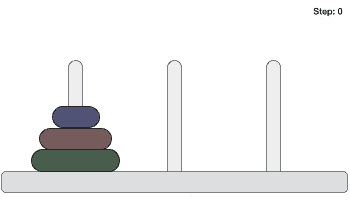
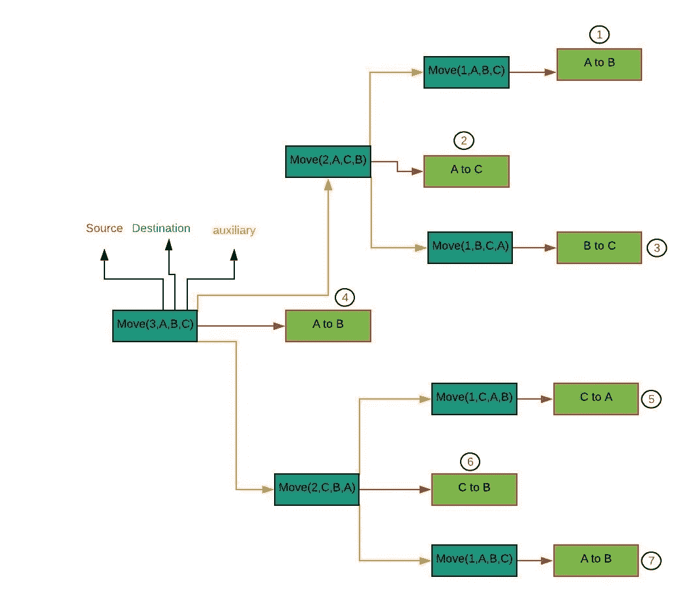

# 汉诺塔问题及 Python 解决方案

> 原文：<https://medium.com/analytics-vidhya/tower-of-hanoi-b8f2283e3d78?source=collection_archive---------8----------------------->

河内塔是一个数学游戏或难题，我们有三个桩和 n 个圆盘。

河内塔

**游戏可以按规则玩:**

*   您可以一次移动一张光盘。
*   小光盘必须在大光盘上。
*   所有盘从源堆移动到目标堆。

1.1:从源堆到目的堆

**问题:**
假设我们有三堆(A，B，C)和 n 个圆盘。那么解决汉诺塔难题需要多少步呢？答案是**2^*n*1**其中 n 是碟片的数量。

***为三个号码盘:***

3 盘移动解决方案

1.1 图片我们已经提到，A 是我们的**源**，B 是**目的地**，C 是**辅助**桩。所以我们的目标是把三张盘从源移动到目的地。

1.2 ***移动步骤:***

*   将**源堆**顶盘移动到**目的堆。**
*   将**源堆**第二顶盘移至**副堆**。
*   将**目的堆纸台**顶盘移至**辅助堆纸台。**
*   将**源堆当前顶部**圆盘移动至**目的堆**。
*   将**副堆当前顶部**圆盘移至**源堆。**
*   将**辅助堆纸台当前**顶盘移动至**目的堆纸台**。
*   将**源堆当前顶部**圆盘移动至**目的堆**。

因此，我们在七次移动中成功地将所有源堆盘移动到目标堆。

现在的问题是我们如何求解四个或六个圆盘？

# 汉诺塔递归树；

如果你看到上图，你会看到我画了一棵 n = 3 的树。其中每一级表示从源到目的地的移动，其中**移动**是一个函数。 **Move** 函数可以接受四个参数。第一个参数是指盘数，第二个是指我们的**源堆**，第三个是指**目的堆**，第四个是指**辅助堆**。我们在这里对每个**母堆使用一个通用模式。**为****Move(3，A，B，C)** 所在的第一个节点还有另外两个子节点 **Move(2，A，C，B)** 和 **Move(2，C，B，A)** 。这意味着对于我们的第一个孩子，我们取 2(3–1)作为盘的数量，A 是源堆，C 是目的堆，B 是辅助堆，我们的第二个孩子取 2 是盘的数量，C 是源堆，B 是目的堆，A 是辅助堆。
对于每个第一个孩子:**移动**(父磁盘- 1，父源，父辅助，父目的)。**

**对于每个第二胎:**移动**(父盘- 1、父辅助、父目的地、父源)。这种模式对于每个父节点和每个子节点都是正确的，并且这种模式可以使用任意数量的 n**

****Python 实现:****