# 有毒评论分类

> 原文：<https://medium.com/analytics-vidhya/toxic-comment-classification-e8fe2922249f?source=collection_archive---------21----------------------->

讨论你关心的事情可能会很困难。网上辱骂和骚扰的威胁意味着许多人停止表达自己，放弃寻求不同意见。平台努力有效地促进对话，导致许多社区限制或完全关闭用户评论。

# **问题陈述**

因此，本项目的问题陈述是使用不同的机器学习模型来分类和预测评论位于给定毒性水平标签下的概率，包括:

*   有毒的
*   剧毒
*   猥亵的
*   威胁
*   侮辱
*   身份仇恨

这个项目的主题来自 Jigsaw 的一个 Kaggle 竞赛。你可以在这里找到竞争对手[。](https://www.kaggle.com/c/jigsaw-toxic-comment-classification-challenge)

# **数据集描述**

项目中使用的数据集包含带有唯一 id 的注释和六个二进制标签，这些标签表示注释属于哪个类别。训练集包含大约 180，000 个样本，测试集包含大约 60，000 个样本。

现在我们来看数据分析。

# **探索性数据分析**

从数据分析开始，我们检查数据集中的任何空值，结果是没有。之后，我们检查了不同标签下的评论分布，结果如下图所示:

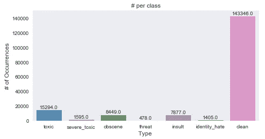

不同标签下的评论分布

由于干净评论和标记评论的不平衡，我们检查了在多个标签下标记的评论的数量。结果，我们得到了下图:

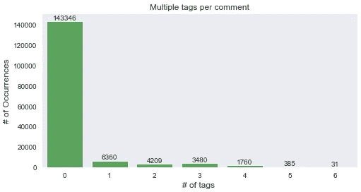

多标签评论的数量

在此之后，我们通过执行相关性分析来查看不同标签之间的相关性。由于分析中涉及的变量是分类变量，所以没有使用相关矩阵，而是使用了交叉表和 Cramers V 统计等方法。

> 克拉默的统计得分= 0.3085
> 
> 有毒标签和其他标签之间的交叉表:

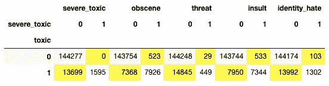

有毒标签和其他标签之间的交叉表

我们还看了定义或属于不同标签的不同的独特单词。以下是单词 Clouds 对有毒和清洁的注释:

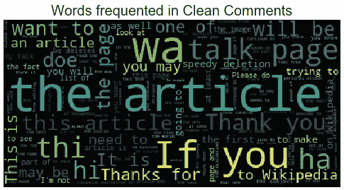

干净评论的文字云

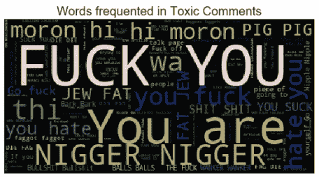

有毒评论的词云

另一件值得注意的事情是评论中独特词汇的比例。发现大量有毒评论包含的词汇种类非常少。通过观察下图所示的 KDE 图中的 0–10%标记，您可以注意到同样的情况:

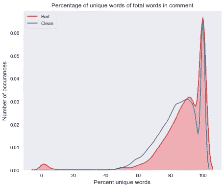

独特单词的百分比(KDE 图)

现在，让我们进入提取模型数据进行训练的部分，即特征。

# 特征工程

该项目的特征工程大致分为两类:

## **间接特征**

这些特征是我们提取的一些实验特征，包括:

*   句子计数
*   字数统计
*   唯一单词的计数
*   字母计数
*   标点计数
*   大写单词/字母的计数
*   停用词计数

首先创建间接特征有两个原因。首先，必须从干净的语料库中创建直接特征。其次，这些功能有助于弥补清理数据集时丢失的信息

## **直接特征**

这些特征是直接由于评论的文字/内容而产生的特征。我们探索了以下技术:

*   单词矢量器
*   Char N-gram 矢量器
*   单词嵌入(例如:手套)

# 清理语料库(预处理)

为了清理用于提取直接特征的语料库，使用了以下技术:

*   收缩
*   删除泄漏特征(例如:IP 地址)
*   删除用户名(如果有)
*   案例折叠
*   词汇化
*   停用词删除

# 使用的模型

在该项目中，总共使用了 3 个模型(1 个基线模型和 2 个高级模型):

## 逻辑回归

逻辑回归模型中没有传递特殊参数。

## 光梯度推进机

以下参数用于运行 LGBM 模型:

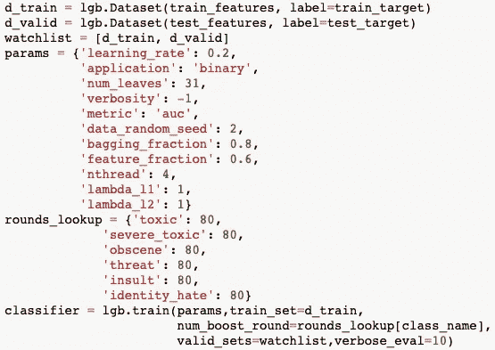

LGBM 模型参数

## 长短记忆网络(LSTM)

在所使用的 LSTM 模型中制作了以下层:

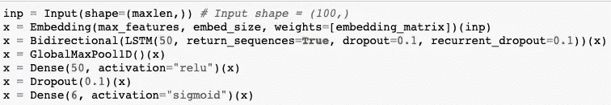

LSTM 层

在上面，不同变量的值如下:

> maxlen = 100
> 
> 最大功能= 20000
> 
> embed_size = 50

LSTM 模型中使用的嵌入文件可以在[这里](https://drive.google.com/open?id=14pKvLSnm_m5ZiUkc8enRUNP1zgcfd_j0)找到。

# 结果

以下是使用的每个模型的结果:

## 逻辑回归

每个标签的测试精度为:

> 有毒评论:61.67%
> 
> 重度毒性意见:58.49%
> 
> 淫秽评论:60.63%
> 
> 威胁评论:58.37%
> 
> 侮辱评论:60.47%
> 
> 身份仇恨评论:58.72%

评论在特定模型下的一些预测概率如下所示:

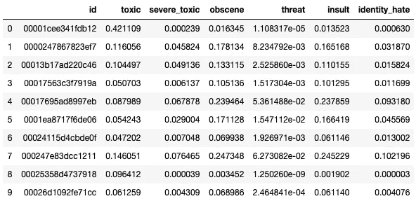

使用逻辑回归预测概率

## 光梯度推进机

每个标签的测试精度为:

> 有毒评论:88.39%
> 
> 重度毒性评论:94.82%
> 
> 淫秽评论:92.35%
> 
> 威胁评论:85.99%
> 
> 侮辱评论:91.98%
> 
> 身份仇恨评论:94.44%

评论在特定模型下的一些预测概率如下所示:

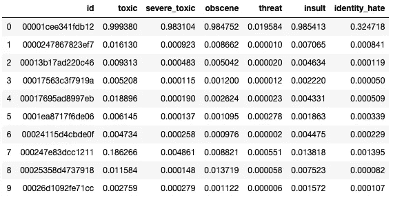

使用 LGBM 预测概率

## 长短期记忆网络(LSTM)

模型的测试精度为:

> 总体准确率:98.47%

评论在特定模型下的一些预测概率如下所示:

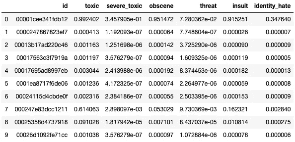

使用 LSTM 预测概率

# 贡献

每个团队成员的贡献如下:

*   nakul Gupta——探索性数据分析、特征工程、LGBM 模型
*   Sunil Kumar —预处理、逻辑回归模型、LSTM 模型

你可以看看谷歌驱动文件夹中的代码和所有文件，链接到[这里](https://drive.google.com/open?id=15S8qCXlKGgih4AUV2OsmYffjeNgGgsaO)。

# 参考

1.  卡格尔。"双向 LSTM 基线."[https://www . ka ggle . com/CVxTz/keras-bidirectional-lstm-baseline-l b-0-069](https://www.kaggle.com/CVxTz/keras-bidirectional-lstm-baseline-lb-0-069)
2.  卡格尔。"对多标签注释进行分类。"[https://www . ka ggle . com/rhodium beng/classing-multi-label-comments-0-9741-lb](https://www.kaggle.com/rhodiumbeng/classifying-multi-label-comments-0-9741-lb)
3.  卡格尔。“特征工程。”【https://www.kaggle.com/eikedehling/feature-engineering 
4.  卡格尔。"带单词和字符 n_gram 的 LGBM . "[https://www . ka ggle . com/ogrellier/lgbm-with-words-and-chars-n-gram](https://www.kaggle.com/ogrellier/lgbm-with-words-and-chars-n-gram)
5.  卡格尔。"逻辑回归 TFIDF。"[https://www.kaggle.com/sudhirnl7/logistic-regression-tfidf](https://www.kaggle.com/sudhirnl7/logistic-regression-tfidf)
6.  卡格尔。"双 LSTM + Conv 层."[https://www . ka ggle . com/fizz buzz/bi-lstm-conv-layer-l b-score-0-9840](https://www.kaggle.com/fizzbuzz/bi-lstm-conv-layer-lb-score-0-9840)