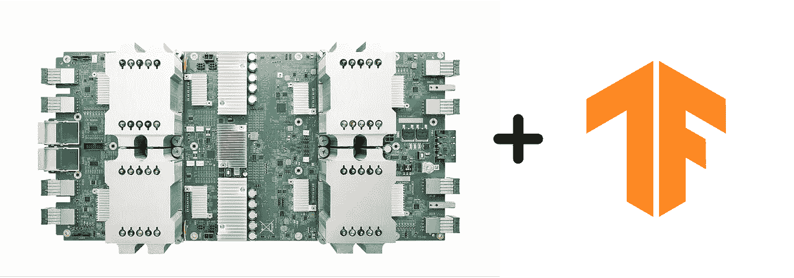
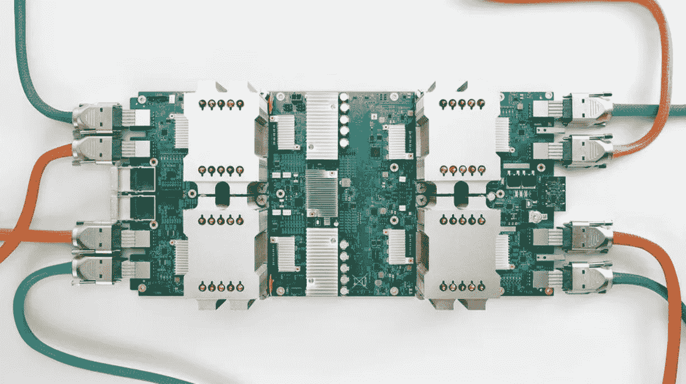
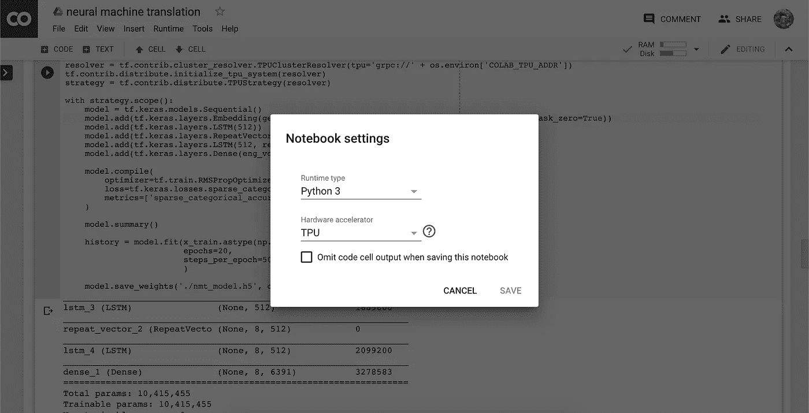
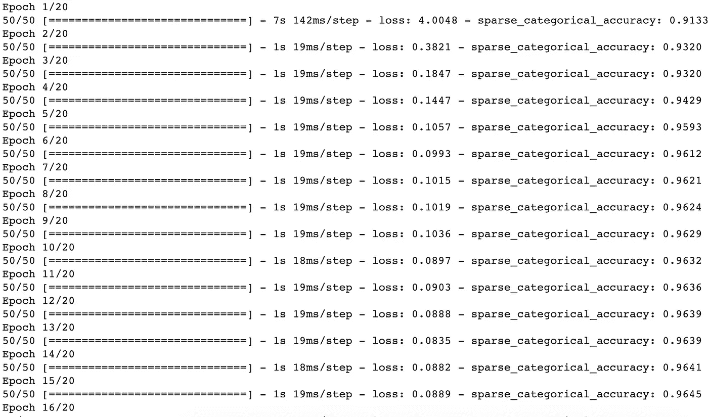
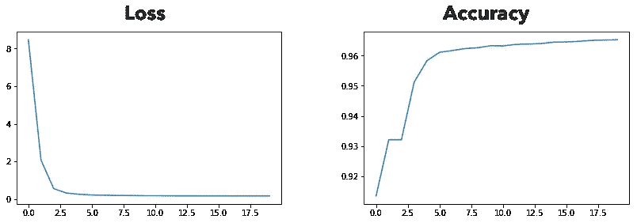

# 在 Google Colab 上通过 4 个简单的步骤在云 TPU 上训练您的模型

> 原文：<https://medium.com/analytics-vidhya/tpu-training-made-easy-with-colab-3b73b920878f?source=collection_archive---------0----------------------->

## 我在 TPU 上训练了一个神经机器翻译(NMT)模型，现在感觉自己像个向导…



你有一个普通的旧 TensorFlow 模型，计算量太大，无法在你的标准工作笔记本电脑上训练。我明白了。我也经历过，老实说，看到我的笔记本电脑在试图训练一个模型后连续两次崩溃是很痛苦的。

在本文中，我将分解如何使用 Google Colab 在云中的 TPU 上训练任何模型的步骤。在这之后，相信我，你再也不想碰你那笨重的 CPU 了。

***TL；博士:*** *这篇文章向你展示了在 TPU 上训练任何张量流模型是多么容易，只需对你的代码做很少的修改。*

## 什么是 TPU？

张量处理单元(TPU)是一个加速器——由谷歌大脑硬件工程师定制——专门训练深度和计算昂贵的 ML 模型。



这就是 TPU 的样子。它有 4 个巨大的散热器，位于一个电路板的顶部，上面有一些非常先进和强大的电路。

让我们来透视一下，让你知道 TPU 有多棒多强大。标准 MacBook Pro 英特尔 CPU 每个时钟周期可以执行一些操作。一个标准的现成 GPU 每个周期可以执行数万次运算。最先进的 TPU 每周期可以执行数十万次运算(有时高达 128K OPS)。

为了理解规模，想象一下用这些设备打印一本书。CPU 可以逐字符打印。一个 GPU 一次可以打印几个字。TPU 吗？嗯，它可以一次打印一整页。这是我们现在拥有的惊人的速度和力量；向谷歌大声疾呼，让每个人都能获得高性能的硬件。

如果你对 TPU 的内部运作以及是什么让它如此神奇感兴趣，去看看谷歌云博客的文章，在那里他们讨论了从硬件到软件的一切 [*这里*](https://cloud.google.com/blog/products/gcp/an-in-depth-look-at-googles-first-tensor-processing-unit-tpu) *。您可以找到关于机制、硬件规格、优点、限制、约束等更多信息，以帮助您完成项目！*

## 预处理 MNIST

为了这个教程，我将运行一个快速简单的 MNIST 模型。请注意，这个模型可以是您想要的任何形式。为了更好地帮助您可视化正在发生的事情，我选择了“老 MNIST”(再次，您选择的数据集)。

让我们首先从提取和预处理数据集开始。这应该不是什么大问题:

```
import tensorflow as tf
from tensorflow.keras.datasets import mnist
from tensorflow.keras.utils import to_categorical# This can be any dataset
(x_train, y_train), (x_test, y_test) = mnist.load_data()
x_train = x_train.reshape([x_train.shape[0], 784])
x_test = x_test.reshape([x_test.shape[0], 784])
x_train = x_train / 255
x_test = x_test / 255y_train = to_categorical(y_train, 10)
y_test = to_categorical(y_test, 10)print (x_train.shape, y_train.shape)
print (x_test.shape, y_test.shape)# >> (60000, 784), (60000, 10)
# >> (10000, 784), (10000, 10)
```

我已经尽力让这个教程尽可能的全面，这样你就可以以深不可测的速度训练你的模型，感觉自己站在世界之巅。我们将采取 4 个步骤在 TPU 上训练我们的模型:

1.  连接到可用的 TPU 实例
2.  初始化分布式训练策略
3.  在上述策略下构建我们的模型
4.  训练模型，感觉自己像个*巫师*

让我们开始吧！

***注意:*** *使用* `tf.data` *随意预处理您的数据集，或者如果您喜欢的话，将它们转换成*`TFRecords`*。*这些步骤不是必需的，但是在处理超大型数据集的情况下，这些步骤可能对处理内存不足的实例很有用。**

## *连接到 TPU*

*当我在 Colab 上摆弄 TPUs 时，连接一个是最乏味的。花了几个小时在网上搜索和浏览教程，但我最终还是完成了。*

*我们首先需要将本地运行的 Colab 笔记本连接到 TPU 运行时。要更改运行时间，只需点击导航栏中的`Runtime`选项卡。将显示一个下拉菜单，您可以从中选择`Change runtime type`选项。将弹出一个窗口，您可以从下拉选择器中选择`TPU`选项。*

**

*弹出窗口看起来像这样。将运行时从 CPU 切换到 TPU。*

*为了连接到 TPU 实例，我们需要创建一个`TPUClusterResolver`，它接收可用的设备并为我们提供一个:*

*这应该将我们当前的 Colab 会话连接到一个可用的 TPU 实例。让我们继续初始化策略，最后调用 TPU。*

****注意:*** *如果您在多次尝试并重新运行后仍无法连接到 TPU 实例，您可以将运行时类型改为* `GPU` *。代码仍然可以有效地编译和运行。**

## *初始化分布式训练策略*

*现在，我们已经更改了运行时，并获得了可用 TPU 的列表，我们需要通过创建分布式训练策略来调用 TPU，这是一个围绕模型的包装器，使其与多核训练兼容。*

*`resolver`让我们可以访问 TPU，这样我们最终可以在其上构建一个并行分布的管道。这是一个必要的步骤，因为 TPU 是一个分布式训练处理器，不像传统的 CPU 那样是单核的。用这种策略方法，跳上 TPU 非常简单！它应该会给您一个可用实例的列表:*

**

*我们有 8 台设备可供使用*

## *在分布式培训策略下构建我们的模型*

*现在有了培训策略，我们可以继续使用该策略构建我们的模型，如下所示:*

*这看起来像很多行话，但它所做的只是采用一个常规的`tf.keras`模型(通常在 CPU 上运行),将其放在 TPU 上，并自动将其分布到所有可用的 TPU 内核上。*

## *训练我们的模型*

*这是这个过程中令人兴奋的部分。我们终于可以在云 TPU 上免费训练模型了。我们手中有这么多权力，让我们好好利用它，在 MNIST 上训练(我知道…非常反气候)。*

*确保实例的数量能被`steps_per_epoch`参数整除，以便在
训练期间使用所有的实例。例如，我们的训练集中有 60000 个实例。60000
可以被 50 整除，这意味着我们所有的实例都被输入到模型中，没有任何*剩余*。如果您点击 run，它应该会在一段时间后在 TPU 实例上开始训练:*

**

*这是我在 Colab 上建立的神经机器翻译模型的 TPU 训练周期。*

## *最后一次围捕*

*这样，训练应该很快就会开始。Colab 将启动一个 TPU，并在上面上传模型架构。您很快就会在终端输出中看到经典的 Keras 进度条样式布局。恭喜你。你刚刚成功地使用了 TPU。*

*回想起来，我一直认为在 TPU 上训练模型是只有 ML 奇才——那些有多年经验和技能的人——才能处理的事情。TPU 训练一直是我无法掌握的一件大事，仅仅是因为它的大肆宣传(使它看起来很难使用)。在我最疯狂的梦想中，我从来没有想到它会像在我已有的模型中添加不到 10 行代码那样简单。*

*看完这篇文章，我想让你知道，任何人都可以在加速硬件上训练，不管经验如何。这只是谷歌人工智能在大众中普及机器学习和人工智能的许多步骤之一。*

## *关于 TPU 培训的一些观察*

*我为 TensorFlow 文档编写的神经机器翻译模型花了我不到一分钟的时间在 TPU 上进行训练。我很惊讶，因为同一个模型花了 4 个多小时在一个 CPU 上训练(这可能解释了为什么我的笔记本电脑崩溃并两次耗尽内存)。*

**

*我的 NMT 模特在 TPU 上训练得非常好！指标显示训练很顺利，我一路上没有遇到任何障碍。*

*我的模型达到了非常高的精确度——比我在 CPU 上训练时达到的精确度还要高。说到质量培训，云 TPU 的性能和速度是首屈一指的！*

****注:*** *你可以在这里找到我的代号*[](https://colab.research.google.com/drive/1o0nSHlhW2i6mrbeU-lUajw8fpSo1dbMr)**。玩得开心！***

## **简单地**

**当谷歌推出新的机器学习玩具时，它总是带着礼物来，我们可以修补和玩耍。TPU 处理器无疑是 ML 社区的福音，因为它在人工智能的民主化中发挥了重要作用——它让每个人都有机会使用加速硬件，无论其人口结构如何。有了 TPUs，研究和实验达到了前所未有的高度，人们现在以前所未有的方式参与机器学习！**

**我希望这篇文章能够帮助您以更加高效和优雅的方式训练您的模型。如果你对 TPU 的使用有任何疑问，或者想就技术和 ML 进行一般性的交谈，请随时在评论中提出，或者在 [Twitter](https://twitter.com/rishabh16_) 或 [LinkedIn](https://www.linkedin.com/in/rishabhanand16/) 上联系我。我一般一天内回复。**

**在那之前，我会在下一个里抓住你！**

**里沙卜·阿南德的文章**

## **某种程度上的行动号召**

**有兴趣阅读最新和最伟大的技术，并接触机器学习、数据科学和技术领域的最新进展吗？一定要抓住我的其他文章或给我一个关注！您的反馈和持续的支持意义重大，并鼓励我继续为您的学习撰写高质量的内容！**

**[](https://towardsdatascience.com/quantum-computing-with-colorful-diagrams-8f7861cfb6da) [## 量子计算速成班使用非常丰富多彩的图表

### 几乎所有你需要知道的关于量子计算的东西都用非常直观的图画来解释…

towardsdatascience.com](https://towardsdatascience.com/quantum-computing-with-colorful-diagrams-8f7861cfb6da) [](/sigmoid/https-medium-com-rishabh-anand-on-the-origin-of-genetic-algorithms-fc927d2e11e0) [## 遗传算法综合指南(以及如何编码)

### 遗传算法的起源

medium.com](/sigmoid/https-medium-com-rishabh-anand-on-the-origin-of-genetic-algorithms-fc927d2e11e0) [](https://hackernoon.com/catgan-cat-face-generation-using-gans-f44663586d6b?source=---------8------------------) [## CatGAN:使用 GANs 生成猫脸— By

### 我们可以看到在第 100 和第 200 个纪元时猫脸的模糊轮廓，这表明发电机已经接近…

hackernoon.com](https://hackernoon.com/catgan-cat-face-generation-using-gans-f44663586d6b?source=---------8------------------) [](https://towardsdatascience.com/making-a-replier-and-follow-bot-for-twitter-using-node-js-23e0ba8e4e4f) [## 使用 Node.js 制作回复器并关注 Twitter 的 Bot

### 如何“明智地”花时间做这个了不起的东西。

towardsdatascience.com](https://towardsdatascience.com/making-a-replier-and-follow-bot-for-twitter-using-node-js-23e0ba8e4e4f) [](https://hackernoon.com/introducing-tensorflow-js-3f31d70f5904?source=---------9------------------) [## TensorFlow.js 简介🎉—由

### TensorFlow.js 潜力很大。而不是将 javascript 文件链接到运行在云上的 python 文件…

hackernoon.com](https://hackernoon.com/introducing-tensorflow-js-3f31d70f5904?source=---------9------------------) [](https://towardsdatascience.com/tensorflow-or-tensorno-c9c6c6c2f992) [## TensorFlow 还是 TensorNo？

### TensorFlow 机器学习初学者指南。

towardsdatascience.com](https://towardsdatascience.com/tensorflow-or-tensorno-c9c6c6c2f992)**