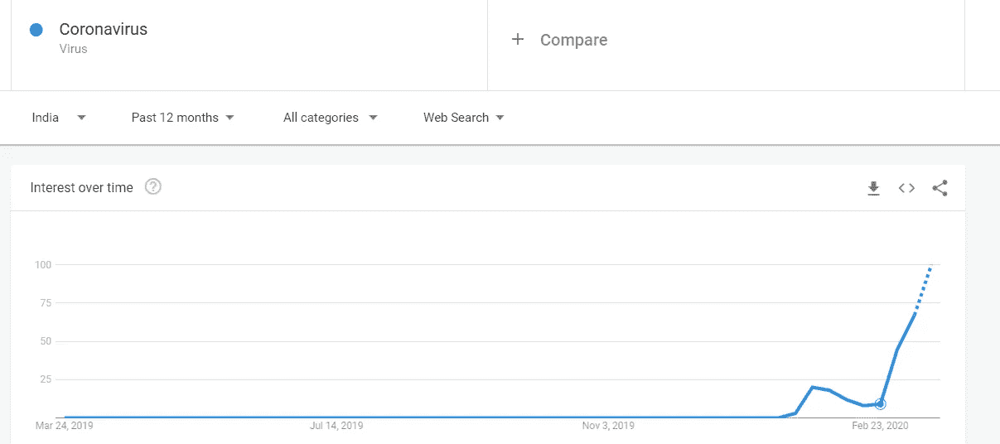
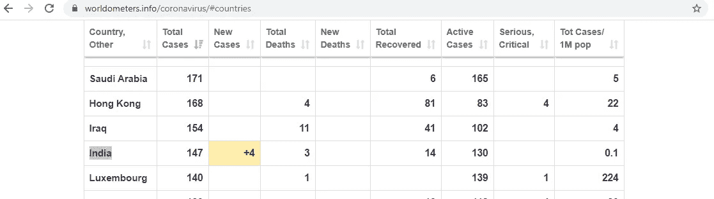
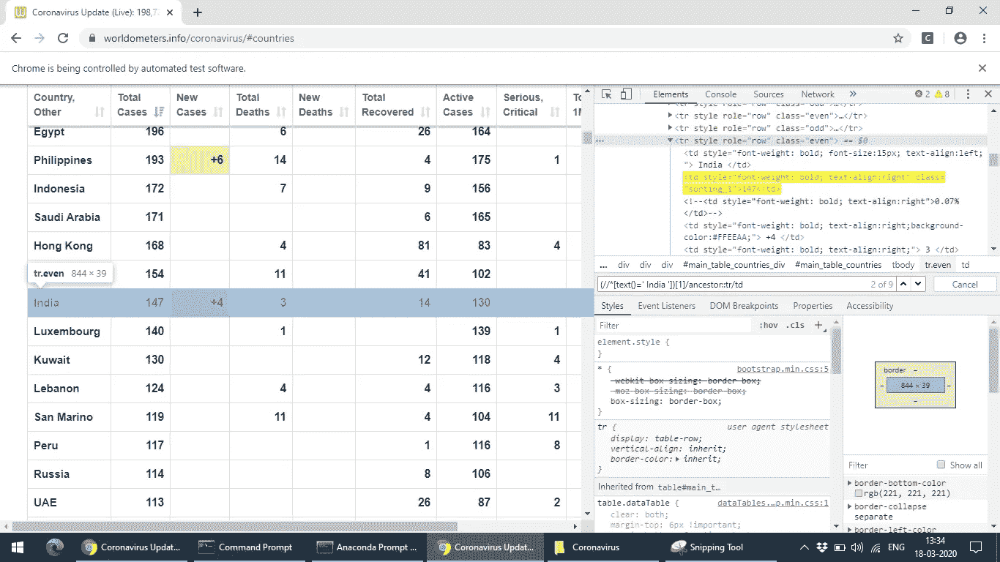
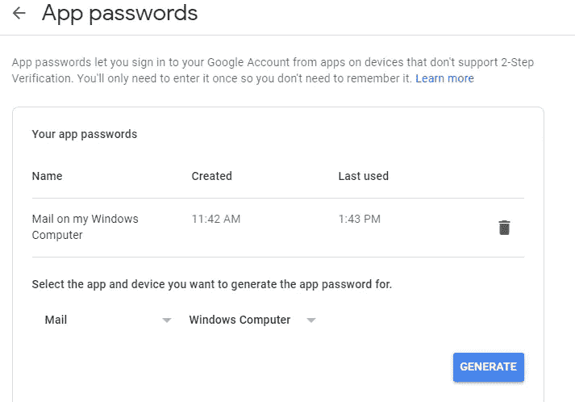
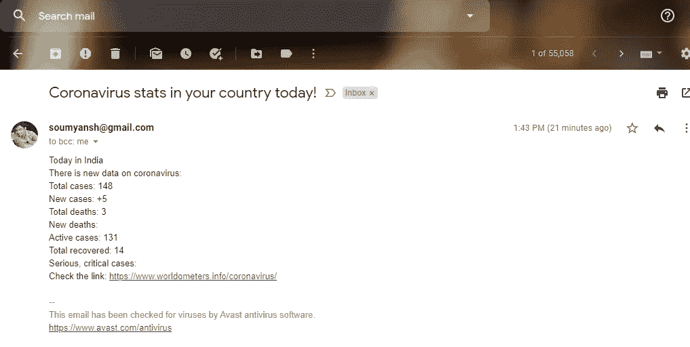

# 使用 Python 自动发送电子邮件，跟踪您所在国家的冠状病毒。

> 原文：<https://medium.com/analytics-vidhya/track-corona-virus-in-your-country-with-an-automated-email-using-python-1793e1abe0db?source=collection_archive---------11----------------------->


**冠状病毒(CoV)** 是一个大的病毒家族，可引起从普通感冒到更严重疾病的疾病，如中东呼吸综合征(MERS-CoV)和严重急性呼吸综合征(SARS-CoV)。

由新型冠状病毒引起的新冠肺炎病的潜伏期为 2 至 14 天。



在 *这篇文章中，我们将追踪某个特定国家的* ***冠状病毒*** *，还将使用 Python 接收我们收件箱中的所有详细数字。*

让我们一步一步地深入这个有趣的教程。

**第一步。在 Python 中安装 Selenium**

Selenium 是一个开源的基于网络的自动化工具。**它**可以向不同的浏览器发送标准的 **Python** 命令，尽管它们的浏览器设计有所不同，我们将使用它从下面的网站获取数据。

[](https://www.worldometers.info/coronavirus) [## 冠状病毒病例:

### 实时统计和冠状病毒新闻，跟踪确诊病例、康复患者和死亡人数，按…

www.worldometers.info](https://www.worldometers.info/coronavirus) 

要安装 Selenium，请在安装标准 python 后，在命令提示符下键入以下内容。

```
pip install Selenium
```

**步骤二。为 Chrome 下载 Chrome 驱动程序**

除了上述步骤，请下载 Chromedriver.exe，这将是打开 Chrome 浏览器所必需的。

请根据您自己的 Chrome 浏览器版本从以下位置下载相同的版本，同时注意 32 位版本支持 32 位和 64 位机器。

 [## 下载—Chrome driver—Chrome 的网络驱动程序

### Chrome 的网络驱动

Chromechromedriver.chromium.org 的 web 驱动程序](https://chromedriver.chromium.org/downloads) 

完成后，请打开你的 Jupyter 笔记本，将你的 chromedriver.exe 文件放在运行 Jupyter 笔记本的同一个目录下。

我们可以在任何 Jupyter 单元格中使用下面的命令来标识我们当前的工作目录。最终的目录结构应该与给定图像中所示的相同，我们可以忽略 checkpoints 文件夹。

```
## Returns current working directory
pwd()
```


**第三步。使用 Selenium 打开 Chrome 浏览器。**

```
from selenium import webdriverdriver = webdriver.Chrome(executable_path=”chromedriver.exe”)
driver.maximize_window()## for waiting the WebElements to load till 30 seconds
driver.implicitly_wait(30)driver.get(“[https://www.worldometers.info/coronavirus/#countries](https://www.worldometers.info/coronavirus/#countries)")
```



上述步骤应该会打开 Chrome 浏览器，并导航到上述网页。

**第四步。在网上搜索与您所在国家相对应的数据**

我们将在这里获取国家"*"的数据，您可以修改自己国家的代码。*

```
*country_data=driver.find_elements_by_xpath(“(//*[text()=’ India ‘])[1]/ancestor::tr/td”)*
```

*在这里，我使用 XPath 查找与国家标签为**印度**的行相对应的所有数据，如果您是 XPath 新手，下面的教程将会很有帮助。*

*[](https://www.w3schools.com/xml/xpath_intro.asp) [## XPath 教程

### XPath 是 XSLT 标准中的一个主要元素。XPath 可以用来浏览 XML 中的元素和属性…

www.w3schools.com](https://www.w3schools.com/xml/xpath_intro.asp) 

您可以在下图中验证我们的 Xpath 是如何从给定的表中突出显示国家"**印度**"的所有行数据的。
**我们将行“India”的所有对应元素存储到一个变量 country_data** 中，这是 Python 中的 list 类型。



**第五步。解析 country_data 列表并为电子邮件功能生成新的应用程序密码。**

这里 country_data 列表包含对应于每一列的值，因此我们将每个值的信息分离如下。

```
country_name=country_data[0].text
total_cases=country_data[1].text
new_cases=country_data[2].text
total_deaths=country_data[3].text
new_deaths=country_data[4].text
total_recovered=country_data[5].text
active_cases=country_data[6].text
serious_critical=country_data[7].text
Tot_cases_1M_pop=country_data[8].text
```

现在，让我们使用以下步骤生成应用程序密码，以便使用 Python 的 SMTP 库发送电子邮件。

**生成 Gmail 应用程序密码的步骤**

*   进入你的谷歌账户。
*   在左侧导航面板中，选择安全性。
*   在“登录到 **Google** 面板上，选择**应用密码**。…
*   在底部，选择选择**应用**并选择您正在使用的**应用**。
*   选取“选择设备”,然后选取您正在使用的设备。
*   选择生成并保存密码。



**第六步。使用谷歌的 SMTP 服务器实现电子邮件功能**

最后，是时候使用步骤 5 中的所有参数构造我们的电子邮件函数，并在换行格式化后在电子邮件正文中使用它们。

```
def send_mail(country_name,total_cases,new_cases,total_death,new_deaths,total_recovered,active_cases,serious_critical,Tot_cases_1M_pop):
 server=smtplib.SMTP(‘smtp.gmail.com’,587)
 server.ehlo()
 server.starttls()
 server.ehlo()
 server.login(‘[U](mailto:soumyansh@gmail.com)ser's Email address’,’Generated Password’)
 subject = ‘Coronavirus stats in your country today!’
 body = ‘Today in ‘ + country_name + ‘\
 \nThere is new data on coronavirus:\
 \nTotal cases: ‘ + total_cases +’\
 \nNew cases: ‘ + new_cases + ‘\
 \nTotal deaths: ‘ + total_deaths + ‘\
 \nNew deaths: ‘ + new_deaths + ‘\
 \nActive cases: ‘ + active_cases + ‘\
 \nTotal recovered: ‘ + total_recovered + ‘\
 \nSerious, critical cases: ‘ + serious_critical + ‘\
 \nCheck the link: [https://www.worldometers.info/coronavirus/’](https://www.worldometers.info/coronavirus/')
 msg = f”Subject: {subject}\n\n{body}"
 server.sendmail(
 ‘Coronavirus’,
 ‘[U](mailto:soumyansh@gmail.com)ser's Email address’,
 msg
 )
 print(‘Hey Email has been sent!’)
 server.quit()
```

在上面的函数中，我们使用所有预定义的统计数据，在**生成的应用程序密码的帮助下，向我们指定的收件箱地址发送电子邮件。**

**步骤 7。调用该函数并验证收件箱中的邮件**

```
send_mail(country_name,total_cases,new_cases,total_death,new_deaths,total_recovered,
 active_cases,serious_critical,Tot_cases_1M_pop)
```

**祝贺**在您的收件箱中收到合并邮件。

您甚至可以通过创建一个 windows 批处理文件并将其作为一项服务，或者使用 Windows 任务计划程序运行它，来计划每天运行该脚本，而无需任何手动干预。

*

****感谢您读到这里。在这篇文章中，我们学习了如何使用 Selenium 和 Python 在网络上搜索冠状病毒的详细信息，以及如何向收件人发送电子邮件。****

*我希望这个教程对你有用。我很好奇你是怎么想的，所以给我一些建议吧。你也可以直接通过[邮箱](mailto:soumyansh@gmail.com)与我取得联系，或者在 [LinkedIn](https://www.linkedin.com/in/soumyansh/) 上与我联系。*