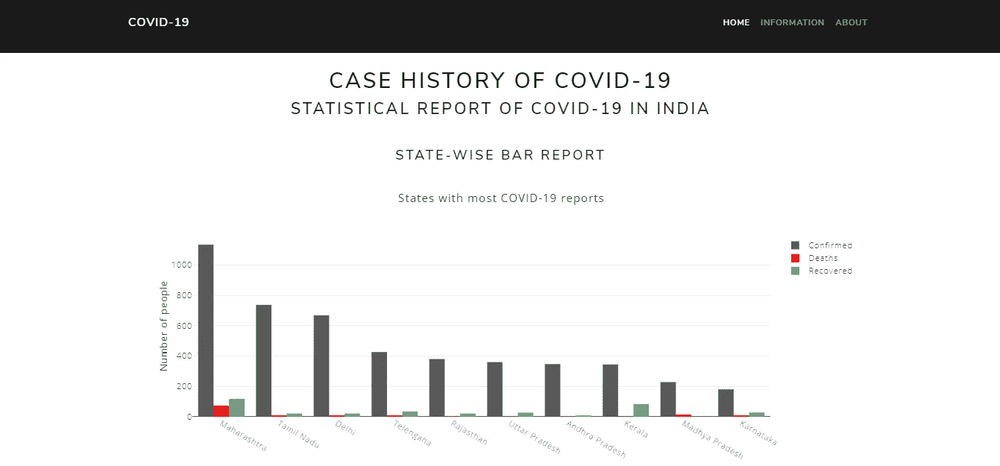

# 使用 Python 制作印度新冠肺炎的统计报告

> 原文：<https://medium.com/analytics-vidhya/tracking-corona-virus-in-india-using-python-7f29e6b0b7e4?source=collection_archive---------21----------------------->

冠状病毒病(新冠肺炎)是一种由新发现的冠状病毒引起的传染病。

大多数感染新冠肺炎病毒的人将经历轻度至中度的呼吸道疾病，无需特殊治疗即可康复。老年人以及那些患有心血管疾病、糖尿病、慢性呼吸系统疾病和癌症等潜在疾病的人更有可能患上严重疾病。



最终 web 应用程序的快照。

在本帖中，我们将追踪印度的 ***冠状病毒*** *，还将制作一个如上图所示的网络应用。web app 的演示可以看* [*这里*](https://covid-19-in-india.herokuapp.com/) *。*

**免责声明:此应用程序将开发用于教育目的，不应用作接收与新型冠状病毒相关的信息的官方途径。**

# 第一步。装置

我们将使用美丽的汤 4 从官方数据中收集数据。因此，让我们使用“pip”来安装它。

```
pip install bs4
```

我们将使用 Pandas 来分析收集到的数据。

```
pip install pandas
```

我们将使用 Dash 来制作一个仪表板 web 应用程序。

```
pip install dash
```

# 第二步。抓取数据

我们需要一个来源来收集数据。我们将使用从[这里](https://www.mohfw.gov.in/)(卫生和家庭福利部)检索的印度官方数据。

创建一个新的 python 文件，将其另存为 scrape.py。

首先，让我们导入所有需要的库。

```
import requests
import re
import os.path
from os import path
import bs4
from bs4 import BeautifulSoup
from datetime import datetime
```

现在让我们定义一个方法，如果状态码是 200(HTTP OK)，它就从 URL 获取内容。

```
def getContents():
    url = "[*insert url here*](https://www.mohfw.gov.in/)"
    r = requests.get(url)
    txt = ""

    if r.status_code == 200:
        txt = r.text
        return txt
```

现在让我们定义一个方法来抓取我们实际寻找的内容，即来自 URL 的状态数据，并将其解析到一个列表中。

```
def scrape_now():
    *#list declarations*
    total_list = []
    state_list = []
    confirmed_list = []
    recovered_list = []
    death_list = [] *#parse starts* txt = getContents()
    soup = BeautifulSoup(txt, 'html.parser') *#get total stats first* total = soup.find("div", {"class": "site-stats-count"})
    for length in total.find_all("strong"):
        total_list.append(length.getText()) *#get states data* states_data  = soup.find("section", {"id": "state-data"})
    tables = states_data.find_all('tbody')
    for row in tables[0].findAll("tr"):
        col = row.findAll("td")
        if((col[0].getText()).isnumeric()):
            state_list.append(col[1].getText())
            confirmed_list.append(int(col[2].getText()))
            recovered_list.append(int(col[3].getText()))
            death_list.append(int(col[4].getText())) return total_list, state_list, confirmed_list, recovered_list, death_list
```

上面的方法从[这里的](https://www.mohfw.gov.in/)抓取数据，并将结果解析为五个列表，即。、 *total_list* 、 *state_list* 、 *confirmed_list* 、 *recovered_list* 、 *death_list* ，分别提供受影响总人数、州名列表、某州确诊电晕病例数列表、某州治愈人数列表、某州电晕死亡人数。这些数据可以用于以后的分析。

# 第三步。处理数据

我们需要处理收集到的数据，以便以一种有益的方式使用这些数据。

创建一个新的 python 文件，将其另存为 resources.py

首先，让我们导入所需的库和模块。

```
import scrape
import pandas as pd
```

***注意*** *:不要忘记将 scrape.py 导入到新脚本中。*

我们知道，我们收集的数据是按字母顺序列出的，从受影响程度最高的状态到最低的状态查看数据更可取。因此，让我们把列表压缩到一个数据帧中，改变它的顺序，然后再把它放回到原来的列表中。在本例中，我们将只选择前 10 个受影响的州(否则，图表会变得拥挤)。这可以使用以下代码来完成:

```
total_list, state_list, confirmed_list, recovered_list, death_list = scrape.scrape_now()*#state_stats has the data of each state in a single dataframe* state_stats=pd.DataFrame(
     list(zip(state_list,confirmed_list,death_list,recovered_list)),
     columns=['State','Confirmed','Deaths','Recovered']
)*#states with highest confirmed cases are ordered first(resets index after sorting)* state_stats = state_stats.sort_values(
    by='Confirmed', ascending=False
).reset_index(drop=True)*#top 10 is choosed* top_state_stats = state_stats.head(10)*#convert the processed dataframe to list to be fed into the graph* state_list = top_state_stats['State'].values.tolist()
confirmed_list = top_state_stats['Confirmed'].values.tolist()
death_list = top_state_stats['Deaths'].values.tolist()
recovered_list = top_state_stats['Recovered'].values.tolist()
```

# 第四步。显示数据

现在我们已经处理了数据，但是我们需要以图表的形式显示它，并使 dashboard 应用程序具有视觉吸引力。

创建一个新的 python 文件，将其另存为 app.py

首先，让我们导入所需的模块和库

```
import resources
import dash
import dash_bootstrap_components as dbc
import dash_core_components as dcc
import dash_html_components as html
import dash_table
from dash.dependencies import Input, Output
```

***注*** *:不要忘记将 resources.py 导入到新脚本中。*

让我们设置一些用户界面参数，如背景颜色，字体大小等。，(这完全取决于您的创造力，我建议您在获得正确的参数之前一直使用它)。

```
colors = {'background':'#FFFFFF'}
```

现在让我们初始化应用程序。添加 *meta_tags* 让 web app 移动响应。我使用 dash 的引导组件来使它看起来更好，如果你对它感到舒适，你也可以写你自己的 CSS。

```
app = dash.Dash(
    external_stylesheets=[dbc.themes.BOOTSTRAP],
    meta_tags=[
    {"name": "viewport", "content": "width=device-width, initial-scale=1"}]
)
```

现在我们来做 app 的基本布局。

```
app.layout = html.Div(
    [
        dcc.Location(id="url"),
        dbc.NavbarSimple(
            children=[
                dbc.NavLink("Home", href="/page-1", id="page-1-link")
            ], brand="COVID-19",
            color="primary",
            dark=True
        ), dbc.Container(id="page-content", className="pt-4"),
        dbc.NavbarSimple(style={'color':'white'},children=[
            dcc.Markdown('''
                Built using Dash and Python
                Data from Ministry of Health and Family Welfare
            ''')
            ],
            brand="COVID-19",
            color="primary",
            dark=True
        )
    ]
)
```

上面只是构建了基本的布局，然而页面中什么也没有。所以*页*是一串布局中应该有的内容。

```
*#Page starts*
page = html.Div(className="container",
    style={
       'textAlign':'center',
       'backgroundColor':colors['background']
    },
    children=[
        html.H1("Case History of COVID-19"),
        html.Div(className="main",children=[
        html.Div(className="graphhead",children=[
            html.H3("Statistical Report of COVID-19 in India"),
    ]), html.P(html.Br()), dcc.Markdown('''
        #### **State-wise Bar Report**
    '''),
```

图表应该被绘制出来。这可以使用 python dash 中默认的 plotly 图形来完成。

```
 html.Div(className="graph",children=[
        dcc.Graph(
            id='bar-graph',
            figure={
                'data':[
                    {
                        'x':state_list,
                        'y':confirmed_list,'type':'bar',
                        'name':'Confirmed'
                    },
                    {
                        'x':state_list,
                        'y':death_list,
                        'type':'bar',
                        'name':'Deaths'
                    },
                    {
                        'x':state_list,
                        'y':recovered_list,
                        'type':'bar',
                        'name':'Recovered'
                    }
                ],                
            },
            config={'displayModeBar':False},
        ),
        html.P(html.Br()),
        html.P("The above graph shows the states with the highest confirmed COVID-19 cases. Interact with the legend to get better information."),
    ]),
    html.P(html.Br()),
```

我们还需要查看表格以获得每个州的准确数字。让我们来展示这张表。

```
 dcc.Markdown('''
            #### **State-wise Table Report**
        '''), html.Div(
            className="tablehead",
            style={'font-family':"SegoeUI"},
            children=[
                html.P("The below table gives us statewise reports"),
            dash_table.DataTable(
                id='table',
                columns=[{"name": i, "id": i} for i in
state_stats.columns],
                data=state_stats.to_dict('records'),
            ),
            html.P(html.Br()),
        ]),
    ]),
])*#Page ends*
```

现在让我们运行服务器。

```
if __name__ == "__main__":
    app.run_server(debug=True)
```

# 第五步。执行

使用以下命令执行 python 脚本 app.py:

```
python app.py
```

如果您一步一步地按照教程操作，应该不会出现错误，python 脚本将被执行，应用程序将在[*http://127 . 0 . 0 . 1:8050/*](http://127.0.0.1:8050/)上运行

# **脚注**

谢谢你读到这里。在这篇文章中，我们学会了使用 Beautiful Soup 4 从网络上搜集冠状病毒的详细信息，使用 Pandas 处理它们，并使用 Dash 和 Plotly 图形将它们显示为仪表板应用程序。

希望这篇教程对你有用。我很好奇你是怎么想的，所以给我一些建议吧。如果你有任何问题，请在 LinkedIn[上联系我或者写在下面的评论里。](https://www.linkedin.com/in/rahul-hegde-0955391a5/)