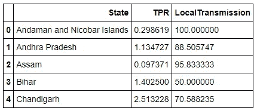
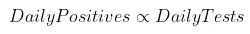

# 追踪新冠肺炎在印度的传播 Python 中的时序数据建模和聚类

> 原文：<https://medium.com/analytics-vidhya/tracking-covid-19-spread-in-india-time-series-data-modeling-and-clustering-in-python-f3ca70eb4f2?source=collection_archive---------20----------------------->

探索和构建时序数据模型的实践演练

在本帖中，我们试图解决追踪全印度上升的新冠肺炎病例的问题。

乍一看，这个问题似乎可以通过按顺序组织的一系列数据点(案例数)来最好地表示(也称为时间序列数据)。但仔细观察，人们可能会发现有如此多的不同因素导致了印度病例数量的上升。

各州案件总数([https://www.covid19india.org/](https://www.covid19india.org/)

***在本帖中，我们将着眼于可以提取的不同特征(可用的和衍生的),并使用 XGBoost 构建/验证集成模型，以预测任何给定州每日报告的病例数。***

# **数据来源**

Covid19India.Org 是一个开源项目，它整理和维护谷歌表单上与新冠肺炎相关的数据。他们有以 CSV/JSON 格式提供数据的 HTTP-API。本分析中使用的数据简述如下:

1.  原始数据—这是实时数据，每隔几分钟就会更新一次，其中包含检测呈阳性的患者的信息
2.  全国总检测数据——该数据来自 ICMR 网站，该网站每天更新每天进行的检测数量
3.  州级测试数据—这些数据来自不同的州政府和第三方资源。包含该州正在进行的测试总数

虽然，这些数据也有缺失值(我们将在后面的文章中处理)，但我确信整理和维护这些数据需要付出巨大的努力。感谢 Covid19India.Org 团队。请通过[电报](https://t.me/covid19indiaops)了解更多信息。

# 数据准备

让我们加载所需的库和包:

## 1.国家一级的数据

该数据集包含以下重要信息:

1.  **日期** —报告数字的日期
2.  **检出阳性病例总数(累计)**
3.  **每日检测出的阳性病例数**
4.  **进行的 COVID 检测试验总数(累计)**
5.  **每天进行的 COVID 检测测试次数**

我们使用 Pandas 读取文件，并将日期列解析为日期格式(这在接下来的部分中很重要)

现在，我们将通过执行滞后 1 差分，然后使用“回填”插值填充第一个值，将累积计数转换为每日计数。此外，为了获取最近的数据，我们将定义一个较低的截止日期，该日期将指定需要考虑数据的日期。

**2。状态级别数据**

让我们使用这个 [csv](https://api.covid19india.org/csv/latest/raw_data3.csv) 获取**各州病例数**的数据源。这是一个病人级别的数据集，我们将把它带到州日期级别。

现在，让我们从单独的 [csv](https://api.covid19india.org/csv/latest/statewise_tested_numbers_data.csv) 中加载**状态级测试数据**。然后，我们将它与州级案例数合并，以获得以下每日州级统计数据框架:

然而，查看各州的测试数据，这些数据并不是非常完整和详尽的。例如，让我们看看德里的数据:

我们可以通过简单地以线性方式内插这些值来填充**累积投资状态总测试**中的这些缺失值。然而，这可能不是最准确的方式来填补这一点。相反，我们将对**累积国家测试**进行加权，因为我们有每个日期的数据。下面的流程图说明了我们如何做到这一点:

1.  获取上面数据框架中每个日期的国家总测试数
2.  计算各州考试人数对全国考试人数的贡献
3.  使用线性插值法填充 StateTestingContribution 值
4.  现在，通过将状态的估计贡献(通过在步骤 3 中插值获得)乘以当天进行的总绝对测试，来填充每日测试数中的缺失值
5.  通过累计值的差值计算在一个州进行的日常测试

通过这种方式，我们得到了该州一天内进行的测试数量的近似估计值。

下面是我们在 Python 中的做法:

现在，我们有完整的数据集如下:

# **探索性数据分析**

让我们来看看我们在上一节中清理的一些变量:

1.  看起来是一个持续上升的趋势，围绕着它有波动。

**2。全国范围内进行的考试数量也在增加，尽管速度不同**

各州的趋势也是相似的，尽管我们想了解各州之间感染传播的差异。

作为探索性练习，我们来看两个指标，它们有助于我们了解一个州内的感染传播情况:

1.  州内本地传播的百分比——我们对少数患者进行了分类(可作为样本)
2.  **检测阳性率—** 检测呈阳性的样本百分比

我们将提取本地传输速率和 TPR，然后查看状态的分布，以区分高风险 v/s 低风险状态。

让我们首先提取本地传输速率:

现在，我们将把阳性病例总数加上在该州进行的检测总数的百分比，以表示检测阳性率

现在让我们看一个散点图，以了解这两个参数的状态分布:

我们可以看到，这些状态分散在各处，似乎成簇分布。因此，自然地，我们应用 K-Means 聚类算法来识别具有高本地传输和 TPR(spread)的状态。

现在，我们可以看看下面矩阵中的 4 个集群，以了解高影响和低影响状态:

聚类结果以存储状态

这有助于我们了解全国的情况，不仅可以看到感染人数，还可以看到传播方式和检测阳性率(TPR)。

# **特色工程**

由于我们希望在州级别构建模型，因此让我们看看目前为止每个州的功能:

1.  **CumulativeStatewiseTotalTests—**这给出了在该状态下进行的测试的累计次数，直到数据帧中的相应日期
2.  **TestPositivityRate —** 检测出阳性病例的检测比例
3.  **每日阳性数—** 数据框中相应日期确认的新阳性病例数

现在，我们知道进行测试的次数是一个非常重要的指标，它影响着一天内确定的阳性病例总数

由于戈德史密斯可能已经泄露了消息，每日的正面消息也将取决于前几天的情况。

现在让我们为这些变量取多个滞后值，然后我们可以在稍后列出有用的值:

# **模型构建**

在本文中，我们将在集合模型中使用[回归树](https://towardsdatascience.com/tree-based-methods-regression-trees-4ee5d8db9fe9)查看建模时间序列数据。

回归树类似于决策树，是最容易解释的模型之一，但是这是以准确性为代价的。这是通过使用[技术](https://towardsdatascience.com/ensemble-methods-bagging-boosting-and-stacking-c9214a10a205)如 bagging 或 boosting 组合不同的回归树(弱学习者)来解决的。两种组装技术的简介:

1.  **Bagging**——我们采用多个弱学习者，并行地独立训练他们，然后按照某种确定性平均过程将他们组合起来
2.  **促进—** 这是一个连续的过程，其中一个弱学习者依赖于前一个弱学习者。在每一步中，新的学习者将给予先前被错误分类的数据点更多的权重，并且将尝试正确地分类这些数据点。升压可以以多种方式实现，例如自适应升压(AdaBoost)、梯度升压(GBM)等。

对于这个问题，我们将使用一个 GBM 的变体，在 Python 中称为 **XGBRegressor** 。这将有助于我们将 boosting 方法应用于连续变量。

现在，在我们将数据集分为训练数据集和测试数据集之前，让我们删除重复值并用 0 填充空值(如果有的话)。

## **基线精度**

让我们尝试创建一个基线精度，以了解要达到的最低基准，这是由一个相当简单的近似值确定的。如果这是一个二进制分类的问题，我们可以很容易地假设基线准确率为 50%(抛硬币)。在这种情况下，我们可以将前一天的值近似为找到的阳性病例数的第二天的值。让我们看看采用这种策略的准确性如何:

这给了我们一个基线精度，为 38.82%，这是使用该模型所无法超越的

## **训练模型**

让我们从创建一个将 ADS(分析数据集)分成训练和测试的函数开始。

现在，我们将创建一种方法来为每个州的 XGBRegressor 模型定型。为此，让我们创建一个名为 XGBOptimizer 的类，在其中我们将实现构建一个状态的模型所需的所有方法。

为了训练 XGBRegressor 模型，我们将使用 [HyperOpt](http://hyperopt.github.io/hyperopt/) 进行超参数调整。这个软件包帮助我们以最小化损失函数的方式设置超参数(在我们的例子中是 RMSE)。

让我们简要回顾一下本课程中的不同功能:

1.  optimize_hp:这是进行优化的主要函数。它从 HyerOpt 库中调用 fmin 函数，这将进行贝叶斯优化。它接受以下参数:

*   fn —损失函数，采用当前参数集并返回需要最小化的损失值。例如，训练模型并返回 RMSE 值的函数
*   空间-定义不同参数值的空间。我们可以定义这个空间，以确保它被约束在模型的预期参数值内。例如，我们返回所有参数的字典以及它们可以取的值的范围
*   algo —这由 HyperOpt 负责。这实际上指定了在选择下一组参数值时要使用的贝叶斯算法，HyperOpt 使用[树结构 Parzen 估计器模型](https://github.com/hyperopt/hyperopt/blob/master/hyperopt/tpe.py)，我们可以调用 tpe.suggest 为我们自动配置算法
*   试验——这是一个记录不同评估值的试验对象(来自 HyperOpt)。在优化之后，这个对象可以用来查看尝试的不同值
*   return _ arg min-False 值将返回使损失函数最小化的实际最优值，而 True 值将使函数返回最优值的索引

2.train _ reg:loss 函数，用给定的参数训练模型并返回损失

3.train_best_model:用优化后的最终参数训练模型

4.get_xgb_possible_params:返回所有可能的参数值的值空间

5.get_xgb_preds:打印最佳模型的测试和训练精度(MAPE)

唷！！现在，我们已经创建了这个框架，我们可以调用这些函数，并为各个状态训练模型。

一种状态的控制台输出示例

让我们看看所有这些模型的训练和测试准确度:

虽然训练精度比基线模型好，但是测试精度在 **93.83%** 看起来相当不错。尽管如此，我们只创建了每个状态 1 个数据点的测试集。

现在，这些模型中的每一个都有它们自己的重要特征，并且这些特征对于每一个模型都是不同的。例如，对于马哈拉施特拉邦，让我们看看 XGBoost 生成的要素重要性值

# **结论**

我们能够以很高的准确度对新冠肺炎的真实世界时间序列数据进行建模，以预测第二天的积极结果。这最终可以帮助我们理解我们在考虑跨州感染控制方面的发展方向。

1.  我们使用了来自 Covid19India.Org 的数据，这些数据是由州和国家提供的。利用国家级数据来完善州级数据
2.  州级统计数据帮助我们根据分布情况将各州分为 4 个不同的部分
3.  我们使用 XGBoost 来预测每个州每天即将出现的病例数
4.  我们使用贝叶斯优化来调整 XGBoost 模型，以获得最佳结果
5.  国家级模型给出的综合验证准确度为 **93.8%**

*本文概述了使用 XGBoost 使用真实世界数据对时间序列数据建模的过程。*

*感谢你阅读这篇文章！如果你有任何问题，请在下面留言。*