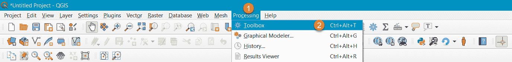

# 跟踪船只并在 QGIS 中可视化它们

> 原文：<https://medium.com/analytics-vidhya/tracking-ships-and-visualize-them-in-qgis-35c074810937?source=collection_archive---------1----------------------->

今天我要写的是收集感兴趣的船只的坐标、航向、速度和日期/时间。收集完数据后，我将在 QGIS 中可视化这些数据。

从 vesselfinder.com 刮出 AIS 航迹并在 QGIS 中可视化

# 我该怎么办？

*   我要为 vesselfinder.com 建造一个追踪装置。
*   用 python 编写工具
*   如果你有一个树莓派，它是这个项目的完美设备
*   在 QGIS 中可视化数据

# **维塞尔芬德**

在 vesselfinder.com 网站上，你可以搜索和跟踪感兴趣的船只。例如，涉及非法捕鱼或走私活动的可疑船只。然而，这是不可能的(免费版)保存和出口的跟踪一艘船。让我们自己做它。

我在这篇文章中使用的船一点也不可疑！！！

在这篇文章中，我使用的是“FREYJA W”号船。去 vesselfinder.com 搜索船名“FREYJA W”，点击船名(1)，下一艘船将显示在一个单独的页面上。点击地图时，您将看到该船的详细页面。

(2)点击曲目时，您可以看到一天前的历史曲目。我们想要更多！在第 3 点，我们看到一些额外的信息，如速度和方向。通过点击(3)详细信息，我们可以翻到 FREYJA W 的主页。

有一个叫做“位置和航程数据”的小节。在这一小节中，我感兴趣的大部分数据被呈现出来:(1)航向&速度，坐标和(3)接收数据的时间戳。

分段

# **数据检索**

我要用网络搜集来获取数据。小心使用它，不要滥用它。

我要建立一个小刮刀，将提取路线，速度，坐标和更新时间。铲运机将在 python3 中建造。但是在我们开始编码之前，我们需要知道从哪里提取数据，为了做到这一点，我需要查看网页的源代码。因此，打开该页面的源代码，搜索“位置和航程数据”小节。

位置和航程表的部分源代码，记住这个表。

首先，我需要安装一些额外的 python 包:

> *pip 安装请求
> pip 安装美观组 4
> pip 安装硒
> pip 安装时间表*

安装完包后，我们开始编写刮刀。打开新的。py 文件并开始导入以下包:

抓取过程发生在一个函数中。让我们创建一个函数:

第 14 行是为模拟浏览器而创建的标题。如果我们使用不带头文件的 python，vesselfinder.com 会阻止我们的请求。

第 17 行是 ships 页面的实际 URL。在第 18 行，我们将使用给定的头对 ships URL 执行一个 get 请求。第 19 行用于将接收到的 HTML 解析成一个变量。

接下来，我想将数据保存到我的本地磁盘。通过这种方式，我们将网站的流量保持在尽可能低的水平。第 22 & 23 行用于打开数据并将数据保存到与 python 程序相同的文件夹中的 HTML 文件。

第二部分是在存储的文档中查找信息。第 28 & 29 行用于打开和读取我们之前存储的 HTML 文件的内容。你还记得源代码吗？

“位置和航程数据”小节存储在一个表格中。在 HTML 中“td”用于创建表格。在第 32 行，我们将搜索所有的表项，并将它们放入一个列表中。第 35 行从列表中提取坐标对(它存储在第 22 项中，但是 python 列表是从零开始的)。第 38 行提取整行代码。第 39 行将 Beautifulsoup 对象转换为字符串值。第 40 行将其转换回一个 Beautifulsoup 对象(不确定我为什么这样做…看起来有些多余)。第 41 行提取工具提示信息。

第 44 行到第 46 行成对提取路线和速度。所以在第 45 行，我从这一对中提取了航向，在第 46 行，我从这一对中提取了以节为单位的速度。

最后必要的部分是关于净化坐标和日期/时间，并把它附加到一个 CSV 文件中。

提取的坐标对在第 51 行被转换成字符串，之后在第 52 行从坐标对中提取北距，在第 53 行提取东距。

然后我们要提取并格式化日期和时间戳。日期和时间戳如下:

世界协调时 2020 年 3 月 23 日 12:01。为了在 QGIS 中使用该日期和时间，我想将其转换为 2020–03–23，并在一个单独的字段中显示时间 12:01。

在第 56 行，我删除了逗号和单词(包括空格)UTC。所以现在的格式是 2020 年 3 月 23 日 12:01。在第 57 行，我使用 datetime 模块来解释变量 dtg 的格式。在第 58 行和第 59 行，从 dtg 变量中提取日期和时间。

在第 62 行我调用了一个全局变量。这个全局变量保存条目的数量。这在 QGIS 中是必需的，用于创建船只的轨迹。

现在是时候将所有变量添加到一个 CSV 文件中了。第 65 行以追加模式打开一个名为 AIS_Track.csv 的 CSV 文件。第 66 和 67 行用于将变量“ctr，north，east，date，current_time，heading，speed”写入 CSV 文件。在这个写附加动作之后，文件将被关闭。

下一部分是可选的，不是让铲运机工作所必需的。每次工具检索页面时，我都想要一个网站的截图，以便交叉引用。对于这一部分，我需要一个谷歌网络驱动，去[https://chromedriver.chromium.org/](https://chromedriver.chromium.org/)下载你的网络驱动到你的 python 文件所在的文件夹。

在第 72 和 73 行，我准备了一个前缀文件名。截图取自图片链接的网页(1)。第 76 和 77 行用于提取图像 URL。

第 80 行到第 85 行用于打开 google webdriver 并获得该船的网页。然后它会等待 5 秒钟，然后保存页面截图。保存截图后，它将关闭网络驱动程序。第 88 行向 python 控制台输出一条状态消息。并且在第 91 行，计数器将加+ 1。

因为程序是用函数写的，所以我需要调用这个函数。

当我第一次启动这个程序时，它会在第 96 行创建一个计数器，它基本上是每个条目的 id 号。接下来，我将在第 99 行运行该函数 1 次。此后，它将每隔 900 秒重新运行一次该功能(第 103–106 行)。

# **利用 QGIS 可视化船舶轨迹**

当代码组合在一起时，我让它运行几天。以我为例，我记录了弗雷嘉 W 从英国到荷兰的航行。

打开 CSV 文件并添加列标题(ID、北、东、日期、时间(UTC)、方向、速度)。然后关闭文件。在第 1 行，您可以看到列标题，我必须手动填写。

让我们启动 QGIS，当 QGIS 启动后，使用(1)“快速地图服务”插件加载(2) Openstreetmap (OSM)数据作为背景图层。

加载 OSM 图层后，通过单击图层→添加分隔文本图层来加载 CSV

数据源管理器将弹出。您可以在这里填写数据，以便将 CSV 加载到 QGIS 中。

(CSV 文件的 file path
(2)东行列(如果一切顺利，QGIS 将识别该列)
(3)北行列(如果一切顺利，QGIS 将识别该列)
(4)单击添加
(5)并关闭数据管理器

现在我们将看到一条从英格兰北部到荷兰鹿特丹的虚线。虽然现在是进口的，但是我想要更多。我要看到一条线，我要看到每个点的方向。

单击处理→工具箱

工具箱将出现在屏幕的右侧。

为了将点转换成线，我使用了“指向路径”工具。因此，在处理工具箱(1)中，在搜索栏(2)中填写“指向路径”。双击齿轮图标/‘指向路径’(3)。

将出现/弹出指向路径屏幕。

使用 ID (1)作为点序列的顺序。然后选择一个输出位置(2)并单击运行(3)。该过程完成后，单击关闭(4)。

好的，这样更好。然而，我希望它更清楚和标题。为此，我们需要调整线图层和点图层的图层属性。

双击线层(1)。选择红色发光线(2)，将线的大小调整为大约 1，46 (3)，然后单击“确定”(4)。

现在双击点层(1)，选择简单的标记(2)，改变图标为箭头形状(3)。为了查看航向，每个箭头必须旋转船只航向的相同值。点击旋转菜单右侧的图标(4) →“字段类型:int，double，string”(5)→点击“标题”(6)。要查看结果，请单击确定(7)。

**结果:**

# **最后的话**

我们可以看到中间部分缺少“几个”点。这可能是由几种原因造成的，有些是合法的，有些是非法的。在这种情况下，我的计算机重新启动进行强制更新:(。但是有几个选项可以部分解决这种得分不足的问题。它涉及使用来自哨兵 1 号星座(SAR)的卫星图像。如果有足够的热情，我将在下一次写这个。

我不是专业的程序员，所以很有可能代码在某些地方还可以改进。代码和音轨可以在我的 github 上找到:

程序位于:

[https://gist . github . com/bear hunt 11/9 b 02 f 4977436 be 2 B1 cf 15 c 9 b 10 a 5 feb 0](https://gist.github.com/bearhunt11/9b02f4977436be2b1cf15c9b10a5feb0)

CSV 文件位于:

[https://gist . github . com/bear hunt 11/5ff 44 be 9942 a 22 e 63 f 3317919564 c 44 c](https://gist.github.com/bearhunt11/5ff44be9942a22e63f3317919564c44c)