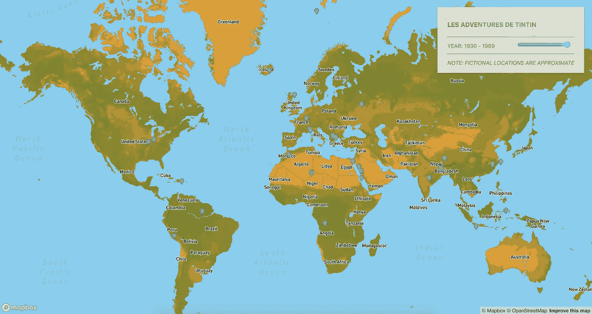
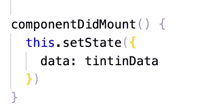
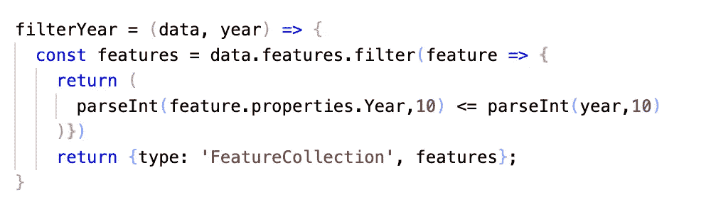
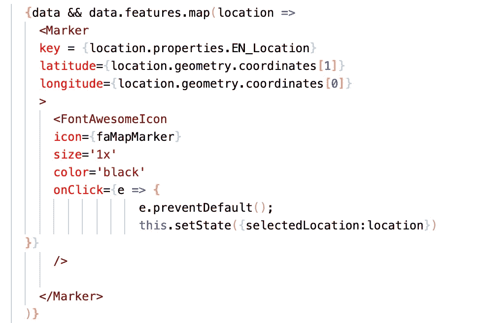
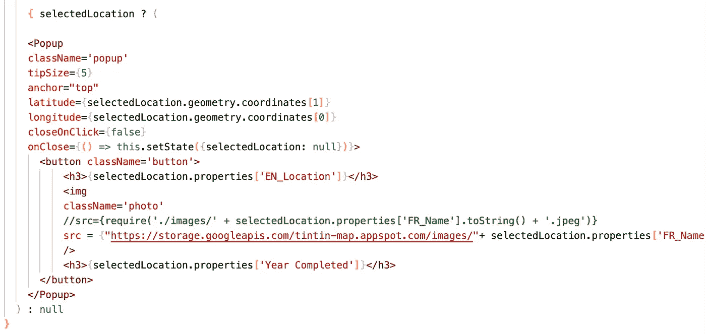
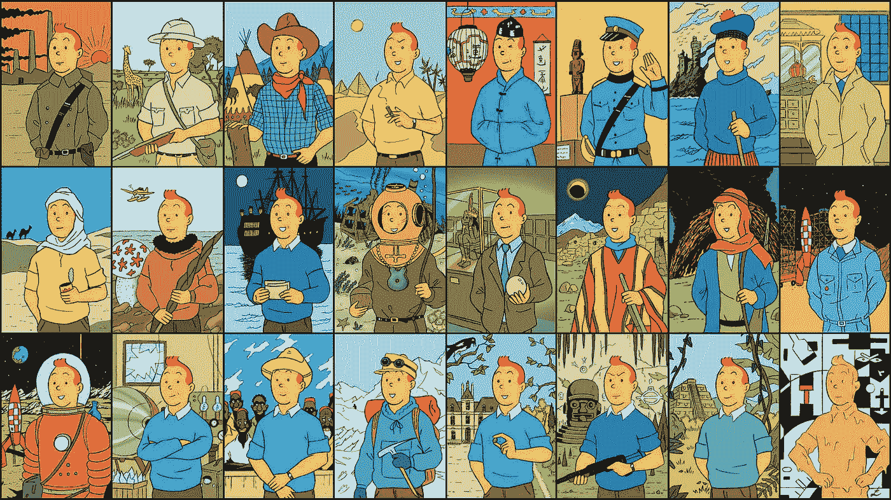
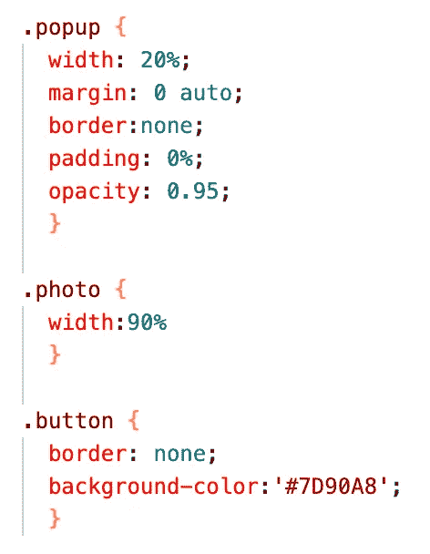

# 追踪丁丁的行踪与地图框和反应

> 原文：<https://medium.com/analytics-vidhya/tracking-tintins-whereabouts-with-mapbox-and-react-c12f1d14c776?source=collection_archive---------9----------------------->

《丁丁历险记》仍然是一个经典系列，给第一次或无数次拿起这本书的读者带来快乐。为了庆祝这个系列，我们决定制作一个[地图](http://tintin-map.uc.r.appspot.com/)，它提供了基于时间和地点的丁丁全球历险的图解。

丁丁旅行地图

这张地图有一个时间滑块，这样你就可以按照丁丁的时间顺序穿越世界。令人惊讶的是，几乎每个有人居住的大陆都被覆盖了——从技术上讲，丁丁甚至到达了澳大利亚大陆，尽管这并没有在书中明确显示出来(*714 航班飞往悉尼*)。虽然有许多丁丁历险记发生在布鲁塞尔，但我们对马林斯派克大厅(Moulinsart)的首次亮相(*独角兽的秘密)给予了特别的称赞。*

**创建应用:**

创建地图的过程包括两个主要组件:React 组件和样式。

*反应组分:*

我们用 React 和 Visgl 的 [react-map-gl](https://github.com/visgl/react-map-gl) 包构建了地图，然后添加了滑块、侧栏和弹出功能。在转换成 JSON 格式之前，数据点被编译成 csv 文件。为此，我们使用了 Mapbox 的 [csv2geojson](https://github.com/mapbox/csv2geojson) 包，允许轻松转换。在使用 ComponentDidMount()方法作为组件加载之前，我们直接从 JSON 文件导入数据:

根据滑块的值过滤数据。该值的变化会改变状态变量 *selectedYear* ，进而调用 filterYear 函数。例如，如果滑块值更改为 1949，selectedYear 变量将设置为 1949，filterYear 函数将筛选从 1930 年到 1949 年(含)的数据。

我们的数据点使用 react-map-gl 标记组件和通用字体 Awesome [图标](https://fontawesome.com/icons/map-pin)显示。我们对数据进行循环，并为每个 lat/long 值返回一个标记。

当用户单击特定的标记时，selectedLocation 状态变量被设置为新的位置，允许弹出窗口出现—这将显示该书的法文封面，以及其发行年份和标记位置。react-map-gl 包包含一个弹出组件，它简化了这个过程。当我们的状态变量 selectedLocation 不为空时，就会显示弹出框；单击弹出窗口和标记之外的任何地方都会将 selectedLocation 的状态改回 null。

*风格:*

第一步是创建一个代表丁丁的调色板。我们给所有水体赋予了典型的浅蓝色，以此来突出埃尔热经典的丁丁衫。与此同时，代表世界低洼地区的独特橙色是丁丁头发的一大亮点——你还会注意到这种颜色是埃尔热名字的背景。这些标记显示了阿道克船长特有的深蓝色毛衣的颜色。

丁丁在 47 年的历程中

弹出窗口采用一些简单的 CSS 格式。我们决定放弃。边栏和。弹出一个不透明度为 0.95 的窗口，这样底图就可以一直显示一定程度。我们还决定将丁丁封面固定在屏幕的 20%，这样无论你是缩放 1 还是缩放 20，它们都会保持突出。

这是一张有趣的地图，它打开了一扇通往可能性世界的大门，以及使用时间滑块来展示多年来令人惊叹的旅程的用例。我们希望丁丁爱好者发现这张地图是一个直观的，令人耳目一新的丁丁和白雪(米卢)带给我们所有人的快乐的提醒。

Github 链接:【https://github.com/stefangouyet/tintin_map 

地图链接:【http://tintin-map.uc.r.appspot.com/ 

 [## Stefan Luc Gouyet -美国纽约州纽约市|职业简介| LinkedIn

### 查看世界上最大的职业社区 LinkedIn 上 Stefan Luc Gouyet 的个人资料。Stefan Luc 列出了 6 项工作…

www.linkedin.com](https://www.linkedin.com/in/stefangouyet/)  [## Andre Gouyet -客户经理- Mapbox | LinkedIn

### 兴趣:*宣传我相信的技术*探索正念的效果*铁人三项和旅行…

www.linkedin.com](https://www.linkedin.com/in/andregouyet/)