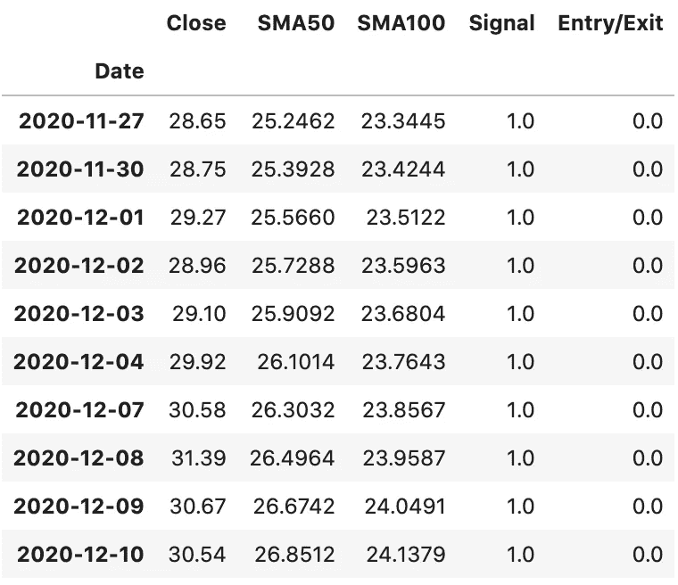
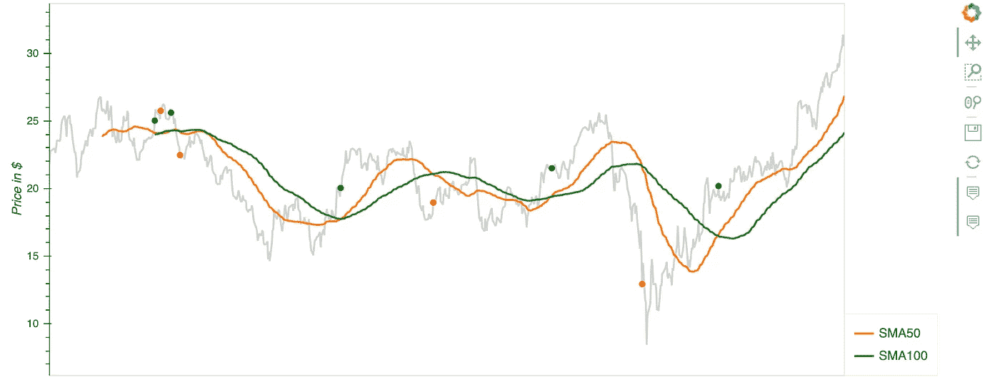
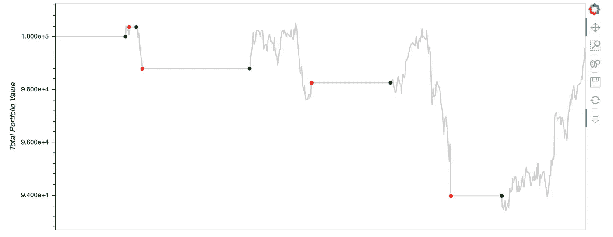
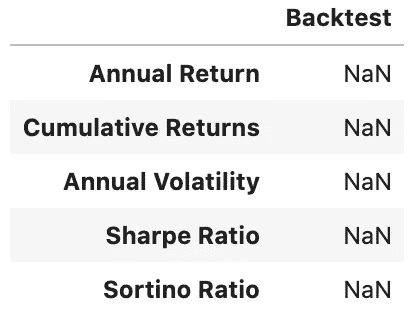
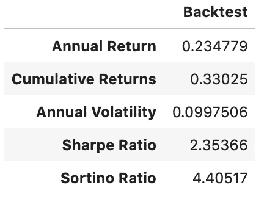
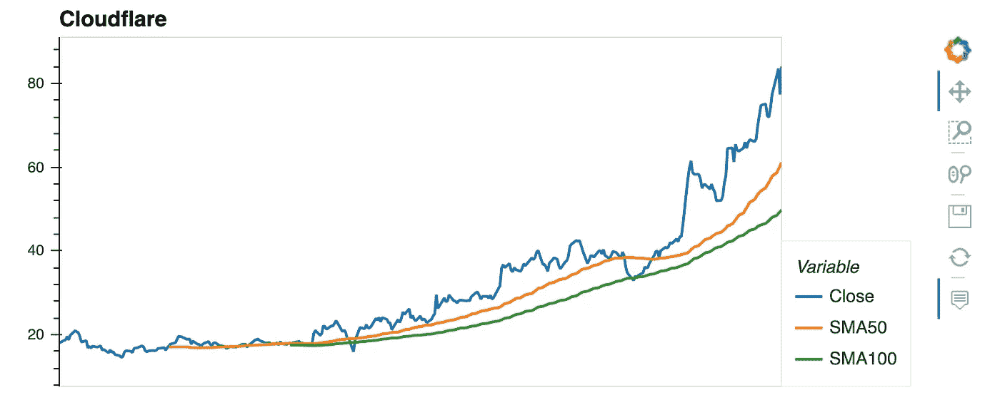
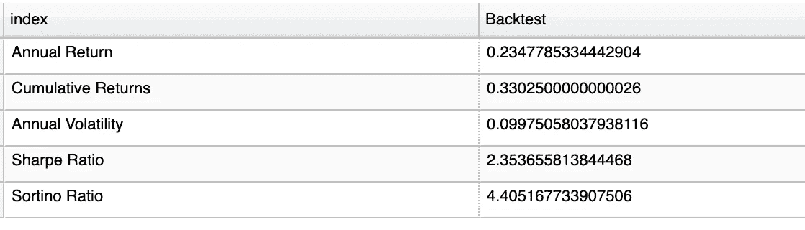

# 使用 Yfinance & Python 的交易仪表板。

> 原文：<https://medium.com/analytics-vidhya/trading-dashboard-with-yfinance-python-56fa471f881d?source=collection_archive---------0----------------------->

高级技术的初级编码。


**目录:**

*   使用 Yfinance Api 提取数据
*   设置短窗口和长窗口(SMA)
*   生成交易信号
*   地块入口/出口点
*   回溯测试
*   分析投资组合指标
*   服务仪表板

# **简介**

首先，让我们先理解这篇文章的目标，它是为普通散户投资者提供一种快速简单的方法来获取实时数据，使用这些数据来突出关键指标，并在投资特定公司之前创建一个清晰易读的表格。

这个过程将帮助你消除情绪，给你足够的信息来做出明智的决定。

*在代码块的底部替换您想要的任何股票代码:*

```
# Import libraries and dependencies
import numpy as np
import pandas as pd
import hvplot.pandas
from pathlib import Path
import yfinance as yf#Cloudflare
net = yf.Ticker(“net”)
net# Set the timeframe you are interested in viewing.net_historical = net.history(start="2018-01-2", end="2020-12-11", interval="1d")# Create a new DataFrame called signals, keeping only the 'Date' & 'Close' columns.signals_df = net_historical.drop(columns=['Open', 'High', 'Low', 'Volume','Dividends', 'Stock Splits']) 
```


**移动平均线:**

接下来，我们要为短窗口和长窗口创建列，也称为简单移动平均线。在这种情况下，我们将使用 50 天和 100 天的平均值。

在下面的代码中，我们需要将交易信号设置为 0 或 1。这将告诉 python 我们应该在哪个点买入或卖出头寸。

*   *请记住，当 SMA50 越过 SMA100 或阻力位时，这是一个看涨的突破信号。*

```
# Set the short window and long windows
short_window = 50
long_window = 100# Generate the short and long moving averages (50 and 100 days, respectively)
signals_df['SMA50'] = signals_df['Close'].rolling(window=short_window).mean()
signals_df['SMA100'] = signals_df['Close'].rolling(window=long_window).mean()
signals_df['Signal'] = 0.0# Generate the trading signal 0 or 1,
# where 0 is when the SMA50 is under the SMA100, and
# where 1 is when the SMA50 is higher (or crosses over) the SMA100
signals_df['Signal'][short_window:] = np.where(
    signals_df['SMA50'][short_window:] > signals_df['SMA100'][short_window:], 1.0, 0.0
)# Calculate the points in time at which a position should be taken, 1 or -1
signals_df['Entry/Exit'] = signals_df['Signal'].diff()# Print the DataFrame
signals_df.tail(10)
```



构建仪表板的第三步是创建一个图表，用绿色和红色的信号标记表示进/出指示器。

**用 HvPlot 绘制移动平均线:**

```
# Visualize exit position relative to close priceexit = signals_df[signals_df['Entry/Exit'] == -1.0]['Close'].hvplot.scatter(
    color='red',
    legend=False,
    ylabel='Price in $',
    width=1000,
    height=400
)# Visualize entry position relative to close priceentry = signals_df[signals_df['Entry/Exit'] == 1.0]['Close'].hvplot.scatter(
    color='green',
    legend=False,
    ylabel='Price in $',
    width=1000,
    height=400
)# Visualize close price for the investmentsecurity_close = signals_df[['Close']].hvplot(
    line_color='lightgray',
    ylabel='Price in $',
    width=1000,
    height=400
)# Visualize moving averagesmoving_avgs = signals_df[['SMA50', 'SMA100']].hvplot(
    ylabel='Price in $',
    width=1000,
    height=400
)# Overlay plots
entry_exit_plot = security_close * moving_avgs * entry * exit
entry_exit_plot.opts(xaxis=None)
```



接下来，我们将设定资本的初始投资股份，并设定股份数量。对于本例，假设我们想购买 500 股 Cloudflare。

```
# Set initial capital
initial_capital = float(100000)# Set the share size
share_size = 500# Take a 500 share position where the dual moving average crossover is 1 (SMA50 is greater than SMA100)
signals_df['Position'] = share_size * signals_df['Signal']# Find the points in time where a 500 share position is bought or sold
signals_df['Entry/Exit Position'] = signals_df['Position'].diff()# Multiply share price by entry/exit positions and get the cumulatively sum
signals_df['Portfolio Holdings'] = signals_df['Close'] * signals_df['Entry/Exit Position'].cumsum()# Subtract the initial capital by the portfolio holdings to get the amount of liquid cash in the portfolio
signals_df['Portfolio Cash'] = initial_capital - (signals_df['Close'] * signals_df['Entry/Exit Position']).cumsum()# Get the total portfolio value by adding the cash amount by the portfolio holdings (or investments)
signals_df['Portfolio Total'] = signals_df['Portfolio Cash'] + signals_df['Portfolio Holdings']# Calculate the portfolio daily returns
signals_df['Portfolio Daily Returns'] = signals_df['Portfolio Total'].pct_change()# Calculate the cumulative returns
signals_df['Portfolio Cumulative Returns'] = (1 + signals_df['Portfolio Daily Returns']).cumprod() - 1# Print the DataFrame
signals_df.tail(10)
```

**想象相对于我们投资组合的退出头寸:**

```
# Visualize exit position relative to total portfolio value
exit = signals_df[signals_df['Entry/Exit'] == -1.0]['Portfolio Total'].hvplot.scatter(
    color='red',
    legend=False,
    ylabel='Total Portfolio Value',
    width=1000,
    height=400
)# Visualize entry position relative to total portfolio value
entry = signals_df[signals_df['Entry/Exit'] == 1.0]['Portfolio Total'].hvplot.scatter(
    color='green',
    legend=False,
    ylabel='Total Portfolio Value',
    width=1000,
    height=400
)# Visualize total portoflio value for the investment
total_portfolio_value = signals_df[['Portfolio Total']].hvplot(
    line_color='lightgray',
    ylabel='Total Portfolio Value',
    width=1000,
    height=400
)# Overlay plots
portfolio_entry_exit_plot = total_portfolio_value * entry * exit
portfolio_entry_exit_plot.opts(xaxis=None)
```



```
# Prepare DataFrame for metrics
metrics = [
    'Annual Return',
    'Cumulative Returns',
    'Annual Volatility',
    'Sharpe Ratio',
    'Sortino Ratio']columns = ['Backtest']# Initialize the DataFrame with index set to evaluation metrics and column as `Backtest` (just like PyFolio)
portfolio_evaluation_df = pd.DataFrame(index=metrics, columns=columns)
```



**执行回溯测试:**

在这一节中，我们将重点介绍🖐🏼指标。

*   1.累计回报— **总投资的回报**。
*   2.年度回报——当年收到的投资的回报。
*   3.年波动率——日波动率乘以 252 个交易日的平方根。
*   4.夏普比率—衡量在调整风险后，投资相对于无风险资产的表现。
*   5.sortino ratio——通过使用负投资组合回报的资产标准偏差、下行偏差，而不是投资组合回报的总标准偏差，来区分有害波动和总波动。

```
# Calculate cumulative return
portfolio_evaluation_df.loc['Cumulative Returns'] = signals_df['Portfolio Cumulative Returns'][-1]# Calculate annualized return
portfolio_evaluation_df.loc['Annual Return'] = (
    signals_df['Portfolio Daily Returns'].mean() * 252
)# Calculate annual volatilityportfolio_evaluation_df.loc['Annual Volatility'] = (
    signals_df['Portfolio Daily Returns'].std() * np.sqrt(252)
)# Calculate Sharpe Ratioportfolio_evaluation_df.loc['Sharpe Ratio'] = (
    signals_df['Portfolio Daily Returns'].mean() * 252) / (
    signals_df['Portfolio Daily Returns'].std() * np.sqrt(252)
)# Calculate Downside Returnsortino_ratio_df = signals_df[['Portfolio Daily Returns']].copy()
sortino_ratio_df.loc[:,'Downside Returns'] = 0target = 0
mask = sortino_ratio_df['Portfolio Daily Returns'] < target
sortino_ratio_df.loc[mask, 'Downside Returns'] = sortino_ratio_df['Portfolio Daily Returns']**2
portfolio_evaluation_df# Calculate Sortino Ratiodown_stdev = np.sqrt(sortino_ratio_df['Downside Returns'].mean()) * np.sqrt(252)
expected_return = sortino_ratio_df['Portfolio Daily Returns'].mean() * 252
sortino_ratio = expected_return/down_stdevportfolio_evaluation_df.loc['Sortino Ratio'] = sortino_ratio
portfolio_evaluation_df.head()
```



```
# Initialize trade evaluation DataFrame with columns.trade_evaluation_df = pd.DataFrame(
    columns=[
        'Stock', 
        'Entry Date', 
        'Exit Date', 
        'Shares', 
        'Entry Share Price', 
        'Exit Share Price', 
        'Entry Portfolio Holding', 
        'Exit Portfolio Holding', 
        'Profit/Loss']
)
```


*   通过数据框架循环，如果“进场/出场”交易为 1，设置进场交易指标。
*   如果“进场/出场”为-1，设置出场交易指标并计算利润。
*   将记录附加到交易评估数据框架。

```
# Initialize iterative variables
entry_date = ''
exit_date = ''
entry_portfolio_holding = 0
exit_portfolio_holding = 0
share_size = 0
entry_share_price = 0
exit_share_price = 0 for index, row in signals_df.iterrows():
    if row['Entry/Exit'] == 1:
        entry_date = index
        entry_portfolio_holding = abs(row['Portfolio Holdings'])
        share_size = row['Entry/Exit Position']
        entry_share_price = row['Close']elif row['Entry/Exit'] == -1:
        exit_date = index
        exit_portfolio_holding = abs(row['Close'] * row['Entry/Exit Position'])
        exit_share_price = row['Close']
        profit_loss =  entry_portfolio_holding - exit_portfolio_holding
        trade_evaluation_df = trade_evaluation_df.append(
            {
                'Stock': 'NET',
                'Entry Date': entry_date,
                'Exit Date': exit_date,
                'Shares': share_size,
                'Entry Share Price': entry_share_price,
                'Exit Share Price': exit_share_price,
                'Entry Portfolio Holding': entry_portfolio_holding,
                'Exit Portfolio Holding': exit_portfolio_holding,
                'Profit/Loss': profit_loss
            },
            ignore_index=True)
```

**绘图结果:**

```
price_df = signals_df[['Close', 'SMA50', 'SMA100']]
price_chart = price_df.hvplot.line()
price_chart.opts(title='Cloudflare', xaxis=None)
```



最后一步:打印仪表板

```
portfolio_evaluation_df.reset_index(inplace=True)
portfolio_evaluation_table = portfolio_evaluation_df.hvplot.table()
portfolio_evaluation_table
```



**感谢阅读！**

*如果你觉得这篇文章有用，欢迎在* [*GitHub*](https://github.com/scottandersen23/Medium_Blog/tree/main/Articles) *上下载我的个人代码。你也可以直接在 scottandersen23@gmail.com 给我发邮件，在*[*LinkedIn*](https://www.linkedin.com/in/scott-andersen-3208897b/)*上找到我。有兴趣了解更多关于数据分析、数据科学和机器学习应用的信息吗？跟我上* [*中*](/@scottandersen23) *。*