# 核心样本的传统图像语义分割

> 原文：<https://medium.com/analytics-vidhya/traditional-image-semantic-segmentation-for-core-samples-f315157913e8?source=collection_archive---------16----------------------->

这是我有生以来第一次写博客，所以我们今天要讨论的是如何用传统的方法分割图像。

在这篇博客中，我们将使用岩心样本作为例子，如果你不知道岩心样本是什么，它是从油井或矿区取得的圆柱形样本，我们用它来查看那里的地质情况。

具有两种不同纹理的岩心样本，在分割之前

所以我们在这里的任务是尝试编写一个代码，可以区分岩心样本中的暗纹理和亮纹理，这可能会帮助地质学家节省一些时间，并为他的工作引入一些自动化。

第一步:

我们需要找到一种算法，可以找到两种不同纹理之间的差异，如果你用传统方法搜索语义分割，你会发现很多现成的库过滤器，如 Skimage，Scipy 和 OpenCV。在我们的例子中，我们将使用 Skimage，因为我喜欢它。

因此，在 Skimage 中，我们可以找到很多过滤器来完成这项任务，但唯一一个能给我们一个好的最终结果的过滤器是熵分割过滤器。

首先，我们需要为这个任务导入必要的库

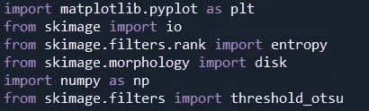

导入库

我们需要导入 Matplotlib 来显示我们的最终结果，进行熵分割和阈值处理(第二步)，并导入 Numpy 来完成我们的导入鸡尾酒。

为了首先在 python 中打开我们的图像，我们将使用下面的代码行

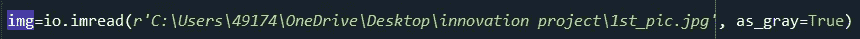

如何在 python 中导入图像

现在让我们来谈谈熵过滤器，熵过滤器可以检测局部灰度分布的细微变化，下一张图将向您展示它是如何工作的

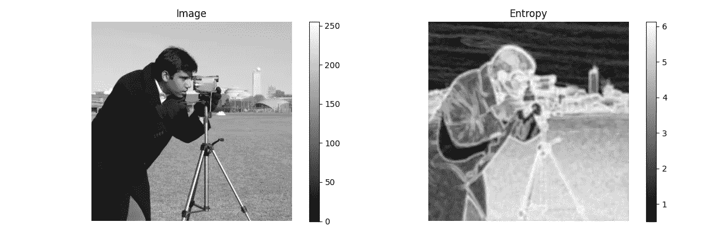

提供:[https://scikit-image . org/docs/dev/auto _ examples/filters/plot _ entropy . html](https://scikit-image.org/docs/dev/auto_examples/filters/plot_entropy.html)

为了在我们的核心样本图像上应用这个过滤器，我们将使用下面的代码行。

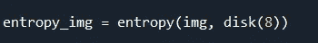

对岩心样本应用熵过滤器，半径为 8

为了显示此过滤器的结果，我们将使用 Matplotlib 来绘制这些新值，使用接下来的代码行。

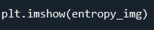

使用 matplotlib 显示绘图

这里我们可以看到核心样本的熵分割结果。

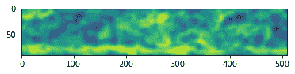

对我们的核心样本进行熵分割过滤的结果

现在我们可以看到，熵过滤导致原始图片中较暗的纹理为黄绿色，而另一个纹理为正常的绿色，但从这个结果中，我们无法精确区分两个纹理，我们需要较暗和较亮的纹理之间的边界线，为此，我们将使用 Otsu 阈值过滤器，它将产生估计较暗纹理像素值和其他纹理像素值之间的边界线的值，我们可以使用下面的代码行。

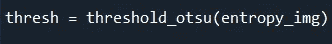

两个纹理之间的阈值

使用前面的代码，我们在两个纹理之间做了一条线，我们只需要把这条线放在动作中，这就是为什么我们要使用这个阈值，使用下面的代码行来做一个布尔蒙版。

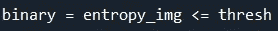

二进制是由真值和假值组成的图像

前一行代码构建了一个图像，由真值和假值或 0 和 1 组成，真值用于小于或等于阈值的像素值，假值用于其余像素

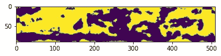

二进制图像，黄色=1，紫色= 0

现在，我们在输出图像中只有两个不同的纹理，我们可以使用布尔遮罩轻松计算这两个纹理之间的面积比。

要计算面积比，您需要使用下面几行代码

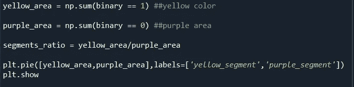

每个纹理的布尔遮罩，然后在饼图中绘制比率

最终结果是这个饼图，显示黄色区域到紫色区域。

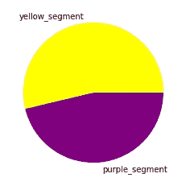

黄色和紫色区域饼图

本分割教程的灵感来自 rg Benndorf 教授和 DigitalSreeni YouTube 频道

 [## 数字时代

### 本频道将带您了解学习 Python 编码的整个过程；从基础到高级…

www.youtube.com](https://www.youtube.com/channel/UC34rW-HtPJulxr5wp2Xa04w)