# 自然语言处理的朴素贝叶斯和逻辑回归

> 原文：<https://medium.com/analytics-vidhya/traditional-ml-nlp-definitions-tried-tested-573026693415?source=collection_archive---------5----------------------->

## 我将在 IMDB 数据集上使用朴素贝叶斯和逻辑回归来预测评论的类型，即它是积极的还是消极的。此外，我将包括一些其他真正重要的术语。我建议读者也去探索 fastai。让我们开始吧。


## ❓什么是正规化

Fastai 从未争论过训练模型需要考虑的参数数量。Fastai 始终支持您想要训练模型的任意数量的参数。但是值得记住的是，如果你在训练你的模型时遇到了困难，增加一点点规则可能会帮助它训练得更快(更好！我就不索赔了)。根据正则化，最好惩罚那些非零的参数，因为零值参数不影响损失，因为它们是零。现在，主要有两种方法来惩罚非零参数:

1.  我们可以修改损失函数，加入这个平方损失。这就是所谓的 L2 正规化。这将增加损失函数值，这将导致更多的**反向传播**，因此非零非必需权重将趋向于零。你将不得不在做调整的时候注意过度配合的问题。

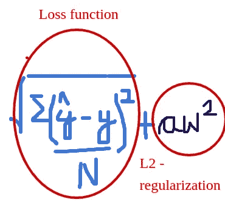

1.  我们可以修改我们所说的权重等于权重减去梯度乘以学习率(当我们根据需要反向传播并优化我们的梯度以更好地适应时),也可以添加 *2aw* 。这被称为 L1 正则化或重量衰减。这不会直接影响损失函数，但是这将从权重中减去，因此非零非必需参数将趋向于零。

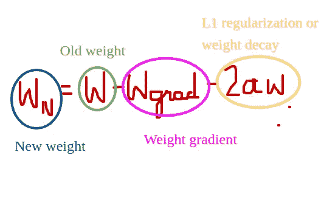

让我们做 PyTorch 称之为重量衰减的版本，但它是 L2 正则化。

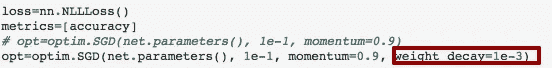

我们这样做的原因是我们想要惩罚非零的东西，也就是说不要让这个参数成为一个很高的数字，除非它对损失有很大的帮助。如果可以的话，将其设置为零，因为将尽可能多的参数设置为零意味着它将更好地泛化。这就像拥有一个更小的网络。这就是我们这么做的原因。但是它也可以改变学习的方式。

*如果培训损失高于验证损失，那么你就不适合。所以没有必要正规化。这意味着你的模型中需要更多的参数。万一你过度适应，这并不一定意味着规律化会有帮助，但肯定值得一试。*

您可以在拟合模型时使用 [fit_one_cycle](https://docs.fast.ai/basic_train.html#fit_one_cycle) ()初始化权重衰减值。

总之，我们可以建立非常精确的模型，即使它们有很多很多的参数。不一定要有更少的参数来学习适合和学习得更好。这是对正规化的基本理解。我将在我的深入学习博客中涉及更多。

**❓What 退学**

**❓What 被批量归一化**

## ❓什么是自然语言处理

NLP 代表自然语言处理。NLP 是指我们使用自然语言文本并对其进行处理以推断结果的任何建模。

为了更好地理解 NLP，我将使用 IMDB 数据集。它是电影评论的数据集。我将使用朴素贝叶斯，然后逻辑回归。您可以按如下方式下载数据集:

```
!wget [http://ai.stanford.edu/~amaas/data/sentiment/aclImdb_v1.tar.gz](http://ai.stanford.edu/~amaas/data/sentiment/aclImdb_v1.tar.gz)!gunzip aclImdb_v1.tar.gz!tar -xvf aclImdb_v1.tar
```

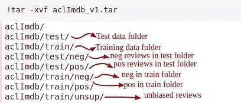

内部数据

在`neg`和`pos`文件夹中有文本文件。我使用 google colab 进行数据实现。

```
PATH='/content/aclImdb/'
%ls {PATH}train/pos | head
```

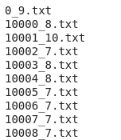

让我们看看其中一个文本文件的内部。我将使用 numpy 来了解文本文件。

```
%cd  /content/aclImdb/train/pos
np.loadtxt('10000_8.txt', dtype=np.str)
```

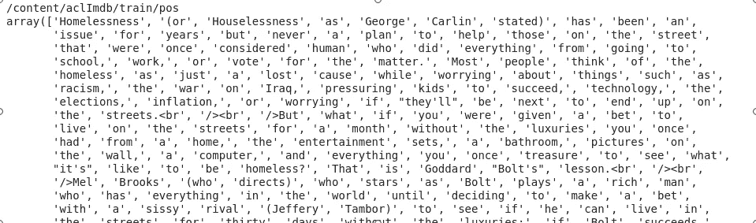

我们的下一步是从文件夹中取出这些评论及其标签，并创建一个数组，这样我们就可以轻松地访问数据。Fastai 有一个方便的方法。

```
trn,trn_y = texts_labels_from_folders(f'{PATH}train',names)
val,val_y = texts_labels_from_folders(f'{PATH}test',names)
```

现在，你可以检查你的数据如下。

```
trn[20000], trn_y[20000]**trn- will give you the review
trn_y- will return you the review label(0-negative review, 1- positive review)**
```

这是我们的数据。因此，我们的工作将是采取电影评论，并预测标签。在分析数据时，我们不考虑单词的顺序。我们只会考虑一个词在评论中的出现。通常，单词的顺序很重要。如果你在某事前有一个“不是”，那么这个“不是”指的是那件事。但在这种情况下，我们试图预测某事是积极的还是消极的。如果你看到“愚蠢”或“晦涩”这个词出现了很多次，那么这可能是一个不好的信号。如果你知道“棒极了”这个词看起来很棒，那么这可能是好的迹象。

*因此，我们的想法是将它变成一个术语-文档矩阵，对于每个文档(即每个评论)，我们只需创建一个单词列表，而不是它们的顺序。*

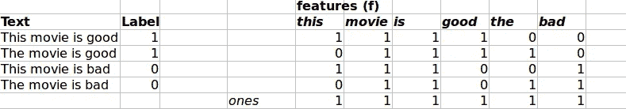

*   影评中所有的词汇都被记录下来，像这样列出来，电影，好的，坏的。词汇表是所有出现的独特单词的列表。在这种情况下，我的单词没有一个出现两次。所以这被称为术语文档矩阵。
*   如果该特性出现在评论中，我们添加 1，如果该特性不存在，我们添加 0。
*   我们增加了一层 1，以避免在评论中没有出现特定单词的情况下出现无限值。如果我没有在我的任何评论中写过“性”这样的词，那并不意味着这个词也不存在。所以，我们也需要注意这一点。当我们用天真的谎言作为预测评论的模型时，这尤其有用。我们将在某个时候讨论这个问题。
*   它只是一个单词包(即里面有哪些单词)。它包含“坏”、“是”、“电影”、“这个”。所以我们要做的第一件事是，我们要把它变成一个单词包。这对于线性模型来说很方便的原因是，这是一个有用的矩形矩阵，我们可以在其上进行数学计算。具体来说，我们可以做 ***的逻辑回归。***
*   Sklearn 有一个可以为我们自动创建 word 文档矩阵的东西——它被称为[计数矢量器](http://scikit-learn.org/stable/modules/generated/sklearn.feature_extraction.text.CountVectorizer.html)。在此之前，让我们先了解一下传统的 NLP 术语。

## ❓什么是标记化

现在在 NLP 中，你必须把你的文本变成一个单词列表，这叫做标记化。你对评论的修饰越好，结果就越好。

```
veczr = CountVectorizer(tokenizer=tokenize)
trn_term_doc = veczr.fit_transform(trn)
val_term_doc = veczr.transform(val)
```

*   CountVectorizer 将一组文本文档转换成一个令牌计数矩阵(是`sklearn.feature_extraction.text`的一部分)。
*   fit_transform(trn)在训练集中查找词汇。它还将训练集转换为术语-文档矩阵。因为我们必须将 *same transformation* 应用到您的验证集，所以第三行只使用方法 transform(val)。`trn_term_doc`和是稀疏矩阵。`trn_term_doc[i]`代表训练文档，它包含词汇表中每个单词的每个文档的字数。

```
vocab = veczr.get_feature_names(); vocab[5000:5500]
```

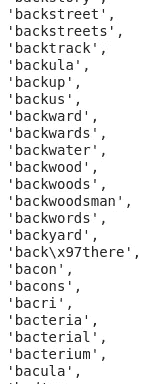

*   get_feature_names()为我们提供了词汇表。`veczr.get_feature_names`将单词的整数索引映射到单词。
*   单词作为一个整数存储在词汇表中。您可以检查词汇表中任何单词的整数，如下所示:

```
veczr.vocabulary_['bad']
```

*   当我们创建这个术语-文档矩阵时，训练集有 25，000 行，因为有 25，000 条电影评论，并且有 75，132 列是唯一单词的数量。

```
trn_term_doc
<25000x75132 sparse matrix of type '<class 'numpy.int64'>'
     with 3749745 stored elements in Compressed Sparse Row format>
```

*   *现在大部分文档都没有这 75132 个单词中的大部分。所以我们不想把它作为普通数组存储在内存中。因为那会非常浪费。因此，我们将它存储为一个稀疏矩阵。稀疏矩阵的作用是，把它保存为一个表示非零值位置的东西。所以它说好的，文档号 11，单词号 41 出现，它有 9 个。文档编号 12，术语编号 23 出现三次，依此类推。*

```
(11, 41) → 9
(12, 23) → 3
```

*   现在，CountVectorizer 中又多了一个属性，那就是 ngram_range。默认情况下，我们得到的是单个单词的单字。但是如果我们说`ngram_range=(1,3)`，那也会给我们二元模型和三元模型。现在，我们可以组合使用像`by hook and crook`、`fastai library`等更多的单词，而不是仅仅使用单个单词。
*   现在做的是同样的事情，但是在标记化之后，它不仅仅是抓住每个单词，说那是你词汇的一部分，而是每两个单词相邻，每三个单词相邻。这对于利用单词袋方法非常有帮助，因为我们现在可以看到`not good`和`not bad`和`not terrible`之间的区别。

```
veczr =  CountVectorizer(ngram_range=(1,3), tokenizer=tokenize,
                         max_features=800000)
```

*   `max_features`用于限制特征计数。

```
trn_term_doc.shape= 25000, 800000
```

# 使用朴素贝叶斯

所以我们想要的是给定这个特定文档(我有这个特定的 IMDb 评论)的概率，它的类等于正或负的概率是多少。因此，对于这个特定的电影评论，它的类别是积极的可能性有多大。所以我们可以说，嗯，这等于我们得到这个特定的电影评论的概率，假设它的类是正的，乘以任何电影评论的类是正的概率，除以得到这个特定电影评论的概率。

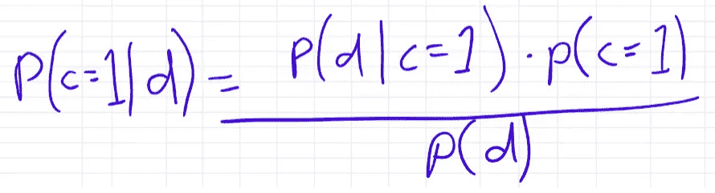

那只是贝氏法则。

所以我们可以计算所有这些东西，但实际上我们想知道的是，这更有可能是 0 类还是 1 类。如果我们把 1 级概率除以 0 级概率会怎么样。如果我们做到了呢？

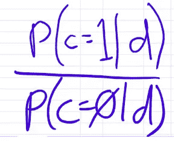

好的，如果这个数比 1 更重要，那么它更有可能是 1 类，如果它比 1 小，它更有可能是 0 类。

```
If we have to find probability of occurance of **this** feature given the review is positive p(f/1)**,** then it is calculated as below:Given **this** feature, what is the probability of finding it in positive review p(1/f) (out of three positive review) = 2/3probability of selecting the positive review class = 1/2probability of selecting the feature = 2/4Probability of occurance of "this" in the positive reviews = ((2/3) * (1/2)) / (2/4) = 0.6667
```

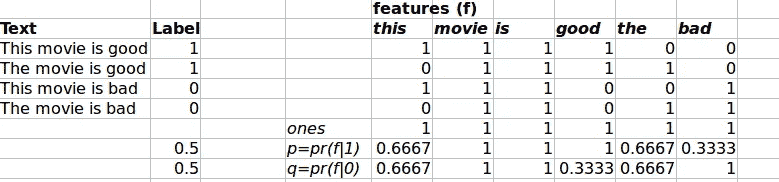

大体上，要发现评论是正面的还是负面的，请遵循以下步骤:

*   将评论中特征的个体概率相乘，考虑一次正面情况，然后考虑一次负面情况。
*   将这两个概率相除，得到评论是正面的还是负面的。

```
If I want to know about the review "movie is bad", then it can be calculates as below:- Multiply the probabilites of features considering the review to be positive = 1*1*0.333
- Multiply the probabilites of features considering the review to be negative = 1*1*1probability of movie review to be positive / probability of movie review to be negative = 0.333 < 1Thus, the review is negative.
```

这是我们对评论的推断。

让我们用 python 代码来做这件事。

```
def pr(y_i):
    p = x[y==y_i].sum(0)
    return (p+1) / ((y==y_i).sum()+1)x=trn_term_doc
y=trn_yr = np.log(pr(1)/pr(0))
b = np.log((y==1).mean() / (y==0).mean())pre_preds = val_term_doc @ r.T + b
preds = pre_preds.T>0
(preds==val_y).mean()
```

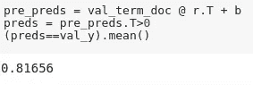

*   所以这里写成 Python。我们的自变量是我们的术语文档矩阵，我们的因变量只是`y`的标签。所以使用 numpy，这个`x[y==1]`将获取因变量为 1 的行。然后我们可以对这些行求和，得到该特性在所有文档中的总字数加 1。
*   当然，取对数会更有帮助，因为如果我们取了对数，我们就可以把它们相加，而不是相乘。一旦你把足够多的这些东西相乘，它会变得非常接近零，你可能会用完浮点。所以我们取比率的对数。然后，就像我说的，我们乘以它，或者用 log，我们把它加到整个类概率的比率上。然后要在日志上添加类比率，可以使用`+ b.`
*   *所以我们最终得到了看起来很像逻辑回归的东西。但是我们什么也没学到。从 SGD 的角度来看不是这样。我们只是用这个理论模型来计算。这大约有 81%的准确率。所以朴素贝叶斯什么也不是。它给了我们一些东西。*

现在，特别是对于这个问题，重要的是有没有单词出现。所以，我们可以用 1 代替单词计数，如果它出现了，就用-1 代替，如果它没有出现。另一方面，我们可以将数据二进制化。

```
pre_preds = val_term_doc.sign() @ r.T + b
preds = pre_preds.T>0
(preds==val_y).mean()= 0.82623999999999997
```

现在，我们将对同一问题使用逻辑回归，并将比较结果。

# 使用逻辑回归

朴素贝叶斯从理论的角度来看是杰出的但是在实践中，与其定义权重，我们为什么不学习它们呢？所以让我们创建一个逻辑回归，让我们拟合一些系数。这将给我们一个与之前完全相同的函数形式，但是现在我们不使用理论上的 T1 和 b，而是基于逻辑回归来计算这两个东西。我们是 SkLearn 中定义的 LogisticRegression 类。

```
m = LogisticRegression(C=1e8, dual=**True**)
m.fit(x, y)
preds = m.predict(val_term_doc)
(preds==val_y).mean()
```

*   dual=true 当您的数据比 long 宽时，类似于一个变通办法。
*   `C`用于正规化。我们应该考虑正规化，因为我们有 75，000 字的词汇，用于近 25，000 条评论。C=1e8 因为数字很低所以关；对损失函数几乎没有任何影响。`***C***` ***是规则化罚款金额的倒数。*** 我们使用 L2 正则化，因为我们只能在 L2 正则化中使用 dual=true。此外，L2 是违约国。

我们也可以对二进制版本运行上述解决方案。

```
m = LogisticRegression(C=1e8, dual=**True**)
m.fit(trn_term_doc.sign(), y)
preds = m.predict(val_term_doc.sign())
(preds==val_y).mean()= 0.85487999999999997
```

现在，打开正则化，让我们声明 C=0.1，看看结果。

```
m = LogisticRegression(C=0.1, dual=**True**)
m.fit(x, y)
preds = m.predict(val_term_doc)
(preds==val_y).mean()= 0.88404000000000005
```

# ❓·法斯泰。NBSVM++

```
sl=2000
md = TextClassifierData.from_bow(trn_term_doc, trn_y, val_term_doc, val_y, sl)learner = md.dotprod_nb_learner()
learner.fit(0.02, 1, wds=1e-6, cycle_len=3)
```

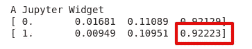

*   sl=2000 表示使用 2000 个唯一的单词。
*   TextClassifierData 是我们如何从一堆单词中得到一个模型。这是一件很快的事。
*   然后我们使用朴素贝叶斯学习器来学习这些东西。
*   我们的准确率达到了 92%。

这就是我们对数据集使用传统和现代化技术的方式。