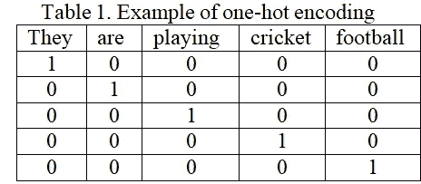
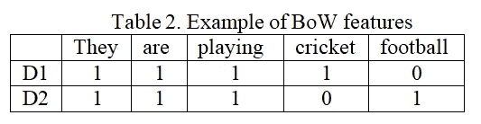

# 自然语言处理中的传统文本矢量化技术

> 原文：<https://medium.com/analytics-vidhya/traditional-text-vectorization-techniques-in-nlp-4e99218e7efe?source=collection_archive---------11----------------------->

作者图片(男性，马尔代夫)

> *矢量化是*将来自数据集的词汇单词或记号映射到相应的实数向量。这些向量被用作机器学习(ML)模型的输入。*现在，最近的单词嵌入方法被用于执行大多数下游 NLP 任务。在这篇文章中，让我们看看文字嵌入时代之前的文本矢量化方法。*

# **基于统计的矢量化方法**

在单词嵌入时代之前，基于统计单词矢量化的方法，如计数单词共现、加权矩阵，被用来从文本中提取特征，以便稍后用作机器学习算法的输入。(特尼博士和潘特尔出版社，2010 年)。

# **1。一键编码**

表 1。通过在向量的其他位置设置值为 1、其余为 0 的唯一标记，提供了一种表示词汇表中每个唯一单词的方法。

***例******差了。1*** *:他们在踢足球。* ***派。2*** *:他们在打板球。* ***Vocab。*** *:【他们，正在，玩，足球，板球】*

向量大小的缺点等于计算词汇表中的唯一单词。1-热编码遗漏了单词之间的关系，并且不传达关于上下文的信息。

# **2。文字袋(蝴蝶结)**

BoW 是一种将文本内容转换成数字特征向量的矢量化技术(P. D. Turney。2002).BoW 模型保存关于它出现的文档的字数，这里每个向量充当 ML 模型的特征列。表二。演示每个文档的功能示例。

***举例******D1****:他们在踢足球。* ***D2****:他们在打板球。*

BoW 的缺点是它不保留单词顺序，并且不允许对下游的 NLP 任务进行有用的推断。

# **3。n-gram**

n-grams 考虑文本中 n 个单词的序列；其中 n 是(1，2，3..)例 1 克，2 克。对于令牌对。与 BoW 不同，n-gram 保持词序。

***例题*** *:一个游泳运动员在游泳池里游泳。
单字母(1-gram): A，游泳者，is，游泳，在，游泳，游泳池……
双字母(2-gram): A，游泳者，游泳者，正在游泳，正在游泳中……
三字母(3-gram):A，游泳者，游泳者正在游泳，正在游泳中……*

n-gram 的缺点是特征太多。特征集变得过于稀疏，并且计算量很大。

# **4。术语频率-逆文档频率(TF-idf)**

TF-idf 对罕见事件给予更大的权重，而对预期事件给予较小的权重。TF- idf 惩罚在文档中频繁出现的频繁出现的单词，如“the”、“is”，但对不太频繁或罕见的单词赋予更大的权重。

**公式** 

一个单词的 TF×IDF 的乘积表示在文档中找到该标记(t)的频率，以及该标记对于整个文档集来说有多独特。

# **5。逐点互信息(PMI)**

PMI 通常识别文本中的配对模式(Turney，P. D .，& Pantel，P. 2010)。 ***公式*** *:出现次数(word1 和 word2) /计数(word1) *计数(word2))*

**举例:***假设，* *在一个文档中 word1(汽车)和 word2(驾驶)出现的概率可能较低。相反，出现概率比共现概率高得多的一对单词会得到小的 PMI 分数，如单词 1 (that)和单词 2 (is)。*

我们在这里看到的所有这些方法都存在向量稀疏问题，因此不能处理复杂的单词关系，也不能对长文本序列建模。在下一篇文章中，我们将尝试研究新时代的文本矢量化技术。

**更新链接至:** [单词嵌入:NLP 中的新时代文本矢量化](https://saurabhk30.medium.com/word-embedding-new-age-text-vectorization-in-nlp-3a2db1db2f5b)