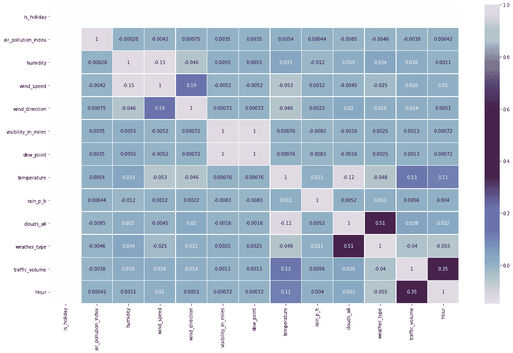
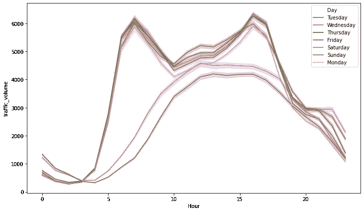
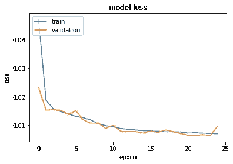

# 流量计数:位置分析

> 原文：<https://medium.com/analytics-vidhya/traffic-count-location-analytics-d7a4fd71cc2f?source=collection_archive---------23----------------------->


桑吉夫·库甘在 [Unsplash](https://unsplash.com?utm_source=medium&utm_medium=referral) 上拍摄的照片

> 你可以拥有没有信息的数据，但你不能拥有没有数据的信息
> 
> 丹尼尔·凯斯·莫兰

在本文中，让我们讨论如何使用传感器记录的数据，或商店的客户发票数据，或任何其他包含特定位置或地点的时间和人员等信息的数据集。

并将这些原始数据转化为可操作的见解，以解决特定的业务问题。

# 用例

*   预测繁忙道路的交通量
*   预测购物中心的高峰时间和繁忙时段
*   预测给定日期和时间机场的人数等。

我们将在这里构建的这个通用模型可以解决许多用例。

人数计数或交通计数可能取决于各种因素，例如一天中的时间或一周中的某一天、天气特征、附近事件等。

我们将带着 UCI 机器学习库的[州际交通流量数据集。](https://archive.ics.uci.edu/ml/datasets/Metro+Interstate+Traffic+Volume)

数据集包含 MN DoT ATR 站 301 的 94 号州际公路西行交通量的每小时信息及其天气特征，如温度、雨等。

***那么，我们来码吧！***

**注意:**在开始编写代码之前，了解您的数据集非常重要。

1.  **将数据集提取到数据帧中**

使用 pandas，将 csv 文件提取到数据帧中。文件格式可能不总是 CSV，因此它也可以获取 JSON、XML 和其他文件格式。

```
import pandas a pd
df = pd.read_csv('Interstate_traffic.csv', sep=",")
```

2.**执行数据转换**

您正在处理的数据可能不是可以直接分析的形式，因此，我们需要转换数据。

```
df.date_time = pd.to_datetime(.date_time)
df['Day'] = df['date_time'].dt.dayofweek.replace([0,1,2,3,4,5,6],['monday','tuesday','wednesday','thursday','friday','saturday','sunday'])
df['Hour'] = train_df['date_time'].dt.hour
```

这里我们从时间戳中提取日期和时间。

将分类数据转换成数字。您可以对其进行一次性编码，或者使用单词嵌入来获得更好的结果。

```
df['weather_type'] = pd.Categorical(df['weather_type'])
df['weather_type'] = df.weather_type.cat.codes
```

可视化相关矩阵，以确定可能影响交通量/交通量的不同因素之间的相关性。



显示其他属性如何影响交通量/计数的相关矩阵



正如我们所观察到的，从上面的图中可以看出，与周末相比，交通流量在工作日有一个明显的峰值。

这些高峰时间被认为是办公时间，因此会影响交通量。

3.**数据缩放**

我们在属性的数量上有很多变化。例如，交通流量可能高达 5000，温度可能在 280–300 之间。

为了解决这个问题，我们将使用最小最大缩放算法来缩放数据。

```
**def** scale(df):
    **return** (df - df.min())/(df.max()-df.min())

**for** col **in** df[['air_pollution_index','humidity','wind_speed','wind_direction','visibility_in_miles','dew_point','temperature','rain_p_h','clouds_all','weather_type','Hour','traffic_volume','Day']]:
    df[col] = scale(df[col])
```

应用最小最大缩放后，我们的数据将只在 0-1 范围内。

4.**将数据分为训练和测试。**

为模型分配输入和输出要素。

```
x = df.loc[:,df.columns != 'traffic_volume'].values
y = train_df['traffic_volume'].values
```

我们将对我们的数据执行 70/30 分割，分别用于训练和测试。

```
x_train, x_test, y_train, y_test = train_test_split(x, y, test_size=0.3)
```

5.**创建和训练模型。**

我们将使用 TensorFlow Keras 高级 API 创建一个神经网络。

我们将使用顺序 API 来构建这个模型。

```
model = tf.keras.Sequential() 
model.add(tf.keras.layers.Dense(13, input_dim = 13, activation = 'relu'))
model.add(tf.keras.layers.Dense(26 , activation = 'relu'))
model.add(tf.keras.layers.Dense(12 , activation = 'relu'))
model.add(tf.keras.layers.Dense(5 , activation = 'relu'))
model.add(tf.keras.layers.Dense(1, activation='linear'))
model.summary()
```

我们已经建立了一个模型，包括 4 个隐藏层和 1 个具有 ReLU 激活的输入层。输出层包含 1 个具有线性激活的神经元，因为它是一个回归模型。

```
model.compile(loss='mse', optimizer='adam', metrics=['mse','mae'])
```

编译模型并为其定义损失度量。

这是回归问题中最常用的两种损失度量。

**平均绝对误差(mae):** 实际值与预测值之差。

**均方误差(mse):** 是实际值和预测值的平方之差。

```
history = model.fit(x_train, y_train, epochs=25, batch_size=15, verbose=1, validation_split=0.2)
```

为模型训练定义超参数，并使用 model.fit()方法启动训练。

## **比较培训和验证之间的损失曲线。**



```
print(history.history.keys())
plt.plot(history.history['loss'])
plt.plot(history.history['val_loss'])
plt.title('model loss')
plt.ylabel('loss')
plt.xlabel('epoch')
plt.legend(['train', 'validation'], loc='upper left')
plt.show()
```

此外，您可以使用 model.predict()方法来预测测试数据的流量，并将它们与实际值进行比较。

这是我的第一篇文章，我希望你喜欢阅读它！

随意分享吧。

欢迎反馈和建议！

***谢谢***