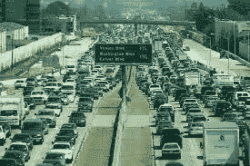
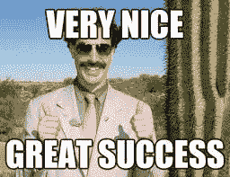
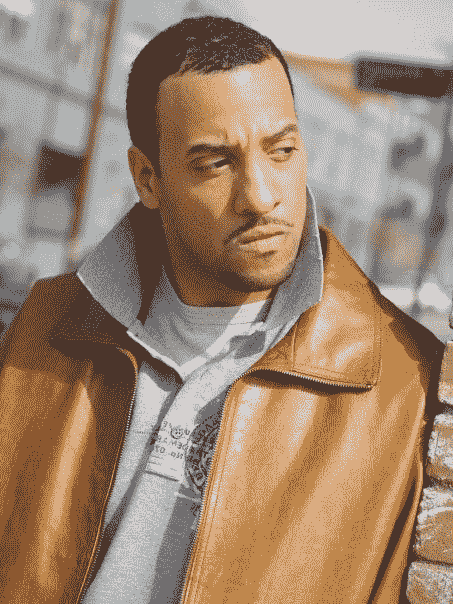

# 人生高速公路堵车！

> 原文：<https://medium.com/analytics-vidhya/traffic-jam-on-lifes-highway-888e710e628d?source=collection_archive---------19----------------------->

1984 年，一个 5 岁的孩子说:“我想成为一名数据科学家！”！尤其是我，一个经常在《梦幻岛》中神智不清的孩子。第一，也许因为这个领域并不存在，就像我们今天所知道的那样，当我们还是孩子的时候，我们真的在考虑融合数学、统计学、商业和计算机吗？第二，在我拥有第一台苹果电脑之前，我就已经决定要成为一名艺人。


是啊！那是我的第一台电脑。我 7 岁生日时父母给我的礼物，因为我在学校表现很好，没有恐吓我的新侄子，因为他抢了我的风头，成了家里的新明星！太神奇了！我是我朋友中第一个拥有电脑的人！我喜欢炫耀它，从我们现在称之为终端的地方运行命令。谁曾想到 15 年后我会开始从事科技职业…好吧，更像是 35 年后。

疯狂的事实是，当我玩够了装扮游戏，并在我 9 岁时创作的百老汇名作之一中扮演我的堂兄弟时，我开始产生兴趣，然后导致痴迷；当我说痴迷的时候…..我的意思是我会花一下午的时间来分析数据和处理结果。我记得在大约 10 岁的时候，我发现了有一串…等等…数字的历书！我来到了城市人口的一部分，这是痴迷的开始。我立刻记住了这个国家十大城市，当时是:

```
us_top10_1980 =['NYC','LA','Chicago','Philadelphia','Houston','Detroit','Dallas','San Diego','Phoenix','Baltimore']
```

相比之下，以下是 2010 年美国十大最受关注的公司:

```
us_top10_2010 = ['NYC', 'LA','Chicago', 'Houston','Philadelphia','Phoenix','San Antonio','San Diego','Dallas','San Jose']
```

比较多…这是 1900 年的人口普查！

```
us_top10_1900 = ['NYC','Chicago','Philadelphia','St. Louis','Boston','Baltimore','Cleveland','Buffalo','San Francisco','Cincinnati']
```

仅供初学者(Python 用户)参考…这些是可以操作的列表，请记住使用括号而不是括号或大括号。不要忘记逗号或撇号。

无论如何，我急切地等待着下一次人口普查，以检查这些数字将如何变化，以及这些数字变化的速度。我渴望更深入的人口统计信息，随着年龄的增长，这种兴趣扩展到教育水平、房屋所有权和种族。然后，作为一个早熟的少年，我发现数据越复杂，我们关于一个城市的崛起或衰落以及整体文化的信息就越多。这有助于解释为什么当时有 100 多万居民的底特律人口在减少，而有同样多居民的达拉斯人口却在迅速增加。

然后是关于大都市地区的信息，这支持了为什么迈阿密比杰克逊维尔或奥兰多更受欢迎，有更多的便利设施，尽管实际的城市规模更小。我会创造平均值……我会操纵数字，想象这样的事情，如果 10 万多硕士学位的人进入这个城市，那么某些关于贫困和失业的数字会发生变化..甚至道路上的交通流量也会发生变化。我会想象一个世界，在那里，我的数据科学方案的解决方案得以实施。这对我来说是最复杂的了，我一点也不知道我是一个崭露头角的数据科学家。

当然，一个被表演迷迷上的 17 岁孩子根本没想过要成为一名科学家…我指的是科学..实际上我去了一所表演艺术高中，我必须通过试镜才能进去。我们的数学和科学只是满足了代数 2 和化学的学区要求，这还不错。我的目标是成为一个家喻户晓的名字，并拥有一个与之相配的银行账户。我已经准备好了我的获奖感言，以及何时开始哭泣的适当提示。


快进大约 10 年…我已经大学毕业，并试图作为一个正常人进入劳动力市场。没用。好莱坞来了。


我放弃了我的第一份工作——精神健康案例经理，去住在肮脏的地方，饿得要死，从一张沙发走到另一张沙发，从一个试镜到另一个试镜，从一个代理到另一个代理……梦想着有一天史蒂文·斯皮尔伯格或斯派克·李会说“是你！”很明显这从来没有发生过，但是我会说我很自豪曾经扮演过一个没有被诅咒的僵尸！

…所以，接下来，是时候享受一些娱乐数据科学的乐趣了。这是我面临的一个非常真实的场景:

我在英格尔伍德的家附近闲逛，在杂货店里逛橱窗，因为我实在买不起任何食物。无论如何，食物对我获得 8 包的追求是一个威胁。我的经纪人在下午 1:38 打电话给我，说她已经为我预订了 2:30 在好莱坞的试镜，并告诉我不要迟到。在一天的这个时候，如果你安全驾驶，好莱坞至少有一个小时的路程。我迅速站起来，抓起我的试镜服、我的大头照和我的太阳镜；洛杉矶人的主食。我开始把走路换成开车，然后我的衣柜改造将在洛杉矶的各种红灯和交通站牌前完成。你试过在红灯时换裤子吗？这并不有趣，但这是一个比弄清楚如何准时参加试镜更容易的困境。

我有三种可能的方式去试镜。走在街道上，美丽的棕榈树沿着 La Cienega 大道，或者臭名昭著的 405 公路，从这里开始将被称为 Carmegeddon，或者两条路的结合！



所以我去了 La Cienega，我可以看看 Carmegeddon 是否太拥挤了。一条畅通无阻的路径需要 35 分钟。在 la Cienega 的一条畅通的小路大约需要 45 分钟。因此，在接下来的一个小时里，我成了一名数据科学家，就像我们所有人在试图到达某个地方时所做的那样。这个难题可以用一个简单的条件函数来解决。

代码如下:

```
Carmegeddon = None
time_to_2nd_405_exit = None
home_to_entrances = 4
hwy405_eta = 35
total_la_Cienega_eta = 45
la_cienega_2nd_leg = 25def project_hollywood():
    if Carmegeddon == False:
        if time_to_2nd_405_exit > 15:
            return home_to_entrances + time_to_2nd_405_exit +                   la_cienega_2nd_leg
        else:
            return home_to_entrances + hwy405_eta
    else:
        return total_la_Cienega_etaprint(f"Chuck makes it in {project_hollywood()} minutes!") if project_hollywood() < 50:
    print('Chuck makes his audition!!!')
elif project_hollywood() <= 50:
    print('Chuck makes it, but continues to starve!')
else:
    print('Chuck pursues Data Science!')
```

首先，我没有给 Carmegeddon 和 second_405_exit 赋值

```
Carmegeddon = None
time_to_2nd_405_exit = None
```

这是因为这些值现在是未知的，我们将在到达高速公路和在高速公路上时填充这些值。最短的路是卡梅吉登。如果 Camegeddon 是清楚的，我会采取 Carmegeddon，直到它再次击中附近的 La Cienega 大道。如果我在某一帧 t <15, I would continue the Carmegeddon route. If I did not make this exit by a certain time, t> 15 到达这个出口，我会放弃卡梅格登，继续穿过第二大街，从相应的出口离开。

然后，我给出了以下每个已知信息变量的平均 eta。

```
home_to_entrances = 4
hwy405_eta = 35
total_la_Cienega_eta = 45
la_cienega_2nd_leg = 30
```

如果 405 高速公路太拥挤，我会将布尔值 True 赋给变量 Carmegeddon，让函数发挥它的魔力。如果为 True，Python 会跳过初始的 If 语句，并在打印第一条打印语句后再次开始处理，这应该是 itt 从家到试听所用的总时间。然后，它接受 project_hollywood 的计算函数的值，并输出与 if 语句对应的适当的打印语句。

如果 Carmegeddon = False，那么我们将在函数 and 中的第一个 If 语句处运行相关的条件语句。然后，它将打印出 2 个语句，到达试镜的实际时间，以及关于时间的注释。

我成功了吗？

让我们用一些实际数字来运行这个函数。

首先，公路看起来很干净，所以让我们设置:

```
Carmegeddon = False
```

交通很快变得繁忙起来，我没有在规定的时间内到达第二个 La Cienega 出口(花了我 19 分 19 秒 15 ),所以我决定离开。我花时间看看即使下车了我是否还能参加试镜。

```
time_to_2nd_405_exit = 19
```

完整的代码块如下所示:

```
Carmegeddon = False
time_to_2nd_405_exit = 19home_to_entrances = 4
hwy405_eta = 35
total_la_Cienega_eta = 45
la_cienega_2nd_leg = 25def project_hollywood():
    if Carmegeddon == False:
        if time_to_2nd_405_exit > 15:
            return home_to_entrances + time_to_2nd_405_exit + la_cienega_2nd_leg
        else:
            return home_to_entrances + hwy405_eta
    else:
        return total_la_Cienega_etaprint(f"Chuck makes it in {project_hollywood()} minutes!") if project_hollywood() < 50:
    print('Chuck makes his audition!!!')
elif project_hollywood() == 50:
    print('Chuck makes it, but continues to starve!')
else:
    print('Chuck pursues Data Science!')
```



```
Chuck makes it in 48 minutes!
Chuck makes his audition!!!
```

所以在所有这些编码和努力之后，你想知道我是否得到了那个角色？不要！但是谁真的想成为威尔·史密斯每周 250 万的替身呢！我宁愿继续在乔氏商店浏览橱窗。



所以这篇博客的目的是向你展示我的生活是如何演变的，以及我是如何将我的爱和好奇心融合在一起的，这构成了我，并给初学者上了一堂编程课。我还想向世界展示，你不必成为一个死忠的技术人员来做这些事情，但你必须对数据和它能做什么有热情和好奇心，足以让你的职业生涯。这显然不是一个失败主义者的博客。我真的相信我们都是多才多艺的，可以在我们感兴趣的任何领域取得成功，还记得我小时候对统计学的痴迷吗？我有如此多的数据科学项目希望继续，并将通过这个博客发表。

记住数据科学回答四个主要问题之一:多少或多少、什么是奇怪的、推荐和分类。上面的高速公路例子就是回归(多少，多少)。

以下是我希望进一步探讨的一些其他主题:

1.  鲍尔兄弟；一个关于篮球的糟糕笑话——数字不会说谎！(回归)

2.迈克尔·菲尔普斯不是人！(异常)

3.三十个人参加了这次试镜，他们看起来都像我！差异中的一课。(分类)

更严重的是…

1.  健康、老年人口和家庭参与水平。
2.  识别面临虐待风险的儿童。
3.  干细胞成功。
4.  解决食物沙漠问题。

目前，这些将满足我的困扰，直到 2020 年的人口普查！保重，稍后再聊！更多有趣的数据科学博客即将推出！