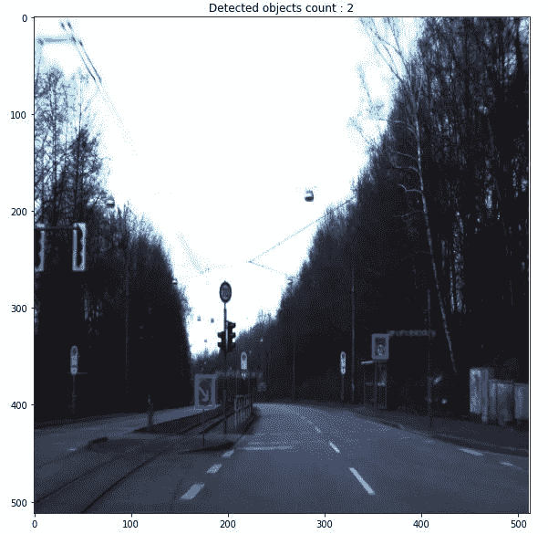
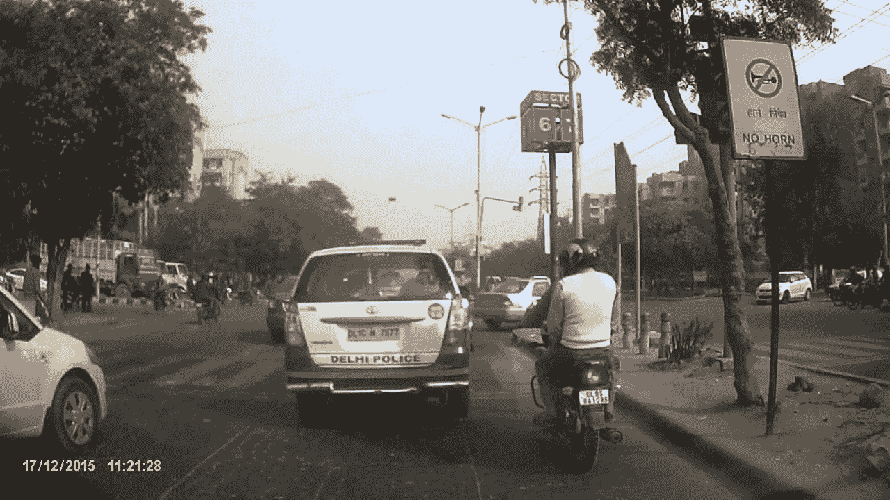
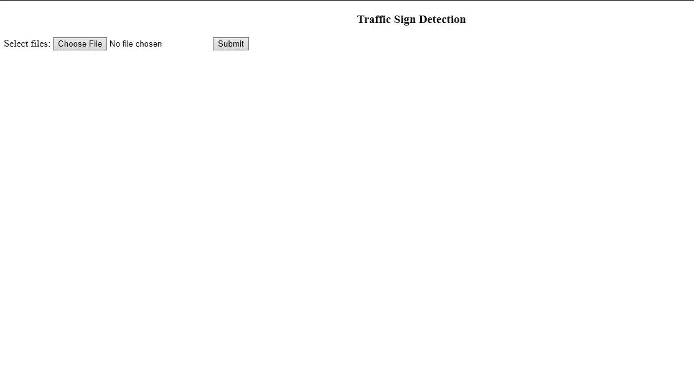
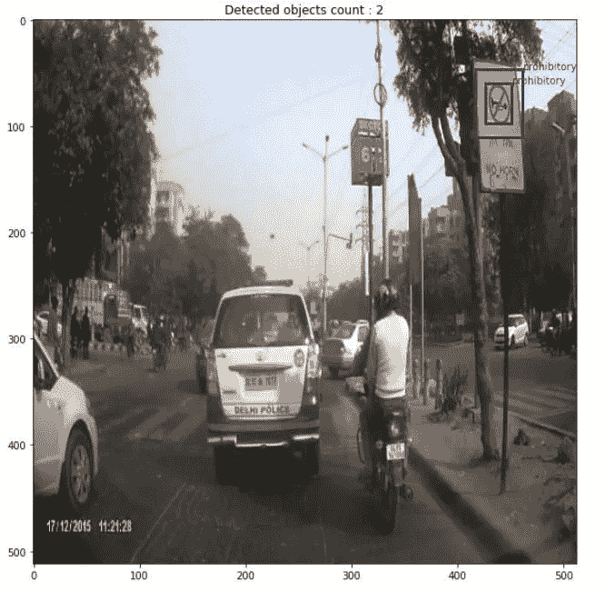

# 基于 YOLOv2 和 Tensorflow 2 的交通标志检测

> 原文：<https://medium.com/analytics-vidhya/traffic-sign-detection-using-yolov2-and-tensorflow-2-e3d5243a6ab2?source=collection_archive---------5----------------------->

参考:[https://gfycat.com/grimyfeistyhornbill](https://gfycat.com/grimyfeistyhornbill)

D eep 学习彻底改变了计算机视觉领域。神经网络被广泛应用于几乎所有的尖端技术，如特斯拉的自动驾驶功能。他们表现得太好了，有时会导致道德问题和冲突。我们今天不会深入讨论这些。让我们来关注一下计算机视觉的一个子类，叫做“检测”。

探测一个物体是什么意思？当我们看到一个物体时，我们可以准确地指出它在哪里，并轻松地确定它是什么。然而对于计算机来说，任务并不简单。多年来，这一直是一个活跃的研究领域，今天仍然如此。在过去的十年里，随着深度学习的出现(而不是复兴)，我们能够取得良好的结果，在一定程度上已经可以使用它的实时场景。

这里我们将使用[德国交通标志检测基准(GTSDB)](http://benchmark.ini.rub.de/?section=gtsdb&subsection=dataset) 数据集。

# 概观

有几种用于检测的神经网络结构

*   R-CNN 系列架构
*   单发探测器
*   YOLO——你只能看一次

我们今天将看到 YOLOv2 的实现(最初 YOLO 架构的一个变种),但不会详细介绍它是如何工作的。

YOLO 带着 Joseph Redmon 等人在 2015 年发表的开创性论文进入了计算机视觉领域。“[你只看一次:统一的实时对象检测](https://arxiv.org/abs/1506.02640)，”并立即引起了计算机视觉研究人员的关注。这是华盛顿大学研究人员 Redmon 在 2017 年的一次 TED 演讲，强调了计算机视觉的艺术状态。

## 什么是 YOLO？

对象检测是计算机视觉中的经典问题之一，在这里，您需要识别什么和在哪里，特别是在给定的图像中有什么对象，以及它们在图像中的位置。目标检测的问题比分类更复杂，分类也可以识别目标，但不能指出目标在图像中的位置。此外，分类不适用于包含多个对象的图像。

YOLO 很受欢迎，因为它实现了高精度，同时还能够实时运行。该算法“只看一次”图像，因为它只需要一次通过神经网络的前向传播来进行预测。在非最大值抑制(确保对象检测算法只检测每个对象一次)之后，它会输出已识别的对象以及边界框。

有了 YOLO，单个 CNN 同时预测多个边界框和这些框的类别概率。YOLO 在全图像上训练，直接优化检测性能。

# 预处理:

在实现 YOLOv2 模型之前，我们必须将数据集准备成 [PASCAL VOC](https://towardsdatascience.com/coco-data-format-for-object-detection-a4c5eaf518c5#:~:text=Pascal%20VOC%20is%20an%20XML,for%20training%2C%20testing%20and%20validation.) 格式。

但是首先我们需要将图像文件(ppm 格式)转换成 jpg 格式。

转换图像文件后，让我们创建 PASCAL VOC 格式的 XML 文件。我们可以通过使用 [PASCAL VOC Writer](https://pypi.org/project/pascal-voc-writer/) 包来完成，或者你可以关注这个[博客](/deepquestai/object-detection-training-preparing-your-custom-dataset-6248679f0d1d)的 GUI。

您还可以根据自己的需要，通过关注这个[博客](https://github.com/italojs/resize_dataset_pascalvoc)来调整图片大小和创建 XML 文件。**(如果您在创建 PASCAL VOC XML 后调整图像大小，则必须根据新图像编辑 XML 文件。)**

# 实施:

让我们先导入必要的库。

现在让我们声明必需的重要参数。

## 定义 YOLO 模型:

## 加载预训练重量:

首先，我们必须从[这里](https://pjreddie.com/media/files/yolov2.weights)为我们的 YOLOv2 架构下载正确的预训练权重文件。

现在让我们加载权重文件。

## **读取数据集:**

下面的代码用于读取数据集，以便我们可以计算数据集中存在的图像数、每个时期的步数和每个时期的图像数。

**读取训练数据集:**

*输出:*

每个时期的步骤=图像数量//批量大小

```
Dataset:
Images count: 506
Step per epoch: 50
Images per epoch: 500
```

**读取验证数据集:**

*输出:*

```
Dataset:
Images count: 235
Step per epoch: 23
Images per epoch: 230
```

## **图像增强:**

图像数据扩充是一种可用于通过在数据集中创建图像的修改版本来人为扩展训练数据集的大小的技术。

图像数据扩充用于扩展训练数据集，以提高模型的性能和概括能力。

# 培训:

现在，让我们针对 1000 个时期训练我们的模型，其中 10 个步骤用于训练时期，2 个步骤用于验证数据集的时期。

```
train(EPOCHS, model, train_gen, val_gen, 10, 2, 'training_1')
```

**保存训练好的模型的权重:**

训练结束后，我们应该保存重量以备将来使用。

```
model.save_weights('traffic.h5')
```

## 测试模型:

培训结束后，是时候测试我们的模型了。

下面的代码用于测试我们的模型。

现在让我们调用上面的函数:

```
x_files =  glob.glob('data/test/*.jpg')score = SCORE_THRESHOLD
iou_threshold = IOU_THRESHOLDscore = 0.65
iou_threshold = 0.3for file in x_files[::]:
    display_yolo(file, model, score, iou_threshold)
```



图 1:检测到的迹象

# 使用 web 应用程序测试模型:

在这里，我们将使用我们的模型测试另一个图像。



图 2:演示图像

现在让我们启动 web 应用程序(使用 Flask 开发)



图 3:索引页面

现在让我们上传图片并点击提交



图 4:检测到的迹象

# 结论:

1.  如果我们增加历元的数量，模型会表现得更好。越多越好。
2.  我们还可以上传视频或使用网络摄像头进行实时检测。

# 参考资料:

1.  原创研究论文: [YOLO9000:更好更快更强](https://arxiv.org/abs/1612.08242)
2.  概念帮助:[应用人工智能课程](https://medium.com/u/bc8571e39021?source=post_page-----e3d5243a6ab2--------------------------------)
3.  数据集:[德国交通标志检测基准(GTSDB)](http://benchmark.ini.rub.de/?section=gtsdb&subsection=dataset)
4.  GitHub 链接:[使用 YOLOv2 的 GTSDB】](https://github.com/sandeeppanda22/GTSD-using-YOLOv2)
5.  领英简介:[桑迪普·库马尔·熊猫](https://www.linkedin.com/in/sandeepkumarpanda/)