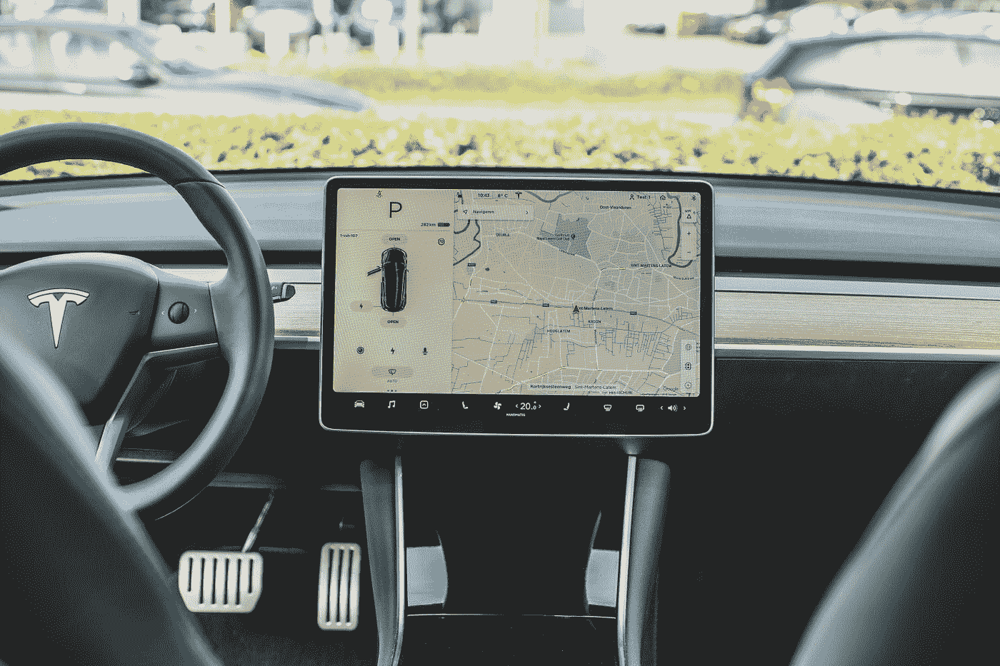

# 自动驾驶汽车的交通标志识别

> 原文：<https://medium.com/analytics-vidhya/traffic-signs-recognition-for-self-driving-cars-6ee30f5dc952?source=collection_archive---------6----------------------->

## 使用 Keras 了解 CNN。

Bram Van Oost 在 [Unsplash](https://unsplash.com?utm_source=medium&utm_medium=referral) 上拍摄的照片

## 内容:

*   动机。
*   了解数据集。
*   步骤 0:导入库和数据集。
*   第一步:数据预处理。
*   第二步:数据可视化。
*   ConvNets 背后的直觉。