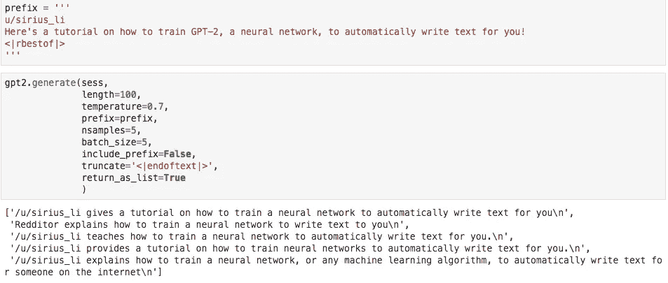

# 训练一个机器人为你写作(不需要编码)

> 原文：<https://medium.com/analytics-vidhya/train-a-robot-to-write-for-you-no-coding-required-a8608fbb9809?source=collection_archive---------13----------------------->

## 没有经验，没有花里胡哨的电脑，没问题。你所需要的只是一个互联网连接。

莎士比亚写哈利波特同人小说。活着是多么美好的时光啊！

2019 年 2 月，一个名为 OpenAI 的组织教会计算机[写出近乎完美的英语](https://www.newyorker.com/magazine/2019/10/14/can-a-machine-learn-to-write-for-the-new-yorker)。他们的语言模型，叫做 GPT-2，是如此强大，以至于他们决定不公开发布。相反，他们推出了三个较小的模型，让我们体验一下什么是可能的，这样我们就有机会做好准备。

虽然 OpenAI 一直在努力工作[与研究机构](https://openai.com/blog/gpt-2-6-month-follow-up/)协调以确保安全措施到位，但我想帮助真正的公众做好准备——你的普通乔、贾马尔、王汝汀和萨利姆——他们可能没有技术经验，但无疑会受到这项技术的影响。

不管你对电脑的熟悉程度如何，我都强烈建议你遵循这个教程或者马克斯·伍尔夫的[稍微高级一点的教程](https://colab.research.google.com/drive/1VLG8e7YSEwypxU-noRNhsv5dW4NfTGce)。我保证你会带着恐惧和力量离开。

之后你可能会想听这首歌

## 首先，示范一下

为了让你知道你能做什么，这里有一个我写的愚蠢的程序(或者我应该说，[它自己写的](https://youtu.be/Y_V6y1ZCg_8)？)阅读 Reddit 评论，并为它们创建令人信服的标题。

## 我的机器人读到了 u/Spencerforhire83 关于屈服于中国压力的公司的评论…

…并生成标题，如:

*   *u/Spencerforhire83 讨论了世界主要品牌如何被发现审查中国文化和政治*
*   *Redditor 列出了审查亲民主网络内容的公司*
*   *u/Spencerforhire83 给出了一个全面的清单，列出了那些行为正在伤害中国人民的公司，以及原因。*

印象深刻吧。现在你可以自己做了！

# 首先你需要想出你希望机器写什么。

也许你讨厌写电子邮件，你想要一个程序，可以完全复制你的写作风格？

也许你希望莎士比亚写了一本哈利波特的书？

也许你想制造自己的假新闻？(请不要这样)

为了彻底起见，本文将通过电子邮件写作的例子。如果你想尽快上手，你可以去[这个教程](https://colab.research.google.com/drive/1Db596SIQKeQ6z-Q5fhXv5jAj7I0ANnRX)在**分钟**内开始训练一个写莎士比亚的机器人。

# 训练电子邮件写作机器人

## 步骤 1:提供数据

要训练这台机器，你需要给它一些学习的例子。这个过程非常简单:创建一个包含你的电子邮件回复的文档。例子越多越好。

尽量让每封邮件都以`<|startoftext|>`开头，以`<|endoftext|>`结尾，这样机器就会知道一封邮件的结尾和另一封邮件的开头。

我现在有点想做一个写电子邮件的机器人…

如果你使用谷歌文档，只需以纯文本格式下载你的文档。txt)文件。

如果你想跳过这一步，直接训练机器，那就继续读下去，做一个写莎士比亚的机器人。

## 第二步:训练！

好了，现在是有趣的部分:去[这个链接](https://colab.research.google.com/drive/1Db596SIQKeQ6z-Q5fhXv5jAj7I0ANnRX)，在那里你会找到一个谷歌协作笔记本，并把它复制到你的硬盘上。

除非创建副本，否则您将无法编辑笔记本

所有的代码都已经为你设置好了，所以你不需要成为一个程序员也能理解！简单地运行所有的**格雷码块**。

这就是运行代码块的方式。你需要对所有的格雷码块都这样做。

继续按照笔记本上的指示做。你最终会到达**第三步:训练时间**。修改下面显示`file_name = “shakespeare.txt”` 的代码块，以匹配您上传的文件的名称(例如，`emails.txt`

更改 shakespeare.txt 以匹配您上传的文件的名称

现在通过运行下一个代码块开始训练过程！(给它大约一个小时来完成。如果您不能运行任何其他代码块，您将知道它仍在运行)

你准备好开始训练了！单击代码块上的 Play 按钮，观看神奇的事情发生。

## 步骤 3:生成新文本

你期待已久的时刻！用您想要开始的文本修改`prefix`代码块。例如，如果你的家人担心会像人类一样写字的机器的后果，你可以生成一封这样开头的电子邮件:

一旦设置了前缀，就运行下一个代码块，然后祈祷好运吧。

这是我的 Reddit 程序中的一个例子

该模型将打印出它认为应该出现在前缀后面的 5 个例子。请记住，结果是不固定的；你可以再次运行，得到非常不同的文本。继续玩不同的前缀，看看你会得到什么！

## 第四步:现在做什么？

您可能已经注意到生成的文本远非完美。抱歉，但是要得到好的结果并不像*那么容易！你还有工作要做，例如:*

*   (推荐)跟随更多的[高级教程](https://colab.research.google.com/drive/1VLG8e7YSEwypxU-noRNhsv5dW4NfTGce)以更好地理解如何根据需要调整代码
*   通过大幅增加`gpt2.finetune`中`steps`的数量，对模型进行更长时间的训练。不过，在增加太多步骤之前，您应该了解如何保存和重新加载您的模型。
*   提供更多培训文本示例
*   通过将`GPT2_MODEL_NAME`设置为`774M`来增加模型的能力(根据[这个线程](https://github.com/minimaxir/gpt-2-simple/issues/108)，现在在 Google Colab 中不起作用)

但是好消息是，你现在已经有了可以利用的基础知识！我鼓励你继续玩笔记本，这样你就可以尽可能多地了解这项令人惊叹的技术。如果你打碎了什么东西，不要担心！这里有一个[新副本](https://colab.research.google.com/drive/1Db596SIQKeQ6z-Q5fhXv5jAj7I0ANnRX)可以重新开始。

***你喜欢这篇文章*** *？请分享！人们对 GPT-2 了解得越多越好。现在，世界上最聪明的人正在讨论普通大众如何从这项技术中受益。普通大众不应该成为对话的一部分吗？您的参与将有助于确保所有人获得公平的结果。感谢阅读！*