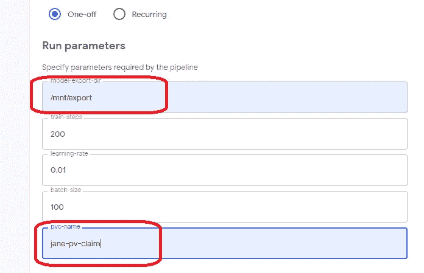
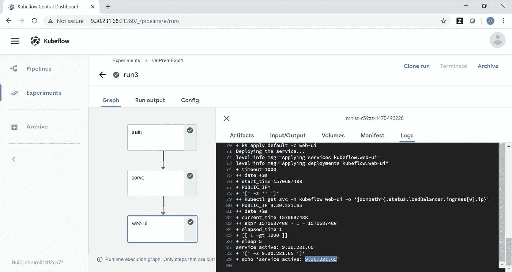
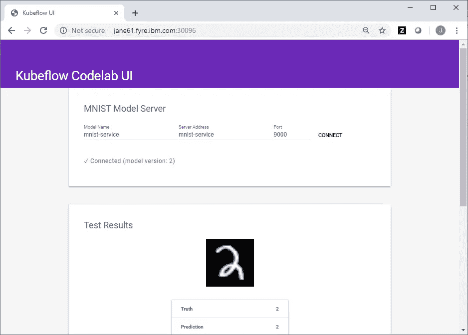

# 在 IBM Cloud Private 中使用 Kubeflow 训练和服务一个 ML 模型

> 原文：<https://medium.com/analytics-vidhya/train-and-serve-a-ml-model-using-kubeflow-in-ibm-cloud-private-ec5b502bd893?source=collection_archive---------14----------------------->

Kubeflow 被称为“Kubernetes 的机器学习工具包”。这是一个开源项目，致力于使 Kubernetes 上的机器学习(ML)工作流的部署简单、可移植和可扩展。

IBM Cloud Private 是一个开发和管理本地容器化应用程序的平台。

MNIST 数据库(改进的国家标准和技术研究所数据库)是大型手写数字数据库之一。它通常用于机器学习培训和测试目的。

在本教程中，我将说明如何使用 IBM Cloud Private 中的 Kubeflow，基于 GitHub 示例为 MNIST 数据库训练和提供 ML 模型。

将涵盖以下主题:

*   先决条件
*   在 IBM Cloud Private 上启用负载平衡器服务
*   为示例应用程序创建 PV 和 PVC
*   源的编译
*   上传到 Kubeflow 中央仪表板并测试

# 先决条件

Kubeflow 安装在 Ubuntu 机器的 IBM Cloud Private 中。如果你还没有这样做，请阅读我的另一篇文章。

在本教程中，我在单节点 Ubuntu 机器上使用 IBM Cloud Private Community Edition

# 在 IBM Cloud Private 上启用负载平衡器服务

如果您已经在 IBM Cloud Private 上启用了 LoadBalancer 服务，则不需要这样做。

默认情况下，IBM Cloud Private 不提供对负载平衡器服务的内置支持。为了在 IBM Cloud Private 上启用 LoadBalancer 服务，我将 LoadBalancer 服务与 MetalLB 一起使用(第 2 层模式)。关于其他选项，请参见[本文](/ibm-cloud/working-with-loadbalancer-services-on-ibm-cloud-private-26b7f0d22b44)。

## 步骤 1:安装金属 1b

```
kubectl create clusterrolebinding privileged-metallb-clusterrolebinding \
 --clusterrole=ibm-privileged-clusterrole \
 --group=system:serviceaccounts:metallb-systemkubectl apply -f [https://raw.githubusercontent.com/google/metallb/v0.7.3/manifests/metallb.yaml](https://raw.githubusercontent.com/google/metallb/v0.7.3/manifests/metallb.yaml)
```

如果遇到图像权限问题，请创建一个名为 image-policy.yaml 的文件，其内容如下:

```
apiVersion: securityenforcement.admission.cloud.ibm.com/v1beta1
kind: ImagePolicy
metadata:
  name: image-policy
spec:
  repositories:
    - name: docker.io/*
      policy: null
    - name: k8s.gcr.io/*
      policy: null
    - name: gcr.io/*
      policy: null
    - name: ibmcom/*
      policy: null
    - name: quay.io/*
      policy: null
```

然后运行以下命令在 metallb-system 命名空间上创建映像策略，并再次安装 metallb。

```
kubectl create -n metallb-system -f image-policy.yamlkubectl apply -f [https://raw.githubusercontent.com/google/metallb/v0.7.3/manifests/metallb.yaml](https://raw.githubusercontent.com/google/metallb/v0.7.3/manifests/metallb.yaml)
```

## 步骤 2:使用第 2 层配置 MetalLB

继续之前，请验证 MetalLB 的 pod 正在运行。

```
kubectl -n metallb-system get pod
NAME                        READY     STATUS    RESTARTS   AGE controller-9c57dbd4-sh2ms   1/1       Running   0          1d
```

然后运行以下命令来配置 MetalLB(请记住使用实际的 IP 地址范围):

```
kubectl create -f - << EOF
apiVersion: v1
kind: ConfigMap
metadata:
  namespace: metallb-system
  name: config
data:
  config: |
    address-pools:
    - name: default
      protocol: layer2
      addresses:
      -  {IP address range}
EOF
```

# 为示例应用程序创建 PV 和 PVC

GitHub 中的[示例应用程序](https://github.com/kubeflow/examples/blob/master/pipelines/mnist-pipelines/mnist_pipeline.py)最初被编写为在 Google 云平台中运行。然后，它被修改为在本地运行。为了在我们的单节点集群中运行应用程序，我们需要创建一个持久卷(PV)和一个持久卷声明(PVC)。

## 步骤 1:创建一个 PV

创建一个名为 jane-pv.yaml(或者您喜欢的任何名称)的 YAML 文件，包含以下内容:

```
apiVersion: v1
kind: PersistentVolume
metadata:
  name: jane-pv-volume
  labels:
    type: local
spec:
  storageClassName: manual
  capacity:
    storage: 10Gi
accessModes:
  - ReadWriteMany
hostPath:
  path: "/mnt/data"
```

运行以下命令来创建 PV:

`kubectl apply -f jane-pv.yaml -n kubeflow`

## 步骤 2:创建 PVC

创建一个名为 jane-pv-claim.yaml(或您喜欢的任何名称)的 YAML 文件，包含以下内容:

```
apiVersion: v1
kind: PersistentVolumeClaim
metadata:
  name: jane-pv-claim
spec:
  storageClassName: manual
  accessModes:
    - ReadWriteMany
  resources:
    requests:
      storage: 3Gi
```

然后运行以下命令创建 PVC:

`kubectl apply -f jane-pv-claim.yaml -n kubeflow`

最后，运行以下命令来检查我们创建的 PV 的状态:

`kubectl get pv jane-pv-volume -n kubeflow`

你应该看到一个“`Bound`状态是这样的:

```
NAME             CAPACITY   ACCESS MODES   RECLAIM POLICY   STATUS    CLAIM                    STORAGECLASS   REASON    AGEjane-pv-volume   10Gi       RWX            Retain           Bound     kubeflow/jane-pv-claim   manual                   3d
```

# 源的编译

我创建了一个名为/root/src 的目录来克隆 GitHub 中的示例。你可以使用任何你喜欢的目录。在编译该示例之前，请确保您已经按照这里或 Kubeflow 官方网站中的[设置了编译环境。](/@janeman98/ibm-cloud-private-community-edition-for-kubeflow-for-beginners-697a044522a)

```
git clone https://github.com/kubeflow/examples.gitcd /root/src/examples/pipelines/mnist-pipelinesconda activate mlpipelinepip install -r requirements.txt –upgradesed -i.sedbak s"/platform = 'GCP'/platform = 'onprem'/"  mnist_pipeline.pypython3 mnist_pipeline.py
```

编译完成后，在`/root/src/examples/pipelines/mnist-pipelines`目录下会创建一个名为`mnist_pipeline.py.tar.gz`的文件。

# 上传到 Kubeflow 中央仪表板并测试

您可以按照此处[的说明](/@janeman98/ibm-cloud-private-community-edition-for-kubeflow-for-beginners-697a044522a)上传您的应用程序，创建一个实验并运行。请输入以下运行参数(其他参数使用默认值)。

*   在“模型-导出-目录”下:`/mnt/export`
*   在“pvc 名称”下:`jane-pv-claim`



对于一次成功的运行，您应该看到如下内容:



在[源文件](https://github.com/kubeflow/examples/blob/master/pipelines/mnist-pipelines/mnist_pipeline.py)中，示例应用程序启动 3 个容器来训练模型、服务模型和测试模型。示例应用的完整描述可在[这里](https://github.com/kubeflow/examples/tree/master/pipelines/mnist-pipelines.)找到。

管道成功运行后，您可以通过运行以下命令找到 web-ui 的 url:

```
kubectl get svc web-ui -n kubeflowNAME      TYPE           CLUSTER-IP   EXTERNAL-IP   PORT(S)        AGEweb-ui    LoadBalancer   10.0.0.50    x.xx.xxx.xx   80:30096/TCP   23h
```

web-ui 在[http://x.xx.xxx.xx:30096/](http://x.xx.xxx.xx:30096/)



现在你可以用不同的输入(手写数字)来玩/测试你的模型。

# 摘要

在本教程中，我展示了如何使用 IBM Cloud Private 中的 Kubeflow，基于 GitHub 示例为 MNIST 数据库训练和服务 ML 模型。如您所见，Kubeflow 管道确实使这一过程变得简单易行。我希望你喜欢阅读本教程，并开始尝试。

# 确认

非常感谢何对 ICP 中负载均衡器的帮助。