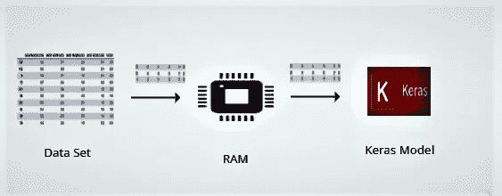
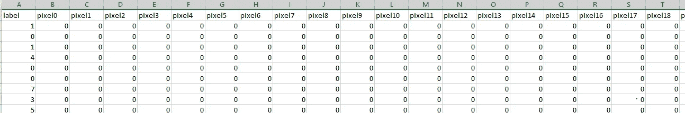

# 用大数据集训练 Keras 模型(批量训练)

> 原文：<https://medium.com/analytics-vidhya/train-keras-model-with-large-dataset-batch-training-6b3099fdf366?source=collection_archive---------4----------------------->



嗨伙计们！！在这篇博客中，我将讨论 Keras 的一个非常有趣的特性。在训练任何深度学习模型时，获得好结果的前提是庞大的训练数据。数据集越大，我们就越能依赖模型。现在的问题是，大部分时间我们都是在有限的资源下工作的，比如内存和 CPU。随着训练数据大小的增加，将它完全放在 RAM 上并进行训练变得困难。在这种情况下，解决这个问题的最佳方法是分批训练模型。训练数据将存储在磁盘中。在每一步中，将从磁盘中取出一块数据，加载到 RAM 中，进行模型训练。然后，同样的过程将再次重复，直到没有数据留给训练。

## fit_generator()参数:

Keras 模型有一个名为 **fit_generator()** 的方法，帮助执行上述批量训练。

[](https://keras.io/models/sequential/) [## 顺序 Keras 文档

keras.io](https://keras.io/models/sequential/) 

```
**fit_generator** (**generator**,steps_per_epoch=**None**, epochs=1, verbose=1,            callbacks=**None**, **validation_data=None**, validation_steps=**None**,    validation_freq=1, class_weight=**None**, max_queue_size=10, workers=1, use_multiprocessing=**False**, shuffle=**True**, initial_epoch=0)
```

它以一个生成器作为参数。该生成器获取一批训练数据，并在单个步骤中将其发送给模型训练。Validation_data 也可以作为生成器传递。根据文件

```
**generator**: A generator or an instance of Sequence (keras.utils.Sequence) object in order to avoid duplicate data when using multiprocessing. The output of the generator must be either- tuple (inputs, targets)
- tuple (inputs, targets, sample_weights). This tuple (a single output of the generator) makes a single batch. Therefore, all arrays in this tuple must have the same length (equal to the size of this batch). Different batches may have different sizes. For example, the last batch of the epoch is commonly smaller than the others, if the size of the dataset is not divisible by the batch size. The generator is expected to loop over its data indefinitely. An epoch finishes when steps_per_epoch batches have been seen by the model.
```

所以我们需要一个生成器来生成一个有两个列表结构的元组——输入和目标。让我们举一个例子来说明上面提到的。

1.  **数据集**

例如，我们将使用 MNIST 数据集作为训练数据。整个数据集分为两部分，保存为 train.csv 和 test.csv。数据如下所示。其中第一列是目标列。其余是像素值



训练数据的维度(42000，784)

测试数据的维度(28000，784)

让我们定义我们的生成器函数，它从上表中批量捕获数据。

```
def batch_generator(Train_df,batch_size,
                    steps):
    idx=1
    while True: 
        yield load_data(Train_df,idx-1,batch_size)## Yields data
        if idx<steps:
            idx+=1
        else:
            idx=1
```

在下面 load_data()函数的帮助下，上面的生成器将在每一步产生批处理

```
def load_data(Train_df,idx,
              batch_size):
    df = pd.read_csv(
                  Train_df, skiprows=idx*batch_size,
                  nrows=batch_size)
    x = df.iloc[:,1:]

    y = df.iloc[:,0] return (np.array(x), np_utils.to_categorical(y))
```

在上面的每个调用中，生成器生成元组(输入，目标)。其中“输入”和“目标”都是长度为“batch_size”的数组

2.**网络架构**

现在让我们用 keras 设计一个简单的神经网络。

```
## importing libraries
from keras.models import Sequential 
from keras.layers import Dense, Activation# some model parameters
output_dim = 10
input_dim = 784batch_size = 256 
nb_epoch = 10
steps_per_epoch=np.ceil(42000/batch_size)
validation_steps=np.ceil(28000/batch_size)### Generator objects for train and validation
my_training_batch_generator = batch_generator('train.csv', 256,steps_per_epoch)
my_validation_batch_generator = batch_generator('test.csv', 256,validation_steps)## Layer 1
model = Sequential()
model.add(Dense(50, input_dim=input_dim, activation='relu'))## Layer 2
model.add(Dense(output_dim, input_dim=50, activation='softmax'))##Compile model
model.compile(optimizer='sgd', loss='categorical_crossentropy', metrics=['accuracy']) 
```

现在，我们将使用 model.fit_generator()代替 model.fit()，并传递 my_training_batch_generator 和 my_validation_batch_generator

```
model.fit_generator(my_training_batch_generator,
epochs=nb_epoch,steps_per_epoch=steps_per_epoch,
 verbose=1, validation_data=my_validation_batch_generator,
validation_steps=validation_steps)
```

我们完了。现在，Keras 模型将使用批量训练数据进行训练，而无需将整个数据集加载到 RAM 中。我们可以通过设置 **use_multiprocessing=True 来获得多重处理的帮助。然后，多个线程将运行以获取不同的数据块并训练模型。最后，结果将被合并。**

今天就到这里吧。快乐学习。