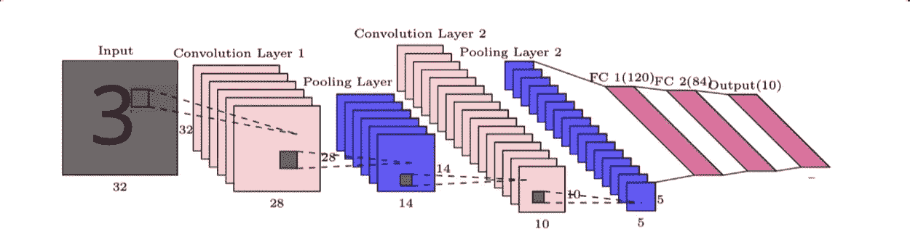
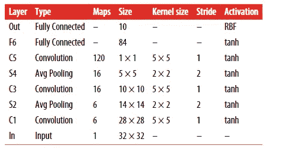
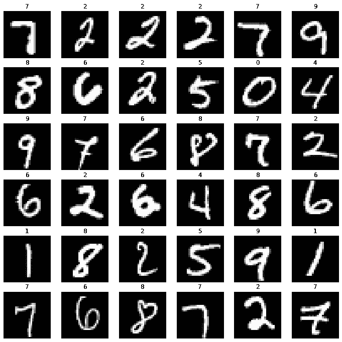
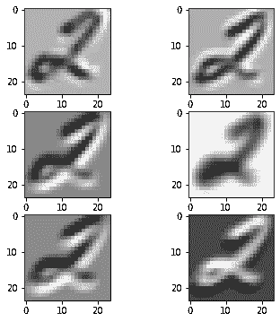
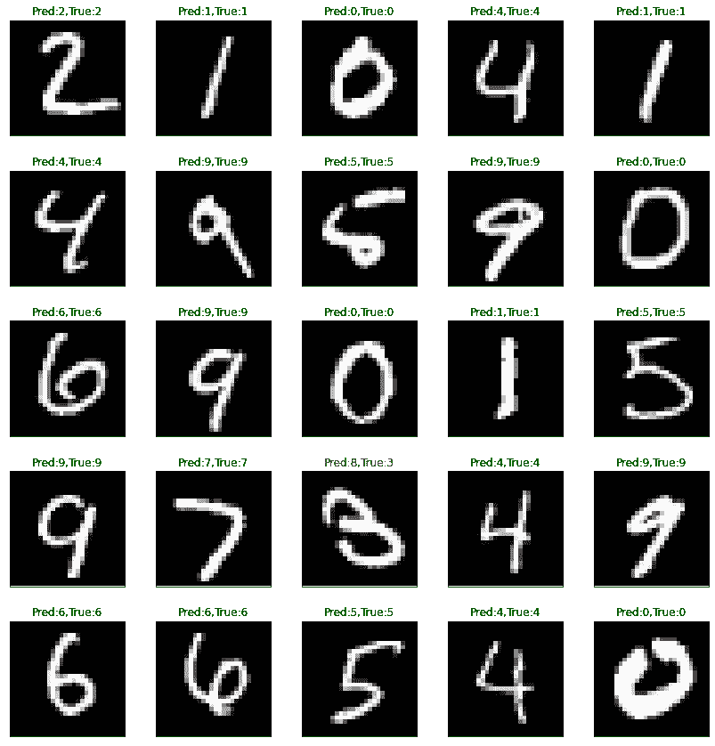

# 在 LeNet 模型上训练 MNIST 数据集

> 原文：<https://medium.com/analytics-vidhya/train-mnist-dataset-on-lenet-model-6180917c85b6?source=collection_archive---------12----------------------->

## 深度学习

## 什么是 MNIST？

*   MNIST 代表修改后的国家标准与技术研究所数据库。
*   MNIST 数据集是一组 70，000 个小数字图像，由高中生和美国人口普查局的员工手写而成。
*   每个图像都标有它所代表的数字。这个集合已经被研究了很多，以至于它经常被称为机器学习的“Hello World ”:每当人们提出一种新的分类算法时，他们都很好奇它在 MNIST 上会有什么表现。每当有人学习机器学习，他们迟早会解决 MNIST。

## 关于数据集

*   MNIST 数据库包含 60，000 幅训练图像和 10，000 幅测试图像。一半的训练集和一半的测试集取自 NIST(美国国家标准与技术研究院数据库)的训练数据集，而另一半的训练集和另一半的测试集取自 NIST 的测试数据集。
*   数据库的最初创建者保留了一份在其上测试过的一些方法的列表。在他们的原始论文中，他们使用 [**支持向量机**](https://en.wikipedia.org/wiki/Support-vector_machine) 得到 0.8%的错误率。2017 年发布了一个类似于 MNIST 的扩展数据集，名为 EMNIST，包含 240，000 张训练图像和 40，000 张手写数字和字符的测试图像。

# LeNet 模型

*   LeNet 是由 [Yann LeCun](https://en.wikipedia.org/wiki/Yann_LeCun) 等人在 1998 年提出的一种 [**卷积神经网络**](https://en.wikipedia.org/wiki/Convolutional_neural_network) 结构。
*   LeNet-5 架构可能是最广为人知的 CNN 架构，用于手写数字识别(MNIST)。它由这些层组成。

*   *MNIST 图像是 28 × 28 像素，但是在馈送到网络之前，它们被零填充到 32 × 32 像素并被归一化。*
*   *网络的其余部分不使用任何填充，这就是图像在网络中前进时尺寸不断缩小的原因。*
*   *平均池层比通常稍微复杂一些，每个神经元计算其输入的平均值，然后将结果乘以一个可学习的系数(每个映射一个)并添加一个可学习的偏差项(同样，每个映射一个)，最后应用激活函数。*
*   *C3 地图中的大多数神经元仅连接到三个或四个 S2 地图中的神经元(而不是所有六个 S2 地图)。*
*   *输出层有点特殊:不是计算输入和权重向量的矩阵乘法，而是每个神经元输出其输入向量和权重向量之间的欧几里德距离的平方。每个输出测量多少图像属于一个特定的数字类。*
*   *交叉熵成本函数现在是首选，因为它对坏预测的惩罚更大，产生更大的梯度，收敛更快。*

> 导入库

> 检查 GPU 可用性

> 下载数据集

O/P:

*   这里 root = '。/data '和 download = True 将下载数据集并将其保存在给定位置。
*   train = True / False 指定数据是训练/测试数据。
*   变换= tr。ToTensors 会将图像转换成张量，我们稍后会在这里看到，我已经评论过了。
*   剩下的只是数据探索

> 加载图像

*   你可以清楚地看到图像轴大约是 28X28。
*   轴不是图像的一部分，matplotlib 用轴的大小初始化每个图形。
*   注意:这里的图像是默认的颜色值，如果我们在 plt.imshow()函数中指定 cmap = 'gray ',我们将得到一个灰度图像。

> 将图像转换成张量并分割训练集

*   现在添加参数 transform = tf。我们正在将图像转换成张量。
*   Pytorch 不知道如何处理图像，所以我们需要在开始时使用 transform 属性。

*   这里，我们将训练集分为训练和验证数据集。
*   正如我们所知**列车组**是计算损失和使用梯度下降调整模型的权重。
*   **验证集**是用于在训练时评估模型，调整超参数(学习率等。)并挑选模型的最佳版本。
*   **测试集**是用于比较不同的模型，或不同类型的建模方法，并报告模型的最终精度。
*   因为没有预定义的验证集，所以我们使用 random_split 来手工验证。

> 加载数据

*   这里我们使用数据加载器类来批量加载转换后的数据集。
*   我们可以根据计算能力选择我们自己的浴槽大小，我们通常倾向于:32、64、128 批次大小
*   参数 shuffle = True 告诉数据加载器类，每次创建批处理时，只需打乱数据，这样在每次迭代训练中，我们都会得到不同的批处理。
*   不需要打乱验证数据和测试数据，因为我们没有训练它们，它们只是用于评估目的。

> 可视化张量转换图像

O/P:

> LeNet 模型

O/P:

*   这是一个 LeNet 体系结构，由两个卷积层、两个池层、三个全连接层和附加在每层之后的 tanh 激活函数组成。

> 创建一个函数来评估我们的模型

> 为我们的 LeNet 模型、损失函数和优化算法创建对象

*   这里我们使用交叉熵损失函数和 Adam 优化器

> 拟合模型并计算训练集和验证集的准确度

O/P:

*   看起来我们的模型有点过拟合，因为它在训练数据集上生成了非常好的准确性，在验证数据集上为 99.78 和 98.57。
*   该图显示了每个时期的损失，我们可以看到，最初损失较高，然后逐渐下降。

> 检查第一个 Conv2d 层上图像的行为

O/P:

*   在这里，我们很好地理解了当图像通过多层卷积时，它是如何变换的。

> 让我们在测试集中检查我们模型的预测

O/P:

*   在这里，我们正在可视化我们的测试数据集，并检查我们的模型与我们的模型以前没有见过的图像有多好。
*   在 predict_image 函数中，我们希望输出是模型的预测。
*   此外，我们使用 matplotlib 库来绘制带有实际和预测标签的测试图像，绿色表示匹配条件，红色表示失败条件。
*   看起来我们的模型做得很好，在 25 个图像槽中，它只是给出了一个错误的预测。

> 保存我们的模型

**参考文献:**

*   【https://www.guvi.in/(AI 与深度学习认证课程)
*   【https://www.jovian.ml/ (py torch 深度学习)
*   用 Scikit 动手机器学习(参考书，PDF-[*https://drive . Google . com/file/d/16 ddwf 4k igi 47 ky 7 q _ B-4 aapvmyw 2 evjz/view？usp =分享*](https://drive.google.com/file/d/16DdwF4KIGi47ky7Q_B-4aApvMYW2evJZ/view?usp=sharing) )。