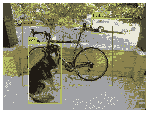

# 在 colab 上训练 yolo 面罩检测器

> 原文：<https://medium.com/analytics-vidhya/train-yolo-on-colab-3ce1d3cfdc6?source=collection_archive---------22----------------------->



YOLO

要求

要培训 Yolo，您需要以下文件

> **。cfg** 文件(根据类别号修改 yolo-voc.2.0.cfg)，
> T3。数据文件**，
> 。名称**文件**，
> train.txt** (训练数据集)**，
> test.txt** (测试数据集)**，**
> 
> **图片文件夹(image.jpg image.txt)**

让我们开始制作这些文件吧

[](https://www.kaggle.com/alexandralorenzo/maskdetection) [## YOLO 格式的屏蔽检测

### 面具/无面具人脸和人群的标签图像

www.kaggle.com](https://www.kaggle.com/alexandralorenzo/maskdetection) 

对于这个博客，我使用上面的面具检测数据集，你也可以使用你的自定义数据集。

如果你已经有了数据，打开笔记本，开始训练你的模型。看图将所有文件放在正确的位置


[http://blog.ibanyez.info/download/B20190410T000000072.png](http://blog.ibanyez.info/download/B20190410T000000072.png)

**yolo-voc.2.0.cfg**

这个文件有 yolo 模型的配置，我们不必深入了解，我们必须在这个文件中更改类和过滤器

```
change classes=20 with your length of class
change filters=125 with (classes + 5) * num like if you have two classes (2 + 5) * 5 = 35
```

如果你想使用 yolov3.cfg 公式将改变

```
filters = (classes+5) * 3
```

对象数据

在这个文件中，你必须写类的数量，你的 train.txt，test.txt 和 obj.names 文件的路径。备份是您想要存储模型的文件夹。

```
classes = 2 
train = train.txt 
valid = test.txt 
names = obj.names 
backup=backup/
```

名称

这个文件包含你的类名。

```
Mask 
Without_mask
```

**train.txt**

该文件包含您的图像的路径

```
data/images/train/195.jpg
data/images/train/asian_mask122.jpg
data/images/train/asian_mask181.jpg
....
```

**图片文件夹**

*   图像文件夹包含训练/测试/有效文件夹
*   每个文件夹包含一个相同名称的图像文件和文本文件，如 195.jpg 195 . txt

现在，如果你有数据，让我们开始训练

用于培训这里是我在 Google Colab [上的 jupyter 笔记本 https://Colab . research . Google . com/drive/1 ehrflzoloxe 0-ols ebt 54 umo 8s 77 QQ 4t？usp =共享](https://colab.research.google.com/drive/1X8JjnpPi3TD48OKiQ2-1LnsTFE5QQmGB?usp=sharing)

按照笔记本来训练您的数据集。

如果你喜欢这篇文章，点击给我买杯咖啡！感谢阅读。

[](https://www.payumoney.com/paybypayumoney/#/147695053B73CAB82672E715A52F9AA5)

你的每一个小小的贡献都会鼓励我创造更多这样的内容。