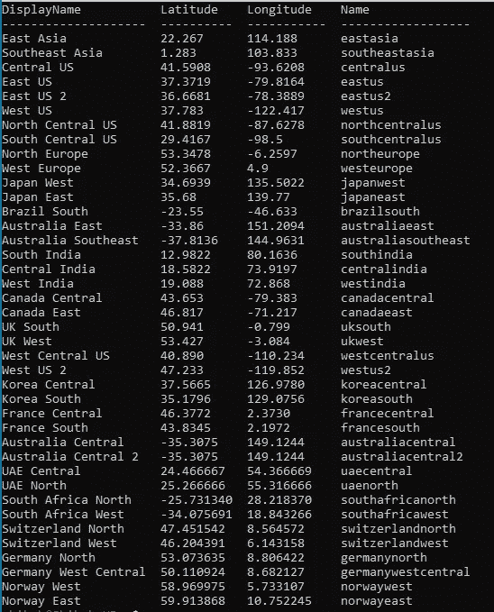
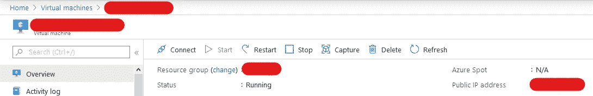

# 在 Azure VM 中训练你的深度神经网络

> 原文：<https://medium.com/analytics-vidhya/train-your-deep-neural-network-in-azure-vm-2bdc418405f8?source=collection_archive---------10----------------------->


照片由 [**威廉·乔奎特**](https://www.pexels.com/@willpicturethis?utm_content=attributionCopyText&utm_medium=referral&utm_source=pexels) 发自 [**派克斯**](https://www.pexels.com/photo/an-on-treadmill-1954524/?utm_content=attributionCopyText&utm_medium=referral&utm_source=pexels)

训练深度神经网络需要高计算资源，特别是非常高端的 GPU。但是建造这样一台强大的机器是非常昂贵的，而且在很多情况下是不可行的。亚马逊(Amazon)、GCP (Google)、微软(Microsoft)等云服务提供商来拯救我们了。他们在云中提供强大的虚拟机，预装了所有驱动程序和大多数流行的深度学习软件和框架，因此您无需担心自己设置任何东西。你将按小时付费，这比建造一台本地机器要便宜得多。

在这篇文章中，我将指导你在 Azure 中创建一个虚拟机(VM)来训练 AI 模型。

# Azure 帐户

您首先需要一个 Azure 帐户。如果你还没有帐户，注册 Azure。你将获得 30 天免费的 200 美元信用额度来试用所有不同的 Azure 服务。或者，如果你是一名学生，并且有一个学术电子邮件，你可以注册“ [Azure for Student](https://azure.microsoft.com/en-us/free/students/) ”优惠活动，该活动将为你提供为期 1 年的 100 美元免费积分。你将被收取虚拟机，所以你需要有一些信贷。

# Azure CLI

我们将使用 Azure CLI(命令行界面)来创建和使用虚拟机。Azure CLI 可在您的 Azure 门户网站的 web 浏览器中访问，或通过此[链接](https://shell.azure.com)，或从您的终端(Linux、Mac)、命令提示符和 powershell (Windows)访问。如果您想从终端、cmd 或 powershell 使用它，您需要首先在您的计算机中安装它。

如果您习惯使用浏览器中的 CLI，您可以跳过安装步骤，但对我来说，这种体验是滞后的，所以我更喜欢从终端使用它。

对于 Linux，运行以下命令(仅针对 Ubuntu 16.04+和 Debian 8+进行验证。如果它在您的发行版中不起作用，请尝试来自[官方文档](https://docs.microsoft.com/en-us/cli/azure/install-azure-cli-apt?view=azure-cli-latest)的手动安装说明

```
curl -sL [https://aka.ms/InstallAzureCLIDeb](https://aka.ms/InstallAzureCLIDeb) | sudo bash
```

对于 Windows，打开 powerShell 并运行以下命令，

```
Invoke-WebRequest -Uri [https://aka.ms/installazurecliwindows](https://aka.ms/installazurecliwindows) -OutFile .\AzureCLI.msi; Start-Process msiexec.exe -Wait -ArgumentList '/I AzureCLI.msi /quiet'; rm .\AzureCLI.msi
```

安装完成后重新启动 powershell 以使用 Azure CLI。

对于 Mac 来说，

```
brew update && brew install azure-cli
```

安装完成后，在您的终端/cmd/powershell 中运行下面一行来登录。

```
az login
```

# 正在创建虚拟机

你可以创建任何运行 Windows 或 Linux 的虚拟机，但最好的方法是在 Azure 上使用 DSVM(数据科学虚拟机)映像，因为它会预装所有必要的机器学习工具，所以你不必担心任何事情。我们将在这里使用 DSVM 映像。

1 打开你的终端/命令提示符/powerShell/Azure CLI。我们将在当前工作目录下创建一个名为“ *parameter_file.json* ”的 *json* 文件。使用你喜欢的任何文本编辑器(VS Code，Sublime，Atom，nano 等)创建文件。这里，我使用的是 VS 代码(它也可以在“浏览器”环境中使用)。为了打开当前目录中的 VS 代码，我将运行下面的命令，

```
code .
```

2 将下面的代码保存在 *json* 文件中。

```
{ 
  "$schema": "[https://schema.management.azure.com/schemas/2015-01-01/deploymentParameters.json#](https://schema.management.azure.com/schemas/2015-01-01/deploymentParameters.json#)",
  "contentVersion": "1.0.0.0",
  "parameters": {
     "adminUsername": { "value" : "<Your username here>"},
     "adminPassword": { "value" : "<Create a PASSWORD for user>"},
     "vmName": { "value" : "<your vm name, unique>"},
     "vmSize": { "value" : "A proper size from the list"},
  }
}
```

相应地编辑“adminUsername”、“adminPssword”、“vmName”和“vmSize”的值(删除“”)。例如，在本文的其余部分，我将使用虚拟机名称“azuretestvm925”。想用什么就用什么。密码必须至少包含一个大写字母、一个数字和一个符号字符。

“vmSize”很重要。这定义了您希望虚拟机拥有多少资源(CPU、RAM、存储、GPU)。检查此[列表](https://docs.microsoft.com/en-us/azure/virtual-machines/linux/sizes)并根据您的需要选择尺寸。对于基于 GPU 的虚拟机，我选择“Standard_NC6”大小，这是基本大小。请记住，不同的尺寸当然价格不同。价格可以查看这个[链接](https://azure.microsoft.com/en-us/pricing/details/virtual-machines/linux/)。以下是包含所有值的代码示例。

```
{ 
  "$schema": "[https://schema.management.azure.com/schemas/2015-01-01/deploymentParameters.json#](https://schema.management.azure.com/schemas/2015-01-01/deploymentParameters.json#)",
  "contentVersion": "1.0.0.0",
  "parameters": {
     "adminUsername": { "value" : "nazmul"},
     "adminPassword": { "value" : "Secretpassword1#"},
     "vmName": { "value" : "azuretestvm925"},
     "vmSize": { "value" : "Standard_NC6"},
  }
}
```

接下来，我们需要创建一个资源组。但是首先我们需要选择一个区域来创建组。地域很重要。并非所有区域都具有我们在步骤 2 中定义的所有虚拟机大小。因此，您需要选择一个具有您之前定义的 vmSize 的区域。例如，我将“vmSize”选择为“Standard_NC6”。英国南部是拥有这种 vmSize 的地区之一。所以我会把地点选在英国南部。要获得位置名称的列表，请运行下面一行。

```
az account list-locations -o table
```



从最右边的列中选择适当的名称。然后运行以下命令，

```
az group create --location uksouth --name deep-learning-dsvm
```

将“uksouth”替换为您选择的位置名称。“deep-learning-dsvm”是我正在创建的资源组的名称，你可以给它取别的名字。

现在，我们将在我们的资源组中创建我们的虚拟机。运行以下命令，

```
az deployment group create --resource-group deep-learning-dsvm --template-uri https://raw.githubusercontent.com/Azure/DataScienceVM/master/Scripts/CreateDSVM/Ubuntu/azuredeploy.json --parameters parameter_file.json
```

如果您将资源组命名为“deep-learning-dsvm”以外的名称，请确保在“- resource-group”参数中使用该名称。

控制台会暂时显示`- Running ..`。当操作完成时，将显示一个 JSON 响应。检查字段“provisioningState”的值“Succeeded”是否如其所言。现在您有了一个正在运行的虚拟机。

5 我们必须打开端口 22，通过 ssh 连接到虚拟机。所以运行下面的命令，

```
az vm open-port -g deep-learning-dsvm -n azuretestvm925 --port 22 --priority 900
```

和往常一样，在“-g”后面使用您的资源组名称，如果您的名称不同，则使用您的 vmName 代替“azuretestvm925”。输出将是一个 JSON 响应，检查字段“provisioningState”的值是否为“Succeeded ”,以进行确认。

6 为了访问虚拟机中的 Jupyter 笔记本并进行远程连接，我们需要打开另一个端口 8888，默认情况下，该端口由 Jupyter 笔记本服务器使用。运行以下命令，

```
az vm open-port -g deep-learning-dsvm -n azuretestvm925 --port 8888 --priority 901
```

如果您的资源组名称和虚拟机名称不同，请更改它们。

# 连接到虚拟机

现在您的 VM 正在运行，您可以使用安全 Shell (ssh)连接到它。您需要虚拟机的公共 IP 地址。要首先找到 IP 地址，请使用正确的组名和虚拟机名运行以下命令，

```
az vm list-ip-addresses -g deep-learning-dsvm -n azuretestvm925 --output table
```

现在使用您的用户名(在 *"parameter_file.json"* 文件中定义)和 IP 地址登录虚拟机。例如，我将用户名定义为“nazmul ”,假设 IP 地址是 33.165.103.23。然后，我将运行以下命令来登录虚拟机。

```
ssh nazmul@33.165.103.23
```

出现提示时，输入您在 *"parameter_file.json"* 文件中定义的密码。您的提示应该更改为 VM，您现在所做的任何事情都将在您的 VM 中执行。

# 启动 Jupyter 笔记本

当您通过 ssh 登录到您的虚拟机时，运行以下命令来启动 Jupyter notebook server。

```
jupyter notebook --ip=0.0.0.0 --no-browser --allow-root
```

您的 Jupyter 服务器将启动，在控制台中，您将看到一个 URL，您可以在 web 浏览器中浏览该 URL 以访问 Jupyter 笔记本。复制链接，粘贴到浏览器的地址栏中。如果你按下回车键，你会得到“网站无法到达”的信息。下面的格式需要稍微修改一下地址，(不要碰后面的部分:8888，只修改 IP 部分)

```
http://<public IP Here>:8888/?token={some token}
```

在“http://”和“:8888”之间，用您的虚拟机的公共 IP(您用来 ssh 到您的虚拟机的 IP)替换任何内容。例如，如果我们的 IP 地址是 33.165.103.23，地址栏将如下所示，

```
http://33.165.103.23:8888/?token={some token}
```

现在做你想做的事。创建您自己的笔记本，训练您的模型。完成后，要退出 Jypyter 服务器并返回到您的提示符，请按 ctrl+c(按两次跳过确认)。

请记住，**不要在不使用虚拟机的时候让它一直运行**。即使您没有使用虚拟机，也要为虚拟机的运行时间付费。阅读以下部分，了解如何正确关闭您的虚拟机，这样您就不会被收费。

# 使用已创建的虚拟机

您不需要在每次需要使用时都创建新的虚拟机。不用的时候可以关机，需要的时候再打开。但是有两种方法可以关闭它。一个完全按照你的要求去做，让虚拟机保持关闭，让你免受指控。另一个只是关闭虚拟机，你仍然被收费。因此，请仔细阅读以下说明。

要获取有关虚拟机的信息，请运行以下命令。“powerState”字段将为您提供 vm 正在运行、停止或解除分配的信息(稍后解释)。

```
az vm show -d --name azuretestvm925 --resource-group deep-learning-dsvm --output table
```

要停止 VM，您可以运行以下命令(在命令中的-g 后面使用您自己的资源组名称，在-n 后面使用 VM 名称)，

```
az vm stop -g deep-learning-dsvm -n azuretestvm925
```

如果您通过运行此命令关闭虚拟机，您的虚拟机将被“停止”,但资源仍将保持分配给您的虚拟机。因此，即使虚拟机被关闭，您也将被收费，因为微软仍然保留连接到您的虚拟机的资源，并且不能使用它来服务其他客户端。

如果您关闭虚拟机的时间较短，并且会很快恢复，这可能会有所帮助。

第二种方法是“解除分配”,这将使你免于被收费。为此，使用正确的资源组名称和虚拟机名称运行以下命令，

```
az vm deallocate -g deep-learning-dsvm -n azuretestvm925
```

这将从您的虚拟机中释放资源，以便 Microsoft 可以使用这些资源为另一个客户端提供服务。所以你不会被起诉。

可能会要求您登录。如果是，运行`az login`并遵循屏幕上的指示。

要再次打开虚拟机，请使用正确的资源组名称和虚拟机名称运行以下命令，

```
az vm start -g deep-learning-dsvm -n azuretestvm925
```

您也可以从 Azure 门户网站停止虚拟机。导航到主页>虚拟机>您的虚拟机名称>概述，您将看到一个停止按钮，该按钮将取消分配资源。您也可以按“开始”按钮再次运行它。



从 Azure 门户管理虚拟机

**等等！**你仍然会被收费，虽然不是针对虚拟机，而是针对虚拟机中保存你的持久数据的存储。尽管这个成本非常小。但是，如果您的虚拟机中没有您以后必须使用的文件，您应该清除这些资源，这样您就不会被收取任何不必要的费用。要删除所有内容，请运行以下命令(使用正确的资源组名称)，

```
az group delete --name deep-learning-dsvm
```

这将删除所有内容。下次您需要训练新模型时，只需创建另一个虚拟机。