# 用 DDPG 训练双关节手臂——深度强化学习

> 原文：<https://medium.com/analytics-vidhya/training-a-double-jointed-arm-with-ddpg-deep-reinforcement-learning-e25529a5915b?source=collection_archive---------18----------------------->

今天我们将看到另一种强大的深度强化学习算法。

重要的是你能知道关于深度强化学习的基础知识，你可以看我上一篇文章[这里](/analytics-vidhya/collecting-bananas-with-drl-agent-bdd8bf216d11?source=friends_link&sk=c1c829667c90e9a535af585864f083f2)(用深度强化学习收集香蕉)。

在我们开始之前，我将与您分享一些关于深度强化学习的更多信息。很快，我保证！

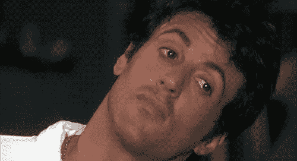

# 理论第一

强化学习是来自人工智能的一个子类，这个子类有不同类型的算法。

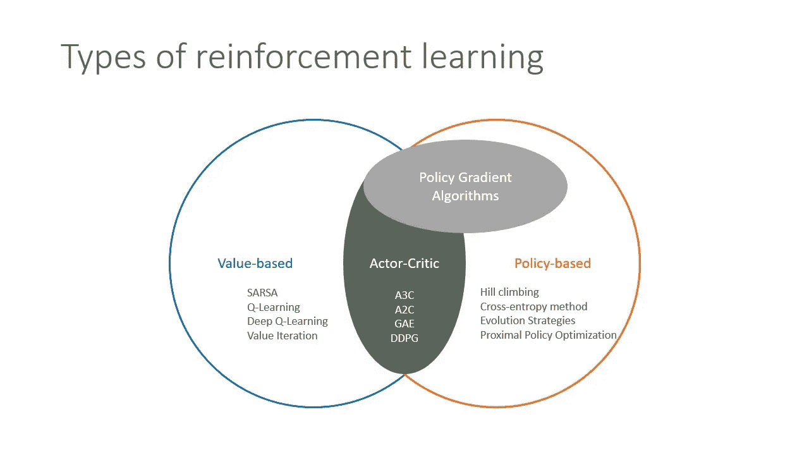

强化学习的类型

了解这些类型很重要，因为每种类型都有自己的学习方式。

## 基于价值的

估计最优值函数 *Q* (s，a)。*

这是在任何策略下都能达到的最大值。

## 基于政策

直接搜索最优策略 *π** 。

这是实现未来最大回报的政策。

## 演员兼评论家

我们结合了基于价值和基于政策的方法。

行动者基于政策，批评者基于价值。

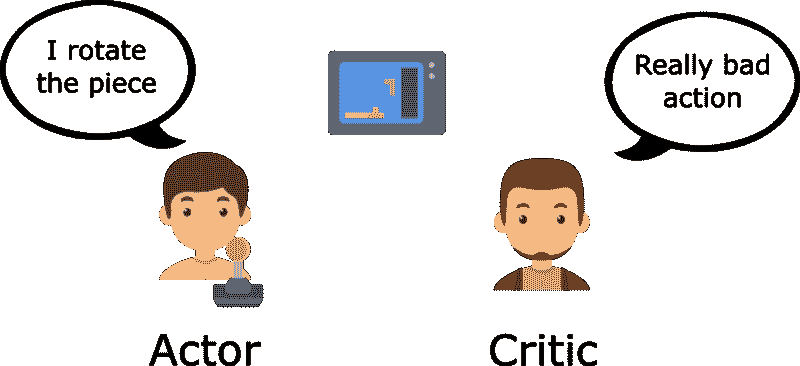

[优势演员评论方法简介:我们来玩刺猬索尼克吧！](/free-code-camp/an-intro-to-advantage-actor-critic-methods-lets-play-sonic-the-hedgehog-86d6240171d)

在这个项目中，我使用了演员-评论家的方法。选择的算法是 DDPG(深度确定性策略梯度)。

与强化学习的基本方法相比，DDPG 的工作方式略有不同。我们将在代理内部有两个神经网络。

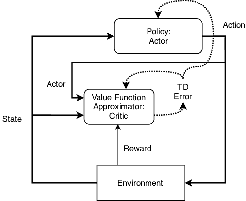

现在，让我们进一步了解环境和双关节臂！

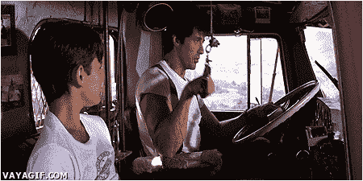

嗯，我们这里的环境比上面的 GIF 要好。我用了 Unity 的 Reacher 环境。

# 环境

在这种环境下，双关节手臂可以移动到目标位置。

第一个版本包含单个代理。

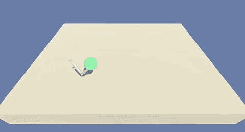

第二个版本包含 20 个相同的代理，每个代理都有自己的环境副本。

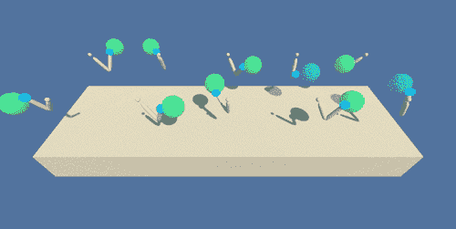

对于这种环境，DDPG 是一个很好的方法，因为我们可以有不止一个代理。我们可以向所有代理学习，也可以与所有代理分享知识。

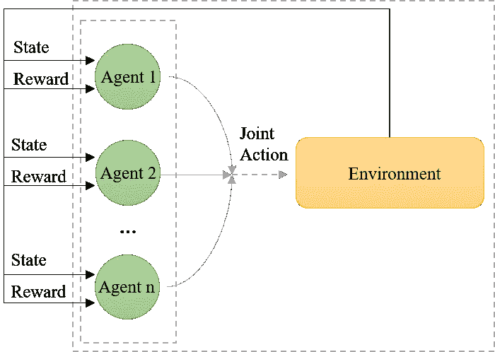

[多智能体系统的深度强化学习](https://www.groundai.com/project/deep-reinforcement-learning-for-multi-agent-systems-a-review-of-challenges-solutions-and-applications/1)

## 状态矢量空间

观察空间由 33 个变量组成，对应于手臂的位置、旋转、速度和角速度。

## 行动

每个动作都是一个有四个数字的向量，对应着适用于两个关节的扭矩。动作向量中的每个条目都应该是介于-1 和 1 之间的数字。

## 报酬

代理人的手在目标位置的每一步提供+0.1 的奖励。因此，代理的目标是在尽可能多的时间步长内保持其在目标位置的位置。

为了解决这个环境，我们需要在最后 100 集有 30+的分数。

# 代理体系结构

在这个项目上创建的代理由一个带有**演员模型**的**代理**，一个**评论家模型**，一个**探索策略**和一个**存储单元**组成。

## **代理人**

代理具有与环境交互的方法:`step()`、`act()`、`learn()`等。

行动者模型、批评家模型、探索策略和记忆单元将是代理的一部分(作为属性)。

## **演员模型**

这个神经网络有三层。

**输入层**将接收状态空间中的所有 33 个特征。

**输出层**将根据动作空间的要求提供一个 4 元素的数组。

```
Actor(
(fc1): Linear(in_features=33, out_features=256, bias=True)     (fc2): Linear(in_features=256, out_features=128, bias=True)     (fc3): Linear(in_features=128, out_features=4, bias=True)
)
```

## 批评家模型

对于 Critic 神经网络，我们也有 3 层。

**输入层**将接收状态空间中的所有 33 个特征。

**输出层**将只提供一个值来指导演员模型的学习。

```
Critic(
(fc1): Linear(in_features=33, out_features=256, bias=True)
(fc2): Linear(in_features=260, out_features=128, bias=True)
(fc3): Linear(in_features=128, out_features=1, bias=True)
)
```

这些神经网络是 https://pytorch.org/用[开发的](https://pytorch.org/)

## **存储单元**

通过两种简单的方法`add()`和`sample()`，该存储器可以存储经验，也可以返回一些随机的经验用于代理培训。

## 勘探政策

探索策略对我们的代理很重要，因为它将帮助代理尝试几种行动结果，并避免在局部最小值上停止。

我的探索政策基于[奥恩斯坦-乌伦贝克过程](https://en.wikipedia.org/wiki/Ornstein%E2%80%93Uhlenbeck_process)。

现在，让我们看看我们的多智能体 DDPG 算法如何解决这个环境。

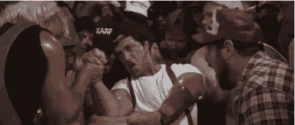

我的手臂训练得很狡猾！

多智能体方法每集都要花很长时间，你知道，我们有几个计算要做，两个神经网络要学习，但我们用 56 集完成了这个环境！

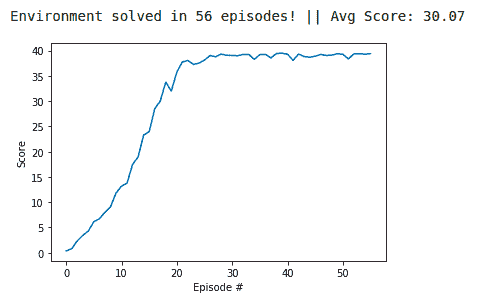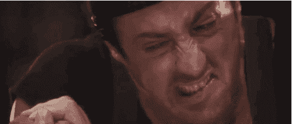

我的代理人当我们完成了环境

你可以在我的 GitHub 的仓库里找到代码。

[](https://github.com/DougTrajano/ds_drl_continuous_control) [## DougTrajano/ds _ drl _ continuous _ control

### 这个项目包含一个基于深度强化学习的代理，它可以从零(无标记数据)学习到…

github.com](https://github.com/DougTrajano/ds_drl_continuous_control) 

# 对未来工作的想法

## 超参数的新组合

这种算法需要太多的时间来学习，测试几个超参数的组合非常复杂，但是我们可以继续训练过程来找到最优的超参数。

## 实施优先体验重放

如果你读了我的上一篇文章，你就会知道我在那里使用了优先体验重放。这种记忆非常好，可以为代理提供我们在培训过程中受益更多的经验，但这会增加代理的培训时间。

这个优先化的存储器在这里被描述为。

## 改变勘探政策

我使用了 DDPG 最初的作者推荐的奥恩斯坦-乌伦贝克过程，但最近的论文说，我们使用奥恩斯坦-乌伦贝克过程而不是高斯噪声没有好处。大概是可以提高代理性能吧。

那都是乡亲们！非常感谢您阅读它，不要忘记在下面发送您的评论！