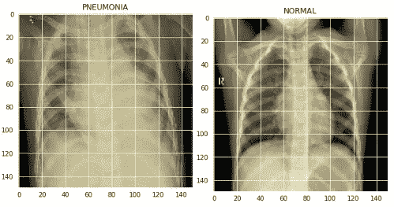
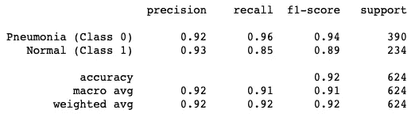
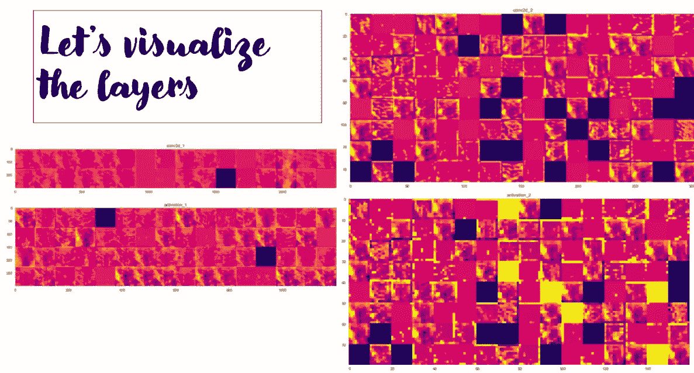

# 训练神经网络以识别 X 射线中的肺炎

> 原文：<https://medium.com/analytics-vidhya/training-a-neural-network-to-identify-pneumonia-in-x-rays-e05a27982443?source=collection_archive---------2----------------------->

[](https://github.com/roydipta/xray_pneumonia) [## 罗伊迪普塔/x 射线肺炎

### 熨斗模块 3 项目迪普塔罗伊和阿维丹伯曼。肺炎是一种感染，会使一个或多个器官的气囊发炎。

github.com](https://github.com/roydipta/xray_pneumonia) 

在 COVID 时代，特别是在疫情的初期，没有广泛的测试来判断一个人是否有病毒。医生能够猜测一个人是否患有 COVID 的一种方法是通过肺部的 x 射线，并查看这个人是否有肺炎的迹象。

**什么是肺炎？**

肺炎是一种感染，使一个或两个肺部的气囊发炎。气囊可能会充满液体或脓，这可能会导致咳嗽、发烧、发冷和呼吸困难。包括细菌、病毒和真菌在内的有机体会导致肺炎。


**潜在肺炎迹象:**

下图显示了正常肺和肺炎肺在 x 线上的区别。通常肺部充满空气，不吸收 X 射线，所以它看起来是黑色的，这在正常图像中可以看到。骨头吸收 x 光，呈现白色。液体或组织显示为灰色。



**导入库和下载数据:**

让我们从 kaggle 下载数据:[https://www . ka ggle . com/paultimothymooney/chest-x-ray-pneumonia](https://www.kaggle.com/paultimothymooney/chest-xray-pneumonia)

然后，我们需要导入项目将使用的所有必要的库！我们将使用 keras 来完成神经网络的实质性工作。

```
**import** **matplotlib.pyplot** **as** **plt**
**import** **seaborn** **as** **sns**
**import** **keras**
**from** **keras.models** **import** Sequential
**from** **keras.layers** **import** Dense, Conv2D , MaxPool2D , Flatten , Dropout , BatchNormalization
**from** **keras.preprocessing.image** **import** ImageDataGenerator
**from** **sklearn.model_selection** **import** train_test_split
**from** **sklearn.metrics** **import** classification_report,confusion_matrix
**from** **keras.callbacks** **import** ReduceLROnPlateau
**import** **os**
**import** **numpy** **as** **np** *# linear algebra*
**import** **pandas** **as** **pd** *# data processing, CSV file I/O (e.g. pd.read_csv)*
**import** **cv2**
```

对于这个项目，我使用谷歌 collab，因为它有更快的训练时间。与我电脑上每个纪元 2 分钟相比，collab 可以做到每个纪元 12 秒。

因此，我们需要创建一个助手函数来实际获取数据。为此，我们将使用 CV2。我们还会把图像放大到 150 x 150。

```
labels = ['PNEUMONIA', 'NORMAL']
img_size = 150
**def** get_data(data_dir):
    data = [] 
    **for** label **in** labels: 
        path = os.path.join(data_dir, label)
        class_num = labels.index(label)
        **for** img **in** os.listdir(path):
            **try**:
                img_arr = cv2.imread(os.path.join(path, img), cv2.IMREAD_GRAYSCALE)
                resized_arr = cv2.resize(img_arr, (img_size, img_size)) *# Reshaping images to preferred size*
                data.append([resized_arr, class_num])
            **except** **Exception** **as** e:
                print(e)
    **return** np.array(data)train = get_data('/content/drive/My Drive/chest_xray/train')
test = get_data('/content/drive/My Drive/chest_xray/test')
val = get_data('/content/drive/My Drive/chest_xray/val')
```

**准备数据:**

在图像分类中，我们将图像放入一组数字中。这些数字代表像素强度，它是一个介于 0 和 255 之间的数字，255 表示白色，0 表示黑色。

在我们实际准备数据之前，有几个关键点:

*   我们需要将图像的数组与它们的标签配对(不管是不是肺炎)
*   在神经网络中，后端会发生大量的数学运算。如果我们使用像 255 这样的数字，计算机将被迫处理非常大的数字，这可能会增加计算能力，同时也会减慢运算时间。为了纠正这一点，我们可以将每个像素除以 255，这样我们就得到 0 和 1 之间的数字，1 是白色，0 是黑色。
*   最后，当我们将图像输入 keras 时，我们需要重塑我们的维度。所以我们将使用 x _ train . shape(-1，image_size，image_size，1)。这些数字表示[批量大小、高度、宽度、通道]。-1 意味着维度中的长度是推断出来的，所以我们不必指定它。1 是因为我们使用的是黑白图片，所以我们只有一层图像。

```
x_train = []
y_train = []

x_val = []
y_val = []

x_test = []
y_test = []

**for** feature, label **in** train1:
    x_train.append(feature)
    y_train.append(label)

**for** feature, label **in** test:
    x_test.append(feature)
    y_test.append(label)

**for** feature, label **in** val:
    x_val.append(feature)
    y_val.append(label)*# Normalize the data*
x_train = np.array(x_train) / 255
x_val = np.array(x_val) / 255
x_test = np.array(x_test) / 255*# resize data for deep learning* 
x_train = x_train.reshape(-1, img_size, img_size, 1)
y_train = np.array(y_train)

x_val = x_val.reshape(-1, img_size, img_size, 1)
y_val = np.array(y_val)

x_test = x_test.reshape(-1, img_size, img_size, 1)
y_test = np.array(y_test)
```

我们也有很大的数据不平衡，所以我们将使用数据增强来解决这个问题。这是什么意思？基本上，我们将采取的图片，我们现在和创造他们的副本做某些改变的图像，可以包括裁剪，旋转，翻转。让我们把它安装到我们的 x 列车上。请注意，我们不会翻转图像，因为我们如何向计算机显示图像确实很重要，而且右肺总是在左侧。电脑可能会搞混=\

```
datagen = ImageDataGenerator(
        featurewise_center=**False**,  *# set input mean to 0 over the dataset*
        samplewise_center=**False**,  *# set each sample mean to 0*
        featurewise_std_normalization=**False**,  *# divide inputs by std of the dataset*
        samplewise_std_normalization=**False**,  *# divide each input by its std*
        zca_whitening=**False**,  *# apply ZCA whitening*
        rotation_range = 30,  *# randomly rotate images in the range (degrees, 0 to 180)*
        zoom_range = 0.2, *# Randomly zoom image* 
        width_shift_range=0.1,  *# randomly shift images horizontally (fraction of total width)*
        height_shift_range=0.1,  *# randomly shift images vertically (fraction of total height)*
        horizontal_flip = **False**,  *# randomly flip images*
        vertical_flip=**False**)  *# randomly flip images*

datagen.fit(x_train)
```

我们准备好出发了！

所以一切都准备好了。我们可以通过基线卷积，尝试不同的东西，但我会节省你的麻烦。玩了一些参数后，最好的结果是 6 个卷积层。

```
model = Sequential()
model.add(Conv2D(32 , (3,3) , strides = 1 , padding = 'same' , activation = 'relu' , input_shape = (150,150,1)))
*# model.add(BatchNormalization())*
model.add(MaxPool2D((2,2)))

model.add(Conv2D(64 , (3,3) , strides = 1 , padding = 'same' , activation = 'relu'))
model.add(Dropout(0.2))
*# model.add(BatchNormalization())*
model.add(MaxPool2D((2,2)))

model.add(Conv2D(64 , (3,3) , strides = 1 , padding = 'same' , activation = 'relu'))
*# model.add(Dropout(0.3))*
*# model.add(BatchNormalization())*
model.add(MaxPool2D((2,2)))

model.add(Conv2D(128 , (3,3) , strides = 1 , padding = 'same' , activation = 'relu'))
model.add(Dropout(0.3))
*# model.add(BatchNormalization())*
model.add(MaxPool2D((2,2)))

model.add(Conv2D(256 , (3,3) , strides = 1 , padding = 'same' , activation = 'relu'))
model.add(Dropout(0.3))
*# model.add(BatchNormalization())*
model.add(MaxPool2D((2,2)))

model.add(Conv2D(512 , (3,3) , strides = 1 , padding = 'same' , activation = 'relu'))
model.add(Dropout(0.3))

model.add(Flatten())
model.add(Dense(units = 128 , activation = 'relu'))
model.add(Dropout(0.3))
*# model.add(Dense(units = 128 , activation = 'relu'))*
*# model.add(Dropout(0.3))*
model.add(Dense(units = 1 , activation = 'sigmoid'))
model.compile(optimizer = "rmsprop" , loss = 'binary_crossentropy' , metrics = ['accuracy'])
model.summary()
```

这就是我们的模型设置，现在我们必须使用 model.fit()方法实际运行它。

```
history = model.fit(datagen.flow(x_train,y_train, batch_size=100),epochs = 12 , validation_data = datagen.flow(x_val, y_val)predictions = model.predict_classes(x_test)
predictions = predictions.reshape(1,-1)[0]
cm= confusion_matrix(y_test,predictions)

print(classification_report(y_test, predictions, target_names = ['Pneumonia (Class 0)','Normal (Class 1)']))
```



我们的 F1 成绩非常好！准确率高达 92%。但是在我们的模型调试过程中，我对召回更感兴趣。回忆意味着我们能够预测所有阳性病例中的 96%。太棒了。！但是看看正常情况，我们做得很好，但是没有 85%好。但这没关系，因为我们宁愿告诉人们他们患有肺炎，并立即开始治疗，而不是错误分类，告诉他们他们没有肺炎，而延长治疗可能会使病情恶化。

最后，我们可以可视化我们的卷积层在后端做什么。

```
**from** **keras.preprocessing** **import** image
**from** **keras.models** **import** Modellayer_outputs = [layer.output **for** layer **in** model.layers[:50]]
test_image = '/content/drive/My Drive/chest_xray/test_image.jpeg'

img = image.load_img(test_image, target_size=(img_size, img_size))
img_tensor = image.img_to_array(img)
img_tensor = img_tensor.reshape(-1, img_size, img_size, 1)
*# img_tensor = np.expand_dims(img_tensor, axis=0)*
img_tensor /= 255.

activation_model = Model(inputs=model.input, outputs=layer_outputs)
activations = activation_model.predict(img_tensor)

layer_names = ['conv2d_1', 'activation_1', 'conv2d_2', 'activation_2', 'conv2d_5', 'activation_5']
activ_list = [activations[1], activations[3], activations[11], activations[13]]

images_per_row = 16

**for** layer_name, layer_activation **in** zip(layer_names, activ_list):
    n_features = layer_activation.shape[-1]
    size = layer_activation.shape[1]
    n_cols = n_features // images_per_row
    display_grid = np.zeros((size * n_cols, images_per_row * size))

    **for** col **in** range(n_cols):
        **for** row **in** range(images_per_row):
            channel_image = layer_activation[0, :, :, col * images_per_row + row]
            channel_image -= channel_image.mean()
            channel_image /= channel_image.std()
            channel_image *= 64
            channel_image += 128
            channel_image = np.clip(channel_image, 0, 255).astype('uint8')
            display_grid[col * size : (col + 1) * size, row * size : (row + 1) * size] = channel_image

    scale = 1\. / size
    plt.figure(figsize=(scale * display_grid.shape[1], scale * display_grid.shape[0]))
    plt.title(layer_name)
    plt.grid(**False**)
    plt.imshow(display_grid, aspect='auto', cmap='plasma')
    plt.savefig(layer_name+"_grid.jpg", bbox_inches='tight')
```



这并不是卷积分解的最佳表现。但是我们可以看出他们在关注什么。