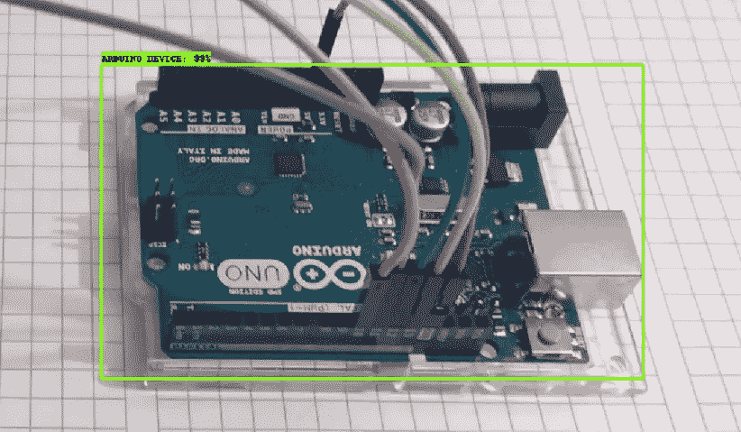

# 使用 Google COLAB 通过 TensorFlow API 训练对象检测模型

> 原文：<https://medium.com/analytics-vidhya/training-an-object-detection-model-with-tensorflow-api-using-google-colab-4f9a688d5e8b?source=collection_archive---------0----------------------->

更新时间:2020 年 4 月 19 日早上 5 点 23 分。
[点击此处](https://github.com/ElectroNath/-Training-an-Object-Detection-Model-with-TensorFlow-API-using-Google-COLAB/blob/master/Training%20an%20Object%20Detection%20Model%20with%20TensorFlow%20API%20using%20Google%20COLAB%20notebook.ipynb)获取笔记本

没有锚框的原始图像来自谷歌图片

Colab 提供免费访问拥有合理 GPU 的计算机，甚至 TPU。这是一种基于 Jupyter 笔记本电脑的云服务，需要互联网连接才能访问。

## 你应该知道的几件事…