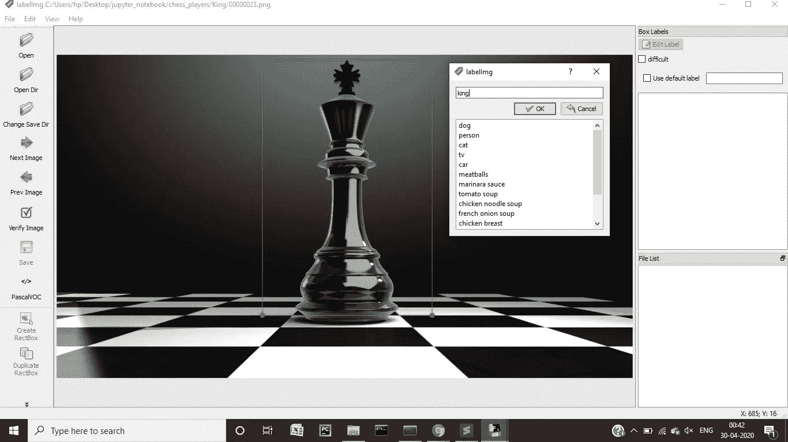
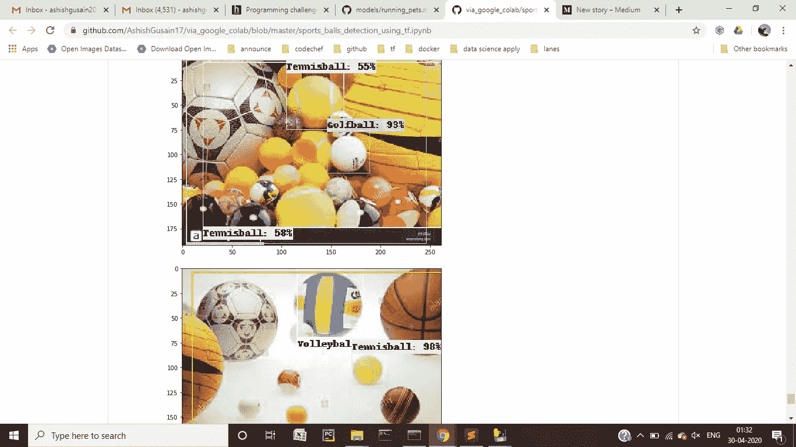
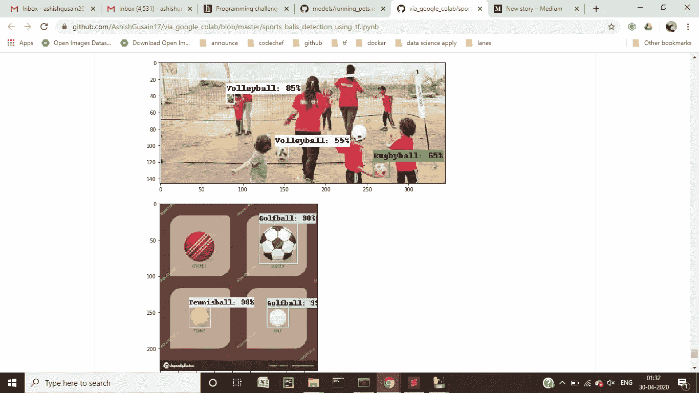

# 使用 tensorflow 训练用于对象检测的自定义数据

> 原文：<https://medium.com/analytics-vidhya/training-custom-data-using-tensorflow-for-object-detection-8dc2fcb08aca?source=collection_archive---------9----------------------->

使用自定义数据进行对象检测总是很有趣。今天，让我们来检测 5 种不同的运动球，包括板球、网球、橄榄球、排球和高尔夫球。

# **获取知识库:**

https://github.com/tensorflow/models 的饭桶克隆

# **安装依赖项:**

pip 安装—用户 Cython
pip 安装—用户 contextlib2
pip 安装—用户 pillow
pip 安装—用户 lxml
pip 安装—用户 jupyter
pip 安装—用户 matplotlib

# **环境设置:**

从[https://github.com/protocolbuffers/protobuf/releases](https://github.com/protocolbuffers/protobuf/releases)下载协议 zip 文件，解压后你会得到包含 protoc.exe 文件的 bin 文件夹。

现在，从终端运行以下命令

```
cd <path_to_tensorflow_cloned_repo>/models/research/
python setup.py build
python setup.py installprotoc object_detection/protos/*.proto --python_out=.
export PYTHONPATH=$PYTHONPATH:`pwd`:`pwd`/slim
```

# **创建带标签的数据集:**

收集所有这 5 组球的图像，每组 500 张图像会给出很好的结果。收集后，将所有图像保存到/research/object _ detection/images

现在，有各种各样的方法来标记你的图像。最广泛使用的应用之一是 [labelImg](https://github.com/tzutalin/labelImg) 。它有一个用户友好的图形用户界面，你不会花太多时间去习惯它。现在，你必须注释你所有的图像，它们将被存储为 Pascal VOC 格式的 xml 文件。

注释所有的图像，继续提供具有相似名称的所有相似图像集。这是带注释的图像的样子。这只是一个使用 labelImg 的例子，你将不得不注释运动球。



现在，使用下面给出的代码将所有 xml 文件转换为 csv 文件:

```
import os
import glob
import pandas as pd
import xml.etree.ElementTree as ETdef xml_to_csv(path):
 xml_list = []
 for xml_file in glob.glob(path + ‘/*.xml’):
 tree = ET.parse(xml_file)
 root = tree.getroot()
 for member in root.findall(‘object’):
 value = (root.find(‘filename’).text,
 int(root.find(‘size’)[0].text),
 int(root.find(‘size’)[1].text),
 member[0].text,
 int(member[4][0].text),
 int(member[4][1].text),
 int(member[4][2].text),
 int(member[4][3].text)
 )
 xml_list.append(value)
 column_name = [‘filename’, ‘width’, ‘height’, ‘class’, ‘xmin’, ‘ymin’, ‘xmax’, ‘ymax’]
 xml_df = pd.DataFrame(xml_list, columns=column_name)
 return xml_dfdef main():
 image_path = os.path.join(os.getcwd(), ‘annotations’)
 xml_df = xml_to_csv(image_path)
 xml_df.to_csv(‘sports_balls.csv’, index=None)
 print(‘Successfully converted xml to csv.’)main()
```

最后，应该通过运行以下代码将 csv 文件转换为 tf.record 文件:

python generate _ TF record . py—CSV _ input =<path to="" csv="" file="">—output _ path = images/train . record—image _ dir =<path to="" images=""></path></path>

```
from __future__ import division
from __future__ import print_function
from __future__ import absolute_importimport os
import io
import pandas as pd
import tensorflow as tffrom PIL import Image
from object_detection.utils import dataset_util
from collections import namedtuple, OrderedDictflags = tf.app.flags
flags.DEFINE_string(‘csv_input’, ‘’, ‘Path to the CSV input’)
flags.DEFINE_string(‘output_path’, ‘’, ‘Path to output TFRecord’)
flags.DEFINE_string(‘image_dir’, ‘’, ‘Path to images’)
FLAGS = flags.FLAGS# TO-DO replace this with label map
def class_text_to_int(row_label):
 if row_label == ‘Rugbyball’:
 return 1
 elif row_label == ‘Cricketball’:
 return 2
 elif row_label == ‘Golfball’:
 return 3
 elif row_label == ‘Volleyball’:
 return 4
 elif row_label == ‘Tennisball’:
 return 5
 else:
 return 0def split(df, group):
 data = namedtuple(‘data’, [‘filename’, ‘object’])
 gb = df.groupby(group)
 return [data(filename, gb.get_group(x)) for filename, x in zip(gb.groups.keys(), gb.groups)]def create_tf_example(group, path):
 with tf.gfile.GFile(os.path.join(path, ‘{}’.format(group.filename)), ‘rb’) as fid:
 encoded_jpg = fid.read()
 encoded_jpg_io = io.BytesIO(encoded_jpg)
 image = Image.open(encoded_jpg_io)
 width, height = image.sizefilename = group.filename.encode(‘utf8’)
 image_format = b’jpg’
 xmins = []
 xmaxs = []
 ymins = []
 ymaxs = []
 classes_text = []
 classes = []for index, row in group.object.iterrows():
 xmins.append(row[‘xmin’] / width)
 xmaxs.append(row[‘xmax’] / width)
 ymins.append(row[‘ymin’] / height)
 ymaxs.append(row[‘ymax’] / height)
 classes_text.append(row[‘class’].encode(‘utf8’))
 classes.append(class_text_to_int(row[‘class’]))tf_example = tf.train.Example(features=tf.train.Features(feature={
 ‘image/height’: dataset_util.int64_feature(height),
 ‘image/width’: dataset_util.int64_feature(width),
 ‘image/filename’: dataset_util.bytes_feature(filename),
 ‘image/source_id’: dataset_util.bytes_feature(filename),
 ‘image/encoded’: dataset_util.bytes_feature(encoded_jpg),
 ‘image/format’: dataset_util.bytes_feature(image_format),
 ‘image/object/bbox/xmin’: dataset_util.float_list_feature(xmins),
 ‘image/object/bbox/xmax’: dataset_util.float_list_feature(xmaxs),
 ‘image/object/bbox/ymin’: dataset_util.float_list_feature(ymins),
 ‘image/object/bbox/ymax’: dataset_util.float_list_feature(ymaxs),
 ‘image/object/class/text’: dataset_util.bytes_list_feature(classes_text),
 ‘image/object/class/label’: dataset_util.int64_list_feature(classes),
 }))
 return tf_exampledef main(_):
 writer = tf.python_io.TFRecordWriter(FLAGS.output_path)
 path = os.path.join(FLAGS.image_dir)
 examples = pd.read_csv(FLAGS.csv_input)
 grouped = split(examples, ‘filename’)
 for group in grouped:
 tf_example = create_tf_example(group, path)
 writer.write(tf_example.SerializeToString())writer.close()
 output_path = os.path.join(os.getcwd(), FLAGS.output_path)
 print(‘Successfully created the TFRecords: {}’.format(output_path))if __name__ == ‘__main__’:
 tf.app.run()
```

# 正在创建 labelmap.pbtxt 文件

在内部创建一个名为 labelmap.pbtxt 的文件，内容如下:

```
item {
 id: 1
 name: 'Rugbyball'
}item {
 id: 2
 name: 'Cricketball'
}item {
 id: 3
 name: 'Golfball'
}item {
 id: 4
 name: 'Volleyball'
}item {
 id: 5
 name: 'Tennisball'
}
```

将此文件保存在/research/object _ detection/training 文件夹中

# 使用预先训练的模型:

从[https://github . com/tensor flow/models/blob/master/research/object_detection/g3doc/detection _ model _ zoo . MD](https://github.com/tensorflow/models/blob/master/research/object_detection/g3doc/detection_model_zoo.md)
下载模型，解压到/research/object _ detection

将 tf.record 文件(训练和测试)保存在/research/object _ detection/images 文件夹中。将 labelmap.pbtxt 保存在/research/object _ detection/training 文件夹中。

# **配置文件的变化:**

从/research/object _ detection/samples/configs→将配置文件复制到/research/object _ detection/training 文件夹。

在此配置文件中进行如下更改:

```
num_classes: 5fine_tune_checkpoint: "../faster_rcnn_inception_resnet_v2_atrous_coco_2018_01_28/model.ckpt"train_input_reader: {
 tf_record_input_reader {
 input_path: “../images/train.record”
 }
 label_map_path: “../training/labelmap.pbtxt”
}eval_config: {
 num_examples: 8000
 # Note: The below line limits the evaluation process to 10 evaluations.
 # Remove the below line to evaluate indefinitely.
 max_evals: <no. of test images>
}eval_input_reader: {
 tf_record_input_reader {
 input_path: “../images/test.record”
 }
 label_map_path: “../training/labelmap.pbtxt”
 shuffle: false
 num_readers: 1
}
```

# **训练:**

Inside /legacy/train.py 在下面运行命令:

```
python3 train.py --logtostderr --train_dir=../training --pipeline_config_path=../training/faster_rcnn_inception_resnet_v2_atrous_coco.config
```

我用过精度高但是速度比较慢的模型，[faster _ rcnn _ inception _ resnet _ v2 _ atrous _ coco _ 2018 _ 01 _ 28](http://download.tensorflow.org/models/object_detection/faster_rcnn_inception_resnet_v2_atrous_coco_2018_01_28.tar.gz)，你要写你下载的模型的名字。

# **冲浪板:**

现在想象你的结果。要检查 tensorboard，请运行下面的命令 from/object _ detection
tensor board—logdir = training

# **创建推理图:**

```
python export_inference_graph.py \
 — input_type image_tensor \
 — pipeline_config_path training/faster_rcnn_inception_resnet_v2_atrous_coco.config \
 — trained_checkpoint_prefix training/model.ckpt-280 \
 — output_directory inference-graph
```

# **结果:**

现在，我们都完成了。该推理图可以用于检测各个图像的对象。让我们来看看最终的检测结果:



这个物体检测的整个工作可以在[https://github . com/ashishgusain 17/via _ Google _ colab/blob/master/sports _ balls _ detection _ using _ TF . ipynb](https://github.com/AshishGusain17/via_google_colab/blob/master/sports_balls_detection_using_tf.ipynb)上看到

如有任何疑问，您可以通过以下方式联系我:

电子邮件:ashishgusain12345@gmail.com

github:[https://github.com/AshishGusain17](https://github.com/AshishGusain17)

领英:[https://www.linkedin.com/in/ashish-gusain-257b841a2/](https://www.linkedin.com/in/ashish-gusain-257b841a2/)